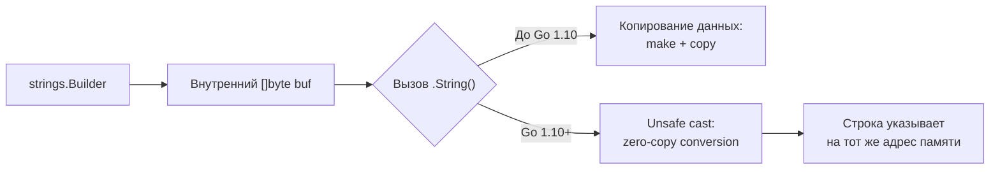

## Природа строки в Go: неизменяемость и внутреннее устройство

В Go строка (`string`) — это не просто массив символов, как в C. Это **неизменяемый (immutable) срез байтов**. Эта фундаментальная особенность диктует все паттерны работы с текстом, стратегии оптимизации памяти и подходы к конкурентности.

Когда вы объявляете переменную `s := "Hello"`, компилятор создает структуру `runtime.stringStruct`:

```go
type stringStruct struct {
    str unsafe.Pointer // Указатель на данные (байты)
    len int            // Длина строки
}
```

> [!info] Под капотом
> Поскольку строки неизменяемы, компилятор может безопасно размещать строковые литералы в сегменте `.rodata` (read-only data) бинарного файла. При присваивании `a := b` (где обе переменные типа `string`) **копирования данных не происходит**. Копируется только структура из двух полей (16 байт на 64-битной архитектуре). Это делает передачу строк в функции крайне дешевой операцией, если мы не вызываем конвертацию типов.

## Механика аллокаций: ловушка конвертации `[]byte` ↔ `string`

Самая частая причина деградации производительности в Go-приложениях, работающих с текстом (парсинг логов, JSON, HTTP-заголовки), — это лишние аллокации при конвертации между слайсом байтов и строкой.

### Почему конвертация дорогая?
Операция `string(b)` или `[]byte(s)` требует **выделения новой памяти в куче** и **копирования содержимого**.
1. Рантайм не может гарантировать, что слайс `[]byte` не будет изменен после создания строки.
2. Строка должна оставаться неизменной.
3. Следовательно, рантайм обязан создать независимую копию данных.

```go
func process(data []byte) {
    // ❌ ПЛОХО: Аллокация + копирование на каждой итерации
    s := string(data) 
    if strings.HasPrefix(s, "GET") { ... }
}

func processOptimized(data []byte) {
    // ✅ ХОРОШО: Работа напрямую с байтами, ноль аллокаций
    if bytes.HasPrefix(data, []byte("GET")) { ... }
}
```

> [!warning] Ловушка / Gotcha
> **Использование `unsafe` для "нулевой" конвертации.**
> Существует трюк через пакет `unsafe`, позволяющий создать строку поверх существующего `[]byte` без копирования:
> ```go
> func BytesToString(b []byte) string {
>     return *(*string)(unsafe.Pointer(&b))
> }
> ```
> **Запрещено использовать этот подход**, если исходный слайс `[]byte` может быть изменен или если его время жизни короче времени жизни строки. Изменение байтов в слайсе приведет к повреждению строки (нарушение контракта иммутабельности), а выход слайса за пределы области видимости оставит строку с висячим указателем (dangling pointer), что вызовет панику или чтение мусора. Используйте это только в высокоспециализированных случаях (например, ключи в `map[string]struct{}`), где вы полностью контролируете жизненный цикл данных.

## Оптимизация сборки строк: от конкатенации до `strings.Builder`

В Go существует четыре основных способа собрать строку из частей. Их производительность различается на порядки.

### 1. Конкатенация оператором `+`
```go
s := "Hello" + " " + "World"
```
*   **Компилятор:** Оптимизирует конкатенацию известных на этапе компиляции констант.
*   **Рантайм:** Для переменных создает новую строку на каждую операцию `+`. Если вы делаете это в цикле, сложность становится $O(N^2)$ из-за постоянного выделения памяти и копирования растущего объема данных.
*   **Вердикт:** Допустимо для 2-3 частей. Запрещено в циклах.

### 2. `fmt.Sprintf`
```go
s := fmt.Sprintf("%s %d", name, id)
```
*   **Механизм:** Использует рефлексию, парсинг формата и внутренний буфер.
*   **Цена:** Высокая (см. статью [[2. fmt. Форматированный вывод и форматирование строк]]).
*   **Вердикт:** Только для логирования и человеко-читаемого вывода. Не для горячих путей.

### 3. `bytes.Buffer`
```go
var buf bytes.Buffer
buf.WriteString("Hello")
s := buf.String()
```
*   **Механизм:** Работает с `[]byte`. При вызове `.String()` делает копию данных (так как не может отдать внутренний буфер, который может расти).
*   **Вердикт:** Хорошо, если вам нужен результат в виде `[]byte`. Для строк есть решение лучше.

### 4. `strings.Builder` (Золотой стандарт)
```go
var b strings.Builder
b.Grow(32) // Подсказка компилятору/рантайму
b.WriteString("Hello")
s := b.String()
```
*   **Механизм:** Внутри использует `[]byte`, но метод `.String()` реализован хитрее. Начиная с определенных версий Go, он помечает внутренний буфер как "замороженный" (через `unsafe` внутри пакета `strings`), предотвращая его изменение, и возвращает строку **без копирования данных**, если буфер больше не используется для записи.
*   **Метод `Grow(n int)`:** Критически важен. Он предварительно выделяет память (`make([]byte, 0, n)`). Без него `Builder` будет вынужден делать реаллокации (удвоение емкости) по мере роста, что приводит к фрагментации кучи и лишним копированиям.



> [!tip] Собеседование
> **Вопрос:** Почему `strings.Builder` быстрее `bytes.Buffer` при получении строки?
> **Ответ:** `bytes.Buffer` не может гарантировать, что вы не продолжите писать в него после получения `[]byte`. Поэтому он всегда копирует данные. `strings.Builder` имеет флаг `copied` (или аналогичную логику блокировки записи). Как только вы вызываете `.String()`, он запрещает дальнейшую запись в этот инстанс (паникует при попытке) и может безопасно вернуть строку, ссылающуюся на тот же блок памяти, что и внутренний буфер, избегая аллокации.

## Поиск и манипуляции: `strings` vs `bytes`

Пакет `strings` предоставляет функции `Contains`, `Index`, `Replace`, `Split` и другие. Важно помнить: почти каждая функция в `strings` имеет аналог в пакете `bytes`.

**Правило инженера:** Если ваши входные данные уже находятся в формате `[]byte` (например, вы читаете из `io.Reader` или получаете тело HTTP-запроса), **никогда** не конвертируйте их в `string` ради использования функций из пакета `strings`. Используйте `bytes` пакет.

```go
// ❌ Плохо: 2 аллокации (конвертация в строку + результат Split)
parts := strings.Split(string(rawData), ",")

// ✅ Хорошо: 1 аллокация (только результат Split, данные не копируются при поиске разделителя)
parts := bytes.Split(rawData, []byte(","))
```

Функции поиска в `bytes` работают напрямую с памятью, используя оптимизированные алгоритмы (часто ассемблерные реализации для длинных паттернов), и избегают накладных расходов на создание временных строк.

## Unicode и UTF-8: мифы о длине строки

Строка в Go — это набор байтов в кодировке UTF-8. Это означает, что `len(s)` возвращает количество **байтов**, а не символов (рун).

```go
s := "Привет"
fmt.Println(len(s))       // 12 (6 букв * 2 байта в UTF-8 для кириллицы)
fmt.Println(utf8.RuneCountInString(s)) // 6
```

Итерация по строке через `range` автоматически декодирует UTF-8:
```go
for i, r := range s {
    // i - индекс начала руны в байтах
    // r - значение руны (int32)
}
```

> [!warning] Ловушка / Gotcha
> **Индексация по байтам против индексации по рунам.**
> Выражение `s[0]` вернет первый **байт**. Для ASCII это совпадает с символом. Для кириллицы или эмодзи `s[0]` вернет лишь часть многобайтового символа, что может привести к невалидной UTF-8 последовательности.
> Если вам нужно получить N-ый символ, используйте конвертацию в слайс рун: `[]rune(s)[N]`. Но помните: эта операция имеет сложность $O(N)$ по времени и памяти, так как требует полного сканирования строки и выделения нового массива `int32`.

## Сравнение строк

Оператор `==` для строк в Go сравнивает сначала длину, а затем побайтово содержимое.
*   Для коротких строк это очень быстро.
*   Для длинных строк компилятор может использовать оптимизации, но в худшем случае это $O(N)$.

Если вам нужно часто сравнивать большие строки (например, ключи в кэше), рассмотрите возможность хранения их хешей (например, `uint64` через `fnv` или `xxhash`) и сравнения хешей. Однако будьте осторожны с коллизиями.

## Итог

1.  **Строка — это неизменяемый срез байтов.** Присваивание дешево (копируется дескриптор), конвертация `[]byte <-> string` дорога (копируются данные).
2.  **Избегайте конвертации в циклах.** Используйте пакет `bytes` для работы с `[]byte`.
3.  **Для сборки строк используйте `strings.Builder`.** Всегда вызывайте `Grow()` для предварительного выделения памяти, чтобы избежать реаллокаций.
4.  **Помните про UTF-8.** `len()` считает байты. Для подсчета символов используйте `utf8.RuneCountInString`. Индексация `s[i]` работает по байтам.
5.  **Будьте осторожны с `unsafe`.** Трюки с нулевой конверткой возможны, но нарушают безопасность типов и требуют глубокого понимания модели памяти Go.

Разобравшись с высокоуровневыми строками, мы должны спуститься на уровень ниже, к их сырому представлению. В следующей статье мы изучим пакет, который дает полный контроль над памятью и байтами: [[8. bytes. Работа с []byte и буферами]].