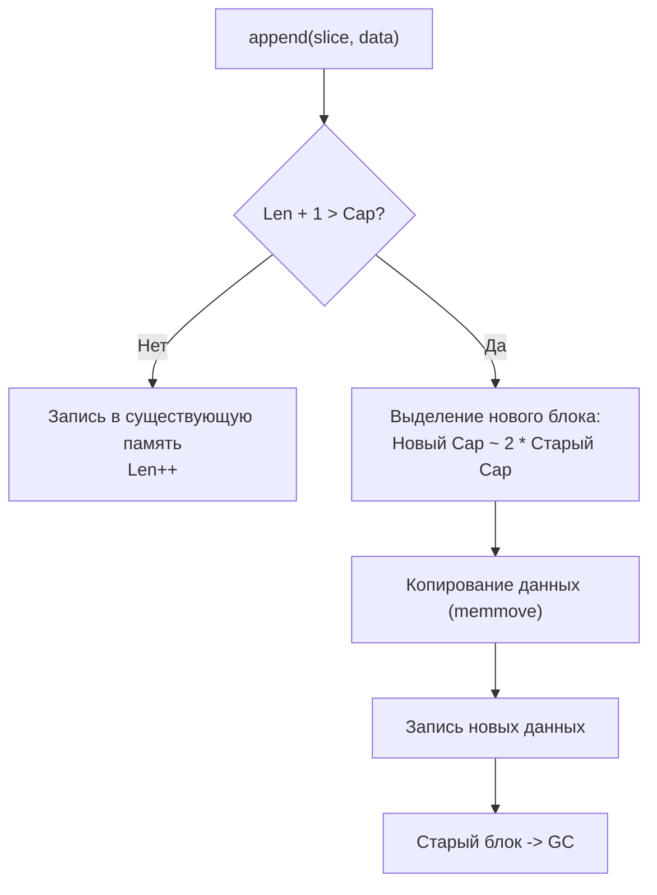

## `[]byte`: Фундаментальный строительный блок ввода-вывода

Если `string` — это абстракция для текста, то `[]byte` (слайс байтов) — это «сырая» память, с которой работает железо, сетевые карты и диски. В Go большинство операций ввода-вывода (`io.Reader`, `io.Writer`) построены именно вокруг `[]byte`.

Понимание внутреннего устройства слайса критически важно для написания высокопроизводительного кода. Слайс — это не массив, а **дескриптор**, указывающий на область памяти.

```go
// Внутреннее представление слайса в рантайме (до Go 1.20 структура называлась slice, сейчас это просто заголовок)
type SliceHeader struct {
    Data uintptr // Указатель на первый элемент массива в куче или на стеке
    Len  int     // Текущая длина (количество доступных элементов)
    Cap  int     // Емкость (количество выделенной памяти от начала Data)
}
```

> [!info] Под капотом
> Когда вы создаете слайс `make([]byte, 0, 1024)`, рантайм выделяет непрерывный блок памяти в куче размером 1024 байта. Переменная слайса занимает всего 24 байта (на 64-битной системе) на стеке, храня указатель и два целых числа. Это делает передачу слайсов в функции крайне эффективной, если мы избегаем лишних аллокаций самого блока данных.

## Механика роста: `append` и амортизированная сложность

Самая частая операция при работе с буферами — добавление данных. Функция `append` умна, но её поведение нужно понимать для контроля над аллокациями.

Когда `Len` превышает `Cap`, происходит реаллокация:
1. Выделяется новый блок памяти большей емкости.
2. Старые данные копируются в новый блок (`memmove`).
3. Старый блок становится мусором для GC.

**Стратегия роста:**
*   Для малых слайсов (< 1024 байт) емкость обычно удваивается ($2x$).
*   Для больших слайсов рост становится более консервативным (примерно $1.25x$), чтобы не тратить гигабайты памяти впустую.



> [!warning] Ловушка / Gotcha
> **Неожиданное совместное использование памяти (Aliasing).**
> Если вы делаете `sub := buf[:10]`, а затем `buf = append(buf, newByte)`, и емкость позволяет, новый байт запишется **в ту же память**, на которую может ссылаться `sub`.
> ```go
> buf := make([]byte, 0, 100)
> buf = append(buf, 1, 2, 3)
> sub := buf[:2] // [1, 2]
> 
> buf = append(buf, 4) // buf становится [1, 2, 3, 4]
> // sub теперь тоже может видеть изменения, если мы изменим buf[1]!
> buf[1] = 99 
> fmt.Println(sub) // [1, 99] - ОШИБКА! Данные подменились.
> ```
> **Решение:** Если нужно изолировать срез, используйте `copy`:
> ```go
> isolated := make([]byte, len(sub))
> copy(isolated, sub)
> ```

## Пакет `bytes`: Оптимизированные утилиты для бинарных данных

Пакет `bytes` предоставляет функции, аналогичные `strings`, но работающие с `[]byte`. Их главное преимущество — отсутствие конвертации типов и, как следствие, аллокаций.

### 1. Поиск и сравнение
Функции `bytes.Contains`, `bytes.Index`, `bytes.Equal` используют оптимизированные алгоритмы поиска подстрок (часто реализованные на ассемблере для конкретных архитектур, например, с использованием инструкций AVX2 на x86).

```go
// ❌ Медленно: конвертация строки в []byte внутри HasPrefix (аллокация!)
if strings.HasPrefix(string(header), "Content-Type") { ... }

// ✅ Быстро: прямой поиск в памяти
if bytes.HasPrefix(header, []byte("Content-Type")) { ... }
```

### 2. `bytes.Buffer`: Динамический буфер
`bytes.Buffer` — это реализация `io.ReadWriter`, которая растет по мере необходимости. Это основной инструмент для сборки бинарных протоколов или подготовки данных перед отправкой в сеть.

**Внутреннее устройство:**
```go
type Buffer struct {
    buf      []byte // внутренние данные
    off      int    // индекс чтения (сдвиг начала полезных данных)
    lastRead readOp // флаг последней операции чтения (для UnreadRune/UnreadByte)
}
```

**Оптимизация `Grow`:**
Как и в `strings.Builder`, метод `Grow(n)` позволяет заранее выделить память. Если вы знаете размер полезной нагрузки (например, размер JSON-ответа), вызов `buf.Grow(size)` перед записью предотвратит серию реаллокаций и копирований `memmove`.

### 3. `bytes.Reader`: Чтение из памяти
`bytes.NewReader(b)` создает объект, реализующий `io.ReaderAt`, `io.Seeker` и `io.Reader`. Это позволяет использовать обычный слайс байтов там, где ожидается файл или сетевой поток.

> [!tip] Собеседование
> **Вопрос:** В чем разница между `bytes.Buffer` и `strings.Builder`?
> **Ответ:**
> 1. `bytes.Buffer` поддерживает чтение (`Read`, `ReadByte`, `Next`) и запись. Он изменяем в обе стороны.
> 2. `strings.Builder` предназначен **только для записи**. Он оптимизирован для финальной конвертации в `string` (zero-copy через `unsafe`).
> 3. `bytes.Buffer` при вызове `.Bytes()` возвращает срез своего внутреннего буфера. Если вы продолжите писать в буфер, данные в срезе испортятся. `strings.Builder` блокирует запись после `.String()`.
> **Вывод:** Для сборки строк — `strings.Builder`. Для работы с бинарными протоколами или когда нужен `io.Reader` — `bytes.Buffer`.

## Mechanical Sympathy: Работа с памятью и GC

### Проблема фрагментации кучи
Частое создание маленьких `[]byte` (например, для токенов при парсинге) приводит к фрагментации кучи. Сборщик мусора (GC) тратит больше времени на сканирование множества мелких объектов.

**Решение: Пулы байтов (`sync.Pool`)**
Для высоконагруженных приложений используйте `sync.Pool` для переиспользования буферов.

```go
var bufferPool = sync.Pool{
    New: func() interface{} {
        // Выделяем буфер фиксированного размера, достаточного для большинства запросов
        b := make([]byte, 0, 4096)
        return &b
    },
}

func handleRequest() {
    // Берем буфер из пула
    bufPtr := bufferPool.Get().(*[]byte)
    buf := (*bufPtr)[:0] // Сбрасываем длину, сохраняем емкость
    
    // ... используем buf для чтения или записи ...
    
    // Возвращаем в пул
    bufferPool.Put(bufPtr)
}
```

> [!warning] Ловушка / Gotcha
> При возврате буфера в пул убедитесь, что вы не оставляете в нем чувствительных данных (паролей, токенов), если пул используется в многопользовательской среде. Хотя память будет перезаписана, в дампах кучи (heap dumps) старые данные могут остаться видимыми до следующей перезаписи. Для критических данных лучше явно занулять буфер перед `Put`: `clear(*bufPtr)` (Go 1.21+) или цикл `for i := range *bufPtr { (*bufPtr)[i] = 0 }`.

## Продвинутые техники: `unsafe` и нулевые копии

Иногда нужно интерпретировать структуру данных как слайс байтов без копирования (например, для сетевой сериализации).

```go
func StructToBytes(s interface{}) []byte {
    // Опасно! Зависит от выравнивания (padding) и порядка байт (endianness)
    // Использовать только для внутренних бинарных протоколов с жестким контролем структур
    size := unsafe.Sizeof(s)
    ptr := unsafe.Pointer(&s)
    return unsafe.Slice((*byte)(ptr), size)
}
```

> [!warning] Ловушка / Gotcha
> Использование `unsafe` для преобразования структур в `[]byte` нарушает переносимость.
> 1. **Padding:** Компилятор может добавлять пустые байты между полями структуры для выравнивания.
> 2. **Endianness:** Порядок байтов чисел зависит от архитектуры (Little Endian на x86/ARM).
> 3. **Garbage Collector:** Если структура содержит указатели, а вы читаете её как `[]byte`, GC может не увидеть эти указатели, если оригинальная переменная выйдет из области видимости, что приведет к преждевременному освобождению памяти и панике.
> **Рекомендация:** Используйте `encoding/binary` для безопасной и переносимой сериализации примитивов.

## Сравнение с другими языками

| Аспект | C / C++ | Java | Go |
|--------|---------|------|----|
| **Представление** | `char*` + `size_t` (ручное управление) | `byte[]` (объект в куче, фиксированный размер) | `[]byte` (слайс: указатель, длина, емкость) |
| **Изменение размера** | `realloc` (ручное, дорого) | Невозможно (нужен новый массив + `System.arraycopy`) | `append` (автоматическое, амортизированное) |
| **Безопасность** | Нет (переполнения буфера) | Есть (проверка границ, исключения) | Есть (паника при выходе за границы) |
| **Конкатенация** | Ручное выделение + `memcpy` | `StringBuilder` (аналог `bytes.Buffer`) | `append` или `bytes.Buffer` |

## Итог

1. **`[]byte` — это дескриптор.** Понимайте разницу между `Len` и `Cap`.
2. **Избегайте алиасинга.** Помните, что срезы (`slice`) делят одну память. Используйте `copy` для изоляции.
3. **Используйте `bytes` вместо `strings` для бинарных данных.** Это экономит аллокации на конвертации.
4. **Предварительно выделяйте память.** `make([]byte, 0, N)` и `buf.Grow(N)` спасают от реаллокаций.
5. **Переиспользуйте буферы.** `sync.Pool` критически важен для снижения давления на GC в высоконагруженных системах.
6. **Осторожно с `unsafe`.** Преобразование структур в байты требует знания выравнивания и эндиианности.

Разобравшись с байтами, мы переходим к частой задаче: преобразованию примитивных типов (чисел) в строки и обратно. Эта операция кажется простой, но скрывает множество нюансов производительности и точности. В следующей статье: [[9. strconv. Конвертация строк и чисел]].