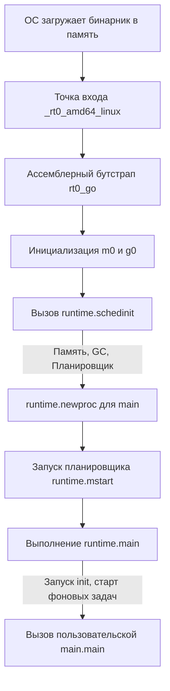

Добро пожаловать в седьмой раздел нашей базы знаний — **«Глубокий Go»**. До этого момента мы рассматривали язык как высокоуровневый инструмент: мы писали код, использовали интерфейсы, запускали горутины и не задумывались о том, как именно это работает на уровне железа и операционной системы.

Пришло время спуститься в машинное отделение. Чтобы писать по-настоящему производительный, `production-ready` код без утечек памяти и bottleneck'ов, мы должны развить **Mechanical Sympathy** — интуитивное понимание того, как наши высокоуровневые абстракции мапятся на системные вызовы, аллокации в куче и регистры процессора.

Начнем с самого фундаментального вопроса: что на самом деле происходит, когда вы запускаете скомпилированный бинарник Go?

## Иллюзия функции main

Разработчики, приходящие из PHP, Python или Java (без глубокого погружения в JVM), привыкли думать, что выполнение программы начинается с первой строчки главного скрипта или функции `main`. В C/C++ программисты знают про `crt0` (C runtime init), который подготавливает среду перед вызовом `main`.

В Go ситуация обстоит схожим образом, но рантайм Go намного "толще" и сложнее, чем в C. Он включает в себя собственный планировщик, сборщик мусора и аллокатор памяти. Прежде чем выполнится ваша `func main()`, рантайм должен поднять целую "виртуальную ОС" внутри процесса.

Когда операционная система (например, Linux) загружает ELF-бинарник Go в память, она ищет точку входа. И эта точка входа — не ваша функция `main.main`.

Фрагмент кода



## Фаза 1. Ассемблерный бутстрап (rt0_go)

Точка входа зависит от архитектуры и ОС. Для Linux x86-64 это ассемблерная функция `_rt0_amd64_linux`. Ее единственная задача — передать управление главной платформонезависимой ассемблерной функции бутстрапа `rt0_go`.

Фрагмент кода

```
// Исходники: src/runtime/rt0_linux_amd64.s
TEXT _rt0_amd64_linux(SB),NOSPLIT,$-8
    JMP _rt0_amd64(SB)
```

Внутри `rt0_go` происходят критически важные низкоуровневые вещи:

1. **Чтение CPUID:** Определение возможностей процессора (поддерживает ли он AVX, AES-NI и т.д.), чтобы рантайм мог использовать оптимизированные инструкции.
2. **Парсинг аргументов:** Сохранение `argc` и `argv`, переданных от операционной системы.
3. **Настройка TLS (Thread Local Storage):** Это позволяет рантайму быстро получать доступ к текущему потоку операционной системы (треду) без тяжелых системных вызовов.
4. **Инициализация m0 и g0.**

> [!info] Под капотом: m0 и g0
> 
> В модели [[9. Scheduler Go. G, M, P и work stealing]] мы будем подробно разбирать эти примитивы. На этапе старта создаются два особенных объекта:
> 
> - **m0** — это структура, представляющая самый первый, главный поток операционной системы (OS thread), который был создан при запуске процесса.
>     
> - **g0** — это системная горутина. В отличие от обычных горутин (у которых стартовый стек равен 2 КБ и может расти), `g0` использует стек потока ОС (обычно около 8 МБ в Linux). На стеке `g0` выполняются все операции планировщика и сборщика мусора. Ваш пользовательский код никогда не выполняется на стеке `g0`.
>     

## Фаза 2. Пробуждение рантайма (schedinit)

После настройки `m0` и `g0`, ассемблерный код вызывает первую функцию на языке Go — `runtime.schedinit()`. Это момент, когда рантайм оживает.

Внутри `schedinit` последовательно запускаются все подсистемы:

1. `mallocinit()` — инициализация аллокатора памяти. Подготавливаются структуры `mcache`, `mcentral` и `mheap` (см. [[21. Аллокатор памяти Go. mcache, mcentral, mheap]]).
2. `osinit()` — определение количества логических ядер CPU для установки дефолтного значения `GOMAXPROCS`.
3. `gcinit()` — базовая подготовка сборщика мусора (см. [[24. Сборщик мусора Go. Общая архитектура]]).
4. **Настройка P (Processors):** Создается массив структур `P` размером с `GOMAXPROCS`. Каждый `P` содержит локальную очередь горутин и кэш аллокатора.

## Фаза 3. Рождение первой горутины

Рантайм готов, но еще ничего не выполняется. Далее функция `rt0_go` вызывает `runtime.newproc()`, чтобы создать новую горутину.

**Но эта горутина создается не для вашей `main.main`, а для функции `runtime.main`**.

Горутина помещается в локальную очередь выполнения (run queue) главного потока. Подробнее механика описана в [[12. Как создается и завершается goroutine]].

Затем вызывается `runtime.mstart()`. Эта функция блокирует главный поток `m0` и запускает бесконечный цикл планировщика (scheduling loop). Планировщик берет первую доступную горутину (нашу `runtime.main`) и начинает ее выполнение.

## Фаза 4. runtime.main и ваш код

Функция `runtime.main` — это "клей" между рантаймом и вашим кодом. Что она делает?

1. **Запуск sysmon:** Создается отдельный системный поток ОС (не горутина!), в котором запускается функция `sysmon`. Она работает в фоне, мониторит долгие системные вызовы, инициирует сборку мусора, если она давно не запускалась, и занимается прерыванием зависших горутин (см. [[10. sysmon, netpoller и фоновые потоки рантайма]] и [[43. Preemption. Как Go останавливает горутины]]).
2. **Инициализация пакетов:** Выполняются все функции `init()` во всех импортированных пакетах (включая стандартную библиотеку).
3. **Вызов main.main():** Наконец-то вызывается код, который написали вы!
4. **Завершение программы:** Когда ваша функция `main.main()` завершается, `runtime.main` вызывает `exit(0)`.

> [!warning] Ловушка / Gotcha
> 
> Это объясняет частую ошибку новичков. Если в `main.main()` вы запускаете горутину через `go doSomething()` и функция `main` сразу же завершается — программа завершит работу до того, как `doSomething` успеет выполниться. Почему? Потому что после возврата из вашей `main.main` рантайм вызывает системный вызов `exit(0)`, который жестко убивает процесс операционной системы вместе со всеми работающими потоками и горутинами.

> [!tip] Собеседование
> 
> **Вопрос:** Что запустится раньше — ваша функция `init()`, горутина сборщика мусора или планировщик?
> 
> **Ответ:** Сначала стартует планировщик (`mstart`), затем он берет в работу горутину `runtime.main`. Внутри `runtime.main` стартуют фоновые процессы (включая инициализацию GC), и только потом последовательно выполняются все `init()`, начиная от самых глубоких зависимостей и заканчивая `init()` в пакете `main`.

## Итоги

1. Процесс загрузки Go-программы — это сложная последовательность инициализации «виртуальной среды» рантайма поверх реальной ОС.
2. Ваша функция `main` — это лишь "вишенка на торте", горутина, которую запускает уже полностью инициализированный и работающий планировщик.
3. Понимание `m0` и `g0` критически важно для анализа профилей (pprof) и понимания того, как работают системные вызовы (см. [[40. Как runtime обрабатывает системные вызовы]]).

В этом разделе мы будем постепенно углубляться в каждый из упомянутых механизмов. Но прежде чем разбирать, как рантайм управляет структурами в памяти, нам нужно понять, как эти структуры вообще формируются на этапе сборки.

В следующей статье мы разберем: [[2. Архитектура компилятора Go]].