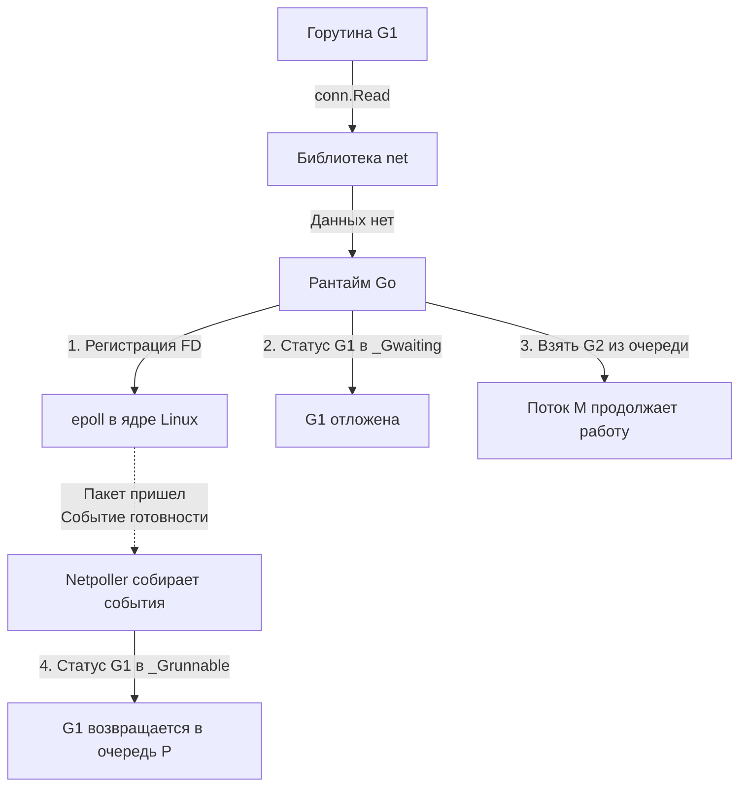

В прошлой статье ([[9. Scheduler Go. G, M, P и work stealing.md]]) мы изучили идеальный мир планировщика: горутины послушно выполняются, потоки ОС (M) распределяют нагрузку через локальные очереди (P) и крадут работу друг у друга. 

Но реальный бэкенд — это не вычисление чисел Фибоначчи в вакууме. Это бесконечное ожидание ответов от базы данных, чтение HTTP-запросов и тяжелые системные вызовы к ядру Linux. 
Если бы планировщик Go не имел механизмов противодействия блокировкам, один медленный SQL-запрос заблокировал бы поток ОС, а тысяча таких запросов полностью уничтожила бы сервер, исчерпав пул потоков.

Чтобы система `M:N` работала эффективно в условиях агрессивного IO (Input/Output) и недобросовестного кода, в рантайме Go существуют два важнейших теневых механизма: **Netpoller** (Сетевой поллер) и **Sysmon** (Системный монитор).

## Netpoller. Магия неблокирующего IO

**Проблема:** Классические системные вызовы для работы с сетью (например, `read` из сокета) являются блокирующими. Если данных в сокете нет, ядро ОС усыпляет вызывающий поток до момента прибытия сетевого пакета. Для Go это означало бы смерть потока `M` вместе с привязанным к нему контекстом `P`.

**Решение:** Современные операционные системы предоставляют механизмы асинхронного (событийного) мультиплексирования IO: `epoll` в Linux, `kqueue` в macOS, `IOCP` в Windows. 
Они позволяют одному потоку ОС наблюдать за тысячами открытых сокетов и мгновенно получать уведомления от ядра, когда в каком-то сокете появляются данные.

Рантайм Go абстрагирует эти платформозависимые механизмы в единый компонент — **Netpoller**. 
Для вас, как для разработчика, код выглядит синхронным и линейным. Но "под капотом" рантайм превращает его в сложнейший асинхронный автомат состояний.

### Как работает Netpoller (Пошагово)

Рассмотрим классический пример: ваша горутина вызывает `conn.Read(buf)`.

1. **Перехват:** Стандартная библиотека `net` не делает прямой системный вызов чтения. Она обращается к рантайму, сообщая: "Эта горутина хочет прочитать данные из файлового дескриптора сокета".
2. **Регистрация в epoll:** Рантайм проверяет, есть ли данные. Если нет, он добавляет дескриптор этого сокета в системный `epoll` инстанс.
3. **Парковка горутины:** Рантайм меняет статус текущей горутины с `_Grunning` на `_Gwaiting` (ожидает). Горутина **открепляется** от потока `M`.
4. **Освобождение M:** Поток `M` теперь свободен! Он обращается к локальной очереди `P`, берет следующую готовую горутину и продолжает полезную работу. Никаких блокировок ОС.
5. **Пробуждение:** Когда пакет данных физически прибывает на сетевую карту, ядро Linux сигнализирует `epoll`. 
При очередном цикле планирования (или по инициативе `sysmon`) рантайм проверяет Netpoller (`runtime.netpoll`). Он видит, что сокет готов к чтению, находит привязанную к нему спящую горутину, меняет её статус на `_Grunnable` и кладет в локальную очередь `P`.

> [!info] Под капотом. Интеграция планировщика и поллера
> В других языках (например, Node.js) Event Loop крутится в отдельном, выделенном потоке. В Go проверка Netpoller'а **встроена прямо в цикл поиска работы (findrunnable)** каждого потока `M`. 
> Когда `M` ищет, какую горутину выполнить, и локальные/глобальные очереди пусты, он обязательно делает неблокирующий вызов к `epoll`, чтобы забрать проснувшиеся сетевые горутины. Это минимизирует задержки (latency) и равномерно размазывает обработку IO по всем ядрам CPU.

## Sysmon. Страж рантайма

Если Netpoller встроен в рабочие потоки, то **Sysmon (System Monitor)** — это одинокий волк. 

`sysmon` — это специальная C-подобная функция в рантайме, которая запускается на **выделенном потоке ОС (M)** в самом начале старта программы. 
Его главная и уникальная особенность: **sysmon работает без привязки к логическому контексту (P)**. Ему не нужны локальные кэши или очереди горутин. Он существует вне общих правил планировщика, чтобы иметь возможность спасать саму систему, когда рабочие потоки заблокированы.

Он крутится в бесконечном цикле, засыпая на короткие промежутки времени (от 20 микросекунд до 10 миллисекунд), и выполняет несколько критически важных задач.

### Задача 1. Preemption (Вытеснение "жадных" горутин)

Горутины в Go не бессмертны. Если вы напишете бесконечный цикл `for {}` без системных вызовов и аллокаций памяти, эта горутина захватит ядро процессора и никогда не отдаст его добровольно.

Чтобы предотвратить зависание логических процессоров `P`, `sysmon` регулярно сканирует все работающие горутины. Если он видит, что какая-то горутина выполняется непрерывно более **10 миллисекунд**, он инициирует процесс ее принудительного вытеснения (Preemption).

До версии Go 1.14 вытеснение было кооперативным (рантайм ставил флаг, а горутина должна была сама его проверить при вызове функции). Но бесконечные пустые циклы этот флаг не проверяли.
Начиная с Go 1.14 внедрено **Асинхронное вытеснение (Asynchronous Preemption)**. `sysmon` отправляет аппаратному потоку ОС сигнал ядра `SIGURG`. Ядро прерывает выполнение потока, вызывает обработчик сигнала рантайма, и рантайм насильно сохраняет регистры горутины, убирает ее в глобальную очередь и передает CPU другой задаче.

*(Мы разберем эту магию досконально в [[43. Preemption. Как Go останавливает горутины.md]])*

### Задача 2. Handoff (Спасение при блокирующих Syscalls)

Мы выяснили, что сетевое IO работает неблокирующе через Netpoller. Но что делать с чтением обычного файла с диска? Или с вызовом C-кода через CGO? В Linux `epoll` исторически плохо работает с обычными файлами (они всегда считаются готовыми). Поэтому такие операции по-прежнему делают честный, блокирующий системный вызов.

Когда поток `M` делает такой вызов, он засыпает в пространстве ядра. Вместе с ним зависает привязанный к нему контекст `P` и вся его очередь из 255 горутин.

Здесь в дело вступает `sysmon`:
1. Он замечает, что `P` находится в статусе `_Psyscall` слишком долго (более 20 микросекунд).
2. `sysmon` совершает **Handoff (передачу эстафеты)**: он агрессивно "отрывает" `P` от спящего потока `M`.
3. Оторванный `P` передается другому, свободному потоку `M` (или рантайм создает новый поток `M`).
4. Очередь горутин продолжает выполняться, пока первоначальный поток всё ещё спит в ядре ОС.

*(Глубокий разбор этого механизма с переходом состояний: [[42. Планировщик и блокирующие syscalls.md]])*

### Задача 3. Страховка Netpoller'а

Если все рабочие потоки `M` заняты тяжелыми вычислениями, они могут долго не заходить в цикл планировщика и, следовательно, не опрашивать `epoll`. Сетевые пакеты будут копиться, а задержки (latency) приложения — расти.
`sysmon` следит за этим. Если с момента последнего опроса Netpoller'а прошло более 10 миллисекунд, `sysmon` берет инициативу на себя. Он сам делает неблокирующий вызов к `epoll` и распихивает проснувшиеся горутины в глобальную очередь, чтобы рабочие потоки забрали их при первой возможности.

### Задача 4. Scavenging (Возврат памяти)

Память, которую освободил сборщик мусора (GC), не возвращается операционной системе мгновенно. Рантайм держит ее у себя про запас (в структуре `mheap`), ожидая новых аллокаций. 
Но если нагрузка спала, держать гигабайты пустой памяти бессмысленно (особенно в контейнерах Kubernetes с жесткими лимитами OOM). 
В свободное время `sysmon` запускает фоновую задачу **Scavenger**, которая медленно и аккуратно вызывает системный вызов `madvise`, сообщая ядру Linux: "Эти страницы памяти нам больше не нужны, можешь забрать их обратно в RAM ОС".

> [!tip] Собеседование. Фоновые потоки и уязвимости
> **Вопрос:** Что произойдет с Go-программой, если вы запустите 100 000 горутин, каждая из которых сделает `time.Sleep` на час? Исчерпается ли память или CPU?
> **Ответ:** Почти ничего не произойдет. `time.Sleep` не блокирует поток ОС. Рантайм переведет горутины в статус `_Gwaiting` и зарегистрирует события в глобальном таймере рантайма. Потоки `M` будут спать (так как работы нет), а `sysmon` будет изредка просыпаться. Единственный расход — это память под структуры самих горутин (примерно 2 КБ на каждую, итого ~200 МБ RAM). Программа будет потреблять 0% CPU.

## Итог

Архитектура Go скрывает от нас сложность системного программирования за элегантными абстракциями:

1. **Netpoller** превращает синхронный сетевой код в асинхронный событийный цикл, избавляя нас от Callback-ада (как в старом JS) и необходимости вручную настраивать `epoll` (как в C++).
2. **Sysmon** — это неутомимый фоновый супервизор, работающий на выделенном потоке ОС.
3. Он спасает планировщик от зависаний, прерывая слишком долгие вычисления (`SIGURG`), отвязывая очереди от заблокированных в ядре потоков (`Handoff`) и возвращая память операционной системе.

Мы рассмотрели, как рантайм жонглирует горутинами и потоками. Но до сих пор мы воспринимали саму горутину просто как черный ящик. Из чего она состоит физически? Где хранятся переменные, когда мы вызываем функцию внутри горутины, и почему этот механизм делает Go таким эффективным?

Пришло время спуститься на уровень памяти горутины. В следующей статье мы разберем:
[[11. Стек горутины. Рост и shrink стека.md]]