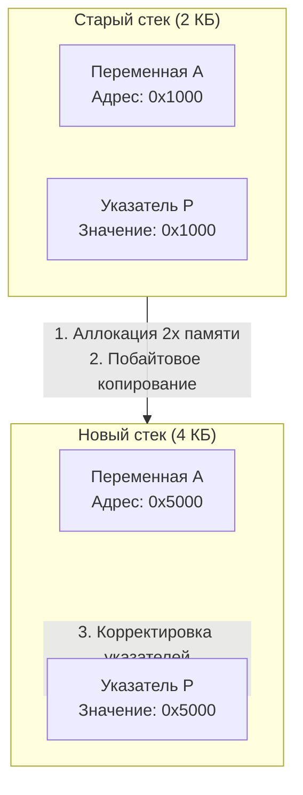

В предыдущих статьях мы разобрали, как рантайм жонглирует горутинами, спасая их от блокировок с помощью Netpoller и Sysmon. Но до сих пор мы относились к самой горутине как к абстрактной сущности `G`. 

Пришло время заглянуть внутрь нее. Самый важный ресурс любой функции — это ее память для локальных переменных, аргументов и адресов возврата. Эта память называется **Стеком (Stack)**. И то, как Go управляет стеком горутин, является одним из главных инженерных шедевров языка, позволившим ему стать стандартом для высоконагруженных систем.

## Проблема OS Threads: Размер имеет значение

В языках с моделью многопоточности `1:1` (Java, C++, PHP) каждый параллельный запрос обрабатывается отдельным потоком операционной системы (OS Thread). 

Когда ядро Linux создает новый поток, оно выделяет ему фиксированный блок виртуальной памяти под стек. По умолчанию в Linux это **8 Мегабайт**. 
Это сделано с огромным запасом, потому что стек потока ОС не умеет изменять свой размер. Если вы выделили 8 МБ, а ваша функция использовала только 1 КБ — оставшиеся 7.99 МБ виртуальной памяти висят мертвым грузом. 
А если вы запустите 10 000 параллельных потоков, ядро зарезервирует **80 Гигабайт** памяти только под стеки! Сервер неминуемо упадет (OOM Killed).

Go решает эту проблему радикально. При создании новой горутины рантайм выделяет ей начальный стек размером всего **2 Килобайта** (в 4000 раз меньше!). 
10 000 активных горутин займут всего **20 Мегабайт** памяти. 

Но что произойдет, если вашей функции с глубокой рекурсией или большими локальными переменными не хватит этих 2 КБ?

## Эволюция: от Segmented к Continuous Stacks

> [!info] Под капотом. Исторический контекст
> До версии Go 1.3 использовались **Segmented Stacks (Сегментированные стеки)**. Когда 2 КБ заканчивались, рантайм выделял новый отдельный блок памяти и связывал его с первым с помощью указателя (как связный список). 
> Это приводило к проблеме **Hot Split**: если функция выделяла новый сегмент в цикле, а затем сразу возвращалась, рантайм постоянно выделял и удалял этот кусок памяти, уничтожая производительность (оверхед на аллокации).

Начиная с Go 1.3, язык перешел на **Continuous Stacks (Непрерывные стеки)**. 
Теперь, если стек переполняется, рантайм выделяет совершенно новый, непрерывный кусок памяти, который ровно **в 2 раза больше** предыдущего, и копирует туда все данные.

## Как компилятор определяет переполнение?

Рантайм не ждет, пока память физически закончится (что вызвало бы аппаратный `Stack Overflow` и `SIGSEGV`). Вместо этого проверки встроены в сам машинный код.

В [[5. Go assembler и внутренний ассемблерный синтаксис.md]] мы видели директиву `$0-24`, описывающую размер фрейма функции. Компилятор точно знает, сколько байт потребуется функции для работы. 
В пролог (начало) каждой функции компилятор автоматически вставляет несколько ассемблерных инструкций — **Stack Bound Check**.

1. Компилятор сравнивает текущий указатель стека аппаратного процессора (`SP`) с границей стека текущей горутины (`g.stackguard0`).
2. Если `SP` опускается ниже границы, происходит условный переход (Jump) к специальной функции рантайма — `runtime.morestack`.

> [!warning] Ловушка / Gotcha. Директива NOSPLIT
> В ассемблерном коде вы можете встретить флаг `NOSPLIT`. Он говорит компилятору: "Эта функция настолько мала и быстра, что я гарантирую — она не переполнит стек. Не вставляй проверку границ!". Это опасная, но мощная оптимизация для самого рантайма. Почти все функции внутри планировщика помечены как `NOSPLIT`, чтобы избежать бесконечной рекурсии (когда код расширения стека сам пытается расширить стек).

## Механика роста стека (Stack Growth)

Когда срабатывает `runtime.morestack`, происходит настоящая магия:

1. **Пауза:** Выполнение вашей пользовательской функции приостанавливается. Управление передается на системный стек `g0` (на котором работает планировщик).
2. **Аллокация:** Рантайм вычисляет новый размер стека (2 КБ -> 4 КБ -> 8 КБ...). Из кучи (Heap) запрашивается новый непрерывный блок памяти.
3. **Копирование:** Происходит побайтовое копирование всех данных из старого стека в новый.
4. **Корректировка указателей (Pointer Adjustment):** Это самая сложная часть!

### Mechanical Sympathy: Боль корректировки указателей

Представьте, что у вас есть локальная переменная `a` и указатель `p`, который ссылается на нее: `p := &a`. 
Оба они лежат на стеке. Когда мы скопировали стек по новому адресу в памяти, адрес переменной `a` физически изменился. Значит, указатель `p` теперь ссылается на старую, невалидную память! Если мы попытаемся его разыменовать, программа упадет.

Чтобы решить эту проблему, рантайм Go должен обновить **каждый указатель**, который ссылается на переменные внутри этого стека.
Откуда рантайм знает, где на стеке лежат указатели, а где — обычные числа (`int64` или `float64`)? 

Здесь вступает в игру связка компилятора и рантайма. Компилятор генерирует специальные метаданные — **Stack Maps** (в ассемблере это директивы `FUNCDATA` и `PCDATA`). Благодаря им рантайм с хирургической точностью проходит по новому стеку и пересчитывает адреса всех локальных указателей, добавляя к ним смещение (offset) между старым и новым стеком.

После корректировки старый стек помечается как свободный, а функция возобновляет работу уже на новом, просторном стеке, даже не подозревая, что ее физический адрес изменился.

> [!tip] Собеседование. CGO и инвалидация указателей
> **Вопрос:** Почему нельзя передать указатель на локальную переменную Go-функции в код на C (через CGO) и сохранить его там для будущего использования?
> **Ответ:** Из-за копирования стеков! Код на C не контролируется рантаймом Go. Если C сохранит адрес локальной переменной Go, а затем стек горутины расширится (и переместится), C-код останется с инвалидным (Dangling) указателем. При обращении к нему произойдет Segfault. 
> Компилятор Go активно борется с этим и выбросит панику "cgo argument has Go pointer to Go pointer", если заметит нарушение. (Подробнее в [[41. cgo. Как Go взаимодействует с C.md]]).

## Сжатие стека (Stack Shrink)

Если стек умеет только расти, то долгие серверные процессы рано или поздно столкнулись бы с утечкой памяти. Горутина может однажды обработать гигантский JSON, раздуть стек до 1 МБ, а потом вернуться к маршрутизации простых запросов.

Чтобы вернуть память ОС, рантайм реализует **Сжатие стека (Shrinking)**.
Оно происходит не в момент возврата из функции (чтобы избежать той самой проблемы "Hot Split"), а во время работы Сборщика мусора (GC).

Когда GC сканирует стек горутины (чтобы найти живые объекты), он заодно проверяет его утилизацию:
1. Если используется **менее 25%** текущего объема стека (и текущий размер больше минимальных 2 КБ).
2. Рантайм выделяет новый стек размером **в 2 раза меньше** текущего (но не менее 2 КБ).
3. Происходит та же процедура копирования `copystack` и корректировки указателей, но уже в меньший объем памяти.

Таким образом, горутины дышат: они расширяются (alloc) под нагрузкой и сжимаются (shrink) во время сборки мусора.

*(Детальнее о фазах работы GC: [[24. Сборщик мусора Go. Общая архитектура.md]])*

## Итоги

1. **Легковесность:** Стартовый стек горутины — всего 2 КБ. Это позволяет держать в памяти миллионы конкурентных задач.
2. **Continuous Stacks:** Стек представляет собой непрерывный кусок памяти. При нехватке места он выделяется заново (в 2 раза больше), а старые данные копируются.
3. **Безопасность типов:** Благодаря строгой типизации и `Stack Maps`, рантайм Go может безопасно обновлять все локальные указатели при переезде стека. В C/C++ такое реализовать практически невозможно.
4. **Сжатие:** Во время GC недоиспользуемые стеки (занято < 25%) сжимаются вдвое, освобождая память.

Теперь мы понимаем, из чего физически состоит горутина, как она растет в памяти и как планировщик управляет ею. Мы собрали все элементы пазла (G, M, P, Netpoller, Stack). 
В следующей статье мы объединим эти знания и пошагово проследим весь жизненный цикл горутины: от вызова ключевого слова `go` до момента ее смерти.

Переходим к: [[12. Как создается и завершается goroutine.md]]