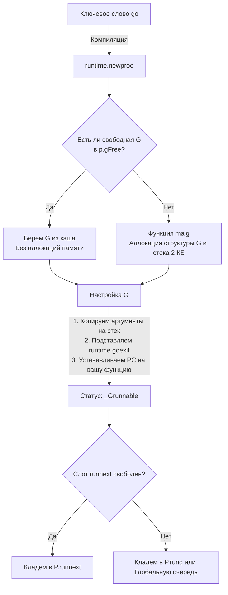

В прошлых статьях мы изучили архитектуру планировщика ([[9. Scheduler Go. G, M, P и work stealing.md]]) и устройство памяти отдельной задачи ([[11. Стек горутины. Рост и shrink стека.md]]). Теперь у нас есть все элементы пазла, чтобы собрать их воедино и проследить полный жизненный цикл горутины: от момента, когда вы пишете ключевое слово `go`, до момента, когда эта горутина тихо исчезает из памяти.

Для бэкенд-инженера понимание этого цикла — это ключ к оптимизации аллокаций памяти и предотвращению одной из самых страшных проблем серверов на Go: утечек горутин (Goroutine Leaks).

## Рождение: Синтаксический сахар и runtime.newproc

Ключевое слово `go` — это синтаксический сахар. Вы не найдете его в скомпилированном бинарнике. На этапе генерации SSA (о котором мы говорили в начале раздела), компилятор транслирует вызов `go myFunction(arg1, arg2)` в вызов функции рантайма `runtime.newproc`.

```go
// Ваш код
go processUser(userID)

// Во что это превращает компилятор под капотом
runtime.newproc(sizeOfArgs, funcPC, argData)
```

Функция `runtime.newproc` выполняет тяжелую работу по созданию новой задачи. Этот процесс разбит на несколько строго оптимизированных этапов.

### 1. Поиск в кэше (gFree)
Аллокация новой памяти в куче (Heap) — дорогая операция. В Go разработчики применили принцип Mechanical Sympathy: **горутины переиспользуются**.

Когда горутина умирает, ее структура `g` не удаляется сборщиком мусора. Она помещается в специальный список свободных горутин — `gFree`. 
Первое, что делает `newproc` — обращается к логическому процессору `P` и ищет свободную структуру `g` в его локальном пуле `p.gFree`. Если локальный пул пуст, рантайм может заглянуть в глобальный список свободных горутин `sched.gFree`.

### 2. Аллокация новой G (malg)
Если свободных структур `g` нет (например, на старте программы или при резком всплеске нагрузки), рантайм вызывает внутреннюю функцию `malg` (Memory Allocate G).
Она создает новую структуру `g` и выделяет для нее те самые стартовые 2 КБ непрерывного стека.

### 3. Настройка контекста (gobuf)
Теперь у нас есть пустая структура `g` (неважно, новая или из кэша). Рантайм должен подготовить её к выполнению вашей функции:
* На вершину стека горутины копируются аргументы (например, `userID`).
* В структуру `g.sched` (объект `gobuf`) записывается указатель на вашу функцию (`PC` - Program Counter).
* Также в `g.sched` записывается текущий указатель стека (`SP`).

### 4. Подмена адреса возврата
Это самый хитрый хак рантайма. Когда обычная функция завершается, процессор читает со стека адрес возврата и прыгает туда. Но кто вызвал самую первую функцию внутри горутины? Никто, она запускается асинхронно!
Поэтому рантайм **подделывает адрес возврата** на стеке новой горутины. Он кладет туда адрес специальной функции `runtime.goexit`. (Мы вернемся к этому на этапе смерти).

### 5. Отправка в очередь
Горутина полностью готова. Ей присваивается статус `_Grunnable` (готова к выполнению), и она помещается в очередь. 
Как мы помним из статьи про планировщик, сначала она попытается попасть в эксклюзивный слот `runnext` текущего `P` (для максимальной локальности кэша L1/L2 процессора). Если он занят, она уходит в локальную очередь `runq`, а если и та переполнена (256 элементов) — половина очереди сбрасывается в глобальную `sched.runq`.



## Жизнь: Выполнение и Handoff

О жизни горутины мы уже много говорили. Когда поток ОС (`M`) берет горутину из очереди, он вызывает ассемблерную функцию `gogo`. 
Эта функция загружает регистры процессора из структуры `g.sched` и делает прыжок (Jump) на адрес вашей функции. Статус горутины меняется на `_Grunning`.

Горутина живет, пока функция не дойдет до конца. В процессе жизни горутина может заблокироваться на сетевом IO (Netpoller), системном вызове (Handoff), канале или мьютексе, меняя статус на `_Gwaiting` и уступая поток `M` другим горутинам.

## Смерть: runtime.goexit и очистка

Что происходит, когда ваша функция доходит до закрывающей фигурной скобки `}` или инструкции `return`?
Благодаря хаку на этапе создания (Шаг 4), процессор "возвращается" в функцию `runtime.goexit1` (которая под капотом вызывает `goexit0` на системном стеке `g0`).

Это встроенный механизм очистки (Garbage Collection для структур горутин), который выполняет строгую последовательность действий:

1. **Обработка defer:** Рантайм проверяет, есть ли отложенные вызовы (`defer`), связанные с этой горутиной, и выполняет их в порядке LIFO. Если в процессе происходит `panic`, запускается механизм `recover` (подробнее об этом мы поговорим в [[39. defer, panic и recover под капотом.md]]).
2. **Сброс состояния:** Статус горутины меняется на `_Gdead`. 
3. **Очистка ссылок:** Рантайм зануляет все указатели в структуре `g` (таймеры, каналы, блокировки). Это критически важно! Если оставить там ссылки на пользовательские объекты, сборщик мусора никогда не сможет удалить эти объекты, и произойдет утечка памяти.
4. **Возврат в пул (gFree):** "Мертвая" горутина открепляется от потока `M` и помещается в список `p.gFree` текущего логического процессора `P`. Стек не удаляется (он переиспользуется вместе со структурой `g`), что позволяет мгновенно запустить следующую горутину без обращений к аллокатору ОС.
5. **Продолжение работы M:** Поток `M` вызывает функцию `schedule()`, чтобы взять из очереди следующую `_Grunnable` горутину и продолжить работу.

> [!info] Под капотом. gFree и память
> Хотя рантайм старается кэшировать горутины, он не позволяет пулу `gFree` расти бесконечно. Во время сборки мусора (GC) фоновые процессы проверяют глобальные и локальные списки `gFree`. Если свободных горутин слишком много и они давно не использовались, рантайм начинает освобождать их стеки, возвращая память операционной системе.

> [!warning] Ловушка / Gotcha. Утечка горутин (Goroutine Leak)
> Механизм смерти запускается **только** если горутина завершает работу. Рантайм Go не имеет встроенного механизма принудительного убийства горутин снаружи (как `Thread.Abort()` в C# или `pthread_cancel` в C++).
> Если ваша горутина навсегда зависла (например, ожидает чтения из канала, в который никто никогда не напишет):
> ```go
> func process() {
>     ch := make(chan int)
>     go func() {
>         <-ch // Утечка! Горутина зависнет здесь навсегда.
>     }()
> }
> ```
> В этом случае статус горутины останется `_Gwaiting`. Она никогда не дойдет до `runtime.goexit`. Структура `g` и её стек (минимум 2 КБ) навсегда останутся в памяти. В высоконагруженном бэкенде это приведет к исчерпанию RAM и падению сервера в течение нескольких часов. Защита от этого — всегда использовать `context.Context` для тайм-аутов и отмен.

> [!tip] Собеседование. Что делает runtime.Goexit()?
> **Вопрос:** В пакете `runtime` есть экспортируемая функция `runtime.Goexit()`. Что будет, если вызвать её прямо посреди функции? Завершит ли она всю программу?
> **Ответ:** Нет, программа не завершится (в отличие от `os.Exit(0)`). Вызов `runtime.Goexit()` немедленно прерывает выполнение **текущей** горутины. При этом рантайм штатно выполнит все ваши `defer` в этой горутине, переведет её в `_Gdead` и освободит поток `M` для других задач. Если это была главная горутина (`main.main`), то программа упадет (так как рантайм считает выход из `main` окончанием работы), но для фоновых горутин это безопасный способ совершить "харакири".

## Итог

1. Вызов `go func()` превращается в `runtime.newproc`.
2. Рантайм агрессивно переиспользует мертвые горутины через список `gFree`, избегая тяжелых аллокаций в куче.
3. Компилятор подменяет адрес возврата на вершине стека, чтобы по завершении функции управление перешло в `runtime.goexit`.
4. Смерть горутины — это очистка структуры, выполнение `defer` и возврат "пустой оболочки" `g` обратно в пул.
5. Горутину нельзя убить снаружи. Если она заблокируется навсегда (на канале или мьютексе), произойдет Goroutine Leak.

Мы полностью разобрали жизненный цикл отдельной асинхронной задачи. Но сила Go не в том, что горутины работают изолированно, а в том, как элегантно они общаются друг с другом. Парадигма гласит: *"Не общайтесь, разделяя память; разделяйте память, общаясь"*.

В следующей статье мы вскроем главный инструмент этого общения и посмотрим, во что обходятся нам каналы: 
[[13. Каналы под капотом. hchan, sudog, sendq, recvq.md]]