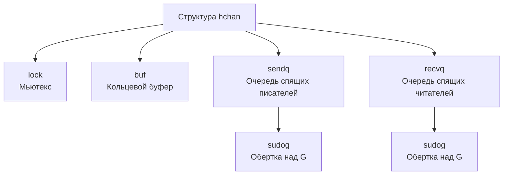
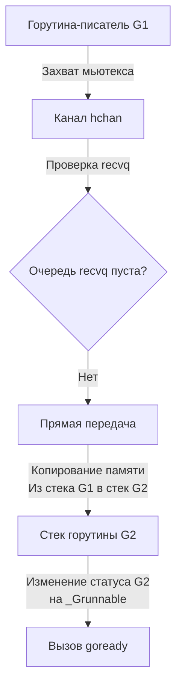

В конце [[12. Как создается и завершается goroutine.md]] мы упомянули главную мантру конкурентности Go: *«Не общайтесь, разделяя память; разделяйте память, общаясь»*. Главным инструментом этого общения являются каналы.

Среди разработчиков, приходящих в Go, часто бытует мистическое отношение к каналам. Кажется, что это некая lock-free магия, встроенная прямо в ядро процессора, которая всегда быстрее и безопаснее классических мьютексов. 

Чтобы стать Senior-инженером, нужно разрушить эту иллюзию. **Канал — это просто потокобезопасная очередь, защищенная обычным мьютексом**, с умной интеграцией в планировщик рантайма. Давайте вскроем исходники `src/runtime/chan.go` и посмотрим на анатомию канала.

## 1. Структура hchan

Когда вы пишете `ch := make(chan int, 3)`, компилятор преобразует это в вызов рантайм-функции `runtime.makechan`, которая аллоцирует в куче (Heap) структуру `hchan` (header of channel). 
**Все каналы всегда живут в куче**, даже если они не покидают область видимости функции, потому что они предназначены для шаринга между горутинами.

Структура `hchan` содержит следующие критически важные поля:

* `buf`: Указатель на кольцевой буфер (ring buffer) в памяти. Если канал небуферизованный, буфера нет (указатель пуст).
* `qcount`: Количество элементов, которые сейчас лежат в буфере.
* `dataqsiz`: Размер буфера (вместимость), заданный при создании канала.
* `elemsize` и `elemtype`: Размер и тип одного элемента (нужно для безопасного копирования участков памяти).
* `sendx` и `recvx`: Индексы в кольцевом буфере. Указывают, куда писать следующий элемент и откуда читать следующий.
* `recvq` и `sendq`: Очереди ожидания (wait queues). Это двусвязные списки из спящих горутин, которые хотят прочитать или записать данные.
* `lock`: Обычный мьютекс (`runtime.mutex`), который блокируется при **любом** действии с каналом.

## 2. Что такое sudog?

В очередях `sendq` и `recvq` лежат не сами структуры `G` (горутины), а специальные объекты `sudog`. Зачем нужна эта прослойка?

Горутина (`G`) — это субъект исполнения. В один момент времени горутина может ожидать данных сразу из **нескольких** каналов (если мы используем оператор `select`). Если бы мы клали саму структуру `G` в очередь канала, мы не смогли бы положить её в несколько очередей одновременно. 
Поэтому `sudog` — это "представитель" горутины в конкретной очереди ожидания. Он содержит:
* Указатель на саму горутину (`g`).
* Указатель на элемент данных (`elem`), который горутина хочет передать или получить.
* Указатель на канал (`c`), в очереди которого он стоит.

## 3. Анатомия записи (Send): ch <- data

Отправка данных в канал (функция `runtime.chansend`) — это мастер-класс по Mechanical Sympathy. Рантайм проверяет три сценария, стараясь выбрать самый быстрый. Во всех сценариях (кроме fast-path проверок) рантайм сначала захватывает `lock` канала.

### Сценарий 1: Читатель уже ждет (Direct Send)
Если мы пишем в канал, а в очереди `recvq` уже спит читатель (его `sudog`), происходит гениальная оптимизация.
Вместо того чтобы класть данные в буфер `buf`, а потом будить читателя (чтобы он забрал данные из буфера), рантайм берет данные из стека писателя и **копирует их напрямую в стек читателя**. 

Мы экономим одну лишнюю аллокацию/копирование в буфер и не трогаем индексы `sendx`/`recvx`. После копирования писатель просит планировщик (через `goready`) разбудить читателя, и тот возвращается в локальную очередь `P`.

### Сценарий 2: Буфер свободен
Если читателей нет, но канал буферизованный и в нем есть место (`qcount < dataqsiz`), писатель просто копирует свои данные в память кольцевого буфера по смещению `sendx`. Затем инкрементирует `sendx` (по кругу), увеличивает `qcount`, отпускает мьютекс и спокойно продолжает свою работу.

### Сценарий 3: Блокировка (Буфер полон или отсутствует)
Если писать некуда, писатель должен уснуть.
1. Рантайм создает `sudog` для текущей горутины.
2. Сохраняет в `sudog` адрес переменной, которую мы хотим отправить.
3. Кладет `sudog` в конец очереди `sendq`.
4. Вызывает `gopark` — горутина открепляется от потока `M`, ее статус меняется на `_Gwaiting`. (В этот момент происходит Handoff, и `M` берет другую задачу из `P`, как мы обсуждали в [[9. Scheduler Go. G, M, P и work stealing.md]]).

## 4. Анатомия чтения (Receive): data := <-ch

Чтение (`runtime.chanrecv`) работает зеркально, но имеет один очень хитрый корнер-кейс.

### Сценарий 1: Писатель уже ждет
Если мы пытаемся прочитать из канала, а в `sendq` уже есть спящий писатель.
* **Если канал небуферизованный:** Мы читаем данные напрямую из стека спящего писателя (Direct Receive) и будим его.
* **Если канал буферизованный (и буфер полон):** Здесь нельзя просто прочитать данные со стека писателя! Если мы это сделаем, мы нарушим FIFO-порядок (сначала нужно прочитать старые данные из буфера).
Поэтому рантайм читает самые старые данные из `buf[recvx]`, затем берет данные со стека спящего писателя и копирует их **на освободившееся место** в `buf[sendx]`. Затем будит писателя.

### Сценарий 2: В буфере есть данные (писателей нет)
Читатель просто копирует данные из `buf[recvx]` в свою локальную переменную, очищает память в буфере (чтобы GC мог удалить объект, если это указатель), инкрементирует `recvx` и идет дальше.

### Сценарий 3: Блокировка (Данных нет)
Читатель создает свой `sudog`, указывает в нем адрес своей локальной переменной (куда нужно положить результат), встает в `recvq` и вызывает `gopark`, засыпая.

## 5. Закрытие канала: close(ch)

Что происходит под капотом при `close(ch)`? 
1. Рантайм захватывает `lock`.
2. Устанавливает флаг `closed = 1`.
3. Проходит по всей очереди `recvq` (спящие читатели). Для каждого `sudog` он записывает в их переменные "zero value" для данного типа данных и будит их.
4. Проходит по всей очереди `sendq` (спящие писатели). Любой `sudog` здесь вызывает жесткую панику (`panic: send on closed channel`).
5. Отпускает `lock`.

> [!warning] Ловушка / Gotcha. Утечка памяти при nil-каналах
> Если вы занулите канал (`ch = nil`), он не закроется и не разбудит спящие в нем горутины. Отправка и чтение из `nil`-канала блокируют горутину **навсегда**. Рантайм просто вызовет `gopark` без добавления в какую-либо очередь, потому что структуры `hchan` больше нет. Это классический путь к Goroutine Leak.

> [!tip] Собеседование. Что быстрее: канал или мьютекс?
> **Вопрос:** Если мы хотим защитить счетчик (`counter++`) от состояния гонки, что лучше использовать: буферизованный канал на 1 элемент или `sync.Mutex`?
> **Ответ:** Однозначно `sync.Mutex` (или `sync/atomic`). Как мы только что увидели, внутри любого канала **уже есть мьютекс** (`hchan.lock`). Использование канала для простых синхронизаций состояния — это накладные расходы на аллокацию `hchan`, создание `sudog`, копирование данных в `buf` и постоянные переключения контекста. Каналы созданы для оркестрации потоков данных и сигналов между горутинами, а не для защиты участков памяти.

## Итог

1. **Канал (`hchan`)** — это структура в куче, состоящая из кольцевого буфера, мьютекса и двух очередей ожидания (`sendq`, `recvq`).
2. **`sudog`** — это обертка над горутиной, которая позволяет ей находиться в очереди ожидания канала.
3. Каждое действие с каналом начинается с блокировки встроенного мьютекса `lock`.
4. Для максимальной производительности рантайм умеет копировать данные **напрямую между стеками** двух горутин (писателя и читателя), минуя кольцевой буфер.

Теперь мы знаем механику работы одиночного канала. Но настоящая сила конкурентности Go раскрывается тогда, когда горутина ожидает событий из множества каналов одновременно. Как реализовать это без создания множества потоков и поллинга в холостом цикле?

В следующей статье мы разберем конструкцию, которая является сердцем любого микросервиса на Go: 
[[14. Select под капотом.md]]