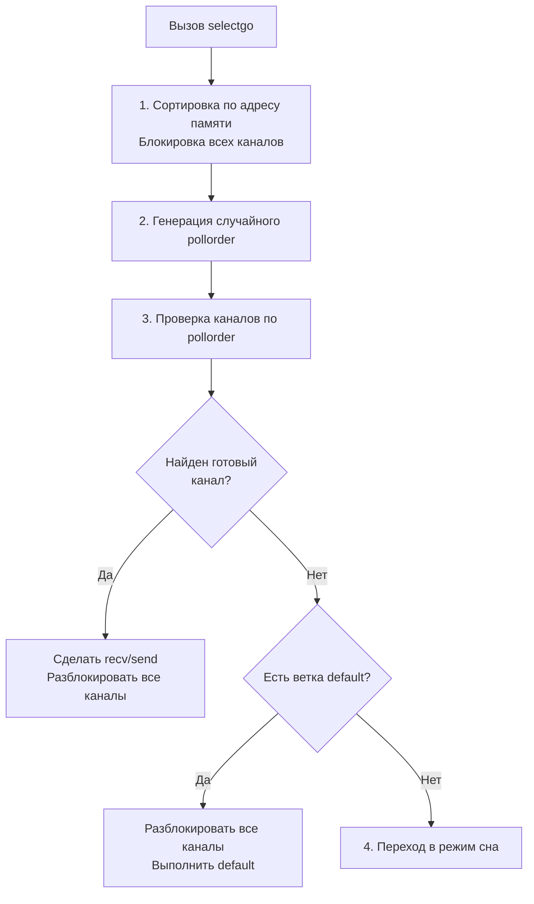

В прошлой статье ([[13. Каналы под капотом. hchan, sudog, sendq, recvq.md]]) мы вскрыли устройство одиночного канала и выяснили, что это кольцевой буфер с мьютексом. Но истинная мощь конкурентности Go — не в одиночных каналах, а в возможности мультиплексирования. 

Оператор `select` позволяет горутине ожидать событий сразу из нескольких каналов. Эта конструкция является фундаментом паттернов вроде *fan-in*, *cancellation* (с помощью контекста) и таймаутов.

Но как это работает на уровне рантайма? Как горутина может спать в нескольких очередях одновременно? И почему `select` работает медленнее, чем простое чтение из канала? Давайте спустимся на уровень машинного кода и структур рантайма.

## 1. Иллюзия компилятора (Синтаксический сахар)

Первое, что нужно знать: единой универсальной функции `select` не существует. На этапе оптимизации AST (см. [[4. SSA в Go. Как компилятор оптимизирует код.md]]) компилятор анализирует ваш блок `select` и подменяет его на вызов одной из узкоспециализированных функций рантайма, чтобы минимизировать накладные расходы.

1. **Пустой `select {}`:** Компилятор заменяет его на вызов `runtime.block()`. Горутина засыпает навсегда (статус `_Gwaiting`) и никогда не проснется. Это часто используется в конце `main`, чтобы сервер не завершил работу.
2. **Один case (без default):** Конструкция не имеет смысла как `select`. Компилятор вырезает `select` и заменяет его на прямое чтение `runtime.chanrecv1` или запись `runtime.chansend1`.
3. **Один case + default:** Это паттерн неблокирующего чтения/записи. Компилятор использует `runtime.selectnbrecv` (non-blocking receive). Если канал пуст, функция мгновенно возвращает `false`, и код переходит в блок `default`, вообще не блокируясь и не создавая `sudog`.
4. **Два и более case:** Здесь начинается настоящая магия. Компилятор генерирует массив структур `scase` (select case) и вызывает самую тяжелую функцию — **`runtime.selectgo`**.

> [!info] Под капотом. Структура scase
> Для вызова `selectgo` компилятор упаковывает каждый `case` в структуру `scase`:
> - `c *hchan` — указатель на канал.
> - `elem unsafe.Pointer` — указатель на переменную для чтения или записи.
> - `kind uint16` — тип операции: чтение, запись или default.

## 2. Механика runtime.selectgo

Функция `selectgo` — это сложнейший алгоритм, который решает фундаментальную проблему Computer Science: блокировку нескольких независимых примитивов синхронизации без возникновения Deadlock (взаимной блокировки).

Алгоритм разбит на 4 строгих фазы.

### Фаза 1. Борьба с Deadlock (Сортировка)

Внутри каждого канала есть свой мьютекс (`lock`). Чтобы проверить состояние сразу нескольких каналов, `select` должен захватить мьютексы их всех. 
Но что, если Горутина 1 делает `select` на чтение из `ch1` и `ch2`, а Горутина 2 в этот же момент делает `select` на запись в `ch2` и `ch1`? Если они будут захватывать мьютексы в порядке написания кода, произойдет Deadlock.

Решение рантайма гениально в своей простоте: **рантайм сортирует все каналы в select по их физическому адресу памяти в куче (heap address)**.
Мьютексы всегда захватываются строго в порядке возрастания адресов `hchan`. Это математически гарантирует отсутствие циклических ожиданий и Deadlock'ов.

### Фаза 2. Справедливость (Перемешивание)

После сортировки и блокировки каналов рантайм должен решить, в каком порядке проверять их готовность. 
Если проверять сверху вниз по коду, верхние `case` будут иметь приоритет (Starvation нижних `case`). Чтобы избежать этого, рантайм использует генератор псевдослучайных чисел (`fastrand`) для создания массива `pollorder` — случайной перестановки индексов `case`.

> [!tip] Собеседование. Почему select случайный?
> **Вопрос:** Если в `select` готовы сразу два канала, какой из них будет выбран?
> **Ответ:** Выбор будет абсолютно случайным. Это сделано намеренно на уровне рантайма (через перемешивание `pollorder`), чтобы гарантировать балансировку нагрузки (fairness) и предотвратить "голодание" каналов, которые программист случайно написал в конце списка `select`.

### Фаза 3. Опрос (Polling)

Рантайм в цикле обходит каналы в случайном порядке (`pollorder`) и смотрит на их состояние:
* Для `case <-ch`: есть ли спящий писатель в `sendq` или данные в `buf`?
* Для `case ch<-`: есть ли спящий читатель в `recvq` или место в `buf`?

Если **хотя бы один** канал готов, рантайм:
1. Выполняет операцию (прямое копирование памяти или работа с кольцевым буфером, как описано в [[13. Каналы под капотом. hchan, sudog, sendq, recvq.md]]).
2. Разблокирует все мьютексы во всех каналах из `select`.
3. Возвращает индекс сработавшего `case`. Управление возвращается в ваш код.

Если **ни один** канал не готов, рантайм проверяет наличие `default`. Если он есть — отпускаем все мьютексы и идем в ветку `default`.



### Фаза 4. Глубокий сон (Множественный sudog)

Что происходит, если ни один канал не готов, а `default` нет? Горутина должна уснуть.
Здесь раскрывается назначение объекта `sudog` (обертки над горутиной).

1. Рантайм создает отдельный объект `sudog` для **каждого** канала, участвующего в `select`.
2. Рантайм помещает эти `sudog` в очереди ожидания `sendq` или `recvq` соответствующих каналов.
3. Горутина вызывает `gopark` и засыпает. Поток `M` берет другую задачу.

Теперь эта единственная горутина "распята" между несколькими каналами: она физически присутствует в очередях ожидания каждого из них.

Когда какая-то другая горутина пишет данные в **один** из этих каналов, она видит наш спящий `sudog`. Она копирует данные, меняет статус нашей горутины на `_Grunnable` и возвращает ее в очередь планировщика `P`.

### Фаза 5. Очистка после пробуждения (Cleanup)

Наша горутина проснулась и готова продолжить работу. Но есть проблема: её `sudog`'и всё ещё лежат в очередях ожидания **остальных** каналов из `select`! Если их там оставить, другая горутина может записать туда данные, разбудить нас второй раз (что приведет к панике) или просто произойдет утечка памяти.

Поэтому первое, что делает горутина после пробуждения:
1. Снова захватывает мьютексы **всех** каналов из `select` (в отсортированном порядке).
2. Проходит по всем каналам и удаляет свои "мертвые" `sudog` из их очередей `sendq` и `recvq`.
3. Отпускает все мьютексы и возвращает управление в пользовательский код.

## Mechanical Sympathy. Цена Select

Зная внутреннее устройство, мы можем оценить реальную цену вызова `select`:

1. **Аллокации массива scase.** (Часто оптимизируется компилятором на стек, но не всегда).
2. **Многократный захват мьютексов.** Вызов `select` на 4 канала — это захват и освобождение минимум 4 мьютексов. И еще раз 4 мьютекса при очистке после пробуждения.
3. **Сортировка.** Сортировка адресов каналов стоит процессорных тактов.
4. **Генерация случайных чисел.** `fastrand` быстр, но это не бесплатная операция.

> [!warning] Ловушка / Gotcha. Цикл с закрытым каналом
> Частая ошибка при чтении из нескольких каналов в цикле `for`:
> ```go
> select {
> case val := <-ch1:
>     // Если ch1 закроют, этот case начнет срабатывать МГНОВЕННО
>     // и бесконечно возвращать zero-value. 
>     // Произойдет загрузка CPU на 100% (Busy Loop).
> }
> ```
> **Решение:** Всегда проверяйте статус канала `val, ok := <-ch1` и устанавливайте `ch1 = nil`, если `ok == false`. Чтение из `nil` канала блокируется навсегда, и `select` просто выключит эту ветку из опроса.

## Итог

1. Компилятор оптимизирует простые `select` (без default, 1 case, неблокирующие) до обычных операций с каналом, избегая тяжелого рантайма.
2. Сложный `select` реализован через функцию `runtime.selectgo`.
3. Для избежания Deadlock каналы всегда блокируются в порядке адресов памяти в куче.
4. Порядок ветвей `case` перемешивается генератором случайных чисел, чтобы гарантировать равномерную обработку (fairness).
5. При засыпании горутина создает копии `sudog` и раскидывает их по всем каналам, а после пробуждения обязана собрать и удалить их, что делает блокирующийся `select` тяжелой операцией.

Каналы и `select` — это высокоуровневые, удобные, но довольно "дорогие" инструменты оркестрации. Внутри них самих, как мы убедились, активно используются классические мьютексы ядра. 

Если нам нужно просто инкрементировать счетчик, обновить конфигурацию в памяти или защитить кэш, использование каналов становится антипаттерном. Для чистой скорости мы должны использовать базовые примитивы синхронизации. 

В следующей статье мы спустимся еще на один уровень ниже и разберем устройство главного стража памяти: 
[[15. Mutex и RWMutex под капотом.md]]