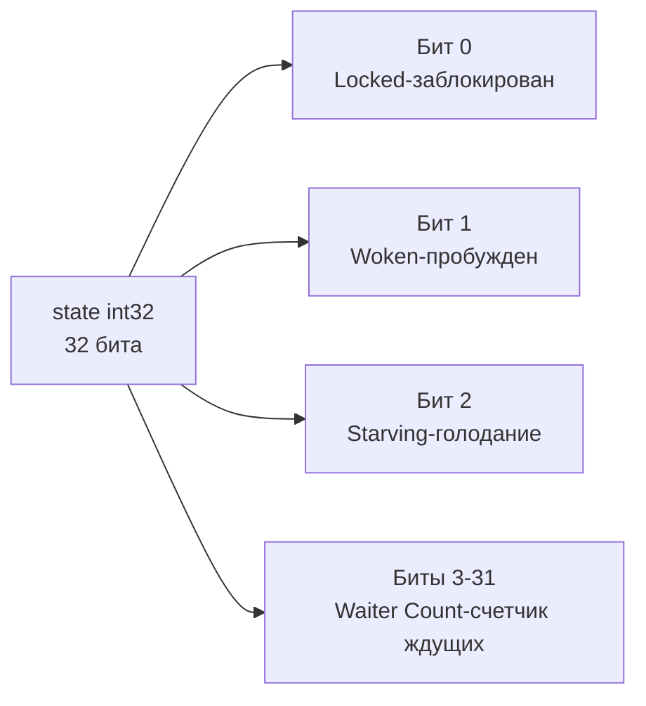
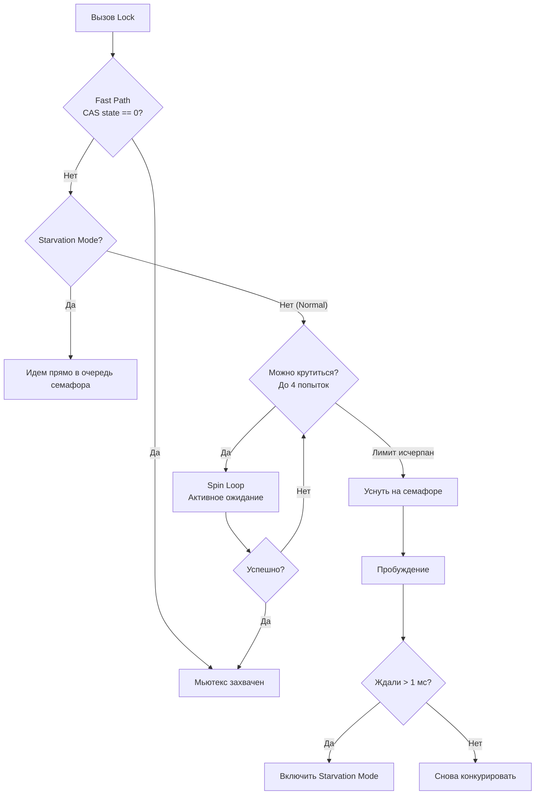

В прошлой статье ([[13. Каналы под капотом. hchan, sudog, sendq, recvq.md]]) мы сорвали покровы с каналов и увидели, что внутри них скрывается старый добрый мьютекс. Каналы прекрасны для передачи владения данными и оркестрации горутин, но когда вам нужно просто защитить участок памяти (например, инкрементировать счетчик или обновить кэш), каналы становятся непозволительной роскошью. Они создают лишние аллокации, копируют данные и нагружают планировщик.

Для чистой защиты состояния (State Protection) фундаментом остаются примитивы из пакета `sync`. И чтобы писать по-настоящему быстрый код, Senior-инженер должен понимать, как `sync.Mutex` и `sync.RWMutex` балансируют между захватом CPU и засыпанием в операционной системе.

## Структура sync.Mutex: Искусство минимализма

Если вы заглянете в исходники C++ или Java, мьютексы там часто представляют собой тяжелые системные объекты. В Go структура `sync.Mutex` занимает ровно **8 байт** (на 64-битных системах).

```go
type Mutex struct {
	state int32
	sema  uint32
}
```

Всего два поля, но они скрывают в себе сложнейший конечный автомат.

### 1. Поле state (Состояние)
Это 32-битное целое число, которое рантайм использует как битовую маску (bitmask). Оно разбито на 4 логические части:



* **Locked:** Мьютекс захвачен (1) или свободен (0).
* **Woken:** Флаг, сообщающий, что одна из спящих горутин была разбужена и сейчас пытается захватить лок.
* **Starving:** Флаг "Режима голодания" (о нем ниже).
* **Waiter Count:** 29 бит выделено под счетчик горутин, которые сейчас спят в очереди и ждут освобождения мьютекса (может вместить более 500 миллионов горутин).

### 2. Поле sema (Семафор)
Если мьютекс занят, горутина должна уснуть. Для этого используется внутренний семафор рантайма (`sema`). Вызов `runtime.SemacquireMutex` переводит горутину в состояние `_Gwaiting` и открепляет ее от логического процессора `P` (происходит Handoff), освобождая ядро CPU для других задач. Когда мьютекс освобождается, вызывается `runtime.Semrelease`, который будит одну горутину из очереди семафора.

## Fast Path: Как работает захват без блокировок

Механика работы мьютекса в Go построена на принципе **Mechanical Sympathy**: мы должны всеми силами избегать системных вызовов и засыпания горутин, если блокировку можно захватить быстро.

Когда вы вызываете `mu.Lock()`, рантайм выполняет **Fast Path** (быстрый путь):
Он делает одну атомарную инструкцию процессора — **CAS (Compare-And-Swap)**. Он проверяет: если `state` равно `0` (полностью свободен), он мгновенно меняет его на `1` (Locked) и возвращает управление.
Эта операция выполняется за единицы тактов CPU прямо в User Space. Никаких системных вызовов.

Но что, если `state` уже содержит `1` (мьютекс занят)? Тогда начинается **Slow Path** (медленный путь).

## Slow Path и два режима работы Мьютекса

До версии Go 1.9 мьютексы были "несправедливыми". Когда мьютекс освобождался, проснувшаяся горутина из очереди конкурировала с новыми горутинами, которые только что подошли к вызову `Lock()`. Новые горутины всегда побеждали, потому что они *уже* находились на CPU, а проснувшейся горутине требовалось время на переключение контекста планировщиком. Это приводило к проблеме **Голодания (Starvation)** — старые горутины могли ждать в очереди секундами.

Чтобы это исправить, в рантайм ввели два режима работы: **Normal Mode** и **Starvation Mode**.

### 1. Normal Mode (Режим по умолчанию)

Если мьютекс занят, новая горутина не засыпает мгновенно! Засыпание (syscall) — это дорого. Вместо этого горутина переходит в состояние **Spinning (Активное ожидание)**.

Она выполняет пустой цикл (в ассемблере это инструкция `PAUSE` для x86), постоянно опрашивая `state` атомарными операциями в надежде, что мьютекс вот-вот освободится.

*Условия для Spinning:*
* Сервер имеет более 1 физического ядра CPU.
* Переменная `GOMAXPROCS` > 1.
* В локальной очереди `P` нет других горутин, ожидающих выполнения.
* Горутина делает **не более 4 попыток** кручения.

Если за 4 попытки мьютекс не освободился, горутина увеличивает счетчик `Waiter Count` (биты 3-31 в `state`), вызывает спячку через семафор `sema` и уходит в очередь.

Когда мьютекс освобождается, он будит первую горутину из очереди. Но в Normal Mode она **не получает мьютекс автоматически**. Она должна конкурировать с новыми пришедшими горутинами. И обычно она проигрывает.

### 2. Starvation Mode (Режим голодания)

Если проснувшаяся горутина замечает, что она ждала в очереди мьютекса **более 1 миллисекунды**, она совершает бунт. При захвате мьютекса она атомарно устанавливает бит **Starving**.

В режиме голодания правила игры кардинально меняются:
1. **Spinning отключен.** Новые горутины, приходящие на `Lock()`, даже не пытаются крутиться в цикле или захватить лок.
2. **Строгий FIFO.** Новые горутины сразу инкрементируют счетчик ждущих и встают в конец очереди семафора.
3. **Прямая передача.** Когда текущий владелец вызывает `Unlock()`, он не просто сбрасывает бит `Locked`. Он проверяет флаг `Starving` и **напрямую передает** владение мьютексом первой горутине в очереди.

Режим голодания выключается, только если проснувшаяся горутина видит, что она ждала менее 1 мс, или если она является последней в очереди (счетчик ждущих стал 0).



> [!warning] Ловушка / Gotcha. Копирование мьютекса
> Самая частая ошибка Junior/Middle разработчиков:
> ```go
> type Cache struct {
>     mu   sync.Mutex // Поле структуры
>     data map[string]string
> }
> // ОШИБКА: Структура передается по значению!
> func (c Cache) Get(k string) string {
>     c.mu.Lock() // Блокируется КОПИЯ мьютекса!
>     defer c.mu.Unlock()
>     return c.data[k]
> }
> ```
> При передаче по значению (`c Cache`) копируются все поля, включая `state` и `sema`. Копия мьютекса не имеет отношения к оригиналу, и защита состояния полностью ломается. Всегда используйте указатели: `func (c *Cache) Get()`. Инструмент `go vet` отлично отлавливает эту ошибку.

## sync.RWMutex: Не серебряная пуля

Когда мы читаем данные из мапы чаще, чем пишем в нее, интуиция подсказывает использовать `sync.RWMutex`. Он позволяет множеству "читателей" (`RLock`) работать параллельно, но требует эксклюзивности для "писателя" (`Lock`).

Посмотрим на его внутренности:
```go
type RWMutex struct {
	w           Mutex  // Защищает очередь писателей
	writerSem   uint32 // Семафор для спящих писателей
	readerSem   uint32 // Семафор для спящих читателей
	readerCount int32  // Количество активных читателей
	readerWait  int32  // Сколько читателей писатель должен дождаться
}
```

### Механика работы
1. **RLock() (Читатель):** Делает атомарный инкремент `readerCount`. Если результат больше или равен нулю — читатель пропущен.
2. **Lock() (Писатель):**
   * Сначала захватывает внутренний мьютекс `w`, чтобы другие писатели ждали.
   * Затем он должен заблокировать вход новым читателям. Для этого он атомарно вычитает огромную константу `rwmutexMaxReaders` (1 << 30) из `readerCount`. Теперь `readerCount` становится отрицательным. Новые читатели увидят минус и уйдут спать в `readerSem`.
   * Писатель копирует количество текущих активных читателей в `readerWait`.
   * Писатель засыпает в `writerSem`, пока последний активный читатель не сделает `RUnlock()`.

### Mechanical Sympathy: Почему RWMutex может быть медленнее Mutex?

Это классический вопрос на Senior-интервью. `RWMutex` звучит идеально для read-heavy нагрузок. Но часто бенчмарки показывают, что обычный `sync.Mutex` быстрее даже при соотношении чтений к записям 90/10. Почему?

Дело в архитектуре CPU и **Конкуренции за кэш-линию (Cache Line Contention / False Sharing)**.
При каждом вызове `RLock()` читатель обязан сделать атомарный инкремент переменной `readerCount` (инструкция `LOCK XADD` в ассемблере). 
Если у вас 16 физических ядер процессора параллельно делают `RLock()`, они все пытаются записать данные по одному и тому же адресу в оперативной памяти.

На уровне железа это вызывает бурю сообщений по шине процессора (протокол MESI). Кэш-линия, содержащая `readerCount`, постоянно инвалидируется в L1-кэшах всех ядер. Ядрам приходится ждать синхронизации шины памяти, простаивая сотни тактов.

Обычный `sync.Mutex` тоже страдает от этого, но его код короче и в нем меньше ветвлений. Поэтому для очень быстрых операций (например, чтение одного инта из кэша) `sync.Mutex` часто превосходит `sync.RWMutex` за счет простоты. `RWMutex` выгоден только тогда, когда само чтение занимает существенное время (микросекунды).

> [!tip] Собеседование. RLock внутри RLock
> **Вопрос:** Вызовет ли следующий код Deadlock?
> ```go
> var rw sync.RWMutex
> rw.RLock()
> // ...какая-то функция...
> rw.RLock() // Второй RLock в той же горутине
> ```
> **Ответ:** Зависит от обстоятельств. Если между первым и вторым вызовом `RLock()` в другой горутине кто-то вызовет `Lock()` (на запись), произойдет Deadlock. Писатель заблокирует новых читателей (сделает `readerCount` отрицательным) и уснет, ожидая завершения текущих. А текущий читатель зависнет на втором `RLock()`, так как `readerCount` уже отрицательный. Никогда не делайте рекурсивный `RLock`.

## Итог

1. **sync.Mutex** — это всего 8 байт, состоящих из маски состояний (`state`) и семафора ОС (`sema`).
2. Мьютекс старается быть быстрым через **Spinning** (активное ожидание), сжигая такты CPU в User Space, чтобы избежать дорогих системных вызовов.
3. **Starvation Mode** решает проблему несправедливости, жестко передавая лок по правилу FIFO, если ожидание превысило 1 мс.
4. **sync.RWMutex** идеален для долгих чтений, но на быстрых операциях сильно страдает от деградации производительности на многоядерных машинах из-за постоянной инвалидации кэш-линий атомарными операциями.

В этой и предыдущих статьях мы часто употребляли фразы "атомарная операция", "CAS" и "инструкция процессора". Это самый нижний слой синхронизации, на котором стоит весь Go (и мьютексы, и планировщик, и каналы). 
В следующей статье мы опустимся на самое дно абстракций и разберем пакет, который позволяет нам писать lock-free алгоритмы: 
[[16. sync_atomic и атомарные операции в рантайме.md]]