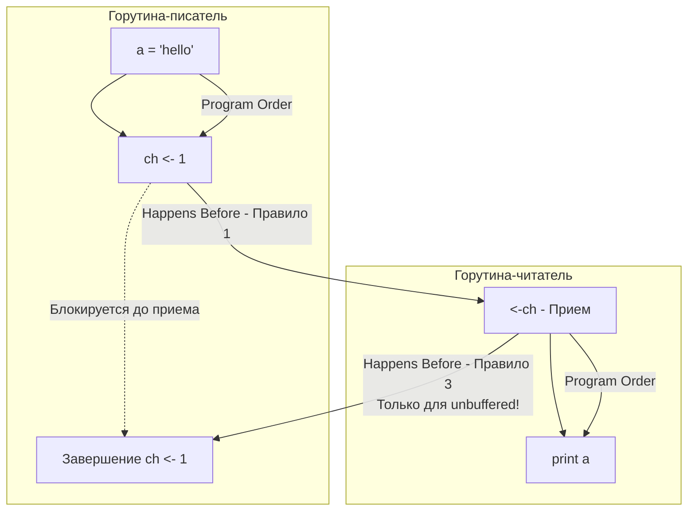

В статьях [[15. Mutex и RWMutex под капотом.md]] и [[16. sync_atomic и атомарные операции в рантайме.md]] мы разбирали, как технически работают примитивы синхронизации: как они блокируют кэш-линии и используют инструкции процессора. 

Но существует проблема более высокого уровня. Даже если вы не используете сложные алгоритмы, чтение и запись обычных переменных в многопоточной среде таят в себе фундаментальную опасность. Эта опасность исходит от тех, кто должен был нам помогать: от компилятора и самого процессора.

Чтобы писать корректный конкурентный код, Senior-инженер должен мыслить не в категориях "что выполнится раньше по времени", а в категориях **Go Memory Model** и математического отношения **Happens Before** (происходит до).

## Иллюзия последовательности (Instruction Reordering)

Давайте посмотрим на простейший код с двумя горутинами:

```go
var a string
var done bool

func setup() {
	a = "hello, world"
	done = true
}

func main() {
	go setup()
	for !done {
		// ждем
	}
	print(a)
}
```

Человеческая логика говорит: если мы вышли из цикла `for`, значит `done == true`. А раз `done` стало `true`, то переменной `a` **уже** присвоено значение `"hello, world"`. Значит, функция `print(a)` гарантированно выведет строку.

На практике этот код содержит классический **Data Race**. Программа может вывести пустую строку, вывести мусор или упасть с паникой. Почему?

Потому что и компилятор, и процессор имеют право **переставлять инструкции местами (Reordering)** для оптимизации производительности.
1. **Компилятор (SSA):** Видит, что внутри `setup()` переменные `a` и `done` никак не зависят друг от друга. Ему ничто не мешает сначала присвоить `done = true`, а уже потом работать со строкой `a`.
2. **Процессор (Out-of-Order Execution):** Даже если компилятор сгенерировал правильный порядок, ядро CPU может выполнить инструкцию записи в `done` быстрее, чем более сложную запись в память строки `a`. Запись `done` попадет в L1-кэш первого ядра раньше, и второе ядро мгновенно увидит флаг, прочитав неинициализированную строку.

> [!warning] Ловушка / Gotcha. Кэширование переменных в регистре
> В коде выше есть еще одна фатальная проблема. Компилятор может посмотреть на цикл `for !done {}` внутри `main` и подумать: *"Внутри этого цикла переменная `done` не меняется. Зачем мне каждый раз ходить за ней в оперативную память? Я прочитаю её один раз, положу в регистр процессора и буду проверять регистр"*. 
> В итоге цикл превращается в бесконечный `if !done { for {} }`. Главная горутина никогда не увидит изменений от горутины `setup`.

## Что такое Модель Памяти (Memory Model)?

**Модель памяти** — это строгий формальный контракт. Он описывает, при каких условиях чтение переменной в Горутине Б гарантированно увидит значение, записанное в эту переменную Горутиной А.

В основе этого контракта лежит понятие **Happens Before** (Происходит до).
Оно обозначается математическим символом $\to$.
Если событие $e_1 \to e_2$, это означает, что память, измененная в $e_1$, **гарантированно и предсказуемо видима** для события $e_2$.

Важно понимать: "Happens Before" — это **не про физическое время**.
Событие $e_1$ может произойти за миллисекунду до $e_2$ по настенным часам, но если между ними нет связи "Happens Before" (нет синхронизации), рантайм Go не дает никаких гарантий, что $e_2$ увидит результат $e_1$.

## Правила Happens Before в Go

Разработчики языка заложили в рантайм строгие правила. Если вы используете примитивы синхронизации, компилятор и процессор лишаются права переставлять инструкции (или обязаны скрыть эту перестановку от вас).

### 1. Инициализация (Init)
* Выполнение функции `init()` в пакете *happens before* начала выполнения функции `main.main()`.

### 2. Создание горутины
* Инструкция `go func()` *happens before* начала выполнения самой этой горутины.
*(Мы всегда гарантированно видим внутри горутины те значения переменных, которые были до ключевого слова `go`).*

### 3. Завершение горутины
* Завершение горутины **НЕ** *happens before* чему-либо.
*(Если горутина что-то записала и умерла, нет никаких гарантий, что `main` это увидит, пока вы не используете `sync.WaitGroup` или каналы).*

### 4. Каналы (Самое важное!)

Правила для каналов часто спрашивают на интервью, потому что небуферизованные каналы имеют контринтуитивную особенность.

* **Правило 1:** Отправка в канал *happens before* завершения приема из этого канала.
* **Правило 2:** Закрытие канала *happens before* получения zero-value читателем.
* **Правило 3 (Небуферизованный канал):** Успешный ПРИЕМ из небуферизованного канала *happens before* завершения ОТПРАВКИ в этот канал.


Благодаря цепочке $\text{WRITE\_A} \to \text{SEND} \to \text{RECV} \to \text{READ\_A}$, мы получаем транзитивную гарантию: запись в a гарантированно произойдет до чтения из a. Код абсолютно безопасен.
### 5. Мьютексы (sync.Mutex)
* Для любого мьютекса успешный возврат из `Unlock()` *happens before* следующего успешного возврата из `Lock()`.
*(Всё, что было изменено под мьютексом, будет на 100% видимо тому, кто захватит этот мьютекс следующим).*

## Mechanical Sympathy. Как это работает в железе?

Отношение *Happens Before* — это абстракция. Как рантайм Go заставляет физический процессор соблюдать эти правила?

Для этого используются **Memory Barriers** (Барьеры памяти) или Memory Fences.
Это специальные аппаратные инструкции (например, `MFENCE` в архитектуре x86 или `DMB` в ARM).

Когда вы вызываете `mu.Unlock()` или отправляете данные в канал, рантайм под капотом выполняет атомарную операцию (которая включает в себя барьер памяти).
Что делает барьер памяти:
1. Он говорит компилятору: "Категорически запрещаю переносить инструкции сверху барьера вниз, а снизу — вверх!".
2. Он говорит ядру CPU: "Останови конвейер. Возьми свой Store Buffer (буфер отложенной записи), сбрось все измененные данные в L1-кэш и дождись подтверждения по шине MESI от других ядер, прежде чем выполнять следующие инструкции!".

Таким образом, барьер памяти как бы "проталкивает" (flush) все локальные изменения ядра в глобальную видимость для остальных процессоров. 

> [!info] Под капотом. Патч Go 1.19 и атомарные операции
> Долгое время в официальной спецификации Go Memory Model не было ни слова про пакет `sync/atomic`. Разработчикам приходилось верить "на слово", что атомарные операции создают *happens before*.
> В Go 1.19 спецификацию официально обновили. Теперь там жестко прописано: атомарные операции в Go обеспечивают **Sequential Consistency** (последовательную согласованность). Успешная атомарная запись (`Store`, `Add`, `CAS`) *happens before* атомарного чтения (`Load`) этой же переменной.

## Как исправить наш плохой код?

Возвращаясь к примеру с `done` из начала статьи. Мы можем исправить его несколькими способами:

**Способ 1. Каналы (Идиоматичный Go)**
```go
var a string
done := make(chan struct{})

go func() {
	a = "hello, world"
	close(done) // Happens before возврата из <-done
}()

<-done
print(a)
```

**Способ 2. Atomics (Высокопроизводительный бэкенд)**
```go
var a string
var done atomic.Bool

go func() {
	a = "hello, world"
	done.Store(true) // Выпускает барьер памяти
}()

for !done.Load() { // Load гарантирует отсутствие кэширования в регистре
	runtime.Gosched() // Уступаем CPU, чтобы не сжигать ядро
}
print(a)
```

> [!tip] Собеседование. Double-Checked Locking
> **Вопрос:** Корректна ли реализация Singleton (одиночки) через двойную проверку без `atomic`?
> ```go
> var instance *Singleton
> var mu sync.Mutex
> 
> func GetInstance() *Singleton {
>     if instance == nil { // Первая проверка БЕЗ мьютекса
>         mu.Lock()
>         defer mu.Unlock()
>         if instance == nil {
>             instance = &Singleton{}
>         }
>     }
>     return instance
> }
> ```
> **Ответ:** Код содержит Data Race и может вернуть **битый объект**. 
> Инициализация `instance = &Singleton{}` состоит из двух шагов: выделение памяти и присвоение адреса. Компилятор или CPU может переставить их! Ядро 1 может записать адрес в указатель `instance` до того, как поля структуры будут заполнены нулями. 
> Ядро 2 выполнит первую проверку `if instance == nil` (которая не защищена мьютексом, а значит, нет барьера памяти), увидит не-nil указатель и вернет ссылку на мусорную память.
> Именно поэтому в Go нужно использовать `sync.Once` (который под капотом использует `atomic.Load` для первой проверки).

## Итог

1. **Reordering:** Компилятор и CPU могут и будут переставлять инструкции вашего кода для оптимизации, разрушая логику многопоточного взаимодействия.
2. **Memory Model:** Это контракт. Если вы не используете примитивы синхронизации, вы не имеете права делать выводы о порядке выполнения памяти.
3. **Happens Before ($\to$):** Математическая гарантия того, что эффекты одной операции будут видны другой. Достигается аппаратными барьерами памяти.
4. Отправка в канал, разблокировка мьютекса и атомарная запись создают непреодолимую стену (memory fence), заставляя процессор синхронизировать кэши с остальной системой.

Мы глубоко разобрали, как рантайм Go управляет потоками (Scheduler) и как синхронизирует память между ними (Memory Model). Но до сих пор мы обходили стороной вопрос: а откуда эта память вообще берется? 
Как компилятор понимает, какую переменную можно безопасно положить на быстрый стек горутины, а какую придется отдать на съедение Сборщику Мусора в кучу? 

Ответ на этот вопрос — главная тема оптимизации бэкенда. Переходим к следующей статье:
[[18. Escape Analysis. Почему переменная ушла в heap.md]]