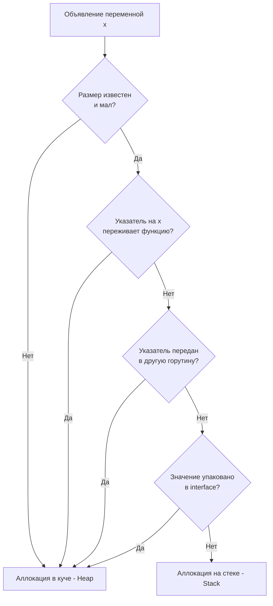

В прошлых статьях мы погружались в то, как рантайм управляет памятью горутины ([[11. Стек горутины. Рост и shrink стека.md]]) и как синхронизирует кэши ядер процессора ([[17. Go Memory Model и happens before.md]]). Мы часто упоминали термины «Стек» и «Куча». 

В языках вроде C или C++ программист сам решает, где выделить память:
* Написал `int a = 5;` — память выделилась на быстром стеке.
* Написал `int* a = malloc(sizeof(int));` — память выделилась в медленной куче.

Но если в C вы вернете указатель на локальную переменную из функции, вы получите «висячий указатель» (Dangling Pointer) и фатальную ошибку памяти (Undefined Behavior). Стек функции уничтожается при выходе из нее, и ваш указатель будет смотреть на мусор.

Go — это язык, созданный для безопасной конкурентности. Вы **можете** вернуть указатель на локальную переменную, и программа не упадет. Почему? Потому что в конвейере компиляции (на этапе работы с AST, см. [[3. Фазы компиляции. Lexer, Parser, Type Checker, SSA.md]]) работает гениальный механизм — **Escape Analysis (Анализ побега)**.

## Mechanical Sympathy. Цена вопроса

Зачем вообще заботиться о том, где лежит переменная?

**Аллокация на стеке:**
Стоит **0 тактов CPU** в рантайме. Компилятор просто сдвигает регистр `SP` (Stack Pointer) вниз на этапе ассемблирования (`SUBQ $24, SP`). Когда функция завершается, указатель сдвигается обратно. Сборщик мусора (GC) никогда не сканирует мертвые фреймы стека. Это абсолютно бесплатная память.

**Аллокация в куче (Heap):**
Стоит дорого. Рантайм должен найти свободный блок памяти подходящего размера в структурах `mcache` или `mcentral` (см. [[21. Аллокатор памяти Go. mcache, mcentral, mheap.md]]). Но самое страшное — переменная в куче создает работу для Сборщика Мусора. Больше аллокаций в куче $\to$ чаще запускается GC $\to$ больше тактов CPU уходит на обход графа объектов вместо обработки бизнес-логики.

**Задача Escape Analysis** — доказать, что переменная не "убегает" из текущей функции. Если компилятор может это математически доказать, он кладет переменную на бесплатный стек. Если есть хоть малейшее сомнение — переменная отправляется в кучу.

## Как компилятор принимает решение?

Анализ побега — это статический анализ графа потока данных. Компилятор ищет ответы на несколько жестких вопросов.



Разберем 4 главных правила, по которым компилятор "штрафует" ваш код аллокациями.

### Правило 1: Возврат указателя (Sharing Out)

Самый очевидный случай. Если функция создает переменную и возвращает указатель на нее, эта переменная будет нужна вызывающей стороне *после* того, как стек текущей функции будет уничтожен.

```go
func createUser() *User {
    u := User{Name: "Alex"} // Убегает в Heap
    return &u
}
```
Компилятор понимает, что если `u` останется на стеке `createUser`, то вызывающая функция получит битый указатель. Поэтому он тихо переносит аллокацию `u` в кучу.

### Правило 2: Передача указателя вглубь структур (Sharing Down)

Если вы кладете указатель локальной переменной внутрь другой структуры, которая уже находится в куче, ваша локальная переменная тоже **обязана** отправиться в кучу.

```go
type Registry struct {
    users []*User
}

func addUser(r *Registry) {
    u := User{Name: "Bob"} // Убегает в Heap!
    r.users = append(r.users, &u)
}
```
Даже если `u` не возвращается из функции напрямую, она привязывается к массиву `r.users`. Если `r` живет в куче, то сборщик мусора сойдет с ума, если массив из кучи будет ссылаться на временный стек какой-то горутины. Поэтому `u` "эвакуируется" в кучу.

> [!warning] Ловушка / Gotcha. Каналы и указатели
> Отправка указателя в канал **всегда** приводит к Escape Analysis = Heap. 
> Компилятор не может знать, какая горутина прочитает из канала и когда. Если мы передаем адрес локальной переменной в другую горутину, память обязана быть общей (куча), так как стеки у горутин строго изолированы.

### Правило 3: Размер неясен или слишком велик

Стек фрейм функции рассчитывается на этапе компиляции (размер хардкодится в ассемблере). 
Если вы просите выделить массив, размер которого становится известен только в рантайме, компилятор не может положить его на стек.

```go
func process(size int) {
    // Убегает в Heap! Компилятор не знает size.
    buf := make([]byte, size) 
    
    // Остается на стеке! Размер константен и мал.
    buf2 := make([]byte, 64)  
}
```
Также существует жесткий лимит. В современных версиях Go переменная размером больше **64 КБ** (даже если размер известен заранее) всегда уходит в кучу, чтобы не переполнить стартовый стек горутины (который весит всего 2 КБ и будет вынужден сразу делать дорогой realloc).

### Правило 4: Упаковка в интерфейс (Interface Boxing)

Это самая неочевидная причина побега в кучу, на которой срезаются многие мидлы.

```go
func printLog() {
    x := 42 // Убегает в Heap! Почему?
    fmt.Println(x)
}
```
Почему обычный `int` улетел в кучу? Потому что сигнатура `fmt.Println` принимает `...any` (слайс пустых интерфейсов `interface{}`).
Под капотом пустой интерфейс (`eface`) — это структура из двух указателей (на тип и на данные). Чтобы передать `42` как интерфейс, рантайм должен создать где-то в памяти объект со значением 42 и дать интерфейсу указатель на него. Так как `fmt.Println` использует рефлексию (которая не гарантирует, что не сохранит указатель глобально), компилятор пессимистично отправляет `42` в кучу.

*(Детальнее механику мы разберем в [[36. Interface Boxing и hidden allocation.md]])*.

## Как посмотреть решения компилятора?

Вам не нужно гадать. Разработчики компилятора оставили нам мощный флаг `-gcflags="-m"`.

Напишем файл `main.go`:
```go
package main

type Data struct { Val int }

func makeData() *Data {
	d := Data{Val: 10}
	return &d
}

func main() {
	makeData()
}
```

Выполняем сборку с флагом:
```bash
go build -gcflags="-m" main.go
```

Выхлоп:
```text
./main.go:6:2: moved to heap: d
```
Компилятор прямым текстом говорит нам: на 6 строке переменная `d` перемещена в кучу. Если вы хотите еще больше деталей (почему именно она туда ушла), можно использовать двойной флаг: `-gcflags="-m -m"`.

> [!tip] Собеседование. Передача по значению или по указателю?
> **Вопрос:** Мы хотим передать большую структуру (например, 200 байт) в функцию-обработчик. Что будет работать быстрее: `func process(s Struct)` (по значению) или `func process(s *Struct)` (по указателю)?
> **Ответ:** Зависит от Escape Analysis! 
> Если вы передаете по значению, вы копируете 200 байт на стек. Это занимает пару тактов CPU (очень быстро) и **не нагружает сборщик мусора**.
> Если вы передаете по указателю, вы копируете всего 8 байт (адрес). НО если внутри функции этот указатель "убежит" (например, сохранится в кэш или уйдет в интерфейс), исходная структура в 200 байт аллоцируется в куче. Затраты на аллокацию кучи и работу GC в тысячу раз превысят стоимость копирования 200 байт по значению на стеке. В Go часто выгоднее копировать небольшие структуры по значению.

## Итог

1. **Escape Analysis** — это статический анализатор компилятора, определяющий время жизни переменной.
2. Аллокация на стеке бесплатна. Аллокация в куче бьет по CPU и заставляет работать Garbage Collector.
3. Переменная убегает в кучу, если:
   * На нее возвращается указатель из функции.
   * Указатель на нее присваивается в объект, уже лежащий в куче.
   * Ее размер слишком велик (обычно > 64 КБ) или не известен на этапе компиляции.
   * Она конвертируется в `interface{}` (Boxing).
4. Главный инструмент анализа: `go build -gcflags="-m"`.

Понимание правил Escape Analysis — это фундамент написания zero-allocation кода (кода без мусора). Знать теорию полезно, но как применить её на практике? Как отрефакторить реальный бэкенд-код, чтобы снизить аллокации в горячих циклах (Hot Paths) в десятки раз?

В следующей статье мы применим Mechanical Sympathy на практике:
[[19. Escape Analysis на практике. Как писать меньше аллокаций.md]]