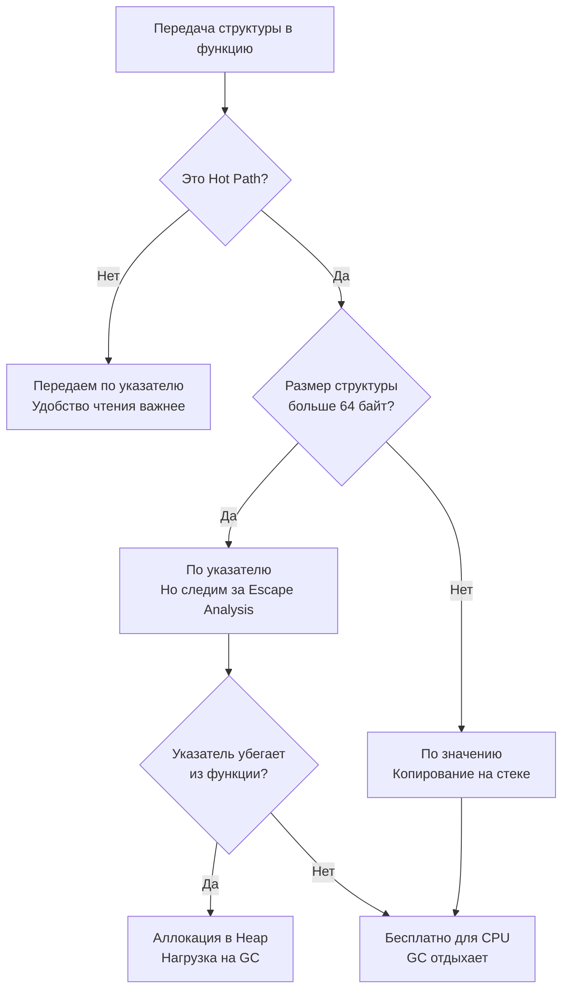

В статье [[18. Escape Analysis. Почему переменная ушла в heap.md]] мы разобрали теорию: как компилятор решает судьбу ваших переменных, анализируя граф ссылок. Теория — это отлично, но бэкенд-инженеру платят за то, чтобы сервер держал 10 000 RPS на минимальном железе.

Аллокации в куче (Heap) — главный враг высоконагруженного кода на Go. Они тратят процессорное время на поиск свободной памяти и заставляют Сборщик мусора (GC) регулярно останавливать мир (пусть и на доли миллисекунды) или отбирать ядра CPU для сканирования мусора.

В этой статье мы перейдем к практике. Мы разберем паттерны Mechanical Sympathy, которые позволяют обмануть Escape Analysis и писать `zero-allocation` код в критических участках приложения.

## Правило нулевое: Hot Path

Прежде чем бросаться вычищать аллокации, нужно запомнить главное правило оптимизации: **Не оптимизируйте холодный код**.

Если переменная аллоцируется в куче при чтении конфига на старте приложения или при обработке cron-задачи раз в сутки — забудьте об этом. Оптимизировать нужно только **Hot Path (Горячий путь)** — участки кода, которые выполняются тысячи раз в секунду. Обычно это циклы обработки данных, сетевые поллеры или хэндлеры HTTP-запросов.

## Паттерн 1. Копирование по значению (Value Semantics)

Самый глубокий миф, который приносят разработчики из других языков: *"Передавать объекты по указателю всегда быстрее, потому что мы копируем всего 8 байт адреса"*.

В Go это утверждение ложно в 50% случаев.

Если вы передаете структуру по указателю в функцию, и внутри этой функции указатель попадает в интерфейс, замыкание или сохраняется в глобальную мапу, срабатывает правило Escape Analysis (Sharing Out / Sharing Down). Структура эвакуируется в кучу. Стоимость аллокации в куче и последующей работы GC в сотни раз превышает стоимость копирования.

Современные процессоры невероятно быстро копируют непрерывные блоки памяти. Скопировать структуру размером 64 или 128 байт по значению (на стеке) для CPU — это буквально пара инструкций перемещения регистров.



**Практика:** Для структур размером до 3-4 машинных слов (24-32 байта) передача по значению почти всегда быстрее. Для структур до ~128 байт передача по значению быстрее, если она предотвращает побег в кучу. 

## Паттерн 2. Интерфейсы и логирование (Boxing)

Вспомним Правило 4 из прошлой статьи: упаковка в `interface{}` (или `any`) отправляет базовые типы в кучу.
Это классическая проблема логирования.

Плохой код (использует стандартный `log` или `logrus`):
```go
func processRequest(userID int64) {
    // userID = 42 (на стеке)
    // При передаче в Println он пакуется в interface{} -> Убегает в Heap!
    log.Println("Processing user", userID) 
}
```

В высоконагруженном сервисе каждый запрос будет плодить мусор. Как это лечится? Использованием логгеров без аллокаций (например, `uber-go/zap`).

Хороший код:
```go
func processRequest(userID int64, logger *zap.Logger) {
    // zap.Int64 не использует interface{}
    // Он использует строго типизированную структуру Field. 0 аллокаций!
    logger.Info("Processing user", zap.Int64("user_id", userID))
}
```

> [!tip] Собеседование. Как Generic'и спасают от интерфейсов?
> **Вопрос:** Если мы напишем функцию `func Print[T any](val T)`, убежит ли `val` в кучу, как это происходит с `interface{}`?
> **Ответ:** Нет! Generic'и в Go работают через мономорфизацию (stenciling). На этапе компиляции компилятор создаст отдельную копию функции `Print` под конкретный тип (например, `Print_int`). Значение передается со строгим типом без упаковки в `eface`, и Escape Analysis оставляет его на стеке. (Подробнее в [[36. Interface Boxing и hidden allocation.md]]).

## Паттерн 3. Предварительная аллокация слайсов

Если вы создаете слайс (см. [[29. Внутреннее устройство slice.md]]) без указания вместимости (`capacity`), и начинаете добавлять в него элементы в цикле, происходят две страшные вещи:
1. Постоянные реаллокации (выделение новой памяти, копирование старой).
2. Слайс гарантированно убегает в кучу, потому что его размер постоянно меняется в рантайме.

**Плохо:**
```go
func getIDs(users []User) []int64 {
    var ids []int64 // Длина 0, Капасити 0
    for _, u := range users {
        ids = append(ids, u.ID) // Аллокации и рост в Heap
    }
    return ids
}
```

**Mechanical Sympathy (Идеально):**
```go
func getIDs(users []User) []int64 {
    // Мы знаем финальный размер! Сразу выделяем память.
    ids := make([]int64, 0, len(users)) 
    for _, u := range users {
        ids = append(ids, u.ID) // 0 реаллокаций
    }
    return ids
}
```
Даже если мы возвращаем этот слайс (он всё равно уйдет в кучу), мы сделали ровно **одну** аллокацию вместо десятка.

## Паттерн 4. Zero-Copy String Conversion

В Go `string` — это неизменяемый массив байт. Слайс `[]byte` — изменяемый. 
Поэтому стандартное преобразование `[]byte(str)` или `string(bytes)` **всегда** выделяет новую память в куче и копирует туда данные, чтобы вы не смогли изменить оригинальную строку, поменяв байты в слайсе.

Но в Hot Path парсерах (например, разбор JSON или HTTP-заголовков) это убивает производительность.
Если вы на 100% уверены, что не будете изменять байты, вы можете использовать пакет `unsafe` для обмана системы типов без копирования памяти.

> [!warning] Ловушка / Gotcha. unsafe-трюки
> До версии Go 1.20 разработчики писали жуткие конструкции с `unsafe.Pointer` и `reflect.StringHeader`. Это было опасно и ломалось при обновлениях компилятора.

Современный (начиная с Go 1.20) безопасный способ сделать zero-copy конвертацию:

```go
import "unsafe"

// Из string в []byte (без аллокаций)
func strToBytes(s string) []byte {
    if s == "" {
        return nil
    }
    return unsafe.Slice(unsafe.StringData(s), len(s))
}

// Из []byte в string (без аллокаций)
func bytesToStr(b []byte) string {
    if len(b) == 0 {
        return ""
    }
    return unsafe.String(unsafe.SliceData(b), len(b))
}
```
Эти функции выполняются за $0$ тактов (они просто перекладывают указатели на одни и те же данные в памяти). Мы детально разберем внутреннее устройство строк в [[34. Внутреннее устройство string.md]] и магию `unsafe` в [[38. Unsafe.Pointer и нарушение гарантий языка.md]].

## Паттерн 5. sync.Pool для тяжелых объектов

Если вы создаете тяжелые объекты (например, буферы `bytes.Buffer` на килобайты памяти) на каждый входящий HTTP-запрос, Escape Analysis бессилен — они уйдут в кучу. GC захлебнется от количества мусора.

Решение — переиспользование объектов. Вы берете грязную кружку, моете её и используете снова, вместо того чтобы выбрасывать и покупать новую.
Для этого в стандартной библиотеке есть `sync.Pool`.

```go
var bufPool = sync.Pool{
    New: func() any {
        return new(bytes.Buffer)
    },
}

func handleRequest() {
    // Берем готовый буфер из пула (0 аллокаций)
    buf := bufPool.Get().(*bytes.Buffer)
    
    // ВАЖНО: сбрасываем состояние перед использованием!
    buf.Reset() 
    
    // ... работаем с buf ...
    
    // Возвращаем в пул
    bufPool.Put(buf) 
}
```

> [!info] Под капотом
> `sync.Pool` работает невероятно быстро, потому что он интегрирован прямо в рантайм Go (в структуры логического процессора `P`). Он забирает объекты без блокировок мьютексами (через lock-free очереди). Мы изучим его досконально в [[23. sync_pool под капотом.md]].

## Как доказать отсутствие аллокаций?

Слова ничего не значат без метрик. Ваш главный инструмент для проверки Hot Path — это бенчмарки с флагом проверки памяти.

Напишите тест:
```go
func BenchmarkGetIDs(b *testing.B) {
    users := make([]User, 100)
    b.ResetTimer() // Сбрасываем таймер после подготовки данных
    
    for i := 0; i < b.N; i++ {
        _ = getIDs(users)
    }
}
```

Запустите с флагом `-benchmem`:
```bash
go test -bench=. -benchmem
```

Вывод, который вы хотите увидеть:
```text
BenchmarkGetIDs-8    10000000    120 ns/op    0 B/op    0 allocs/op
```
`0 allocs/op` означает, что вы победили. Ваш код выполняется исключительно на стеке или переиспользует память. 

## Итог

1. Анализ и борьба с аллокациями имеет смысл только в **Hot Path** (горячих путях выполнения).
2. **Передача по значению** небольших структур (до ~128 байт) часто быстрее передачи указателей, так как гарантирует использование стека и снимает нагрузку с GC.
3. Избегайте упаковки в `interface{}` в горячем коде (используйте строгие типы, кодогенерацию или дженерики).
4. Всегда задавайте `capacity` для слайсов, если знаете финальный размер (`make([]T, 0, cap)`).
5. Для огромных буферов и объектов, которые вынужденно уходят в кучу, используйте `sync.Pool`.

Мы закончили блок, посвященный памяти горутин, побегу в кучу и стекам. Но что представляет собой сама Куча (Heap)? Как рантайм управляет глобальной оперативной памятью, когда переменных становится миллионы? 

В следующей статье мы начнем разбирать глобальную память Go. Переходим к:
[[20. Stack vs Heap в Go.md]]