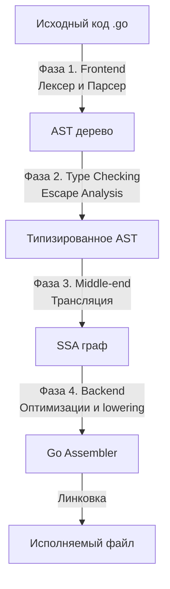

В первой статье мы увидели финал работы языка — момент, когда бинарный файл загружается в память и рантайм начинает разворачивать свои структуры. Но прежде чем этот бинарник вообще появится, исходный код должен пройти через жесткий конвейер трансформаций.

Для инженера, переходящего в Go из языков с JIT-компиляцией (Java, C#) или интерпретируемых языков (PHP, Python), архитектура компилятора Go часто становится откровением. Go использует **AOT-компиляцию** (Ahead-of-Time). Это значит, что компилятор транслирует ваш код напрямую в машинные инструкции конкретной архитектуры (x86, ARM) еще до запуска приложения. Никакой виртуальной машины (JVM/CLR) или байт-кода на проде — только суровый нативный код и встроенный рантайм.

## Почему не LLVM. Философия компилятора

Многие задаются вопросом: почему авторы Go написали свой собственный компилятор с нуля, а не использовали готовую, мощную и проверенную временем инфраструктуру LLVM (как это делают Rust, Swift или Clang для C++)?

Ответ кроется в балансе между **скоростью компиляции** и **глубиной оптимизации кода**.
Компилятор LLVM создает потрясающе быстрый машинный код, применяя сотни проходов оптимизации. Но этот процесс невероятно медленный (каждый, кто собирал крупные проекты на C++ или Rust, знает эту боль). 
Go изначально создавался для огромных монолитов Google. Главной метрикой была скорость обратной связи для разработчика. Компилятор Go намеренно спроектирован так, чтобы быть немного «глупее» LLVM в плане глубоких математических оптимизаций, но в десятки раз быстрее при сборке.

> [!info] Под капотом. Раскрутка компилятора
> До версии Go 1.4 компилятор был написан на C. Начиная с версии 1.5, произошел процесс **Bootstrapping** — компилятор переписали на самом Go. Теперь для того, чтобы скомпилировать исходники свежего компилятора Go, вам нужен установленный предыдущий бинарник Go. Это позволило применять инструменты профилирования самого языка (pprof) для оптимизации компилятора, сделав его работу еще быстрее.

## Высокоуровневая архитектура пайплайна

Процесс превращения вашего текста в машинный код разделен на 4 большие фазы. В отличие от сложных многопроходных компиляторов, Go старается двигаться строго вперед, минимизируя повторные обходы дерева синтаксиса.

### 1. Frontend. Синтаксический анализ и проверка типов

На этом этапе компилятор не думает об архитектуре процессора. Его задача — понять, что именно вы написали, и убедиться, что это семантически корректно.

- **Лексический и синтаксический анализ.** Текст разбивается на токены, из которых строится Абстрактное Синтаксическое Дерево (AST).
- **Type Checking.** Проверка совпадения типов. Сможете ли вы передать эту структуру в интерфейс? Соответствуют ли типы аргументов сигнатуре функции? Здесь же компилятор разворачивает дженерики (generics) с помощью мономорфизации (создания копий функций под конкретные типы).
- **Escape Analysis.** Именно здесь, на этапе работы с AST, компилятор решает, где выделить память под переменную — на стеке (быстро и без GC) или в куче (heap). Мы детально разберем этот механизм в [[18. Escape Analysis. Почему переменная ушла в heap.md]].

### 2. Middle-end. Переход в SSA

AST — удобная структура для проверки синтаксиса, но отвратительная для оптимизации машинного кода. Поэтому компилятор конвертирует AST в промежуточное представление — **SSA (Static Single Assignment)**.

SSA — это форма представления кода, где каждой переменной значение присваивается ровно один раз. Если вы меняете значение переменной в цикле, SSA создает новую версию этой переменной под капотом (например, `x1`, `x2`, `x3`).

> [!tip] Собеседование
> 
> **Вопрос.** Почему компилятору так важно использовать SSA?
> 
> **Ответ.** SSA-форма показывает поток данных прозрачно. Если переменной значение присваивается только один раз, компилятору становится элементарно просто отслеживать ее время жизни (lifetime). Это позволяет легко удалять мертвый код (DCE — Dead Code Elimination), выкидывать лишние проверки границ массивов (BCE — Bounds Check Elimination) и эффективно распределять переменные по регистрам процессора.

### 3. Оптимизации SSA

Получив SSA, компилятор прогоняет через него десятки оптимизационных проходов (passes). Именно здесь происходят вещи, влияющие на Mechanical Sympathy:

- **Inlining (Встраивание).** Вызов функции — дорогая операция (сохранение регистров, сдвиг указателя стека). Компилятор берет тело маленьких функций и вставляет их прямо в место вызова.
- **Dead Code Elimination.** Удаление веток `if`, которые никогда не выполнятся.
- **Devirtualization.** Если компилятор видит, что вызов метода через интерфейс всегда указывает на один и тот же конкретный тип, он заменяет дорогой динамический вызов на быстрый прямой вызов (direct call).

### 4. Backend и Кодогенерация (Lowering)

Наконец, абстрактный SSA-граф, который не зависел от платформы, начинает "приземляться" (lowering) на конкретную архитектуру процессора, указанную в `GOARCH` (например, `amd64` или `arm64`).

Каждая инструкция SSA заменяется на одну или несколько инструкций машинного кода. Здесь же компилятор решает, в каком физическом регистре процессора (RAX, RDI и т.д.) будет лежать ваша переменная. Выхлопом этого этапа является объектный файл, содержащий инструкции в формате внутреннего ассемблера Go.

Подробнее об этом мы поговорим в [[5. Go assembler и внутренний ассемблерный синтаксис.md]].

> [!warning] Ловушка / Gotcha
> 
> Компилятор Go **не линкует библиотеки динамически** (по умолчанию). Вы не можете просто обновить `.so` или `.dll` файл на сервере, чтобы пропатчить бэкенд на Go. Все зависимости, весь ваш код и весь рантайм (сборщик мусора, планировщик) статически компилируются и собираются линковщиком в один огромный (fat binary) исполняемый файл. Это делает деплой невероятно простым (скопировал один файл и запустил), но увеличивает размер бинарника.

## Итог

1. Компилятор Go — это компромисс между скоростью сборки и глубиной оптимизаций. Он написан на самом Go.
2. Он производит AOT-компиляцию прямо в бинарный машинный код, избавляя от необходимости в JIT и тяжелых виртуальных машинах на сервере.
3. Сердце оптимизаций компилятора — это SSA (Static Single Assignment) граф.

Архитектура описана крупными мазками. В следующей статье мы возьмем лупу и посмотрим на первую половину пайплайна: как именно парсится текст и как компилятор проверяет типы и интерфейсы.

Переходим к: [[3. Фазы компиляции. Lexer, Parser, Type Checker, SSA]]