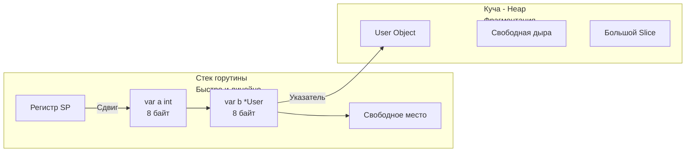

В статьях [[18. Escape Analysis. Почему переменная ушла в heap.md]] и [[19. Escape Analysis на практике. Как писать меньше аллокаций.md]] мы боролись за то, чтобы наши переменные не "убегали" со стека. Мы воспринимали стек как абсолютное благо, а кучу — как неизбежное зло, нагружающее Сборщик мусора.

Но чтобы писать высокопроизводительный код на уровне Senior, недостаточно знать *как* избежать кучи. Нужно понимать физику процесса: что именно представляют собой эти две области памяти на уровне операционной системы и кэшей процессора. 

Почему аллокация на стеке работает мгновенно, а поход в кучу убивает производительность, даже если мы временно отключим Garbage Collector?

## Физическая реальность памяти

На уровне железа (чипов RAM на материнской плате) нет никакого разделения на "стек" и "кучу". Оперативная память — это просто гигантский одномерный массив байт.
Разделение на стек и кучу — это абстракция операционной системы (виртуальная память) и рантайма языка программирования.

Когда вы запускаете бинарник Go, ОС выделяет процессу виртуальное адресное пространство. Рантайм Go берет это пространство и логически делит его на зоны.

### Стек (Stack): Линейная скорость

Как мы помним из [[11. Стек горутины. Рост и shrink стека.md]], каждая горутина получает свой личный, эксклюзивный кусок памяти (изначально 2 КБ).

**Свойства стека:**
1. **Эксклюзивность:** К стеку текущей горутины не может получить прямой доступ никакая другая горутина (если мы явно не передадим указатель, что вызовет Escape Analysis). Следовательно, для выделения памяти на стеке **не нужны мьютексы или атомарные операции**.
2. **Линейность:** Память выделяется строго последовательно. Вызов функции просто сдвигает Указатель Стека (регистр `SP` в процессоре) на нужное количество байт вниз.
3. **Бесплатная очистка:** Когда функция завершается, компилятор просто сдвигает указатель `SP` обратно вверх. Данные не затираются нулями, они просто остаются лежать в памяти до тех пор, пока следующая функция не перезапишет их. Никакой работы для GC.

### Куча (Heap): Глобальный хаос

Куча — это гигантский общий пул памяти для всей программы. 

**Свойства кучи:**
1. **Конкурентность:** Миллионы горутин могут одновременно запрашивать память из кучи. Рантайм обязан выдавать участки памяти безопасно (thread-safe), что требует сложных алгоритмов блокировок (о которых мы поговорим в следующей статье).
2. **Фрагментация:** Память выделяется и освобождается в случайном порядке. Образуются "дыры" (свободные блоки между занятыми). Аллокатор должен тратить процессорное время на поиск подходящей дыры нужного размера.
3. **Налог на Сборку мусора:** Все, что попало в кучу, должно быть рано или поздно отсканировано и удалено.



## Mechanical Sympathy: Настоящая цена Кучи

Многие разработчики думают, что проблема кучи только в Garbage Collector. Это фатальное заблуждение.
Главная проблема кучи — это **Cache Miss (промах мимо кэша процессора)**.

Чтобы понять это, вспомним иерархию памяти современного сервера:
* **L1 кэш (внутри ядра CPU):** Доступ за ~1-2 такта. (Объем ~32 КБ).
* **L2 кэш (внутри ядра CPU):** Доступ за ~10 тактов. (Объем ~256 КБ).
* **L3 кэш (общий для всех ядер):** Доступ за ~40-60 тактов. (Объем ~16-32 МБ).
* **RAM (Оперативная память):** Доступ за **~200-300 тактов**.

Процессор **ненавидит** ходить в RAM. Это невероятно медленно. Чтобы ускорить работу, процессор читает данные из RAM не побайтово, а целыми кэш-линиями по 64 байта (см. [[16. sync_atomic и атомарные операции в рантайме.md]]).

### Почему Стек летает?
Стек горутины непрерывен. Когда горутина активно работает, её стек почти всегда находится в сверхбыстром кэше L1 или L2. 
Когда процессор читает переменную `a` со стека, он заодно подтягивает в кэш-линию соседнюю переменную `b`. Доступ к локальным переменным происходит практически на скорости света. Мы получаем стопроцентный **Cache Hit**.

### Почему Куча тормозит (Pointer Chasing)?
Переменные в куче раскиданы хаотично. 
Представьте, что у вас есть слайс указателей: `users []*User`.
Сам слайс (массив указателей) может лежать непрерывно. Но когда вы делаете цикл:
```go
for _, u := range users {
    print(u.Age)
}
```
Процессор читает адрес указателя, а затем вынужден идти по этому адресу в кучу. Объект `User 1` лежит по адресу `0xA100`, а `User 2` — по адресу `0xBB00`.
Процессор не может предсказать этот прыжок (Hardware Prefetcher сходит с ума). При каждом обращении к `u.Age` происходит **Cache Miss**. Процессор простаивает 300 тактов, ожидая ответа от планки оперативной памяти.

Этот антипаттерн называется **Pointer Chasing (Погоня за указателями)**.

> [!tip] Собеседование. Массив структур vs Массив указателей
> **Вопрос:** Что работает быстрее при итерации и суммировании поля: `[]User` (массив структур по значению) или `[]*User` (массив указателей)?
> **Ответ:** `[]User` работает **на порядки быстрее**. 
> В `[]User` все структуры лежат в памяти единым, непрерывным блоком (Data Locality). Процессор подтягивает их в L1-кэш большими чанками и суммирует без задержек. 
> В `[]*User` каждая структура аллоцирована в куче отдельно. Итерация по такому массиву вызывает шторм Cache Miss-ов. Передавать по указателю стоит только тогда, когда структура слишком огромна для копирования, или когда требуется мутация (изменение состояния) оригинального объекта.

## Миф: "Куча — это медленно из-за системных вызовов"

В языках вроде C, вызов `malloc` (выделение памяти в куче) часто приводит к системному вызову к ядру ОС (например, `brk` или `mmap`), что стоит тысячи тактов CPU.

Инженеры Go знали об этом. Поэтому рантайм Go **не делает системных вызовов при каждой аллокации в куче**.
Рантайм заранее (крупными кусками по несколько мегабайт) запрашивает память у операционной системы через `mmap`. А затем сам, в User Space, мелко "нарезает" эту память для ваших структур.

Именно поэтому аллокация в Go (даже в куче) работает в несколько раз быстрее, чем стандартный `malloc` в C. Но она всё равно остается медленнее стека из-за необходимости синхронизации и обновления метаданных для сборщика мусора.

## Когда Куча — это хорошо?

После всех страшилок про кучу может показаться, что её нужно избегать любой ценой. Это не так. Куча — важнейший инструмент проектирования.

1. **Разделение состояния (Shared State):** Если у вас есть in-memory кэш (например, `map[string]User`), к которому обращаются сотни горутин-обработчиков HTTP-запросов, этот кэш обязан жить в куче.
2. **Динамический размер:** Стек ограничен. Если вы читаете файл размером 10 МБ в буфер, этот буфер должен аллоцироваться в куче (через `io.ReadAll` или `make([]byte, 10*1024*1024)`). Попытка положить огромный массив на стек приведет к его разрастанию и лишнему копированию (см. [[11. Стек горутины. Рост и shrink стека.md]]).
3. **Долгоживущие объекты (Long-lived objects):** Объекты, жизненный цикл которых привязан к работе всего приложения (пулы коннектов к БД, глобальные логгеры, конфигурации), чувствуют себя в куче прекрасно. Сборщик мусора умеет эффективно игнорировать старые объекты и не тратить на них много времени.

## Итог

1. **Стек:** Линейная память, локальная для горутины. Выделение стоит 0 тактов. Максимальная дружелюбность к кэшам CPU (Data Locality). Данные исчезают мгновенно при выходе из функции.
2. **Куча:** Глобальная, фрагментированная память. Требует работы аллокатора и сборщика мусора. Главный удар по производительности — **Cache Misses** из-за хаотичного расположения объектов.
3. **Pointer Chasing:** Итерация по слайсу указателей убивает производительность CPU. Итерация по слайсу значений (непрерывному куску памяти) летает на максимальной скорости.
4. Выделение памяти в куче Go сильно оптимизировано и работает в User Space без частых системных вызовов.

Но как именно рантайм Go "нарезает" эту память в User Space без глобальных блокировок (мьютексов), чтобы тысяча горутин не выстроилась в очередь за памятью?
Это шедевр инженерной мысли, основанный на алгоритме `TCMalloc`.

В следующей статье мы разберем анатомию этого механизма:
[[21. Аллокатор памяти Go. mcache, mcentral, mheap.md]]