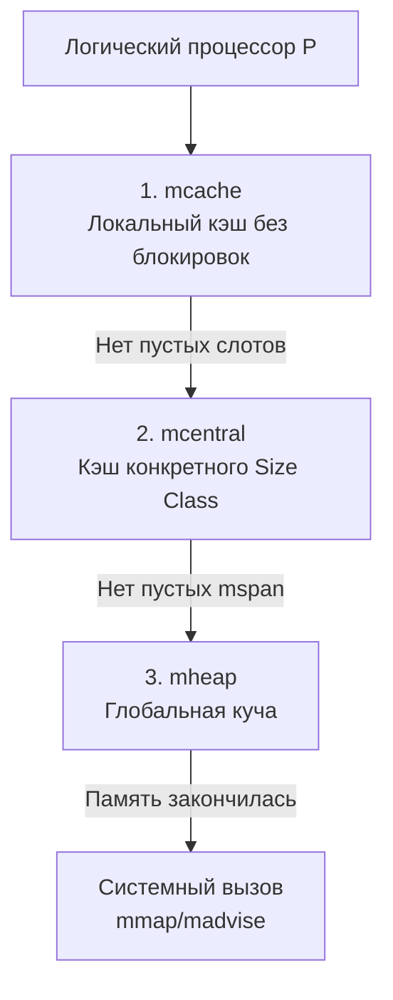

В статье [[20. Stack vs Heap в Go.md]] мы установили, что Куча (Heap) — это медленно. Но главная причина медлительности кучи в многопоточной среде — это не сами по себе кэш-промахи (Cache Misses), а **конкуренция за блокировки (Lock Contention)**.

Представьте себе классический `malloc` в языке C из 90-х годов. Это глобальная функция, которая управляет единым куском оперативной памяти. Если 16 физических ядер процессора одновременно захотят выделить память для своих объектов, 15 из них выстроятся в очередь и уснут на глобальном мьютексе, пока 1 ядро ищет свободный блок. В высоконагруженном бэкенде это приводит к деградации производительности в десятки раз.

Чтобы Go мог держать миллионы горутин, ему был нужен аллокатор, способный выдавать память параллельно, **без блокировок**. Для этого инженеры применили архитектуру **TCMalloc** (Thread-Caching Malloc), изначально разработанную в Google для C++.

Ее фундаментальная идея — иерархия кэшей. Рантайм Go делит память на три уровня: `mcache`, `mcentral` и `mheap`.

## Анатомия памяти: Page и mspan

Прежде чем разбирать кэши, нам нужно понять, чем именно они управляют. Рантайм Go не работает с отдельными байтами. Он мыслит крупными блоками.

1. **Page (Страница):** Минимальная единица памяти, которую рантайм берет у операционной системы. В Go размер одной страницы равен **8 КБ** (в Linux по умолчанию 4 КБ, рантайм абстрагирует это).
2. **mspan (Span):** Базовый строительный блок аллокатора. Это структура `mspan`, которая управляет непрерывным блоком из одной или нескольких страниц (8 КБ, 16 КБ, 24 КБ и т.д.).

Сам по себе `mspan` — это просто пустой кусок памяти. Чтобы раздавать его под пользовательские структуры, рантайм нарезает `mspan` на одинаковые ячейки определенного размера. Это называется **Size Classes (Классы размеров)**.

В Go существует **67 классов размеров** (от 8 байт до 32 КБ).
Например:
* Класс 1: Ячейки по 8 байт.
* Класс 2: Ячейки по 16 байт.
* Класс 3: Ячейки по 24 байта.

Если `mspan` объемом 8 КБ (8192 байта) назначен для Класса 2 (16 байт), он физически распиливается на 512 готовых слотов по 16 байт.

> [!warning] Ловушка / Gotcha. Внутренняя фрагментация
> Такой подход полностью уничтожает Внешнюю фрагментацию (дыры между объектами разного размера). Но он порождает **Внутреннюю фрагментацию**.
> Если вы аллоцируете структуру размером 19 байт, аллокатор не найдет точного класса. Ближайший больший класс — это Класс 3 (24 байта). Рантайм выделит вам слот на 24 байта. 5 байт памяти будут потрачены впустую (padding). Именно поэтому в Go важно выравнивать поля в структурах — это не только ускоряет CPU, но и позволяет "влезть" в более мелкий Size Class, сэкономив RAM.

## Иерархия аллокатора: Три кита

Теперь посмотрим, как эти нарезанные `mspan` распределяются между горутинами.

### 1. mcache (Уровень 1 - Локальный кэш)

Это Святой Грааль Mechanical Sympathy в аллокаторе Go.
Как мы помним из [[9. Scheduler Go. G, M, P и work stealing.md]], в системе есть структуры `P` (Логические процессоры), которых по умолчанию столько же, сколько ядер CPU. 
К каждому `P` намертво привязан **один личный `mcache`**.

`mcache` содержит массив указателей на 67 `mspan` (по одному на каждый класс размера).

**Почему это гениально?**
Поскольку в один момент времени на одном логическом процессоре `P` выполняется ровно одна горутина (через один поток ОС `M`), **доступ к `mcache` не требует никаких мьютексов**. Выделение памяти из `mcache` — это пара инструкций ассемблера (найти нужный `mspan` по индексу размера, забрать слот, сдвинуть внутренний указатель). Ноль блокировок, ноль системных вызовов.

### 2. mcentral (Уровень 2 - Среднее звено)

Если ваша горутина запрашивает объект на 24 байта, но в локальном `mcache` текущего `P` закончились пустые слоты в `mspan` для 3-го класса, аллокатору нужно взять где-то свежий `mspan`.
Здесь в игру вступает `mcentral`.

`mcentral` — это менеджер для **конкретного класса размеров**. В рантайме их 67 штук. 
Каждый `mcentral` хранит два связных списка:
1. `partial`: список `mspan`, в которых еще есть свободные слоты.
2. `full`: список полностью забитых `mspan` (или тех, которые сейчас отданы в `mcache`).

**Важно:** Так как любой логический процессор `P` может прийти в `mcentral` за свежим `mspan`, **`mcentral` защищен мьютексом**. Но так как `mcentral` разбит на 67 независимых пулов по размерам, конкуренция за эту блокировку (Contention) минимальна. Процессор, ищущий 16 байт, не заблокирует процессор, ищущий 32 байта.

Когда `mcache` просит память, `mcentral` берет один `mspan` из списка `partial`, перевешивает его в список `full` и отдает в `mcache`.

### 3. mheap (Уровень 3 - Глобальная куча)

Что делать, если и у `mcentral` закончились `mspan` с нужным размером? Он обращается к боссу — `mheap`.

`mheap` — это единственный, глобальный объект рантайма, который владеет всей виртуальной памятью программы. 
* Он управляет свободными страницами памяти (по 8 КБ) через структуру данных `treap` (декартово дерево) или Radix Tree в новых версиях Go, чтобы быстро находить смежные свободные блоки.
* Если у `mheap` есть свободные страницы, он отрезает кусок, формирует из него новый `mspan`, инициализирует его нужным классом размера и отдает в `mcentral`.
* Так как `mheap` глобален, он жестко **защищен глобальным мьютексом**.

И только если `mheap` видит, что у него вообще не осталось пустых страниц, он делает системный вызов к ядру Linux (например, `mmap`), прося выделить процессу еще несколько десятков мегабайт виртуальной памяти.

> [!tip] Собеседование. Что такое Large Objects?
> **Вопрос:** Если Size Classes заканчиваются на 32 КБ, как аллоцировать массив размером 1 Мегабайт?
> **Ответ:** Рантайм Go разделяет аллокации на мелкие и крупные. Любой объект размером **больше 32 КБ** считается крупным (Large Object). Он полностью обходит стороной уровни `mcache` и `mcentral`. Рантайм идет напрямую в глобальный `mheap`, берет глобальный лок и выделяет под этот объект отдельный кастомный `mspan`, состоящий из непрерывной цепочки страниц (в данном случае $1024 / 8 = 128$ страниц).
> **Вывод для бэкенда:** Выделение объектов > 32 КБ в высоконагруженном цикле — это катастрофа для производительности из-за глобальной блокировки `mheap`. Используйте `sync.Pool`.

## Итоговый алгоритм аллокации

Когда вы пишете `user := new(User)` (и Escape Analysis решает отправить его в кучу), происходит следующее:

1. Рантайм вычисляет размер структуры `User` (допустим, 36 байт).
2. Подбирается ближайший Size Class (в данном случае 48 байт).
3. Горутина идет в свой локальный контекст `P` и обращается к `mcache.alloc[ClassIndex]`.
4. Если там есть пустой слот — он возвращается мгновенно (Fast Path, без блокировок).
5. Если слотов нет, `mcache` обращается к `mcentral` за новым `mspan` (Slow Path 1, частичная блокировка).
6. Если `mcentral` пуст, он обращается к `mheap` (Slow Path 2, глобальная блокировка).
7. Если `mheap` пуст, он просит память у операционной системы (Slow Path 3, системный вызов).

## Итог

1. Аллокатор Go построен на архитектуре **TCMalloc**, чтобы минимизировать конкуренцию за мьютексы на многоядерных процессорах.
2. Память квантуется на **67 Size Classes**, что исключает внешнюю фрагментацию, но добавляет внутреннюю (padding до ближайшего размера).
3. **mcache** работает без блокировок, так как жестко привязан к одному логическому процессору `P`.
4. Объекты **> 32 КБ** выделяются напрямую из глобального `mheap` под глобальным мьютексом.

Мы разобрали, как выделяются средние и крупные объекты. Но бэкенд на Go постоянно плодит крошечные объекты: указатели, булевы флаги, маленькие инты. 
Если под каждый `bool` (1 байт) выделять минимальный Size Class (8 байт), мы будем выбрасывать 87% памяти в мусор из-за внутренней фрагментации!

Чтобы этого избежать, инженеры Go встроили внутрь аллокатора еще один микро-механизм, который работает на уровне магии указателей. 
В следующей статье мы разберем:
[[22. Tiny Allocator и маленькие объекты.md]]