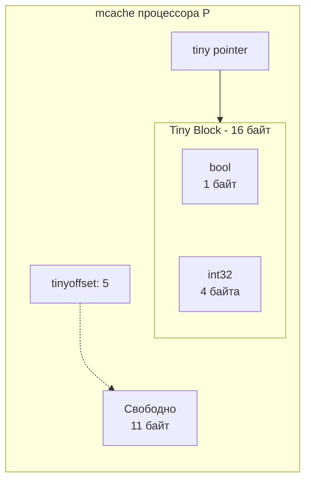

В статье [[21. Аллокатор памяти Go. mcache, mcentral, mheap.md]] мы разобрали трехуровневую архитектуру TCMalloc. Мы увидели, что рантайм нарезает память на 67 классов размеров (Size Classes). 

Но если вы внимательно смотрели на эти классы, вы могли заметить проблему. Самый маленький стандартный класс размера выделяет блок на **8 байт**. 
Что произойдет, если в высоконагруженном цикле мы аллоцируем миллион переменных типа `bool` (размер 1 байт), которые из-за замыкания "убегут" в кучу (Escape Analysis)?

Если бы рантайм выделял под каждый `bool` целый слот на 8 байт, мы бы выбрасывали 7 байт в мусор. Это **87% внутренней фрагментации**! В масштабах серверов с гигабайтами RAM это привело бы к колоссальным утечкам полезного пространства.

Чтобы заткнуть эту дыру, инженеры Go встроили в `mcache` специализированный микро-механизм — **Tiny Allocator (Крошечный аллокатор)**.

## Что такое Tiny Allocator?

Tiny Allocator — это механизм, предназначенный для максимально плотной упаковки крошечных объектов в памяти.

Он активируется только тогда, когда выполняются два строгих условия:
1. Размер объекта **меньше 16 байт** (например, `bool`, `int8`, `int32`, `float64`).
2. Объект **не содержит указателей (noscan)**.

> [!info] Под капотом. Почему запрещены указатели?
> Сборщик мусора (GC) в Go сканирует кучу, чтобы найти живые объекты. Если объект содержит указатель, GC должен прочитать его и пойти по адресу. Для этого GC использует специальные битовые карты (bitmap), где каждому объекту в куче соответствует метаинформация. 
> Если мы "утрамбуем" несколько разных объектов с указателями в один 16-байтный блок, GC не сможет разобрать, где заканчивается один указатель и начинается другой. Поэтому объекты с указателями (даже если это структура размером 8 байт из одного указателя `*User`) всегда идут в стандартные Size Classes и никогда не попадают в Tiny Allocator.

## Механика упаковки (Tiny Block)

Внутри структуры локального кэша `mcache` (который привязан к процессору `P`) есть три специальных поля для крошечных аллокаций:
* `tiny`: указатель на начало текущего 16-байтного блока.
* `tinyoffset`: текущее смещение в байтах (сколько байт уже занято).
* `local_tinyallocs`: счетчик крошечных аллокаций для статистики.

Когда вы аллоцируете `bool` (1 байт), рантайм берет свободный слот размером 16 байт (Tiny Block). 
Он кладет туда ваш `bool`, устанавливает `tinyoffset = 1` и возвращает указатель. 
Когда вы аллоцируете следующий `bool`, рантайм не берет новый слот! Он кладет второй `bool` в тот же самый блок по смещению 1 и обновляет `tinyoffset = 2`.



### Выравнивание памяти (Alignment)

Процессор физически не может эффективно (а иногда и вообще не может) читать 64-битное число, если его адрес в памяти не кратен 8 (см. проблему из [[16. sync_atomic и атомарные операции в рантайме.md]]).

Tiny Allocator строго соблюдает правила выравнивания. Это приводит к интересному эффекту: порядок аллокации имеет значение.

Представьте, что вы аллоцируете `bool` (1 байт), а затем `int64` (8 байт).
1. `bool` ложится по смещению `0`. `tinyoffset` становится `1`.
2. Рантайм пытается положить `int64`. Но для `int64` адрес должен быть кратен 8! 
3. Рантайм сдвигает `tinyoffset` с `1` на `8`. Байт 0 занят, байты с 1 по 7 просто выбрасываются (пустой padding). `int64` ложится с 8 по 15 байт. Блок заполнен.

Мы хотели аллоцировать $1 + 8 = 9$ байт, но сожрали все 16 байт.

> [!warning] Ловушка / Gotcha. Порядок полей в структурах
> Это правило выравнивания работает не только для независимых крошечных аллокаций, но и для ваших структур (Struct Packing). Если вы неверно расположите поля, структура "раздуется" из-за скрытых пустот (padding), не поместится в Tiny Allocator и улетит в более жирный Size Class.

Давайте посмотрим на классический вопрос с хардового собеседования.

## Mechanical Sympathy. Оптимизация структур

Посмотрите на эту структуру. Сколько байт она занимает в памяти?
```go
type BadStruct struct {
    A bool  // 1 байт
    B int64 // 8 байт
    C bool  // 1 байт
}
```

Математически $1 + 8 + 1 = 10$ байт. 
Но из-за правил выравнивания `int64` обязан лежать по адресу, кратному 8. Компилятор вставит 7 байт пустоты между `A` и `B`. Поле `C` займет 1 байт, но размер самой структуры компилятор тоже обязан выровнять по размеру самого большого поля (8 байт), чтобы при создании массива `[]BadStruct` элементы лежали ровно. Итого: в конце добавится еще 7 байт.

**Реальный размер `BadStruct`: 24 байта!** В куче он займет слот на 24 или 32 байта.

А теперь проявим Mechanical Sympathy и переставим поля от больших к меньшим:
```go
type GoodStruct struct {
    B int64 // 8 байт
    A bool  // 1 байт
    C bool  // 1 байт
}
```
`B` лежит по смещению 0. `A` по смещению 8. `C` по смещению 9. Добивка до кратности 8 (размер структуры 16). 
**Реальный размер `GoodStruct`: 16 байт.** Мы сэкономили 33% памяти просто переставив строчки кода.

> [!tip] Собеседование. Как найти неоптимизированные структуры?
> Вручную считать байты в огромном проекте — безумие. Для автоматизации этого процесса в экосистеме Go есть линтеры. Самый популярный — `fieldalignment` (ранее `maligned`). Встроен в `golangci-lint` (линтер `govet` с флагом `fieldalignment`). Он автоматически подсветит структуры, которые можно сжать, просто переставив поля.

## Итог

1. **Tiny Allocator** — это оптимизация внутри `mcache`, спасающая рантайм от катастрофической внутренней фрагментации при аллокации миллиардов мелких переменных.
2. Он упаковывает объекты **< 16 байт** в единый 16-байтный блок.
3. Он принимает только объекты **без указателей (noscan)**, чтобы не ломать логику Сборщика мусора.
4. Знание того, как работает выравнивание в памяти (Alignment), позволяет сжимать структуры в коде, экономя гигабайты RAM на крупных масштабах.

Мы завершили разбор встроенных механизмов управления памятью: от стека горутины до иерархии `mheap` и микро-аллокаций `Tiny Allocator`. Рантайм делает всё возможное, чтобы память выделялась быстро.

Но самая быстрая аллокация — это та, которой не было. 
В ситуациях, когда мы вынуждены создавать тяжелые объекты в куче на каждый HTTP-запрос (например, буферы парсинга JSON), стандартный аллокатор не спасет от нагрузки на Сборщик Мусора. Нам нужно переиспользовать уже выделенную память.

Для этого в стандартной библиотеке есть механизм, который работает в обход GC, но плотно интегрирован с логическими процессорами `P`. В следующей статье мы разберем:
[[23. sync_pool под капотом.md]]