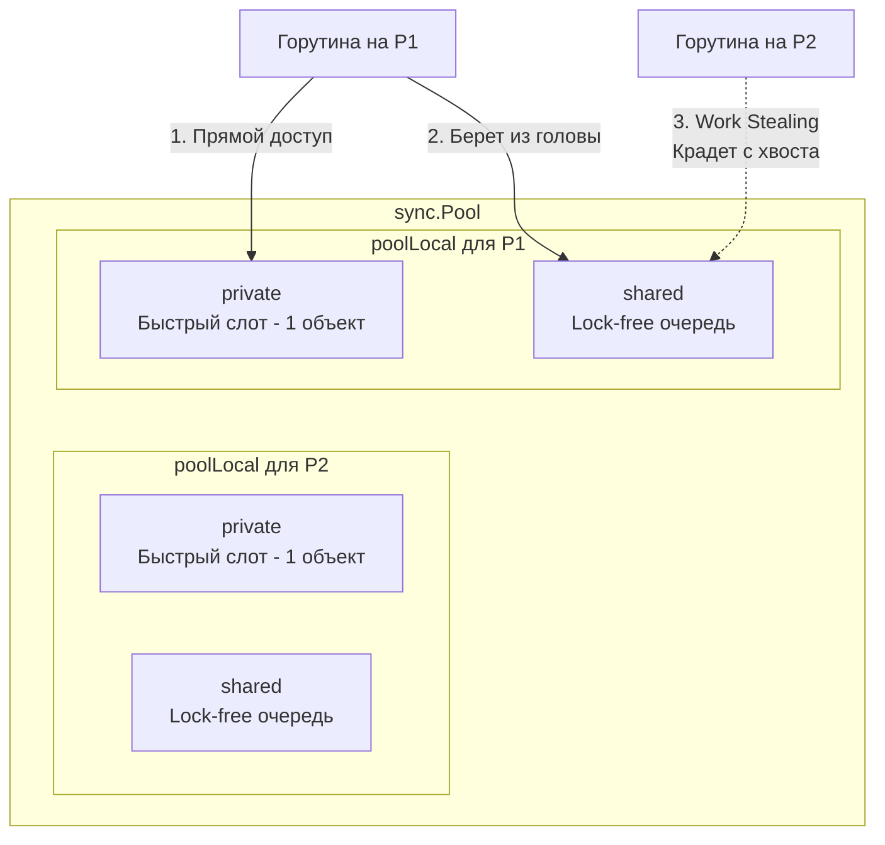

В предыдущих статьях ([[21. Аллокатор памяти Go. mcache, mcentral, mheap.md]] и [[22. Tiny Allocator и маленькие объекты.md]]) мы убедились, что рантайм Go делает всё возможное, чтобы выделение памяти работало быстро и без блокировок. Но какой бы гениальной ни была архитектура аллокатора, самая быстрая аллокация в куче — это та, которой не было.

Если ваш высоконагруженный HTTP-сервер на каждый запрос создает `bytes.Buffer` размером 10 КБ для парсинга JSON, Escape Analysis гарантированно отправит его в кучу. При 10 000 RPS вы будете генерировать 100 Мегабайт мусора в секунду. Сборщик мусора (GC) захлебнется, и процессор будет тратить такты не на бизнес-логику, а на очистку памяти.

Чтобы разорвать этот цикл, инженеры Go добавили пакет `sync`. В нем лежит структура, которая позволяет переиспользовать уже выделенную память, работая в обход Сборщика мусора, но в тесной симбиозе с планировщиком — **`sync.Pool`**.

## Главное заблуждение: Это не кэш

Первое, что нужно усвоить: `sync.Pool` — это **пул временных объектов**, а не кэш (Cache).

В классическом кэше (например, LRU или Redis) вы кладете объект и ожидаете, что сможете достать его через минуту. В `sync.Pool` рантайм имеет право **безвозвратно удалить** все ваши объекты в любой момент времени (спойлер: это происходит при каждой сборке мусора).
Вы не можете хранить там соединения с базой данных (для этого есть `sql.DB`), TCP-сокеты или состояния сессий. `sync.Pool` существует только для одной цели: разгрузить аллокатор памяти и GC.

## Архитектура под капотом

Как сделать пул объектов, к которому могут одновременно обращаться тысячи горутин, и при этом не превратить его в бутылочное горлышко (bottleneck) на мьютексе?
Инженеры Go снова применили паттерн локальности (как в `mcache`).

Если мы заглянем в исходники `src/sync/pool.go`, мы увидим, что `sync.Pool` — это не единый массив. Это сложная иерархия, жестко привязанная к логическим процессорам `P` (см. [[9. Scheduler Go. G, M, P и work stealing.md]]).

Внутри `sync.Pool` есть массив `local`. Его размер равен переменной `GOMAXPROCS`. Каждому логическому процессору `P` принадлежит ровно один элемент этого массива — структура `poolLocal`.



### Структура poolLocal
Каждый `poolLocal` состоит из двух основных хранилищ:
1. **private:** Указатель на **ровно один** объект. Это самый быстрый путь. Так как к этому слоту имеет доступ только текущий процессор `P`, операции с `private` не требуют ни мьютексов, ни атомарных инструкций.
2. **shared:** Двусвязная lock-free очередь (структура `poolChain`). Сюда попадают объекты, если слот `private` уже занят. Текущий процессор `P` кладет и забирает объекты из "головы" этой очереди с помощью атомарных операций (CAS).

> [!info] Под капотом. Mechanical Sympathy и False Sharing
> В [[16. sync_atomic и атомарные операции в рантайме.md]] мы разбирали проблему Ложного разделения (False Sharing). Если структуры `poolLocal` для `P1` и `P2` лежат в оперативной памяти рядом, они могут попасть в одну кэш-линию L1 (64 байта). Когда `P1` обновит свой пул, он инвалидирует кэш для `P2`, убив производительность.
> Чтобы этого не произошло, структура `poolLocal` в исходниках выглядит так:
> ```go
> type poolLocal struct {
>     poolLocalInternal
>     // Добивка до 128 байт!
>     pad [128 - unsafe.Sizeof(poolLocalInternal{})%128]byte 
> }
> ```
> Разработчики намеренно вставили `pad` (пустые байты), чтобы каждый `poolLocal` гарантированно лежал в **разных кэш-линиях**. Это эталонный пример кода, написанного с уважением к аппаратному обеспечению.

## Механика работы: Get()

Когда вы вызываете `pool.Get()`, рантайм проходит через многоступенчатый алгоритм (от самого дешевого к самому дорогому):

1. **Pin (Привязка):** Горутина "прикалывается" (pin) к текущему процессору `P`. Планировщик временно лишается права вытеснить эту горутину на другой `P` (прерывания отключаются), чтобы мы могли безопасно работать с локальными данными.
2. **Fast Path:** Рантайм смотрит в слот `private` текущего `P`. Если там есть объект, он забирает его, обнуляет слот `private`, делает Unpin и возвращает объект. Стоимость: $\sim$ 0 тактов.
3. **Shared Head:** Если `private` пуст, рантайм берет объект из головы своей локальной очереди `shared`. Используется атомарная операция, так как в этот же момент кто-то другой может попытаться украсть объект.
4. **Work Stealing (Кража):** Если свой `shared` тоже пуст, горутина не сдается. Она идет по всем остальным логическим процессорам `P` в системе и пытается **украсть** объект с хвоста (tail) их `shared` очередей. 
5. **Victim Cache:** Если кража не удалась, рантайм проверяет "Кэш жертвы" (о нем ниже).
6. **New():** Если все пулы во всей системе пусты, рантайм вызывает вашу функцию `New()`, аллоцируя свежий объект в куче.

Механика `Put()` работает в обратном порядке: сначала пытаемся записать в `private`, а если он занят — пушим в голову `shared`.

## Жертвенный кэш (Victim Cache) и сборка мусора

До версии Go 1.13 `sync.Pool` имел ужасный недостаток: при каждом запуске Сборщика мусора (GC) **все** пулы во всех процессорах полностью очищались. Если GC запускался часто, `sync.Pool` был почти всегда пуст, и вызов `Get()` постоянно создавал новые объекты, сводя на нет всю оптимизацию.

В Go 1.13 алгоритм изменили, добавив **Victim Cache**. 
Теперь внутри `sync.Pool` есть два массива: `local` (активный) и `victim` (жертвенный).

Что происходит при запуске Сборщика Мусора?
1. GC не удаляет объекты из `sync.Pool` напрямую.
2. Вместо этого он берет весь активный массив `local` и перемещает его на место `victim` (старый `victim` при этом удаляется и очищается из памяти).
3. Массив `local` становится девственно чистым.

Что это дает? 
Если после GC ваша программа делает `pool.Get()`, рантайм сначала проверит `local` (там пусто). Затем он проверит `victim`. Если объект есть в `victim`, рантайм заберет его оттуда и **вернет обратно в `local`**!
Объекты, которые активно используются (постоянно "гуляют" между пулом и программой), будут перепрыгивать из `victim` обратно в `local` и жить вечно. Объекты, которые никто не запрашивает, тихо умрут на следующем цикле GC. 
Это элегантное решение увеличило эффективность пула в десятки раз.

## Mechanical Sympathy. Правила безопасного использования

`sync.Pool` работает с интерфейсами (`any`), что влечет за собой риск `Interface Boxing` (см. [[36. Interface Boxing и hidden allocation.md]]). Плюс, пулы требуют строгой гигиены памяти.

> [!warning] Ловушка / Gotcha. Утечка данных (Data Leak)
> Если вы кладете в пул объект, вы **обязаны** сбросить его состояние (Reset).
> ```go
> var builderPool = sync.Pool{
>     New: func() any { return new(strings.Builder) },
> }
> 
> func handle() {
>     b := builderPool.Get().(*strings.Builder)
>     // ОШИБКА: Мы забыли b.Reset()
>     b.WriteString("secret_password")
>     builderPool.Put(b)
> }
> ```
> Если следующая горутина (обрабатывающая запрос другого пользователя) сделает `Get()`, она получит этот же `Builder` вместе с чужим паролем внутри! Это критическая уязвимость AppSec.
> **Правило:** Всегда делайте `Reset()` **перед** вызовом `Put()`.

> [!tip] Собеседование. Слайсы в пуле и утечка памяти
> **Вопрос:** Мы используем `sync.Pool` для переиспользования `[]byte` буферов. Почему со временем потребление оперативной памяти сервером улетает в космос?
> **Ответ:** Слайсы могут расти! Если вы положите в пул слайс, capacity которого раздулся до 100 Мегабайт, он так и останется лежать в памяти пула, ожидая следующего использования. Если таких слайсов накопится тысяча — вы потеряете 100 ГБ памяти.
> **Решение:** Нужно ввести жесткий лимит.
> ```go
> func putBuffer(buf []byte) {
>     if cap(buf) > 64*1024 { // Не кладем в пул слайсы больше 64 КБ
>         return // Отдаем на растерзание GC
>     }
>     buf = buf[:0] // Сброс длины, но сохранение capacity
>     bytePool.Put(buf)
> }
> ```

## Итог

1. **`sync.Pool`** — это высокопроизводительный механизм переиспользования памяти, обходящий дорогостоящие аллокации кучи.
2. Он работает практически без блокировок за счет привязки данных (`poolLocal`) к логическим процессорам `P`.
3. Для балансировки используется **Work Stealing** — свободные процессоры могут "красть" объекты из очередей занятых процессоров.
4. **Victim Cache** позволяет активно используемым объектам переживать ровно один цикл Сборки мусора, предотвращая холодный старт пула.
5. Использование пула требует жесткого контроля: обязательный сброс состояния (Reset) и ограничения на размер возвращаемых объектов (Capacity Limit).

В этой статье мы часто упоминали Сборщик Мусора (GC) как некую непреодолимую силу, которая приходит и очищает память. Мы знаем, как избегать его внимания (Escape Analysis) и как прятать от него объекты (Pool). 

Но пришло время встретиться с ним лицом к лицу. Как GC в Go умудряется очищать гигабайты мусора, не останавливая работу наших серверов на секунды, как это делает Java? 
В следующей статье мы откроем главную гордость рантайма Go:
[[24. Сборщик мусора Go. Общая архитектура.md]]