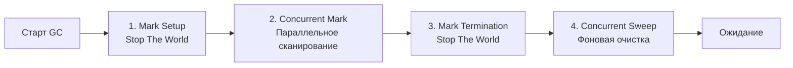

В прошлых статьях мы разобрали аллокатор памяти ([[21. Аллокатор памяти Go. mcache, mcentral, mheap.md]]) и способы обхода кучи ([[18. Escape Analysis. Почему переменная ушла в heap.md]], [[23. sync_pool под капотом.md]]). Но как бы мы ни оптимизировали код, часть объектов неизбежно оседает в глобальной памяти. Рано или поздно эту память нужно возвращать операционной системе, иначе сервер упадет с ошибкой `Out Of Memory`.

За очистку кучи отвечает Сборщик мусора (Garbage Collector, GC). 
Для многих разработчиков, приходящих из C++ или Rust, наличие GC — это синоним медлительности и непредсказуемых зависаний (Stop-The-World). Разработчики на старых версиях Java помнят, как сборщик мусора мог "заморозить" сервер на несколько секунд.

Go предлагает принципиально иной подход. Архитектура GC в Go — это экстремальный компромисс в сторону **минимальных задержек (Low Latency)**.

## Философия Go GC: Latency vs Throughput

При проектировании сборщика мусора инженеры всегда выбирают между двумя метриками:
1. **Throughput (Пропускная способность):** Какую долю процессорного времени приложение тратит на полезную работу (бизнес-логику), а какую — на работу GC.
2. **Latency (Задержка):** Насколько долго приложение "зависает" (не отвечает на сетевые запросы), пока GC делает свою работу.

Исторически Java (с классическим Parallel GC) делала ставку на Throughput. Мусор копился, а затем JVM останавливала мир (Stop-The-World, STW) на десятки или сотни миллисекунд, быстро и эффективно перепаковывая память.

Инженеры Go (во главе с Риком Хадсоном) сделали ставку на **Latency**. 
В современном Go длительность пауз Stop-The-World редко превышает **1 миллисекунду**. Достигается это тем, что сборщик мусора работает **конкурентно** (одновременно с вашим пользовательским кодом).

### Почему Go GC не Generational (не поколенческий)?

В Java или C# (.NET) сборщики мусора делят объекты на "молодые" и "старые" поколения. Идея в том, что "большинство объектов умирает молодыми". 
На собеседованиях часто спрашивают: *почему в Go нет поколений?*

**Ответ кроется в Escape Analysis.**
В Java практически все объекты рождаются в куче. В Go умный компилятор оставляет большинство "молодых" (короткоживущих) объектов на стеке горутины. Стек очищается бесплатно (сдвигом указателя) и вообще не сканируется GC как мусор. 
В кучу Go попадают в основном долгоживущие объекты (кэши, пулы, глобальные состояния). Добавлять сложную логику поколений, барьеры чтения (Read Barriers) и таблицы кард (Card Tables) для кучи, в которой и так лежат преимущественно "старики" — это лишний overhead, убивающий производительность.

### Почему Go GC не Compacting (не уплотняющий)?

Многие GC передвигают выжившие объекты в памяти поближе друг к другу, чтобы убрать "дыры" (фрагментацию). 
Go не перемещает объекты в памяти. 
* Во-первых, перемещение требует долгих пауз STW (нужно обновить все указатели в программе).
* Во-вторых, аллокатор Go базируется на архитектуре `TCMalloc` и классах размеров (Size Classes). Как мы помним из [[21. Аллокатор памяти Go. mcache, mcentral, mheap.md]], объекты распределяются по строго нарезанным слотам (span). Внешняя фрагментация там физически невозможна, а с внутренней рантайм мирится.

## 4 Фазы работы Сборщика мусора

Полный цикл работы сборщика мусора в Go называется `Mark and Sweep` (Пометка и Очистка). Он разделен на четыре строгие фазы.

### Фаза 1: Mark Setup (Stop The World)
Цикл начинается с жесткой остановки. Рантайм приостанавливает выполнение **всех** пользовательских горутин.
Что происходит за эту долю миллисекунды:
1. Ожидается, пока все горутины дойдут до безопасных точек (Safe Points), обычно это вызов функции или аллокация.
2. Включается **Write Barrier (Барьер записи)**. Это критически важный механизм, который следит за изменениями указателей во время конкурентной фазы (подробнее в [[27. Write Barrier и почему она нужна.md]]).
3. Рантайм запускает горутины сборщика мусора (Mark Workers).
После этого мир снова запускается. Ваше приложение "висело" всего $10-50$ микросекунд.

### Фаза 2: Concurrent Mark (Конкурентная пометка)
Это самая долгая и тяжелая фаза. Ваше приложение работает, обрабатывает HTTP-запросы, но рантайм отбирает у него **ровно 25% ресурсов процессора**.
Если у вас сервер на 8 ядер (значит `GOMAXPROCS=8`), 2 ядра будут полностью отданы под фоновые воркеры Сборщика мусора. 

Воркеры обходят память по алгоритму **Tri-color Abstraction (Трехцветная абстракция)**:
1. Они начинают с "корней" (Roots) — глобальных переменных и стеков всех работающих горутин. Объекты красятся в Серый цвет (найдены, но их дочерние поля не проверены).
2. Воркер берет Серый объект, красит его в Черный (полностью проверен) и переходит по всем его указателям, крася найденные объекты в Серый.
3. Процесс идет, пока Серых объектов не останется. Все оставшиеся Белые объекты — это мусор.

> [!warning] Ловушка / Gotcha. Налог на аллокацию (Mark Assist)
> Представьте: GC выделил 25% CPU для сканирования 10 ГБ кучи. Сканирование займет 100 миллисекунд. Но ваши бизнес-горутины (работающие на оставшихся 75% CPU) так яростно создают новые объекты, что генерируют мусор быстрее, чем GC успевает его сканировать!
> Если рантайм это заметит, он применит штраф — **Mark Assist**. Планировщик заставит горутину, которая запрашивает память (вызывает `mallocgc`), остановиться и *самостоятельно* отсканировать часть кучи, прежде чем дать ей новый слот памяти. В графиках мониторинга это выглядит как резкий спад производительности бэкенда (Троттлинг).

### Фаза 3: Mark Termination (Stop The World)
Вторая и последняя пауза в цикле.
1. Мир снова останавливается.
2. Рантайм доделывает хвосты: сканирует мелкие изменения, которые могли произойти во время конкурентной пометки.
3. Выключает Write Barrier.
4. Вычисляет следующий таргет (когда нужно будет запускать GC в следующий раз).
Эта пауза обычно занимает $60-100$ микросекунд.

### Фаза 4: Concurrent Sweep (Конкурентная очистка)
Все Белые объекты признаны мусором. 
Очистка в Go ленивая (Lazy). Рантайм не бежит мгновенно стирать данные нулями. 
Вместо этого фоновый поток (вместе с `sysmon` и горутинами-чистильщиками `bgsweep`) просто помечает слоты в структурах `mspan` как свободные, возвращая их в `mcentral` и `mcache`.
Когда вашему приложению снова понадобится память, оно просто перезапишет эти свободные слоты новыми данными.

> [!tip] Собеседование. Что такое "Пауза GC"?
> **Вопрос:** Если мы видим в логах/трейсах, что GC Pause равна 1 миллисекунде, значит ли это, что Сборщик Мусора работал всего 1 мс?
> **Ответ:** Нет! "Пауза" (Pause Time) показывает только длительность жестких остановок (STW) из Фазы 1 и Фазы 3. Сама конкурентная сборка (Фаза 2) могла длиться десятки миллисекунд, съедая 25% CPU или заставляя горутины выполнять Mark Assist. Приложение не "висело", но работало медленнее. Поэтому мониторить нужно не только STW-паузы, но и общую загрузку CPU метрикой `go_gc_duration_seconds`.

## Итог

1. **Tradeoff:** Архитектура Go GC жертвует пропускной способностью (через 25% налог на CPU и Mark Assist), чтобы гарантировать предсказуемое время ответа сервера (субмиллисекундные паузы STW).
2. **Не-поколенческий:** Большинство временных объектов умирает на стеках (благодаря Escape Analysis). В куче нет поколений, так как это бы усложнило барьеры чтения/записи.
3. **Не-уплотняющий:** Go не двигает объекты в памяти, избегая долгих STW-пауз на обновление указателей. Избежание фрагментации решается на уровне TCMalloc (Size Classes).
4. **Конкурентный:** Главная фаза пометки графа объектов (Mark Phase) происходит параллельно с работой приложения.

Мы крупными мазками посмотрели на четыре фазы работы GC. 
Но как именно рантайм отличает полезные данные от мусора, если новые данные постоянно создаются, а старые удаляются прямо в момент сканирования кучи? 

В следующей статье мы спустимся в математику графов и детально разберем знаменитый алгоритм пометки:
[[25. Mark, Sweep и Tricolor GC.md]]