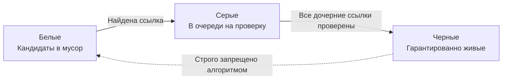
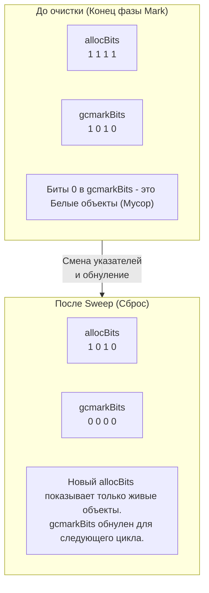

В статье [[24. Сборщик мусора Go. Общая архитектура.md]] мы увидели картину с высоты птичьего полета: Сборщик мусора (GC) в Go работает в четыре фазы, стараясь максимально перенести нагрузку на конкурентное выполнение, чтобы минимизировать паузы Stop-The-World (STW). 

Но как именно воркеры GC понимают, что является "живым" объектом, а что — мусором, особенно когда миллионы горутин параллельно создают и удаляют гигабайты структур?
В основе этого процесса лежит элегантный математический алгоритм обхода графа — **Tricolor Mark and Sweep (Трехцветная пометка и очистка)**. 

Для Senior-разработчика понимание этого алгоритма — это ключ к чтению pprof-профилей и осознанию того, за что мы платим процессорным временем при работе с кучей.

## Иллюзия простого Mark and Sweep

Классический алгоритм `Mark and Sweep` (изобретенный Джоном Маккарти в 1960 году для Lisp) работает элементарно:
1. **Mark (Пометка):** Сборщик мусора ставит программу на паузу, находит все Корни (Roots — глобальные переменные и стеки потоков) и рекурсивно идет по всем указателям, ставя бит "Живой" на каждом найденном объекте.
2. **Sweep (Очистка):** Сборщик линейно проходит по всей памяти. Если у объекта нет бита "Живой" — это мусор, память освобождается. Бит "Живой" сбрасывается для следующего цикла.

**Проблема:** В высоконагруженном бэкенде памяти много. Если куча весит 10 ГБ, рекурсивный обход всех указателей может занять сотни миллисекунд. Классический алгоритм требует **полной остановки приложения (STW)** на всё это время, иначе пользовательский код изменит указатели прямо во время обхода, и GC удалит живой объект.

Инженерам Go нужен был алгоритм, который можно "поставить на паузу" и выполнять небольшими порциями параллельно с работой приложения. Этим алгоритмом стала Трехцветная абстракция.

## Tricolor Abstraction (Трехцветная абстракция)

Суть алгоритма заключается в разделении всех объектов в памяти на три логических множества (цвета).

1. **Белые (White):** Объекты, до которых сборщик мусора еще не добрался. В начале цикла сборки абсолютно все объекты в куче условно считаются белыми. В конце цикла все оставшиеся белые объекты признаются мусором и удаляются.
2. **Серые (Grey):** Объекты, которые GC уже нашел (они точно живые), но сборщик **еще не проверил** их дочерние поля-указатели. Серые объекты — это "фронт работ" (work queue) для GC.
3. **Черные (Black):** Объекты, которые GC нашел, проверил и гарантированно просканировал все их внутренние указатели. Черный объект не может ссылаться на белый объект напрямую (это фундаментальное правило алгоритма).

### Алгоритм работы (Пошагово)

1. **Старт (Mark Setup):** На короткой паузе STW рантайм сканирует все Корни (Roots) — глобальные переменные и стеки текущих горутин. Все объекты, на которые указывают корни, мгновенно красятся в **Серый** цвет.
2. **Цикл (Concurrent Mark):** Воркеры GC берут один Серый объект.
   * Они находят все указатели внутри этого объекта.
   * Объекты, на которые ведут эти указатели, красятся в **Серый** (добавляются в очередь).
   * Исходный объект красится в **Черный**.
3. **Конец:** Процесс повторяется до тех пор, пока не останется ни одного Серого объекта.
4. **Очистка (Sweep):** Все Черные объекты остаются жить. Все Белые объекты объявляются мусором и их память возвращается аллокатору. Цвета сбрасываются (Черные снова становятся Белыми для следующего цикла).

## Mechanical Sympathy: Где хранятся цвета?

Это любимый вопрос на хардовых собеседованиях. Если у нас есть структура `User`, добавляет ли рантайм в нее скрытое поле `color`?

**Ответ: Нет.** Хранить метаинформацию GC внутри самих объектов — это катастрофа для производительности по двум причинам:
1. **Cache Locality:** Если воркер GC будет писать цвет прямо в объект, он будет инвалидировать L1/L2 кэши процессоров, на которых в этот момент крутится пользовательский код (False Sharing, см. [[16. sync_atomic и атомарные операции в рантайме.md]]).
2. **Copy-on-Write (CoW):** В операционных системах (особенно при ветвлении процессов или работе с `mmap`) запись в память объекта вызовет физическое копирование страницы памяти в RAM.

Вместо этого рантайм Go использует **Bitmaps (Битовые карты)**, которые хранятся отдельно от данных.

В [[21. Аллокатор памяти Go. mcache, mcentral, mheap.md]] мы разбирали структуру `mspan`. Внутри каждого `mspan` есть две битовые карты:
* `allocBits`: Бит равен 1, если слот памяти занят объектом.
* `gcmarkBits`: Бит равен 1, если объект помечен как найденный во время GC.

**Как алгоритм видит цвета через биты:**
* **Белый:** `allocBits = 1`, `gcmarkBits = 0`. (Объект есть, но GC его еще не пометил).
* **Черный / Серый:** `allocBits = 1`, `gcmarkBits = 1`. (Объект помечен).

Подождите, если и Черный, и Серый имеют `gcmarkBits = 1`, как рантайм их различает?
Разница заключается в **Очереди задач (gcWork)**.
* **Серый** объект — это тот, у которого бит установлен в 1, и указатель на него **лежит в очереди** `gcw` текущего процессора `P`.
* **Черный** объект — это тот, у которого бит установлен в 1, и он **уже удален** из очереди `gcw` (обработан).

> [!info] Под капотом. Lock-free очереди воркеров
> Очередь серых объектов (`gcWork`) не является единым глобальным списком (иначе воркеры бы "убили" сервер борьбой за мьютекс). Каждый логический процессор `P` имеет свою локальную очередь серых объектов. Воркеры GC бегут на системном стеке `g0` и обходят графы параллельно, используя атомарные инструкции для кражи работы (Work Stealing) друг у друга, если локальная очередь пустеет.

## Фаза Sweep: Ленивая магия

Когда Серых объектов больше нет, фаза Mark Termination останавливает мир на микросекунды, и начинается фаза Concurrent Sweep.

В ранних версиях языков с GC фаза очистки была тяжелой — нужно было пройти по всей памяти и удалить мертвые объекты. В Go очистка работает почти бесплатно благодаря `mspan` и битовым картам.

Что делает Sweep? Он выполняет одну элементарную математическую операцию на уровне структуры `mspan`:
**Он просто меняет местами указатели `allocBits` и `gcmarkBits`!**

Все слоты памяти, где `gcmarkBits` был равен 0 (Белые объекты), автоматически становятся свободными в новом `allocBits`. Память даже не нужно затирать нулями (это произойдет лениво, прямо перед тем, как аллокатор выдаст этот пустой слот под новый объект вашей программы).

> [!tip] Собеседование. Что делает runtime.GC()?
> **Вопрос:** Если мы вручную вызовем `runtime.GC()` в коде, заблокирует ли это нашу горутину до конца очистки памяти?
> **Ответ:** Вызов `runtime.GC()` блокирует вызывающую горутину до завершения фазы **Mark** (пока все живые объекты не станут Черными). Но фаза **Sweep** (очистка) выполняется асинхронно в фоне. Поэтому вызов функции вернет управление *до* того, как память реально будет возвращена операционной системе. Использовать `runtime.GC()` в production-коде (за исключением очень специфичных кэшей) — жесткий антипаттерн, ломающий эвристику планировщика GC.

## Предвестие катастрофы: Гонка данных с Мутатором

Мы разобрали идеальную работу Tricolor алгоритма, когда графы объектов заморожены.
Но мы помним главное: Go GC работает **конкурентно**. Пока воркеры GC (в фоне на 25% CPU) перекрашивают узлы графа из Серого в Черный, ваши горутины (Мутатор) продолжают работать, перекладывать указатели, удалять ссылки и создавать новые объекты.

Что произойдет, если Черный объект (уже проверенный GC) вдруг получит ссылку на Белый объект (еще не проверенный), а Серый объект в ту же микросекунду "забудет" (удалит ссылку) на этот Белый объект?

Это классическая уязвимость конкурентного GC. Воркеры больше никогда не посмотрят на Черный объект, Серый объект потерял ссылку, а значит, Белый объект останется Белым навсегда и **будет удален Сборщиком мусора, хотя ваша программа всё ещё использует его!**

Чтобы предотвратить это фатальное повреждение памяти, в рантайм встроена защита — аппаратные и программные перехватчики записи.
В следующей статье мы разберем суть этой проблемы и как Go решает её без остановки мира:
[[26. Concurrent GC и Stop The World.md]]