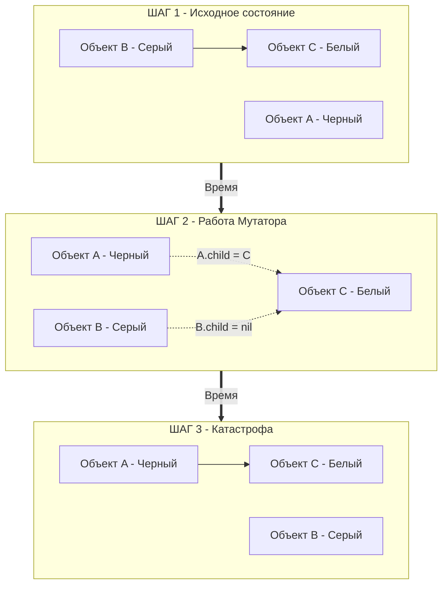

В конце статьи [[25. Mark, Sweep и Tricolor GC.md]] мы подошли к главной проблеме современных систем управления памятью. Мы поняли, как работает алгоритм трехцветной пометки в идеальном мире, где графы объектов "заморожены". 

Но в реальности Go мы имеем **Concurrent GC**. Пока фоновые воркеры сборщика мусора перекрашивают узлы из Серого в Черный, ваши бизнес-горутины (в терминологии GC они называются **Мутатором** — *Mutator*) продолжают выполняться на других ядрах CPU. Мутатор непрерывно создает новые объекты, меняет указатели и удаляет старые связи.

В этой статье мы разберем, как именно конкурентность ломает алгоритм пометки, почему полностью избавиться от пауз **Stop The World (STW)** физически невозможно, и как рантайм Go останавливает миллион горутин за микросекунды.

## Фундаментальный конфликт: Мутатор против GC

Чтобы понять всю боль инженеров рантайма, давайте смоделируем классическую гонку данных (Data Race) между сборщиком мусора и вашим кодом.

Представьте ситуацию: 
1. Воркер GC проверяет объект `A` и красит его в **Черный** (он полностью проверен, к нему мы больше не вернемся).
2. Воркер GC видит объект `B` и красит его в **Серый** (он в очереди на проверку).
3. Объект `B` (Серый) ссылается на объект `C` (**Белый**, еще не найденный).

В эту самую микросекунду планировщик ОС отдает ядро вашей горутине (Мутатору). Ваша горутина делает две простые операции:
```go
A.child = B.child // Черный объект А теперь ссылается на Белый объект С
B.child = nil     // Серый объект В теряет ссылку на Белый объект С
```

Посмотрим на это через призму графов:



**Что произойдет дальше?**
Воркер GC просыпается, берет объект `B` (Серый), не находит внутри него никаких ссылок (Мутатор их удалил) и красит `B` в Черный. 
Объект `C` остается **Белым** навсегда, потому что единственный путь к нему теперь лежит через Черный объект `A`, а алгоритм гласит: *Черные узлы больше никогда не проверяются*.

В фазе очистки (Sweep) рантайм сотрет Белый объект `C`, хотя он всё ещё используется в вашей программе через объект `A`. При следующем обращении `A.child.Field` ваш сервер жестко упадет с `SIGSEGV` (Segmentation Fault) или, что еще хуже, прочитает мусор из переиспользованной памяти.

## Триколорные инварианты

Эта уязвимость известна в Computer Science десятилетиями. Чтобы её избежать, Сборщик мусора должен соблюдать хотя бы один из двух математических инвариантов:

1. **Сильный триколорный инвариант (Strong Tricolor Invariant):** Черный объект **никогда** не может ссылаться на Белый объект. (Это правило мы только что нарушили на Шаге 2).
2. **Слабый триколорный инвариант (Weak Tricolor Invariant):** Черный объект может ссылаться на Белый объект, **НО только если** до этого Белого объекта всё ещё существует альтернативный маршрут от какого-нибудь Серого объекта.

Если мы гарантируем соблюдение одного из этих правил, GC никогда не удалит живые данные. И чтобы включить механизм, который будет следить за соблюдением этих правил (Write Barrier), рантайму нужна абсолютная тишина. Ему нужен **Stop The World**.

## Механика Stop The World (STW)

Вопреки популярному мифу, Go не избавился от пауз STW. Он просто сделал их невероятно короткими (обычно $< 1$ мс). 
Как мы помним, STW случается дважды за цикл:
1. **Mark Setup:** Включение защиты (Write Barrier) и сканирование корней.
2. **Mark Termination:** Выключение защиты и проверка оставшихся очередей.

Как рантайм может мгновенно остановить 100 000 горутин, размазанных по 32 ядрам процессора?

Внутри пакета `runtime` (файл `proc.go`) есть функция `stopTheWorldWithSema`. Процесс остановки — это шедевр низкоуровневой оркестрации:

1. **Блокировка:** Рантайм захватывает глобальный мьютекс `worldsema`, чтобы никто другой (например, `sysmon` или CGO-тред) не попытался инициировать остановку одновременно с нами.
2. **Сигнал прерывания:** Горутина, инициировавшая STW, меняет глобальный флаг состояния планировщика `sched.stopwait` (количество процессоров `P`, которые нужно остановить).
3. **Preemption (Вытеснение):** Рантайм отправляет сигнал `preemptall()`. Для каждого логического процессора `P` выставляется флаг прерывания. Если горутина делает вызов функции, компилятор проверяет этот флаг (через Stack Bound Check, см. [[11. Стек горутины. Рост и shrink стека.md]]) и горутина сама сдает процессорное время.
4. **Асинхронный удар (С Go 1.14):** Если горутина застряла в бесконечном цикле `for {}` и не вызывает функций, рантайм не будет ждать. Он отправляет аппаратному потоку ОС сигнал `SIGURG`. Ядро Linux мгновенно прерывает выполнение, сохраняет регистры и убирает горутину с CPU (подробнее в [[43. Preemption. Как Go останавливает горутины.md]]).
5. **Syscalls (Системные вызовы):** А что делать с потоками `M`, которые прямо сейчас заблокированы в ядре ОС (например, ждут ответа от диска)? Рантайм просто отрывает от них контекст `P` (Handoff) и помечает этот `P` как остановленный. Когда поток `M` проснется, он увидит, что мир остановлен, и сам уснет на глобальном семафоре.

Мир считается остановленным только тогда, когда **каждый** логический процессор `P` отчитался: *"Я заморожен и нахожусь в безопасной точке (Safe Point)"*.

> [!warning] Ловушка / Gotcha. Длинные паузы STW
> Если в вашем сервисе pprof или grafana показывают огромные спайки пауз GC (например, 50-100 миллисекунд), это почти никогда не означает, что сам сборщик мусора медленный. 
> Это означает, что **мир долго не мог остановиться**. Обычно это происходит, если:
> 1. Вы используете тяжелый C-код через CGO (рантайм Go не может прервать C-поток асинхронно).
> 2. Происходит интенсивный swapping (ОС выгрузила память треда на диск, и сигнал `SIGURG` застрял в ожидании Page Fault).
> 3. Вы используете версию Go старше 1.14 с долгими пустыми циклами без аллокаций.

## Жизнь внутри STW

Когда все 32 ядра процессора замерли, горутина, инициировавшая STW (обычно это фоновый воркер `gcBgMarkWorker`), получает единоличную власть над процессом.

Именно в этот момент (на фазе Mark Setup) она включает флаг `writeBarrier.enabled = true`. 
И только после этого она вызывает `startTheWorld()`, разрешая горутинам продолжить работу.

## Mechanical Sympathy: Налог на конкурентность

Конкурентный GC не бывает бесплатным. Да, мы убрали STW на время обхода 10 ГБ кучи, но мы заплатили за это двумя тяжелыми "налогами":

1. **Mark Assist (Помощь в пометке):** Как мы упоминали, если Мутатор (ваш код) создает новые объекты быстрее, чем GC успевает красить их в Черный, серверу грозит Out Of Memory. Рантайм штрафует жадные горутины: перед выдачей новой памяти `mcache` заставляет саму горутину выполнить часть работы GC пропорционально запрашиваемой памяти. Это убивает latency конкретного запроса.
2. **Write Barrier Overhead:** Включение флага `writeBarrier.enabled` заставляет процессор выполнять дополнительные инструкции при **каждой** перезаписи указателя в куче.

> [!tip] Собеседование. Как избежать Mark Assist?
> **Вопрос:** Мы видим в трейсах (go tool trace), что бизнес-горутины 30% времени проводят в функции `runtime.gcAssistAlloc`. Как это починить?
> **Ответ:** Единственный способ избавиться от Mark Assist — снизить Rate аллокаций. Нужно оптимизировать горячие пути (Hot Paths), применять Escape Analysis, переиспользовать объекты через `sync.Pool` и заранее выделять память для слайсов (capacity). Если мусора станет меньше, фоновые воркеры (на 25% CPU) будут справляться сами, и штрафы не включатся.

## Итог

1. **Гонка Мутатора и GC:** Параллельная работа вашего кода и сборщика мусора может привести к удалению живых объектов, если Черный узел сошлется на Белый, а Белый потеряет связи с Серыми (нарушение триколорных инвариантов).
2. **STW:** Для безопасного переключения состояний (включения/выключения защиты) рантайм использует короткие паузы Stop The World, останавливая все P через сигналы ОС (`SIGURG`) и Safe Points.
3. Долгие STW-паузы в современном Go — это симптом того, что рантайм не может остановить поток ОС (из-за CGO или системных задержек), а не медлительность самого алгоритма очистки.

Мы выяснили *почему* нам нужен механизм защиты во время конкурентной сборки мусора и *когда* он включается. 
Но что физически представляет собой эта защита на уровне машинного кода? Как именно компилятор перехватывает изменения указателей и заставляет соблюдать Триколорный инвариант?

В следующей статье мы опустимся на уровень инструкций компилятора и разберем:
[[27. Write Barrier и почему она нужна.md]]