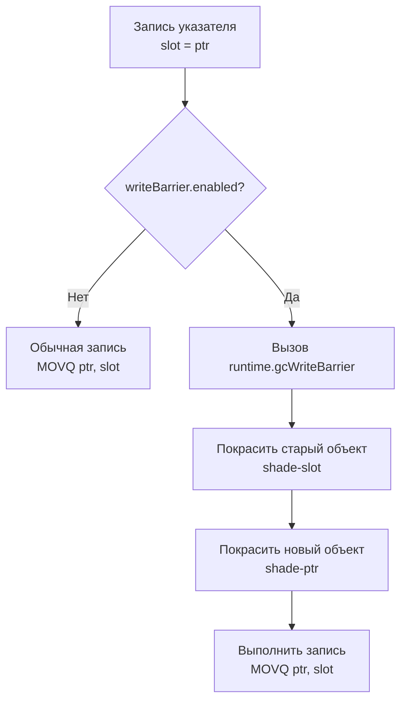

В статье [[26. Concurrent GC и Stop The World.md]] мы смоделировали катастрофу: пока Сборщик мусора (GC) конкурентно сканирует память, ваша программа (Мутатор) успевает перепрятать Белый (непроверенный) объект внутрь Черного (уже проверенного) и удалить все старые ссылки. 

Если рантайм ничего с этим не сделает, алгоритм Tricolor Mark and Sweep безвозвратно удалит живые данные, и сервер упадет с повреждением памяти (Memory Corruption).

Чтобы предотвратить это, компилятор Go встраивает в ваш машинный код защитный механизм — **Write Barrier (Барьер записи)**. Понимание того, как он работает и сколько стоит, отделяет обычного разработчика от системного инженера, чувствующего "пульс" рантайма.

## Терминологическая ловушка: Software vs Hardware

> [!warning] Ловушка / Gotcha. Не путайте барьеры!
> В статье [[17. Go Memory Model и happens before.md]] мы говорили про *Hardware Memory Barrier* (аппаратный барьер памяти) — инструкции процессора вроде `MFENCE`, которые заставляют ядра синхронизировать кэши L1/L2.
> 
> **GC Write Barrier** — это совершенно другое! Это *Software Barrier* (программный барьер). Это крошечный кусок кода (набор `if/else` и вызовов функций), который компилятор автоматически подставляет перед каждой операцией записи указателя в память.

## Эволюция барьеров: От Dijkstra к гибриду

Проблема потери объектов известна давно, и в Computer Science существует два классических способа её решения:

1. **Барьер вставки (Dijkstra Insertion Barrier):**
   * *Правило:* Если вы записываете указатель на объект `C` внутрь Черного объекта `A`, немедленно покрасьте `C` в Серый цвет (добавьте в очередь GC).
   * *Плюс:* Гарантирует сильный триколорный инвариант (Черные никогда не указывают на Белые).
   * *Минус:* Если мы разрешим не использовать этот барьер для локальных переменных на стеке (чтобы не убить производительность), то в конце сборки мусора нам придется сделать огромную STW-паузу (Stop The World), чтобы заново просканировать все стеки всех горутин. Именно так работал Go до версии 1.8, и STW-паузы достигали 100 миллисекунд.

2. **Барьер удаления (Yuasa Deletion Barrier):**
   * *Правило:* Если вы удаляете ссылку на Белый объект `C` из Серого объекта `B` (или перезаписываете её), немедленно покрасьте старый объект `C` в Серый цвет.
   * *Плюс:* Гарантирует слабый триколорный инвариант. Даже если Мутатор спрячет `C` в Черный узел, GC всё равно найдет `C`, потому что мы перехватили момент удаления старой ссылки.

### Магия Go 1.8: Hybrid Write Barrier

Начиная с версии 1.8, инженеры Go внедрили **Гибридный барьер записи**. Он объединяет логику Dijkstra и Yuasa, выполняя два действия одновременно.

Когда ваша программа делает запись вида `*slot = ptr` (записывает новый указатель в ячейку памяти), барьер делает следующее:
1. Берет старый указатель, который лежал в `slot`, и красит этот объект в Серый (Yuasa).
2. Берет новый указатель `ptr` и тоже красит его в Серый (Dijkstra).

Зачем делать двойную работу? Эта избыточность позволила рантайму Go совершить чудо: **полностью отказаться от пересканирования стеков горутин в конце фазы Mark**. Это снизило STW-паузы с сотен миллисекунд до стабильных $< 1$ мс. 

## Mechanical Sympathy: Как это выглядит в ассемблере?

Если барьер записи — это просто код, то он должен отнимать такты процессора. Давайте посмотрим, во что компилятор превращает безобидную строчку `user.Profile = newProfile`.



На уровне машинного кода перед каждой инструкцией записи указателя в кучу (именно указателя, а не обычного числа `int` или `float`!) компилятор вставляет проверку глобального флага:

```asm
// Псевдо-ассемблер барьера записи
CMP runtime.writeBarrier(SB), 0  // Проверяем флаг включения барьера
JEQ fast_path                    // Если 0 (выключен), прыгаем к обычной записи
CALL runtime.gcWriteBarrier(SB)  // Если 1 (включен), вызываем тяжелую функцию
fast_path:
MOVQ AX, (BX)                    // Сохраняем указатель
```

### Цена Барьера (Write Barrier Overhead)

В фазе нормальной работы (когда GC спит) барьер записи выключен. Процессор выполняет одну лишнюю инструкцию сравнения (`CMP`), которая благодаря аппаратному предсказателю ветвлений (Branch Predictor) стоит **0 тактов** (идеально предсказывается как `false`).

Но когда наступает фаза `Concurrent Mark` (Конкурентная пометка), рантайм через короткий STW устанавливает `writeBarrier.enabled = 1`. 
С этого момента **каждая** мутация указателей в вашем коде начинает проваливаться в медленный путь (`SLOW_PATH`). 

Функция `runtime.gcWriteBarrier` написана на чистом ассемблере, она старается быть максимально быстрой, но ей приходится:
1. Сохранять все регистры процессора на стек.
2. Проверять цвета объектов.
3. Класть объекты в локальную очередь `gcWork` текущего логического процессора `P`.

Это замедляет выполнение пользовательского кода на 10-30% на всё время работы фазы Mark. Это тот самый "налог на конкурентность", который мы платим за низкие задержки.

> [!tip] Собеседование. Барьеры и Стек
> **Вопрос:** Включается ли Write Barrier, когда мы меняем локальную переменную (указатель) на стеке горутины?
> **Ответ:** **Категорически нет.** > Операции с локальными переменными на стеке происходят миллионы раз в секунду. Если бы компилятор вставлял Write Barrier на каждую манипуляцию со стеком, Go был бы медленнее Python. 
> Рантайм не отслеживает мутации на стеках. Именно поэтому стек горутины всегда считается "Серым" и сканируется целиком, а барьер записи применяется **только при записи в Кучу (Heap)**.

## Связь с Escape Analysis

Здесь мы видим идеальную синергию архитектуры Go:
1. В [[18. Escape Analysis. Почему переменная ушла в heap.md]] мы узнали, что компилятор изо всех сил старается оставить переменные на стеке.
2. На стеке нет Write Barrier-ов.
3. Чем меньше переменных ушло в кучу, тем реже в горячих циклах (Hot Paths) будет срабатывать `runtime.gcWriteBarrier` во время работы сборщика мусора.
4. Оптимизируя аллокации, мы не только уменьшаем объем мусора, но и **ускоряем сам машинный код** во время фазы конкурентной сборки.

## Итог

1. **Write Barrier (Барьер записи)** — это программный перехватчик, вставляемый компилятором перед каждой записью указателя в кучу.
2. Он решает фундаментальную уязвимость конкурентного GC: не дает Мутатору скрыть Белый объект внутри Черного.
3. Go использует **Гибридный барьер (Dijkstra + Yuasa)**, который красит в Серый и перезаписываемый старый указатель, и сохраняемый новый указатель.
4. Барьер включается только во время фазы `Concurrent Mark`. Он добавляет накладные расходы на процессор (Overhead), замедляя бизнес-логику.
5. На стеке горутин барьеров записи нет, что делает аллокацию на стеке еще более ценной.

Мы полностью разобрали внутренности Сборщика Мусора: от алгоритмов обхода графов до защиты от гонок данных на уровне машинного кода. Мы понимаем, как он работает.

Но что, если он работает *слишком* агрессивно и съедает весь наш CPU? Или наоборот, слишком лениво, и сервер падает по памяти (OOM)? В отличие от Java с её десятками флагов, философия Go — "работает из коробки". 
Однако для Extreme Highload-бэкенда нам всё же оставили пару мощных рычагов управления. 

В следующей статье мы разберем, как правильно настраивать рантайм: 
[[28. Тюнинг GC. GOGC, GOMEMLIMIT и memory ballast.md]]