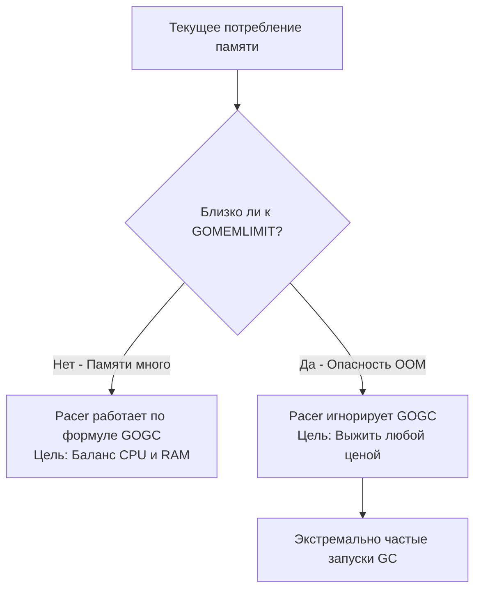

В прошлых статьях мы детально препарировали Сборщик мусора (GC). Мы разобрали его архитектуру ([[24. Сборщик мусора Go. Общая архитектура.md]]), алгоритмы поиска мусора ([[25. Mark, Sweep и Tricolor GC.md]]) и механизмы защиты от конкурентных гонок ([[26. Concurrent GC и Stop The World.md]], [[27. Write Barrier и почему она нужна.md]]). 

Инженеры Go гордятся тем, что их Сборщик мусора работает "из коробки". Если вы пишете на Java, вам доступны десятки флагов JVM (выбор алгоритма G1 или ZGC, тюнинг размера поколений Eden/Survivor, настройка пауз). В Go этого нет. Вы не можете поменять алгоритм сборки мусора.

Но для экстремального Highload-бэкенда "настройки по умолчанию" часто приводят либо к падению контейнера по памяти (OOMKilled), либо к сжиганию процессорного времени на бесконечные циклы GC. 
Для управления этим балансом у нас есть мощный механизм планирования — **Pacer (Пейсер)**, и две главные ручки управления им.

## Pacer: Ритмоводитель Сборщика мусора

Сборщик мусора не работает постоянно (иначе бы он съел весь CPU). Он должен решить, **когда** ему проснуться и начать фазу *Mark Setup*. Этим решением управляет математический контроллер — Pacer.

Pacer постоянно измеряет два параметра:
1. Как быстро Мутатор (ваша программа) аллоцирует новую память.
2. Сколько "живой" памяти осталось после предыдущего цикла очистки.

На основе этих данных Pacer вычисляет **Target Heap Size** — целевой размер кучи, при достижении которого нужно запустить следующий цикл GC.

## Ручка 1: Переменная GOGC

Исторически единственным способом повлиять на Pacer была переменная окружения `GOGC` (по умолчанию равна `100`).
Формула триггера выглядит примерно так:

$$Target = LiveHeap + \frac{LiveHeap \times GOGC}{100}$$

Где $LiveHeap$ — это размер выживших объектов после последней сборки мусора.

**Как это работает на практике:**
Представьте, что после очистки у вас осталось 100 МБ живых данных (различные кэши и пулы). При дефолтном `GOGC=100`:
$$Target = 100 + \frac{100 \times 100}{100} = 200 \text{ МБ}$$
GC будет спать, пока куча не разрастется до 200 МБ. Как только память достигнет этого предела, начнется новый цикл сборки.

### Mechanical Sympathy: Трейд-офф CPU vs RAM
Меняя `GOGC`, вы буквально торгуетесь с операционной системой:

* **Агрессивный GC (`GOGC=50`):** $$Target = 100 + 50 = 150 \text{ МБ}$$
  GC просыпается раньше. Программа потребляет **меньше оперативной памяти**, но фазы *Concurrent Mark* запускаются в два раза чаще. Вы платите процессорным временем (CPU) за экономию RAM.
* **Ленивый GC (`GOGC=200`):**
  $$Target = 100 + 200 = 300 \text{ МБ}$$
  GC позволяет куче расти сильнее. Вы платите гигабайтами оперативной памяти (RAM), но процессор реже отвлекается на сборку мусора, что сильно повышает Throughput (пропускную способность) приложения.
* **Отключение GC (`GOGC=off`):**
  Сборщик мусора не запустится автоматически никогда (только при ручном вызове `runtime.GC()`). Программа будет работать максимально быстро, пока не "съест" всю память сервера и не умрет от OOM (Out of Memory).

## Эпоха хаков: Memory Ballast

До выхода Go 1.19 у разработчиков высоконагруженных систем была серьезная проблема.
Представьте: у вас сервер на 64 ГБ RAM. Ваше приложение хранит всего 50 МБ "живого" состояния, но обрабатывает огромный поток сетевых запросов, создавая и уничтожая сотни мегабайт мусора в секунду. 

При `GOGC=100` триггер сработает на 100 МБ. Куча будет расти от 50 до 100 МБ за миллисекунды. GC будет запускаться сотни раз в секунду, сжигая 25% CPU (и накидывая штрафы Mark Assist), хотя у вас свободно еще 63 Гигабайта памяти!

Увеличить `GOGC` до `1000`? Опасно. Если живая куча вдруг вырастет до 5 ГБ (кто-то загрузил большой кэш), триггер улетит на 55 ГБ, и внезапный всплеск трафика убьет сервер (OOM).

**Инженеры Twitch придумали гениальный хак — Memory Ballast (Балласт памяти).**

В начале функции `main` они создавали гигантский массив:
```go
func main() {
    // Создаем пустой массив на 10 Гигабайт
    ballast := make([]byte, 10<<30)
    
    // ... запускаем сервер ...
    
    // Чтобы компилятор не удалил балласт
    runtime.KeepAlive(ballast) 
}
```

Что происходило?
1. "Живая" куча искусственно увеличивалась до 10 Гигабайт + 50 Мегабайт реальных данных.
2. При `GOGC=100` триггер устанавливался на **20 Гигабайт**.
3. Программа могла спокойно генерировать 10 Гигабайт мусора, прежде чем GC просыпался. Сборка мусора происходила раз в минуту, а не 100 раз в секунду. Производительность (CPU) взлетала в космос!

> [!info] Под капотом. Почему балласт не съедал реальную RAM?
> Вызов `make([]byte, 10<<30)` запрашивает у Linux **виртуальную** память. Ядро ОС выделяет адресное пространство, но не связывает его с физическими плашками оперативной памяти (Physical RAM) до тех пор, пока вы не начнете писать реальные данные в эти байты. Так как массив балласта просто лежал и ничего не делал, Page Fault (ошибка отсутствия страницы) не возникал, и физическая память сервера (RSS - Resident Set Size) оставалась свободной.

## Ручка 2: GOMEMLIMIT (Go 1.19+)

Балласт был отличным хаком, но он был костылем. Он ломался в средах Kubernetes с жесткими cgroup-лимитами и не спасал от случайных всплесков потребления (OOMKilled).

В релизе Go 1.19 произошло эпохальное событие: в язык добавили **Мягкий лимит памяти — `GOMEMLIMIT`**. 
Это официально убило необходимость в Memory Ballast.

`GOMEMLIMIT` устанавливает границу, которую рантайм всеми силами старается не пересекать. Он **переопределяет логику `GOGC`**, если куча подбирается к опасному пределу.



**Идеальный современный сетап для Kubernetes:**
Если ваш pod имеет лимит в 1 ГБ RAM, вы выставляете:
`GOMEMLIMIT=900MiB`

Что это дает?
* Вы можете отключить стандартный пейсер: `GOGC=off`. Программа будет работать со скоростью C++, вообще не тратя CPU на сборку мусора, пока куча не достигнет 900 МБ.
* Как только память пересечет 900 МБ, рантайм экстренно разбудит GC и сожмет кучу, спасая pod от смерти (OOMKilled ядром Linux).

> [!warning] Ловушка / Gotcha. Почему не 100% от лимита контейнера?
> Никогда не ставьте `GOMEMLIMIT` равным лимиту пода в K8s. Рантайму Go нужна память не только на кучу! 
> Вам нужно оставить 10-20% памяти "на чай" для:
> 1. Структур самого рантайма (стеки горутин, структуры `mspan`).
> 2. Кэша ядра ОС (Page Cache).
> 3. Вызовов CGO (память, выделенная в C, не учитывается `GOMEMLIMIT`).
> Если вы поставите `GOMEMLIMIT=1000MiB` при лимите пода 1000MiB, Linux OOM Killer убьет ваш процесс быстрее, чем рантайм Go поймет, что нужно запустить GC.

## Death Spiral (Смертельная спираль трэшинга)

Что произойдет, если ваша программа имеет утечку памяти (см. [[12. Как создается и завершается goroutine.md]]) или реальный объем живых данных превысит `GOMEMLIMIT`?

1. Рантайм видит, что лимит превышен. Он запускает GC.
2. GC сканирует всю память, но ничего не может удалить (все объекты живые).
3. Куча всё ещё больше лимита. Рантайм мгновенно запускает следующий цикл GC.
4. Процессор тратит 100% времени на сборку мусора, приложение зависает и не отвечает на сетевые запросы. Это состояние называется **GC Thrashing**.

Инженеры Go предусмотрели защиту от "смертельной спирали". 
В рантайм жестко зашит лимит: **Сборщик мусора не имеет права потреблять более 50% процессорного времени (CPU)**.
Если лимит памяти превышен, а мусора нет, рантайм скажет: *"Я сделал всё, что мог, но я не буду убивать CPU полностью"*. Он снизит частоту сборок до 50% CPU, позволит памяти превысить `GOMEMLIMIT` и отдаст судьбу процесса в руки операционной системы (которая закономерно убьет его по OOM). И это правильное архитектурное решение: лучше быстро умереть и перезапуститься, чем бесконечно "висеть".

## Итог

1. **Pacer** — это алгоритм, вычисляющий момент следующего запуска GC.
2. **`GOGC`** — процентный мультипликатор. По умолчанию 100. Меньше — частые сборки (экономия RAM). Больше — редкие сборки (экономия CPU).
3. **Memory Ballast** — устаревший хак с выделением огромного пустого слайса для обмана пейсера. В современном Go использовать **категорически запрещено**.
4. **`GOMEMLIMIT`** — современный мягкий лимит (Go 1.19+). Идеален для контейнеров. Позволяет безопасно выкручивать `GOGC` на максимум, защищая сервер от OOMKilled.
5. Защита от **GC Thrashing** гарантирует, что даже при острой нехватке памяти Сборщик мусора не заберет более 50% ресурсов CPU.

В этом огромном блоке мы полностью деконструировали работу памяти: от стека и аллокатора до сборщика мусора и его тюнинга. Мы изучили "невидимые" системы рантайма.
Теперь пришло время вернуться к тому коду, который вы пишете каждый день. Самая популярная и коварная структура данных в Go, которая ломает мозги на собеседованиях и создает больше всего проблем с аллокациями — это `slice`.

В следующей статье мы разберем её под микроскопом:
[[29. Внутреннее устройство slice.md]]