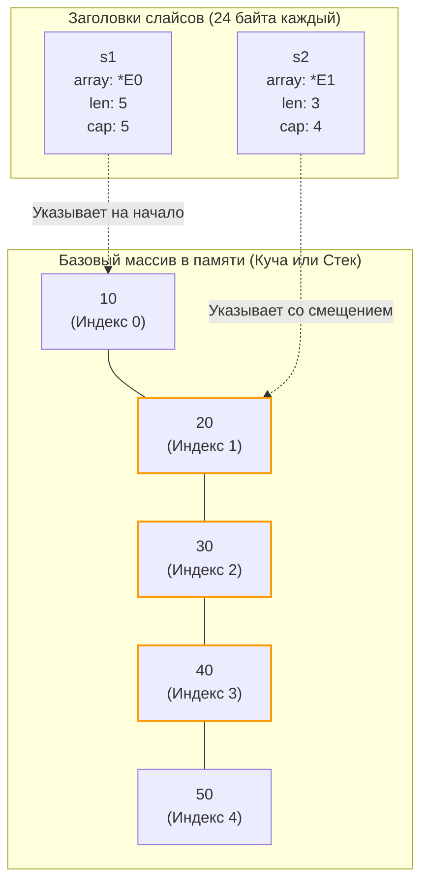

В прошлых статьях мы разобрали, как рантайм Go управляет памятью: от стека горутин до сборщика мусора. В статье [[19. Escape Analysis на практике. Как писать меньше аллокаций.md]] мы вскользь упомянули, что правильная работа со слайсами (slices) спасает кучу от мусора и реаллокаций. 

Слайсы — это, пожалуй, самая используемая структура данных в Go. Но именно они генерируют больше всего багов у Junior и Middle разработчиков: от внезапного изменения данных "где-то в другой функции" до гигантских утечек памяти (Memory Leaks).

Чтобы писать надежный код, Senior-инженер должен перестать воспринимать слайс как "динамический массив". Слайс — это не массив. Это всего лишь крошечная структура-дескриптор, "окно", через которое мы смотрим на сырую память.

## 1. Анатомия слайса: 24 байта

На уровне машинного кода (и в исходниках рантайма `src/runtime/slice.go`) слайс представляет собой элементарную структуру `slice` (или `reflect.SliceHeader` для разработчиков). 

На 64-битной архитектуре слайс **всегда** занимает ровно **24 байта**, независимо от того, сколько в нем элементов — ноль или миллиард.

```go
type slice struct {
	array unsafe.Pointer // Указатель на первый элемент базового массива (8 байт)
	len   int            // Текущая длина (8 байт)
	cap   int            // Вместимость (8 байт)
}
```

* **`array`:** Адрес в оперативной памяти (в куче или на стеке), где физически лежат элементы.
* **`len` (Length):** Сколько элементов мы сейчас "видим" через наше окно.
* **`cap` (Capacity):** Сколько элементов физически влезает в базовый массив, начиная от указателя `array` и до конца выделенного блока памяти.

### Массивы vs Слайсы

В Go есть настоящие массивы (например, `[5]int`). Массивы — это жесткие, неповоротливые блоки памяти. 
* Если вы присваиваете массив переменной (`a := b`), копируются **все его элементы**. 
* Если вы передаете массив в функцию, на стек копируется весь массив. Передача массива на 1 МБ сожжет 1 МБ стека.

Слайс — это легковесная обертка над массивом. Когда вы передаете слайс в функцию по значению (`func process(s []int)`), вы копируете **только 24 байта** заголовка. Сам базовый массив остается на месте.

## 2. Операция Slicing: Как двигается окно

Рассмотрим классический код:
```go
func main() {
    // Выделяем массив на 5 элементов
    // len = 5, cap = 5
    s1 := []int{10, 20, 30, 40, 50} 
    
    // Берем "под-слайс"
    s2 := s1[1:4] 
}
```

Что произошло в памяти при создании `s2`? Новая память **не выделялась**. Элементы **не копировались**.
Рантайм просто создал новую 24-байтную структуру `s2` по следующим правилам:
* `array` = смещается на 1 элемент вперед (адрес `s1.array` + `1 * 8` байт).
* `len` = `4 - 1` = `3`.
* `cap` = `s1.cap - 1` = `4`.



Оба слайса смотрят в один и тот же участок памяти. Если вы сделаете `s2[0] = 99`, то `s1[1]` тоже станет `99`. 

> [!warning] Ловушка / Gotcha. Утечка памяти при парсинге
> Это самое страшное следствие архитектуры слайсов.
> Представьте, вы прочитали файл логов в память: `logData := make([]byte, 100*1024*1024)` (100 Мегабайт).
> Вы нашли в логе нужную строку (допустим, ID ошибки из 10 байт) и вернули её: `return logData[100:110]`.
> **Результат:** 100 Мегабайт памяти **никогда не удалятся Сборщиком Мусора**. Возвращенный 10-байтный слайс содержит указатель `array`, который держит в заложниках весь 100-мегабайтный базовый массив! 
> **Решение:** Если вам нужен маленький кусок из огромного массива, вы обязаны скопировать его в новую память. Используйте `strings.Clone(string(logData[...]))` или `bytes.Clone()`.

## 3. Магия append и Реаллокация

Функция `append` — это то, что превращает жесткие массивы в "динамические".

```go
s1 := make([]int, 0, 3) // len=0, cap=3
s1 = append(s1, 1)      // len=1, cap=3
s1 = append(s1, 2)      // len=2, cap=3
s1 = append(s1, 3)      // len=3, cap=3
```
Пока `len < cap`, `append` работает за $O(1)$ (константное время). Он просто записывает значение по адресу `array + len*sizeof(T)` и возвращает новый заголовок с увеличенным `len`.

Но что будет, если сделать `s1 = append(s1, 4)`? Места больше нет (`len == cap`).
Происходит **Реаллокация (Reallocation)**:
1. Рантайм выделяет в куче **новый** базовый массив большего размера.
2. Происходит побайтовое копирование (инструкция `memmove`) всех старых данных в новый массив.
3. Добавляется новый элемент.
4. Возвращается новый заголовок `slice`, в котором `array` указывает на новую память, а старый базовый массив отдается на съедение Garbage Collector'у.

### Mechanical Sympathy: Формула роста (Как меняется Capacity?)

На собеседованиях любят спрашивать: "Как растет capacity слайса при `append`?".
Большинство отвечает: *"В 2 раза до 1024 элементов, а потом на 25%"*. 

**Это устаревший ответ!** Начиная с Go 1.18, алгоритм роста слайсов (файл `runtime/slice.go`, функция `growslice`) был изменен для более плавной кривой.

Новое правило звучит так:
1. Если требуемая вместимость (cap) больше, чем `doublecap` (в 2 раза больше текущей), выделяется ровно требуемая вместимость.
2. Иначе, если старый `cap < 256` (раньше было 1024), размер удваивается ($2 \times cap$).
3. Иначе, размер растет по формуле плавного перехода: `newcap += (newcap + 3*256) / 4`.

Эта новая математика позволяет избежать резкого скачка (когда слайс из 1024 элементов внезапно превращался в 1280, а до этого рос ровно вдвое). Теперь переход от $2x$ к $1.25x$ происходит плавно.

*Примечание:* После математического вычисления `newcap`, рантайм делает еще одну вещь — он подгоняет размер под **Size Classes** аллокатора памяти `mcache` (см. [[21. Аллокатор памяти Go. mcache, mcentral, mheap.md]]), поэтому реальный `cap` часто оказывается чуть больше, чем выдает формула.

> [!tip] Собеседование. Передача слайса по значению
> **Вопрос:** Что выведет этот код?
> ```go
> func modify(s []int) {
>     s[0] = 99
>     s = append(s, 4)
> }
> func main() {
>     s := make([]int, 1, 3)
>     s[0] = 1
>     modify(s)
>     fmt.Println(s)
> }
> ```
> **Ответ:** Выведет `[99]`.
> **Почему `99`?** Мы передали слайс по значению (скопировали 24 байта). Заголовок внутри функции указывает на тот же самый базовый массив. Поэтому `s[0] = 99` изменяет оригинальные данные.
> **Почему нет `4`?** Когда мы сделали `append` внутри функции, локальная переменная `s` получила новый `len = 2`. Но эта локальная копия заголовка уничтожилась при выходе из функции! Оригинальный слайс в `main` так и остался с `len = 1`. Он физически не "видит" четверку, хотя она лежит в базовом массиве.
> Именно поэтому `append` **всегда** возвращает новый слайс, и мы обязаны его переприсваивать: `s = append(s, ...)`.

## 4. Паттерн Full Slice Expression (Ограничение Capacity)

Что делать, если вы передаете слайс в чужую библиотеку, и хотите гарантировать, что функция не сможет затереть ваши данные через `append`?

В Go есть синтаксис среза с тремя индексами: `[low:high:max]`.

```go
func main() {
    base := []int{1, 2, 3, 4, 5} // len=5, cap=5
    
    // Обычный срез: len=2, cap=5. 
    // Если сделать append, он перезапишет тройку!
    unsafeSlice := base[0:2] 
    
    // Полный срез: len=2, cap=2.
    safeSlice := base[0:2:2] 
}
```

Установив `max` равным `high` (`base[0:2:2]`), мы жестко обрезаем `cap` нового слайса. Если чужая функция попытается сделать `append(safeSlice, 99)`, у слайса не окажется вместимости. Сработает механизм Реаллокации: рантайм выделит новую память, скопирует туда `1, 2` и добавит `99`. Ваш оригинальный массив `base` останется в полной безопасности!

## 5. Очистка слайса (Memory leaks)

Если в вашем базовом массиве лежат указатели (например, `[]*User`), и вы "отрезаете" их, уменьшая `len`, сборщик мусора **не удалит** эти объекты! Базовый массив всё ещё хранит физические указатели на них.

**Плохо:**
```go
// Удаляем первый элемент
s = s[1:] 
// GC не удалит s[0], так как базовый массив все еще держит ссылку!
```

**Mechanical Sympathy (Правильно):**
До Go 1.21 нужно было вручную занулять элементы:
```go
s[0] = nil
s = s[1:]
```

Начиная с Go 1.21, в пакете `slices` (а потом и в built-in) появилась удобная функция:
```go
import "slices"
s = slices.Delete(s, 0, 1)
```
Она под капотом сдвигает элементы и корректно зануляет хвост массива (через функцию `clear`), чтобы Garbage Collector мог спокойно освободить память отброшенных структур.

## Итог

1. **Слайс — это не массив.** Это структура из 24 байт (указатель, длина, вместимость).
2. Операции среза (`s[a:b]`) не выделяют память и не копируют элементы, они создают новый 24-байтный заголовок, ссылающийся на ту же память.
3. Удержание маленького среза из большого массива приводит к утечке памяти всего гигантского массива. Используйте `Clone()`.
4. В Go 1.18+ формула роста `append` изменилась: вместо жесткого $2x$ до 1024, используется плавный переход после 256 элементов.
5. Передача слайса в функцию копирует только заголовок. Мутация элементов изменит оригинал, но изменения `len/cap` (через `append`) оригинал не затронут.

Мы разобрались со списками, где ключами являются строгие индексы. Но как рантайм реализует ассоциативные массивы (словари)? Как Go решает коллизии хэшей без деградации производительности и зачем мапе "эвакуация"?

Мы разобрались с базовой структурой слайса и узнали, что это всего лишь 24-байтное "окно" в память. Но мы лишь вскользь затронули самый ресурсоемкий и опасный процесс — увеличение этого окна. Как именно рантайм выделяет новую память, копирует гигабайты данных и какие ловушки скрываются за безобидной функцией `append`? В следующей статье мы разберем это под микроскопом: [[30. Рост slice. append, realloc и copy.md]]