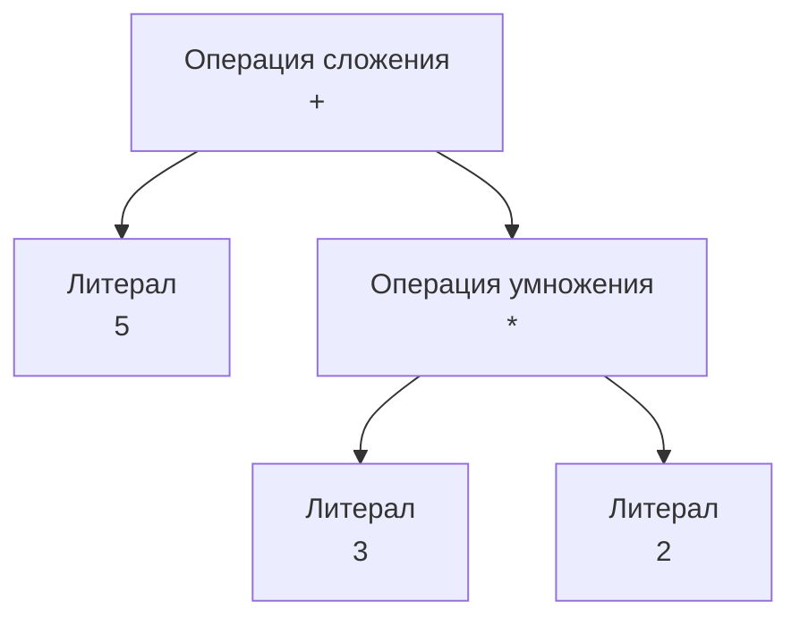

В прошлой статье мы крупными мазками разобрали архитектуру AOT-компилятора. Теперь мы берем исходный код и пошагово проводим его через первую половину конвейера — от обычного текста до промежуточного представления (IR), готового к хардкорным оптимизациям. 

Этот этап компиляции называется **Frontend**. Его задача — распарсить текст, проверить семантику языка и убедиться, что код имеет смысл. Вся работа фронтенда в Go сосредоточена вокруг пакетов `cmd/compile/internal/syntax` и `cmd/compile/internal/types2`.

## 1. Лексический анализ (Lexer / Scanner)

Процессор не понимает слов `func` или `struct`. Для него исходный код — это просто массив байт (срез UTF-8 символов). Первая задача компилятора — сгруппировать эти байты в осмысленные слова. Этим занимается **Лексер** (или Сканнер).

Он читает исходник символ за символом и превращает его в поток **токенов**.

Например, строка `a := 5 + 3` будет разбита лексером на следующие токены:
1. `IDENT("a")` — идентификатор.
2. `DEFINE` — оператор `:=`.
3. `INT("5")` — литерал числа.
4. `ADD` — оператор `+`.
5. `INT("3")` — литерал числа.

> [!warning] Ловушка / Gotcha. Автоматическая вставка точек с запятой
> В Go почти не используются точки с запятой `;` в конце строк, но рантайм и синтаксис языка их требуют. Как это работает? 
> **Лексер вставляет их сам.**
> Если строка заканчивается токеном, после которого логично ожидать конец стейтмента (например, идентификатор, литерал `break`, `return` или закрывающая скобка `}`, `]`), лексер автоматически добавляет токен `;` вместо символа переноса строки.
> Именно поэтому открывающая фигурная скобка `{` обязана стоять на той же строке, что и `func` или `if`. Если перенести ее на новую строку, лексер воткнет `;` после условия `if`, и парсер выдаст синтаксическую ошибку.

## 2. Синтаксический анализ (Parser)

Поток токенов лишен структуры. Лексер знает, что `a`, `+`, `b` идут друг за другом, но не понимает связи между ними. 
**Парсер** берет поток токенов и строит из них **Абстрактное Синтаксическое Дерево (AST)**.

Go использует рекурсивный нисходящий парсер (Recursive Descent Parser). Он идет по токенам и собирает из них вложенные структуры (узлы). Каждый узел представляет собой конструкцию языка: объявление функции, цикл, математическую операцию.

На уровне AST выражение `5 + 3 * 2` превращается в дерево с учетом приоритета операций:



## 3. Проверка типов (Type Checking)

Получив AST, компилятор знает, что код синтаксически верен (нет пропущенных скобок). Но он еще не знает, верен ли код логически. Можно ли умножить строку на число? Соответствует ли возвращаемое значение сигнатуре функции?

За это отвечает фаза **Type Checking** (пакет `types2`). Здесь происходит магия, невидимая невооруженным глазом:

1. **Разрешение типов (Type Resolution):** Компилятор обходит AST и привязывает конкретный тип (например, `int64` или кастомная `struct`) к каждой переменной и выражению.
2. **Проверка интерфейсов:** Удовлетворяет ли структура контракту интерфейса? (Имплементированы ли все методы).
3. **Monomorphization (Дженерики):** Если вы используете Generics, компилятор генерирует реальные функции для конкретных типов (stenciling), с которыми был вызван дженерик. В отличие от Java, где работает Type Erasure (стирание типов), Go создает отдельные копии функций под капотом, чтобы сохранить производительность и избежать аллокаций на боксинг (Interface Boxing).
4. **Escape Analysis:** Базовая фаза анализа того, какие переменные «утекают» за пределы стека горутины, чтобы пометить их для аллокации в куче. (см. [[18. Escape Analysis. Почему переменная ушла в heap.md]]).

> [!tip] Собеседование
> **Вопрос:** Почему в Go можно написать `time.Duration(2) * time.Second`, но нельзя умножить `int(2)` на `time.Second`, хотя `time.Duration` — это `int64` под капотом?
> **Ответ:** Это концепция **Untyped Constants** (нетипизированные константы). Число `2` в исходнике не имеет жесткого типа `int`, пока парсер не привяжет его к контексту. Type Checker видит, что `2` умножается на `time.Duration`, и неявно кастует `2` в `time.Duration` на этапе компиляции. Но если `2` уже лежит в переменной типа `int`, строгая система типов Go запретит умножение разных типов, требуя явного приведения.

### Constant Folding (Свертка констант)
На этапе Type Checking компилятор применяет важную оптимизацию: если он видит математические операции между константами, он вычисляет их прямо во время компиляции.
Код `seconds := 60 * 60 * 24` никогда не будет умножаться процессором во время выполнения программы. В итоговом бинарнике `seconds` будет сразу равно `86400`. Это яркий пример Mechanical Sympathy — мы экономим такты CPU в рантайме, перенося работу на этап сборки.

## 4. Переход от AST к SSA (Генерация IR)

К концу этапа Type Checking мы имеем аннотированное AST (Typed AST). Дерево идеально описывает исходный код, но с ним невозможно проводить глубокие оптимизации (такие как вынос инвариантов из цикла или распределение регистров).

Поэтому пакет `cmd/compile/internal/ssagen` конвертирует AST в промежуточное представление — **SSA (Static Single Assignment)**.

Главное правило SSA: **каждой переменной значение присваивается ровно один раз**. Если в Go коде вы делаете:

```go
x := 1
x = x + 2
x = x * 3
```

В формате SSA это будет выглядеть так:
```asm
v1 = const 1
v2 = add v1, const 2
v3 = mul v2, const 3
```

Создавая новые "версии" переменных (`v1`, `v2`, `v3`), компилятор строит четкий граф потока данных (Data Flow Graph). Теперь, если компилятор видит, что переменная `v2` нигде не используется дальше, он может просто выкинуть ее (Dead Code Elimination) вместе со всеми вычислениями, которые к ней привели.

## Итог фронтенда компиляции

1. **Лексер** читает текст и бьет его на токены (попутно вставляя точки с запятой).
2. **Парсер** собирает из токенов структуру — Абстрактное Синтаксическое Дерево (AST).
3. **Type Checker** проверяет строгую типизацию, вычисляет константы на лету и разворачивает дженерики.
4. **Генератор SSA** переводит высокоуровневое дерево в промежуточный код, где каждая переменная иммутабельна.

На этом этапе код перестает быть "программой на Go" и превращается в математический граф потока управления. В следующей статье мы подробно разберем, какие магические трансформации компилятор делает с этим графом, чтобы заставить ваш код работать молниеносно: 
[[4. SSA в Go. Как компилятор оптимизирует код.md]]