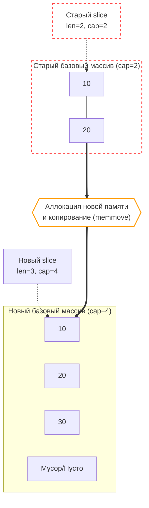

В прошлой статье ([[29. Внутреннее устройство slice.md]]) мы деконструировали слайс до 24-байтной структуры (`array`, `len`, `cap`). Мы увидели, что операции среза (`s[1:4]`) работают за $O(1)$ и не аллоцируют память. 

Но бэкенд редко работает со статичными данными. Мы читаем строки из базы данных, собираем JSON-ответы, буферизуем сетевые пакеты. Для динамического расширения коллекций Go предоставляет встроенную функцию `append`. 

На первый взгляд `append` кажется магической функцией, которая делает массив бесконечным. Но для Senior-разработчика `append` — это триггер потенциального падения производительности. Чтобы писать быстрый код, нужно понимать, когда `append` работает как молния, а когда превращается в тяжелую операцию с выделением памяти в куче и вызовом Сборщика Мусора.

## 1. Fast Path: append без аллокаций

Если в базовом массиве еще есть место (то есть текущая длина `len` строго меньше вместимости `cap`), `append` работает по "быстрому пути".

```go
s := make([]int, 0, 5) // len=0, cap=5
s = append(s, 42)      // Fast path!
```

На уровне компилятора и рантайма никаких вызовов сложных функций не происходит. Компилятор инлайнит (встраивает) этот код, превращая его в простейшую арифметику указателей:
1. Вычисляется адрес целевой ячейки: `ptr = s.array + s.len * sizeof(int)`.
2. По этому адресу записывается значение `42`.
3. Возвращается новая структура `slice`, в которой `len` увеличен на 1, а `array` и `cap` остались прежними.

Эта операция стоит буквально **несколько тактов процессора**. Она не трогает аллокатор памяти, не создает мусора и работает исключительно в кэшах L1/L2 процессора.

## 2. Slow Path: Реаллокация (Reallocation)

Катастрофа (в микро-масштабах производительности) случается, когда мы делаем `append`, а места в базовом массиве больше нет (`len == cap`).

```go
s := make([]int, 2, 2) // len=2, cap=2
s[0], s[1] = 10, 20
s = append(s, 30)      // Slow path! Реаллокация!
```

Теперь рантайм вынужден вызвать тяжелую функцию `runtime.growslice`. Происходит следующий конвейер действий:

1. **Расчет нового размера:** Рантайм вычисляет, какой `cap` потребуется для нового слайса (по специальной формуле роста, о которой ниже).
2. **Аллокация:** Рантайм идет в аллокатор памяти (к `mcache` или `mcentral`, см. [[21. Аллокатор памяти Go. mcache, mcentral, mheap.md]]) и просит выделить совершенно новый, непрерывный кусок памяти нужного размера.
3. **memmove (Копирование):** Рантайм берет старые данные (`10` и `20`) и побайтово копирует их из старого участка памяти в новый. Для этого используется высокооптимизированная ассемблерная функция `runtime.memmove`, которая задействует векторные инструкции процессора (AVX/SIMD) для копирования большими блоками.
4. **Запись нового элемента:** В новую память записывается элемент `30`.
5. **Мусор:** Старый базовый массив теряет свою единственную ссылку (если других слайсов на него нет) и становится мусором, который придется убирать Garbage Collector'у.



> [!warning] Ловушка / Gotcha. Инвалидация указателей
> Если у вас был слайс, и вы передали указатель на один из его элементов в другую горутину: `ptr := &s[0]`. А затем в оригинальной горутине сделали `s = append(s, 42)`, что вызвало реаллокацию.
> Что будет с `ptr`? 
> Он останется указывать на **старую** память! Слайс "уехал" по новому адресу, а ваш указатель смотрит на осиротевший массив. Изменение данных по `ptr` больше не будет отражаться в слайсе `s`.

## 3. Математика роста: От 2x к плавному переходу (Go 1.18+)

Если при каждой нехватке памяти рантайм будет выделять ровно на 1 элемент больше, то цикл `for i:=0; i<1000; i++ { s = append(s, i) }` вызовет 1000 реаллокаций и 1000 копирований всего массива. Скорость работы упадет до $O(N^2)$.

Чтобы амортизировать (размазать) стоимость копирования, рантайм выделяет память с запасом. До версии Go 1.18 правило было простым: удваивать размер (`cap * 2`), пока элементов меньше 1024, а дальше увеличивать на 25%.

**В Go 1.18 алгоритм переписали**, чтобы избежать резких скачков (когда слайс на 1024 элемента требовал сразу +1024 элементов, хотя мы добавляли всего один).

Новый алгоритм `growslice` (упрощенно) работает так:
1. Вычисляется `doublecap = old.cap + old.cap`.
2. Если мы запрашиваем вместимость больше, чем `doublecap` (например, `append(s, make([]int, 1000)...)` к пустому слайсу), рантайм выдаст ровно то, что просили.
3. Иначе, если старая вместимость **меньше 256** (вместо старых 1024), размер удваивается: `newcap = doublecap`.
4. Иначе (если `cap >= 256`), размер растет по плавной формуле:
   $$newcap = newcap + \frac{newcap + 3 \times 256}{4}$$
   Этот цикл повторяется, пока `newcap` не станет больше или равен требуемой длине.

Эта формула гарантирует плавный переход от множителя $2.0x$ (для мелких массивов) к множителю $\approx 1.25x$ (для гигантских массивов).

## 4. Скрытый хак: Size Classes и выравнивание памяти

На хардовых собеседованиях любят давать такую задачу:

```go
func main() {
    s := make([]int, 0) // cap = 0
    s = append(s, 1)    // len = 1, cap = 1 (всё логично)
    s = append(s, 2)    // len = 2, cap = 2 (удвоилось)
    s = append(s, 3)    // len = 3, требуемый cap = 4. А какой будет реальный?
    
    fmt.Println(cap(s)) // Выведет 4? Нет! 
}
```

Чтобы ответить на этот вопрос, нужно вспомнить архитектуру аллокатора (`mcache` из статьи [[21. Аллокатор памяти Go. mcache, mcentral, mheap.md]]). 

Аллокатор не умеет выделять произвольное количество байт. Он выдает память строго по классам размеров (Size Classes): 8, 16, 24, 32, 48, 64, 80 байт и так далее.

Посмотрим на наш слайс из 3 интов (на 64-битной архитектуре `int` весит 8 байт).
1. Формула роста говорит: "Старый cap=2, удваиваем, значит нужен `cap=4`".
2. Для хранения 4 интов нужно $4 \times 8 = 32$ байта.
3. Рантайм идет в таблицу Size Classes и ищет класс $\ge 32$ байт. О, класс на 32 байта существует! Рантайм выделяет 32 байта. Вместимость остается **4**.

А теперь представим, что тип элементов — `int32` (весит 4 байта).
1. Мы имели 2 элемента `int32`. Делаем append третьего.
2. Формула требует `cap=4`.
3. Для 4 элементов нужно $4 \times 4 = 16$ байт.
4. В Size Classes есть 16 байт. Вместимость останется **4**.

**Но что если элемент весит 5 байт (кастомная структура)?**
1. Был `cap=2`. Формула требует `cap=4`.
2. Требуемая память: $4 \times 5 = 20$ байт.
3. Аллокатор смотрит в Size Classes: 8, 16, 24, 32. Ближайший подходящий — **24 байта**.
4. Рантайм выделяет блок на 24 байта.
5. Сколько структур по 5 байт влезет в 24 байта? $24 / 5 = 4.8$. То есть **4** целых структуры. Вместимость останется 4. 4 байта будут потеряны (Internal Fragmentation).

**Секрет:** Из-за округления под классы размеров (Size Classes) реальная вместимость слайса после `append` может оказаться **больше**, чем выдает математическая формула удваивания! Рантайм просто берет "лишнюю" память, выданную аллокатором из-за фрагментации, и бесплатно добавляет её в `cap` вашего слайса.

## 5. Встроенная функция copy

Помимо `append`, в Go есть мощная встроенная функция `copy(dst, src []T) int`.

```go
src := []int{1, 2, 3}
dst := make([]int, len(src))
copied := copy(dst, src) // Скопирует 3 элемента, вернет 3
```

Особенности `copy`, которые должен знать системный инженер:
1. **Никаких аллокаций.** `copy` никогда не выделяет новую память и не меняет `len/cap` слайсов. Она пишет ровно столько элементов, сколько влезает в наименьший из двух слайсов `min(len(dst), len(src))`.
2. **Перекрытие памяти (Overlapping):** `copy` абсолютно безопасна даже если `dst` и `src` — это срезы одного и того же массива, которые пересекаются друг с другом (`copy(s[1:], s[:3])`). Под капотом она использует `runtime.memmove`, который проверяет направление копирования и предотвращает затирание данных.
3. **Строки в байты:** `copy` — это единственный легальный способ быстро скопировать неизменяемую строку `string` в изменяемый срез `[]byte` без промежуточных конвертаций: `copy(byteSlice, myString)`.

## 6. Mechanical Sympathy: Пишем быстрый код

Зная анатомию `append`, мы можем сформулировать правила высокопроизводительного кода.

### Правило 1: Pre-allocation (Предварительная аллокация)
Это правило №1 в Go бэкенде. Если вы в цикле собираете слайс, и вы **хотя бы примерно** знаете итоговое количество элементов — используйте `make` с `capacity`.

**Плохо (10+ аллокаций в куче, нагрузка на GC):**
```go
var ids []string
for _, user := range users {
    ids = append(ids, user.ID)
}
```

**Отлично (1 аллокация, работает в 20 раз быстрее):**
```go
ids := make([]string, 0, len(users)) // Задали capacity!
for _, user := range users {
    ids = append(ids, user.ID) // Работает за O(1)
}
```

### Правило 2: Nil slice vs Empty slice
Разработчики часто путают два состояния:

```go
var s1 []int       // s1 == nil. len=0, cap=0, array=nil
s2 := make([]int, 0) // s2 != nil. len=0, cap=0, array=0xMemoryAddress
```

С точки зрения `append` они работают одинаково (оба создадут новый массив при добавлении). Но с точки зрения сериализации `json.Marshal(s1)` выдаст `null`, а `json.Marshal(s2)` выдаст `[]`.
Более того, `make([]int, 0)` создает невидимую аллокацию (рантайм присваивает указателю `array` глобальный адрес `runtime.zerobase` — специальную переменную для структур нулевого размера). Всегда предпочитайте `var s []int`, если слайс может остаться пустым.

### Правило 3: Обрезка слайса для пула
Если вы переиспользуете слайс (например, через `sync.Pool`, см. [[23. sync_pool под капотом.md]]), вы должны обнулять его длину перед возвратом, но сохранять `capacity`:

```go
// Очистка без потери capacity!
s = s[:0] 
// Затирание хвостов (Go 1.21+), чтобы избежать утечки указателей
clear(s)  
```

## Итог

1. **`append`** работает за константное время $O(1)$ и не аллоцирует память, пока в базовом массиве есть свободное место (`len < cap`).
2. При исчерпании `cap` запускается тяжелый механизм **реаллокации**: аллокация нового массива, `memmove` старых данных, добавление новых и создание мусора для GC.
3. Математика роста стала плавной с Go 1.18: удвоение работает только до **256 элементов**, затем рост замедляется.
4. Из-за подгонки под **Size Classes** аллокатора, реальная вместимость слайса после `append` часто оказывается больше математически ожидаемой.
5. Предварительная аллокация (`make(T, 0, cap)`) — главный инструмент оптимизации памяти в Go, избавляющий от каскадных реаллокаций в горячих циклах.

Слайсы — это линейная, предсказуемая и невероятно быстрая память. Но для реализации логики "ключ-значение" они не подходят. Для этого в Go встроены хэш-таблицы (maps).

Мапа в Go — это не просто абстракция, это сложнейший механизм с бакетами, разрешением коллизий, генерацией хэшей на лету и механизмом постепенной эвакуации, который не блокирует всю программу.

В следующей статье мы разберем одну из самых сложных и гениальных структур в языке: [[31. Внутреннее устройство map. hmap, bucket, overflow]]