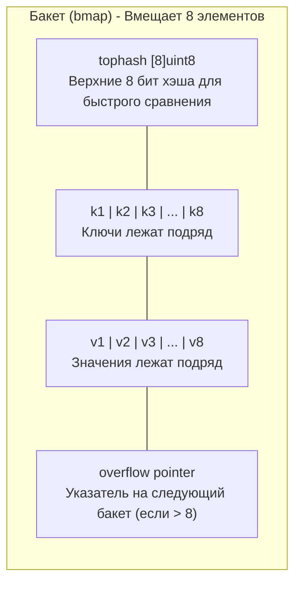
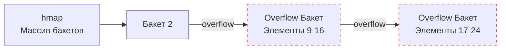

В прошлой статье ([[30. Рост slice. append, realloc и copy.md]]) мы изучили линейную память. Слайсы идеальны, когда ключом является индекс, а размер растет предсказуемо. 

Но бэкенд не может жить без ассоциативных массивов — словарей, где ключом может быть строка, структура или любой другой сравниваемый тип. В Go эта структура называется `map`.

Как и каналы, мапа встроена прямо в язык, и компилятор прячет от нас её сложность. Но цена этой абстракции высока. Неумелое использование мапы — это прямой путь к пробитию потолка по CPU (из-за генерации хэшей), паникам (из-за гонок данных) и скрытым утечкам памяти.

Пришло время открыть исходники `src/runtime/map.go` и разобраться, как рантайм балансирует между математикой хэш-функций и физикой кэшей процессора.

## 1. Структура hmap (Заголовок мапы)

Когда вы пишете `m := make(map[string]int)`, рантайм аллоцирует в куче структуру `hmap` (Header of map). Она весит 48 байт (на 64-битных системах) и содержит метаданные:

```go
type hmap struct {
    count     int    // Количество элементов в мапе (len)
    flags     uint8  // Флаги состояния (например, идет ли сейчас запись)
    B         uint8  // Логарифм от количества бакетов (buckets = 2^B)
    noverflow uint16 // Примерное число переполненных бакетов
    hash0     uint32 // Seed для хэш-функции (рандомизация)
    buckets    unsafe.Pointer // Указатель на массив бакетов
    oldbuckets unsafe.Pointer // Указатель на старый массив бакетов (при эвакуации)
    nevacuate  uintptr        // Прогресс эвакуации (индекс следующего бакета)
}
```

Ключевые поля здесь:
* **`count`:** Делает вызов `len(m)` операцией за $O(1)$.
* **`B`:** Хранит размер хэш-таблицы в виде степени двойки. Если $B=3$, значит у нас $2^3 = 8$ бакетов.
* **`hash0`:** При создании мапы генерируется случайный seed. Это защита от **Hash Collision DOS-атак**. Без него злоумышленник мог бы прислать миллион специально подобранных HTTP-заголовков, которые сгенерируют одинаковый хэш, сложат все элементы в один бакет и превратят поиск за $O(1)$ в поиск за $O(N)$, "положив" ваш сервер.

## 2. Анатомия бакета (bmap)

Мапа в Go реализует алгоритм хэш-таблицы с разрешением коллизий методом цепочек (Separate Chaining). 
В классическом C++ (std::unordered_map) каждый элемент массива указывает на связный список узлов. Это медленно, потому что каждый узел аллоцируется в куче отдельно, что вызывает чудовищный *Pointer Chasing* и кэш-промахи (см. [[20. Stack vs Heap в Go.md]]).

Инженеры Go проявили Mechanical Sympathy. Вместо одного элемента они сгруппировали данные в **Бакеты (Buckets)**. Один бакет (структура `bmap`) вмещает ровно **8 пар ключ-значение**.



### Mechanical Sympathy: Почему ключи и значения разделены?
Вы могли заметить странность. В памяти бакета данные лежат не парами `K-V, K-V, K-V`, а сгруппировано: сначала все ключи `K, K, K...`, а потом все значения `V, V, V...`. 

Зачем? Из-за **выравнивания памяти (Memory Alignment)**!
Представьте мапу `map[int64]int8` (Ключ — 8 байт, Значение — 1 байт).
Если хранить их парами: `[8][1] - padding 7 байт - [8][1] - padding 7 байт...` мы будем терять почти половину памяти бакета просто на пустоту (padding).
Сгруппировав их как `[8][8][8]...[1][1][1]`, рантайм сводит внутреннюю фрагментацию памяти практически к нулю.

## 3. Чтение из мапы: v := m["key"]

Давайте пошагово проследим, что делает процессор при поиске элемента:

1. **Хэширование:** Ключ `"key"` пропускается через хэш-функцию (смешанную с `hash0`). Получается 64-битное число (хэш).
2. **Выбор бакета:** Рантайм берет нижние `B` бит этого хэша. Если $B=3$, он берет последние 3 бита (например, `010`, то есть индекс 2) и идет в бакет номер 2.
3. **Быстрый поиск (tophash):** Внутри бакета нужно найти наш ключ. Но сравнивать строки (или большие структуры) тяжело. Поэтому рантайм берет **верхние 8 бит** нашего 64-битного хэша и побайтово сравнивает их с массивом `tophash` внутри бакета. 
   Массив из 8 байт помещается в один регистр процессора, и сравнение всех 8 ячеек происходит мгновенно!
4. **Глубокое сравнение:** Если рантайм нашел совпадение в `tophash` (например, в 3-й ячейке), он идет к 3-му ключу и выполняет честное сравнение (сравнивает саму строку `"key"`). 
   * Если совпало — возвращает 3-е значение. 
   * Если коллизия хэша (tophash совпал, а ключи разные) — продолжает поиск.

## 4. Разрешение коллизий и Overflow

Что делать, если в бакет номер 2 захэшировалось больше 8 элементов?
Рантайм выделяет в куче **Overflow Bucket** (Переполненный бакет) — точно такую же структуру на 8 элементов, и связывает их в связный список через поле `overflow`.

Если мы читаем данные и не нашли их в основном бакете, мы идем по указателю `overflow` в следующий бакет и повторяем сканирование `tophash`.



> [!warning] Ловушка / Gotcha. Деградация производительности
> Чем длиннее цепочка `overflow` бакетов, тем медленнее работает мапа (поиск стремится к $O(N)$ и вызывает кэш-промахи). Чтобы этого не происходило, рантайм следит за **Load Factor (Коэффициентом заполнения)**. 

## 5. Эвакуация (Рост мапы)

В Go мапа решает вырасти в двух случаях:
1. Среднее количество элементов в бакетах превысило **6.5** (Load Factor > 6.5).
2. Появилось слишком много `overflow` бакетов (даже если элементов мало, но они кучно упали в один бакет из-за неудачных хэшей).

Как растет мапа?
Процесс называется **Эвакуация (Evacuation)**. 
1. Рантайм создает новый массив бакетов, который **в 2 раза больше** старого (увеличивает `B` на 1).
2. Поле `oldbuckets` начинает указывать на старый массив.
3. Поле `buckets` указывает на новый массив.

### Инкрементальная эвакуация
Если перенести сразу миллион элементов из старых бакетов в новые, приложение заблокируется на несколько десятков миллисекунд (Stop-The-World эффект).
Go делает это **инкрементально**. 

Вся работа по переносу данных "размазывается" по операциям записи и удаления. Каждый раз, когда вы делаете `m["key"] = 1` или `delete(m, "key")`, рантайм заодно берет **1 или 2 старых бакета** и переносит их содержимое в новые бакеты, сдвигая указатель `nevacuate`. 

Пока эвакуация не завершена, любые операции чтения обязаны сначала проверять `oldbuckets`, а только затем `buckets`. Как только все старые бакеты перенесены, `oldbuckets` зануляется, и старая память отдается Сборщику Мусора.

## 6. Механика удаления и утечки памяти (Memory Leaks)

Удаление элемента через `delete(m, "key")` **никогда не уменьшает физический размер мапы**.
Рантайм просто находит нужную ячейку и помечает её `tophash` специальным флагом `emptyOne`. Сама память (и выделенные массивы бакетов) остается зарезервированной за мапой.

Это порождает классическую проблему бэкенда:
```go
m := make(map[int]int)
for i := 0; i < 1_000_000; i++ { m[i] = i } // Мапа раздулась до десятков МБ
for i := 0; i < 1_000_000; i++ { delete(m, i) } 
// В мапе 0 элементов (len == 0). 
// Но память НЕ ОСВОБОДИЛАСЬ!
```
Если вы используете мапу как кэш, который постоянно растет, а затем очищается, ваш сервер медленно сожрет всю оперативную память. Сборщик Мусора бессилен, так как структура `hmap` продолжает владеть массивом бакетов.

**Решение:** Если вы хотите полностью очистить мапу и вернуть память ОС, вы должны создать новую мапу, а старую отдать GC:
```go
m = make(map[int]int) // Старая мапа потеряет ссылку и будет собрана GC
// Или в Go 1.21+ использовать clear(m)
```

> [!info] Под капотом. clear(m)
> В Go 1.21 появилась встроенная функция `clear(m)`. Она не уменьшает `cap` мапы и не удаляет массивы бакетов! Она просто сверхбыстро проходит по всем `tophash` и помечает их как пустые, зануляя указатели на объекты, чтобы GC мог собрать *сами объекты*, но "скелет" мапы останется в памяти.

## 7. Параллелизм: fatal error: concurrent map read and map write

Если вы запустите две горутины, одна из которых читает мапу, а другая в этот же момент пишет в неё, ваше приложение **мгновенно упадет**. Это не `panic`, которую можно поймать через `recover()`. Это `fatal error`, который убивает процесс (как `os.Exit`).

Рантайм делает это намеренно. Вспомним инкрементальную эвакуацию: если Горутина 1 прямо сейчас переносит бакеты в новую память, а Горутина 2 попытается в этот же бакет записать данные, память будет необратимо повреждена. 

Перед каждой операцией чтения/записи рантайм проверяет и устанавливает бит `hashWriting` в поле `hmap.flags`. Если он видит конфликт — сервер умирает.

**Решение:**
1. Для редких записей и частых чтений: обернуть `map` в `sync.RWMutex` (см. [[15. Mutex и RWMutex под капотом.md]]).
2. Для высококонкурентной среды (где много горутин постоянно пишут в разные ключи): использовать `sync.Map`.

## Итог

1. **`hmap`:** Мапа — это не просто указатель, это сложный дескриптор, управляющий массивами бакетов и прогрессом эвакуации.
2. **Бакеты (`bmap`):** Для дружелюбности к кэшам CPU элементы хранятся блоками по 8 штук. Ключи и значения сгруппированы для избежания `padding`.
3. **Производительность хэшей:** Использование `tophash` позволяет сравнивать элементы за один процессорный такт, избегая дорогих сравнений самих ключей до момента точного совпадения хэша.
4. **Инкрементальный рост:** Чтобы избежать STW, мапа эвакуирует данные постепенно, "крадя" процессорное время у операций `insert` и `delete`.
5. **Memory Leak:** `delete` не возвращает память операционной системе. Мапы только растут, но никогда не сжимаются физически.

Мы разобрали базовую архитектуру `hmap` и узнали, что элементы хранятся блоками по 8 штук (`bmap`) для максимальной скорости CPU кэшей. Мы также вскользь упомянули, что при переполнении мапа "эвакуируется". Но дьявол кроется в деталях. Как именно рантайм переносит миллионы элементов, не блокируя всё приложение на сотни миллисекунд? И как побитовая математика позволяет перераспределять ключи без пересчета хэшей?

В следующей статье мы спустимся на уровень битов и разберем самый сложный и красивый механизм словарей: [[32. Рост и эвакуация map.md]]