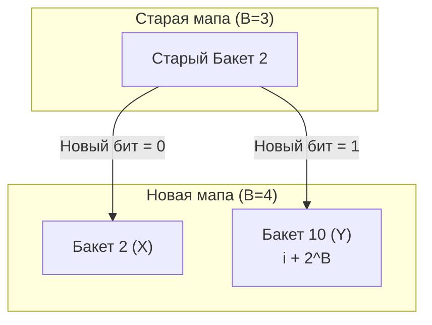

В прошлой статье ([[31. Внутреннее устройство map. hmap, bucket, overflow]]) мы выяснили, что мапа в Go — это массив бакетов (`bmap`), каждый из которых вмещает ровно 8 элементов. 

Пока мы знаем точное количество элементов заранее и выделяем мапу через `make(map[int]int, 1000)`, рантайм сразу аллоцирует нужное количество бакетов. Но что происходит, когда мы постоянно добавляем новые ключи в пустую мапу `m := make(map[string]int)`? 

Словари в Go растут. Этот процесс называется **Эвакуацией (Evacuation)**. Это одна из самых сложных операций в рантайме, потому что разработчики языка поставили жесткое условие: **рост мапы не должен вызывать пауз Stop-The-World**.

## 1. Триггеры роста: Когда мапе пора расти?

Рантайм Go принимает решение о расширении мапы в двух случаях. Обе проверки выполняются при вызове операции добавления (`mapassign`).

### Триггер 1: Load Factor > 6.5
Load Factor (Коэффициент заполнения) вычисляется как:
$$\text{Load Factor} = \frac{\text{Количество элементов}}{\text{Количество бакетов}}$$

В Go критический порог равен **6.5**. Почему именно 6.5? Разработчики рантайма провели масштабные бенчмарки и выяснили, что при таком значении достигается идеальный баланс:
* Мапа используется плотно (мало пустых слотов, экономия RAM).
* Цепочки `overflow` бакетов еще не успевают вырасти настолько, чтобы убить скорость поиска за $O(1)$ и вызвать кэш-промахи (экономия CPU).

Если Load Factor превысил 6.5, рантайм инициирует **рост в 2 раза (Double-size evacuation)**.

### Триггер 2: Слишком много Overflow бакетов
Представьте ситуацию: вы добавили 10 000 элементов, а затем удалили 9 900 из них через `delete()`. Load Factor будет крошечным. Но из-за удалений в бакетах образовались "дыры", а сами ключи "размазаны" по длиннющим связным спискам `overflow` бакетов. 
Поиск в такой мапе деградирует до $O(N)$.

Чтобы вылечить это, рантайм следит за количеством переполненных бакетов. Если их становится примерно столько же, сколько основных (порог зависит от размера мапы), рантайм инициирует **рост без увеличения размера (Same-size evacuation)**. Он просто создает новый массив бакетов *такого же размера* и переносит туда данные, идеально и плотно упаковывая их, попутно удаляя мусорные пустые бакеты.

## 2. Механика Инкрементальной Эвакуации

Мы помним, что в структуре `hmap` есть два важных указателя: `buckets` (активный массив) и `oldbuckets` (старый массив).

Когда срабатывает один из триггеров роста, рантайм делает следующее:
1. Выделяет в памяти новый массив бакетов.
2. Переносит текущий указатель `buckets` в `oldbuckets`.
3. Записывает указатель на новый массив в `buckets`.
4. Устанавливает флаг `nevacuate = 0` (счетчик прогресса эвакуации).

**С этого момента мапа находится в состоянии эвакуации.**
Рантайм *не* бежит переносить все элементы мгновенно. Вместо этого он "облагает налогом" каждую вашу операцию записи или удаления.

Каждый раз, когда ваша горутина делает `m["new_key"] = 42` или `delete(m, "key")`, рантайм заставляет эту горутину выполнить полезную работу для мапы:
она берет **ровно 2 бакета** из `oldbuckets` и переносит их содержимое в `buckets`. Затем `nevacuate` увеличивается.
Таким образом, стоимость переноса миллионов элементов "размазывается" во времени и не блокирует приложение.

## 3. Математическая магия: X и Y бакеты

Это самая гениальная часть алгоритма, за которую Go так любят системные инженеры.

Допустим, у нас была мапа, где параметр $B = 3$ ($2^3 = 8$ бакетов). Мы выросли в два раза, теперь $B = 4$ ($2^4 = 16$ бакетов).
В классических хэш-таблицах при увеличении размера нужно заново вычислять хэш для *каждого* элемента, чтобы понять, в какой бакет его положить. Расчет хэша для строк — дорогая операция.

В Go **хэши не пересчитываются вообще**.

### Как это работает?
Чтобы найти номер бакета, рантайм берет младшие $B$ бит от 64-битного хэша ключа.

В старой мапе ($B=3$) маска была `0111` (двоичная).
Допустим, у нас есть два ключа, лежащих в бакете номер 2 (`010`):
* Ключ 1: хэш заканчивается на `...0_010`
* Ключ 2: хэш заканчивается на `...1_010`
Оба они попали в бакет `2`, потому что последние 3 бита одинаковые.

В новой мапе ($B=4$) маска стала `1111` (мы смотрим на 4 бита).
Теперь, чтобы понять, куда перенести ключи из старого бакета `2`, рантайму нужно просто посмотреть на **один дополнительный бит** (4-й с конца)!

* Если этот бит `0` (как у Ключа 1 `0_010`), элемент идет в бакет `0010` (то есть остается в бакете номер **2**). Это называется **X-бакет**.
* Если этот бит `1` (как у Ключа 2 `1_010`), элемент идет в бакет `1010` (десятичное $2 + 2^3 = 2 + 8 = 10$). Он идет в бакет номер **10**. Это называется **Y-бакет**.

Рантайм берет один переполненный бакет из старой мапы и элегантно, за счет простейшей побитовой операции `AND`, "расщепляет" его на два бакета (X и Y) в новой мапе. Это невероятно быстро.

## 4. Чтение во время эвакуации

Мы выяснили, что эвакуация идет постепенно. Значит, в один момент времени часть данных лежит в новом массиве `buckets`, а часть — всё ещё ждет своей очереди в `oldbuckets`.

Что происходит, если горутина делает чтение `val := m["key"]` в этот момент?

1. Рантайм вычисляет, в какой бакет должен попасть ключ в **новой** мапе (допустим, в бакет 10).
2. Но погодите! А был ли этот бакет уже эвакуирован из старой мапы?
3. Рантайм вычисляет индекс бакета в **старой** мапе (бакет 2).
4. Он смотрит на `nevacuate`. Если индекс старого бакета меньше `nevacuate`, значит этот бакет уже перенесен. Данные нужно искать в новой мапе.
5. Если индекс старого бакета $\ge nevacuate$, значит он еще не перенесен! 
6. В этом случае рантайм идет в `oldbuckets`, находит там старый бакет 2 и ищет данные в нем.

> [!info] Под капотом. Флаги эвакуации в tophash
> Как рантайм помечает, что бакет уже перенесен? В прошлой статье мы упоминали массив `tophash` внутри бакета. Когда бакет эвакуирован, рантайм не просто оставляет его пустым. Он записывает в `tophash` специальные статусы-заглушки: `evacuatedX` (ячейка уехала в X-бакет), `evacuatedY` (ячейка уехала в Y-бакет) или `evacuatedEmpty` (ячейка была пустой). Если читающая горутина натыкается на этот флаг в `oldbuckets`, она понимает, что данные нужно искать в новом месте.

## 5. Итерация (range map) во время эвакуации

Итерация по мапе через цикл `for k, v := range m` — это сама по себе боль (порядок ключей намеренно рандомизируется при каждом запуске цикла). Но итерация во время эвакуации — это сущий кошмар для разработчиков рантайма.

Если итератор будет просто бежать по `buckets`, он пропустит ключи, которые еще лежат в `oldbuckets`.
Если он побежит по `oldbuckets`, он может выдать один и тот же ключ дважды (ведь ключи "расщепляются" на X и Y, и итератор в новой мапе может наткнуться на уже пройденный X-ключ, когда дойдет до Y-бакета).

Алгоритм итератора (в функции `mapiterinit`) настолько сложен, что содержит сотни строк кода только для того, чтобы гарантировать, что каждый ключ будет возвращен ровно один раз, игнорируя уже эвакуированные куски старых бакетов и обходя X и Y развилки. 
Это одна из причин, почему `range` по мапе считается **очень медленной** операцией в критических путях (Hot Paths). Избегайте итераций по большим мапам в высоконагруженном коде.

## Итог

1. **Триггеры:** Мапа растет в 2 раза при Load Factor > 6.5, или переупаковывается в тот же размер при аномально длинных цепочках Overflow.
2. **Инкрементальность:** Эвакуация не вызывает пауз Stop-The-World. Данные переносятся порциями (по 2 бакета) за счет горутин, выполняющих `insert` или `delete`.
3. **Бит-магия X/Y:** При росте в 2 раза хэши ключей не пересчитываются. Рантайм просто смотрит на один следующий старший бит хэша, чтобы раскидать ключи старого бакета на два новых (X и Y).
4. Чтение и итерация во время эвакуации стоят дороже, так как рантайму приходится проверять два массива бакетов и сверяться со статусами `evacuatedX/Y`.

Мы теперь знаем о стандартной мапе почти всё: от структуры памяти до побитовых сдвигов при её инкрементальной эвакуации. Но остался один нюанс, с которым сталкивался абсолютно каждый Go-разработчик. Если вы пройдетесь циклом `range` по одной и той же мапе дважды, порядок вывода ключей будет разным. Это баг или фича? И зачем рантайм тратит такты процессора на перемешивание того, что и так не имеет порядка?

В следующей статье мы ответим на этот вопрос и изучим один из важнейших законов программирования: [[33. Почему iteration по map случайный.md]]