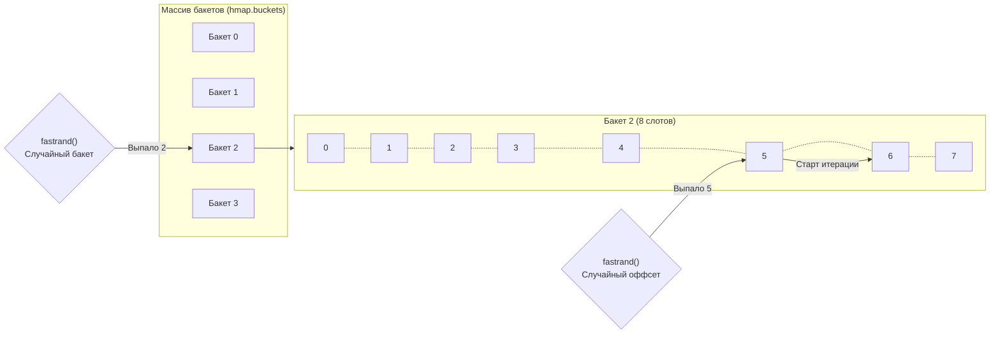

Если вы напишете простейший код, который кладет в мапу три ключа и выводит их через цикл `for k, v := range m`, а затем запустите его несколько раз, вы заметите странность.
Порядок ключей будет меняться. Сегодня это `A, B, C`, через секунду `B, C, A`, затем `C, A, B`. 

Каждый разработчик быстро усваивает правило: **порядок ключей в мапе не гарантирован**. Но Senior-инженер должен задать вопрос: *как именно* рантайм достигает этой случайности, и главное — зачем он тратит на это драгоценные такты процессора?

## Природа хэш-таблиц: Иллюзия порядка

Любая хэш-таблица по своей математической природе не упорядочена. Элементы распределяются по бакетам (см. [[31. Внутреннее устройство map. hmap, bmap, эвакуация.md]]) на основе хэш-функции.

Если вы вставите ключи "Alice", "Bob" и "Charlie", они могут попасть в бакеты 5, 1 и 7 соответственно. Если бы мы просто итерировались по памяти от нулевого бакета к последнему, мы бы всегда получали порядок "Bob", "Alice", "Charlie". 

В ранних версиях Go (до версии 1.3) так и было. Порядок итерации не был отсортирован по алфавиту или времени добавления, но он был **стабильным** в рамках одного запуска приложения, если мапа не менялась.

## Закон Хайрама (Hyrum's Law)

Стабильность итерации сыграла с разработчиками злую шутку. 
В программировании существует эмпирическое правило, названное в честь инженера Google Хайрама Райта:

> *«Если у вашего API есть достаточное количество пользователей, то неважно, что именно вы обещаете в контракте: любое наблюдаемое поведение вашей системы станет зависимостью для кого-то из пользователей.»*

В официальной спецификации языка Go было четко написано: "Порядок итерации по мапе не специфицирован". Но разработчики — люди ленивые и прагматичные. Они писали тесты, видели, что `range m` выдает `["A", "B", "C"]` стабильно, и завязывали логику тестов (или даже бизнес-логику!) на этот конкретный порядок.

Когда команда Go попыталась улучшить хэш-функцию мапы (чтобы сделать её быстрее), это привело к изменению распределения ключей по бакетам. В результате сотни тысяч тестов по всему миру упали, потому что код неявно полагался на "случайный, но стабильный" порядок.

## Решение Go: Принудительная случайность

Чтобы разработчики физически не могли завязаться на порядок итерации, создатели Go приняли радикальное решение: **сделать итерацию явно и агрессивно случайной**.

Каждый раз, когда вы вызываете `for k, v := range m`, компилятор генерирует вызов функции рантайма `runtime.mapiterinit`. 
Эта функция делает две вещи:

1. **Случайный стартовый бакет:** Рантайм вызывает генератор псевдослучайных чисел `fastrand()`. С помощью полученного числа он выбирает случайный бакет, с которого начнется обход (например, бакет номер 3 из 8).
2. **Случайное смещение (Offset):** Выбрав стартовый бакет, рантайм снова использует `fastrand()`, чтобы выбрать смещение внутри бакета — от 0 до 7 (так как в бакете `bmap` ровно 8 слотов).

Итератор стартует с бакета 2, со слота 5. Он дочитывает бакет до конца (слоты 6, 7), затем переходит к бакету 3 (читая слоты 5, 6, 7, 0, 1, 2, 3, 4 — *смещение сохраняется для всех бакетов*), затем перепрыгивает на бакет 0, затем на 1, пока не обойдет всю структуру.

> [!warning] Ловушка / Gotcha. Случайность не криптографическая
> Случайность итерации мапы создана исключительно для разрушения ожиданий программиста. `fastrand()` работает очень быстро, но не дает равномерного математического распределения. 
> Если вы хотите использовать мапу, чтобы "выбрать случайный элемент из словаря", делать `for k := range m { return k }` — это плохая идея. Распределение будет искажено (смещено) из-за пустых слотов и overflow-бакетов. Для честного рандома нужно сложить ключи в слайс (массив) и делать `slice[rand.Intn(len(slice))]`.

## Mechanical Sympathy. Цена случайности

Стоит ли эта случайность процессорного времени? 

Генерация чисел через `fastrand()` занимает единицы тактов (это побитовый сдвиг внутреннего состояния). Для обычного `range` это практически бесплатно по сравнению со стоимостью обхода указателей в куче.

Но если вы делаете микро-оптимизации в горячих циклах (Hot Paths), вы должны понимать:
* Итерация по слайсу — это аппаратная симпатия (Data Locality, линейное чтение, Prefetcher в CPU счастлив).
* Итерация по мапе — это всегда **Pointer Chasing** (прыжки по памяти) + накладные расходы на запуск `mapiterinit` + сложнейшая логика обхода X/Y развилок, если мапа прямо сейчас находится в состоянии эвакуации (как мы обсуждали в [[32. Рост и эвакуация map.md]]).

Итерация по мапе — это очень тяжелая операция для рантайма. По возможности избегайте полных обходов больших словарей в критических путях бэкенда.

## Итог

1. Итерация по мапе в Go намеренно рандомизирована при каждом запуске цикла `range`.
2. Это защита от **Закона Хайрама**: рантайм насильно заставляет разработчиков не закладываться на неопределенное поведение, сохраняя за создателями языка право менять алгоритмы хэширования под капотом.
3. Технически это реализовано через выбор случайного стартового бакета и случайного начального индекса (от 0 до 7) внутри этого бакета через функцию `fastrand()`.
4. Эта случайность "дешевая", но не криптографически честная (не подходит для алгоритмов равномерной случайной выборки).

Мы полностью разобрали стандартную мапу. Она невероятно быстрая для одной горутины, но, как мы помним, одновременное чтение и запись из разных потоков вызывает неизлечимый `fatal error`. 

Что если нам нужен глобальный In-Memory кэш на 32-ядерном сервере? Обернуть мапу в `sync.RWMutex` — значит убить производительность кэш-линий (False Sharing). Для решения этой чисто аппаратной проблемы инженеры Go создали отдельную lock-free структуру. 

В следующей статье мы разберем её магию: [[33.1. sync_map под капотом. Read и dirty словари.md]]