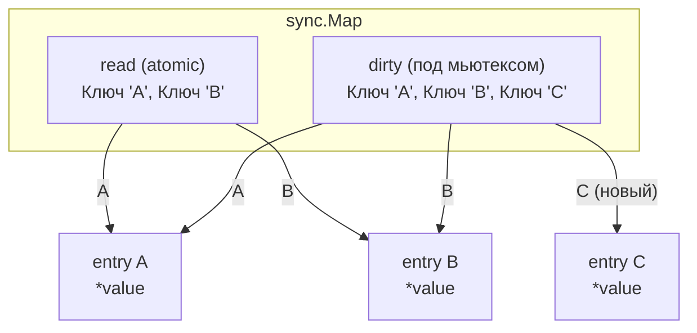

В прошлой статье ([[33. Почему iteration по map случайный.md]]) мы завершили разбор стандартной мапы. Мы знаем, что она невероятно быстра, пока работает в рамках одной горутины. Но как только мы пытаемся использовать её как глобальный in-memory кэш на многоядерном сервере, мы обязаны защитить её мьютексом.

И тут начинается проблема аппаратного уровня. Если 32 ядра процессора одновременно пытаются сделать `RLock()` для чтения из `map + sync.RWMutex`, они все пытаются инкрементировать один и тот же счетчик читателей. Это вызывает инвалидацию кэш-линий L1/L2 (False Sharing), и ядра простаивают, ожидая синхронизации шины памяти (подробнее в [[15. Mutex и RWMutex под капотом.md]]).

Чтобы решить эту проблему, в Go 1.9 добавили **`sync.Map`** — специализированную структуру для конкурентных словарей, которая в определенных сценариях работает вообще без блокировок (lock-free).

## 1. Архитектура: Два словаря

Секрет `sync.Map` в том, что внутри нее находится не одна, а **две** мапы.

```go
type Map struct {
	mu Mutex

	read atomic.Pointer[readOnly] // Быстрый словарь (только для чтения и атомарных обновлений)
	dirty map[any]*entry          // Медленный словарь (защищен мьютексом mu)

	misses int                    // Счетчик промахов
}
```

* **`read` (Словарь для чтения):** Это `atomic.Pointer`, который указывает на обычную встроенную мапу. Особенность в том, что мы **никогда не меняем ключи** в этой мапе напрямую (не добавляем новые). Мы можем только атомарно читать из нее или обновлять значения по *уже существующим* ключам. Доступ к `read` не требует захвата мьютекса.
* **`dirty` (Грязный словарь):** Это обычная мапа, доступ к которой строго защищен встроенным мьютексом `mu`. Сюда попадают все **новые** ключи.
* **`misses` (Промахи):** Счетчик, который растет каждый раз, когда мы не нашли ключ в `read` и были вынуждены пойти под мьютексом в `dirty`.

## 2. Структура `entry`: Указатели повсюду

В `sync.Map` ключи и значения хранятся не напрямую, как в обычной мапе, а через обертку `entry` (запись).

```go
type entry struct {
	p atomic.Pointer[any]
}
```

Это критически важно! И `read`, и `dirty` словари хранят **указатели на одни и те же объекты `entry`**. 
Если Горутина А атомарно меняет значение в `entry` через `read` словарь, Горутина Б мгновенно увидит это изменение через `dirty` словарь, потому что они смотрят на один и тот же физический адрес в памяти.



## 3. Чтение (Load): Жизнь без блокировок

Посмотрим, что происходит при вызове `m.Load("key")`:

1. **Fast Path:** Рантайм атомарно читает указатель на `read` словарь и ищет там ключ. Если ключ найден, он атомарно читает значение из `entry.p` и возвращает его. **Мьютекс не трогался, кэш-линии не инвалидировались. Скорость максимальная.**
2. **Slow Path:** Если ключа в `read` нет, возможно, это новый ключ, который недавно добавили в `dirty`. 
   * Рантайм захватывает мьютекс `mu`.
   * Делает **double-check** (проверяет `read` еще раз — вдруг другая горутина успела скопировать `dirty` в `read`, пока мы ждали мьютекс).
   * Ищет ключ в `dirty`.
   * Инкрементирует счетчик `misses` (промахов).
   * Отпускает мьютекс и возвращает результат.

## 4. Запись (Store): Атомарность или Мьютекс

Что происходит при вызове `m.Store("key", value)`:

1. **Fast Path (Обновление):** Ищем ключ в `read`. Если ключ есть (и он не был удален), мы делаем атомарный CAS (Compare-And-Swap) указателя внутри `entry.p`. Значение обновлено! Никаких мьютексов.
2. **Slow Path (Новый ключ):** Если ключа в `read` нет (или он помечен как удаленный):
   * Захватываем мьютекс `mu`.
   * Если ключа нет нигде, создаем новый `entry` и добавляем его **только в `dirty` словарь**.
   * Отпускаем мьютекс.

## 5. Повышение словарей (Promotion)

Мы выяснили, что новые ключи попадают только в `dirty`. Со временем `read` устаревает, и все чтения начинают проваливаться в `dirty`, захватывая мьютекс. Начинается деградация производительности.

Тут вступает в игру счетчик `misses` (промахи).
Каждый раз, когда чтение не находит ключ в `read`, `misses` увеличивается на 1.
Когда количество промахов становится равно длине `dirty` словаря (`misses >= len(dirty)`), происходит **Promotion (Повышение)**:

1. Мьютекс уже захвачен (так как мы были в `dirty`).
2. Рантайм просто берет указатель на `dirty` и атомарно записывает его в `read`! (Перезаписывая старый `read`).
3. `dirty` обнуляется (`nil`).
4. `misses` сбрасывается в `0`.

**Это операция за $O(1)$.** Мы мгновенно превратили медленный словарь в быстрый. Следующие чтения новых ключей пойдут по Fast Path.

> [!warning] Ловушка / Gotcha. Налог на добавление (Demotion)
> Если `dirty` стал `nil`, а мы хотим добавить *совершенно новый* ключ, рантайму нужно заново создать `dirty` словарь.
> Как он это делает? Он проходит циклом по всему `read` словарю и **копирует все неудаленные `entry` в новый `dirty`**.
> Это операция за **$O(N)$**. Если в вашей `sync.Map` миллион элементов, и вы постоянно добавляете новые уникальные ключи, каждый раз при пересоздании `dirty` ваш сервер будет испытывать чудовищные тормоза на копировании.

## 6. Три состояния удаления: nil и expunged

Самое сложное в `sync.Map` — это удаление (`Delete`).
Мы не можем просто удалить ключ из `read` мапы, потому что она предназначена только для безопасного конкурентного чтения. 
Поэтому `sync.Map` использует **Soft Delete (Мягкое удаление)**. 

Указатель `entry.p` может находиться в трех состояниях:
1. `*Value` — Указывает на реальные данные.
2. `nil` — Ключ удален (Soft Delete).
3. `expunged` (вычеркнут) — Специальный маркер, означающий, что ключ физически мертв.

**Зачем нужен `expunged`?**
Вспомним фазу копирования (когда `dirty` `nil` и мы создаем его из `read`). 
Если бы мы копировали в `dirty` ключи со значением `nil`, `dirty` словарь рос бы бесконечно, храня мусорные ключи.
Поэтому при создании нового `dirty` рантайм:
1. Проходит по `read`.
2. Если видит `nil`, он атомарно меняет его на `expunged` и **НЕ копирует** этот ключ в `dirty`.
3. В `dirty` попадают только живые ключи. 

Теперь, если вы захотите снова записать данные по ключу, который помечен как `expunged`, рантайм поймет: *"Ага, этого ключа нет в `dirty`!"*. Он захватит мьютекс, сбросит `expunged` на `nil`, добавит ключ обратно в `dirty` и запишет новое значение.

## Mechanical Sympathy: Когда использовать sync.Map?

Знание архитектуры дает нам четкие правила использования:

✅ **Идеальные сценарии (sync.Map уничтожает RWMutex):**
1. **Append-only кэши (Read-Heavy):** Ключи добавляются один раз (например, при инициализации или медленном прогреве), а затем читаются 99% времени. `dirty` быстро промовируется в `read`, и вся работа идет без блокировок.
2. **Disjoint Keys (Разделенные ключи):** Разные горутины работают с совершенно разными ключами (читают, пишут, удаляют). В этом случае `RWMutex` вызвал бы глобальную пробку, а `sync.Map` атомарно обновляет независимые `entry` в `read` словаре без взаимных блокировок.

❌ **Плохие сценарии (sync.Map медленнее обычного RWMutex):**
1. **Write-Heavy (Частая запись НОВЫХ ключей):** Если вы постоянно пишете новые (уникальные) ключи, вы постоянно промахиваетесь мимо `read`. Вы постоянно захватываете мьютекс для `dirty`, а главное — рантайм постоянно выполняет $O(N)$ копирование из `read` в `dirty`. Производительность упадет на дно.
2. **Предсказуемый размер:** `sync.Map` нельзя инициализировать с заранее заданным `capacity` (как `make(map, 1000)`). Она будет медленно расти через аллокации.

> [!tip] Собеседование. sync.Map vs map+Mutex
> Если вас спросят, что выбрать, смело отвечайте: "По умолчанию всегда `map + sync.RWMutex`. Я перейду на `sync.Map` только если профайлер (pprof) покажет жесткую деградацию (Lock Contention) на мьютексе при чтении, и мой паттерн нагрузки — это *Read-Heavy* или *Disjoint Keys*."

## Итог

1. **`sync.Map`** оптимизирована под многоядерные архитектуры, чтобы избежать инвалидации кэш-линий при частом чтении.
2. Она состоит из двух словарей: **`read`** (lock-free, обновляется атомарно) и **`dirty`** (защищен мьютексом, принимает новые ключи).
3. При частых промахах (`misses`) `dirty` мгновенно становится `read` ($O(1)$).
4. При появлении новых ключей `read` копируется в новый `dirty` ($O(N)$). Это самое узкое место структуры.
5. Удаление происходит мягко (атомарная подмена на `nil` или `expunged`), мусор очищается лениво при фазе копирования.

Мы завершили огромный блок, посвященный коллекциям и памяти: массивы, слайсы, словари и их конкурентные аналоги. Все они хранят какие-то данные.
Чаще всего в бэкенде этими данными являются строки. В Go строки таят в себе не меньше подвохов, чем слайсы: они иммутабельны, но при этом могут вызывать катастрофические утечки памяти.

В следующей статье мы разберем анатомию текста:
[[34. Внутреннее устройство string.md]]