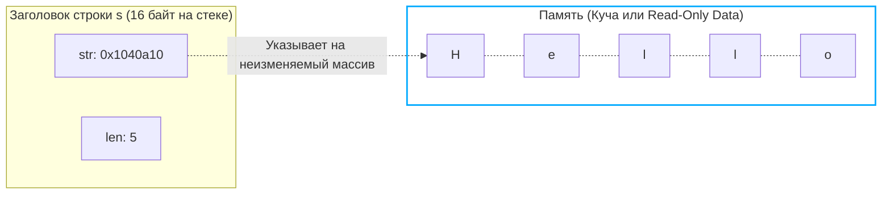

В прошлой статье ([[33.1. sync_map под капотом. Read и dirty словари.md]]) мы погрузились в мир lock-free программирования и конкурентных словарей. 
Большинство ключей в мапах, логах и JSON-ответах бэкенда — это текст. 

Строки (`string`) в Go кажутся самым простым типом данных. Мы склеиваем их плюсиками, передаем в функции и парсим регулярками. Но с точки зрения рантайма и аллокатора памяти, строка — это мина замедленного действия. 

Непонимание того, как устроены строки, приводит к OOM (Out Of Memory), повреждению многобайтовых символов (кракозябры) и диким тормозам при конкатенации. Пришло время разобрать анатомию текста в Go.

## 1. Анатомия строки: 16 байт

Как мы помним из [[29. Внутреннее устройство slice.md]], слайс занимает 24 байта (Pointer, Length, Capacity).
Строка — это "младший брат" слайса. На 64-битной архитектуре заголовок строки (`reflect.StringHeader` или внутренняя структура `stringStruct`) всегда занимает ровно **16 байт**.

```go
type stringStruct struct {
	str unsafe.Pointer // Указатель на первый байт массива (8 байт)
	len int            // Длина в БАЙТАХ (8 байт)
}
```

Чего здесь не хватает по сравнению со слайсом? **Capacity (Вместимости).**
Строке не нужна вместимость, потому что строки в Go **иммутабельны (неизменяемы)**. Их нельзя расширить (append), им нельзя изменить внутренние элементы. 



### Зачем нужна иммутабельность?
Многие новички бесятся: *"Почему я не могу сделать `str[0] = 'a'`?"*. 
Иммутабельность дает три гигантских преимущества:
1. **Thread-safety (Потокобезопасность):** Миллион горутин могут одновременно читать одну и ту же строку без мьютексов. Данные никогда не изменятся под капотом.
2. **Идеальный ключ для map:** Хэш строки никогда не изменится. Если бы строку можно было поменять, её хэш бы устарел, и мы бы потеряли элемент в мапе навсегда.
3. **Совместное использование памяти (Sharing):** Рантайм может переиспользовать одну и ту же память для тысяч одинаковых строк. Строковые литералы (например, `"hello"`, захардкоженные в коде) компилятор кладет в специальный Read-Only сегмент бинарника (`.rodata`). Они вообще не аллоцируются в оперативной памяти во время работы программы!

## 2. Ловушка UTF-8: Байты против Рун

Это самый частый вопрос на собеседованиях для Junior/Middle.

В Go **строка — это просто массив байт**. Рантайму абсолютно всё равно, что там лежит: текст, бинарный мусор или картинка.
Но *по умолчанию* Go предполагает, что текст закодирован в **UTF-8**.

В кодировке UTF-8 английские буквы весят 1 байт. А вот кириллица, китайские иероглифы или эмодзи (🚀) весят от 2 до 4 байт.

```go
func main() {
    s := "Привет"
    fmt.Println(len(s)) // Выведет 6? НЕТ! Выведет 12!
}
```
Функция `len(s)` возвращает **количество байт**, а не символов. Слово "Привет" (6 букв) в UTF-8 занимает 12 байт.

### Как получить количество символов?
Символ (Unicode Code Point) в Go называется **`rune`** (руна, алиас для `int32`).

**Плохой способ (аллокация):**
```go
runes := []rune("Привет") // Конвертация выделяет новый массив в куче!
fmt.Println(len(runes))   // 6. Верно, но мы сожгли CPU и память.
```

**Mechanical Sympathy (быстрый способ):**
```go
import "unicode/utf8"
count := utf8.RuneCountInString("Привет") // 6. Работает за O(N) без аллокаций!
```

> [!warning] Ловушка / Gotcha. Обрезка многобайтовых строк
> Если вы сделаете `s := "Привет"[:3]`, вы не получите "При". Вы "отпилите" 3 байта. Буква "П" (2 байта) влезет целиком, а от буквы "р" (2 байта) останется только половина. 
> При попытке вывести такую строку в консоль вы увидите кракозябру (replacement character ``), потому что валидность UTF-8 нарушена.
> Для обрезки по символам нужно использовать пакет `utf8` или предварительно конвертировать в `[]rune` (если строка небольшая).

## 3. Взятие подстроки (Slicing) и Утечки памяти

Взятие подстроки `s2 := s1[0:5]` работает точно так же, как со слайсами. **Новая память не аллоцируется**. Рантайм просто создает новый 16-байтный заголовок, который указывает на ту же самую область памяти.

И здесь кроется классический Memory Leak:
```go
func extractID(logLine string) string {
    // logLine весит 10 Мегабайт
    // Мы возвращаем строку из 5 байт:
    return logLine[10:15] 
}
```
Сборщик мусора **не удалит** 10-мегабайтный лог из памяти! Ваш крошечный 5-байтный возвращенный `string` (через `str` указатель) держит в заложниках весь огромный массив.

**Решение (Go 1.18+):**
```go
import "strings"
return strings.Clone(logLine[10:15]) 
```
`strings.Clone` принудительно аллоцирует новые 5 байт и копирует туда данные, отвязываясь от оригинального массива.

## 4. Конкатенация (Склеивание)

Поскольку строки иммутабельны, операция `a + b` **всегда** выделяет новый блок памяти размером `len(a) + len(b)` и побайтово копирует туда обе строки.

В Go конкатенация через `+` оптимизирована компилятором. Если вы пишете `a + b + c + d`, компилятор не создает промежуточные строки. Он заранее вычисляет общую длину, выделяет один кусок памяти и копирует туда 4 переменные (функция `runtime.concatstrings`).

Но если вы делаете это **в цикле** — это катастрофа:
```go
var result string
for _, v := range items {
    result += v // O(N^2) аллокаций и копирований памяти!
}
```

### Спаситель: strings.Builder

Для сборки текста в цикле был создан `strings.Builder`. 
Под капотом это просто структура с изменяемым слайсом `buf []byte`.

```go
var builder strings.Builder
builder.Grow(100) // Mechanical Sympathy: заранее выделяем память (Pre-allocation)
for _, v := range items {
    builder.WriteString(v) // Просто append к []byte, без мусора!
}
fmt.Println(builder.String())
```

> [!tip] Собеседование. Магия builder.String()
> **Вопрос:** Мы знаем, что конвертация `[]byte` в `string` всегда копирует память (ведь строка иммутабельна). Почему `builder.String()` работает за $O(1)$ без копирования и аллокаций?
> **Ответ:** `strings.Builder` использует "легальный хак" с пакетом `unsafe`.
> В исходниках `Builder` метод `String()` выглядит так:
> ```go
> return unsafe.String(unsafe.SliceData(b.buf), len(b.buf))
> ```
> Он берет базовый массив слайса и **без копирования** прикручивает к нему строковый заголовок (16 байт). Это безопасно, потому что `strings.Builder` запрещает прямой доступ к своему `buf` извне, гарантируя, что после вызова `String()` никто не сможет изменить эти байты через слайс.

## Итог

1. **Строка — это не массив символов.** Это 16-байтный дескриптор (Указатель + Длина в байтах), указывающий на неизменяемую (read-only) память.
2. Строки **иммутабельны**. Это обеспечивает потокобезопасность, стабильность хэшей для мапы и дешевое создание подстрок за $O(1)$.
3. Вызов `len()` возвращает **байты**. Для работы с человеческими символами используйте `unicode/utf8`.
4. Срез от гигантской строки удерживает её в куче. Используйте `strings.Clone()` для очистки памяти.
5. Для конкатенации в цикле используйте `strings.Builder`, который работает со слайсом байт и превращает его в строку за $0$ аллокаций через магию `unsafe`.

Мы часто упоминали, что строка — это отличный ключ для мапы, а пустой интерфейс (`interface{}`) позволяет класть в мапу что угодно. Но как именно работают интерфейсы? Почему `interface{}` в куче весит 16 байт, а не размер самой структуры? И что такое "Interface Boxing", о котором мы говорили в статьях про аллокации?

Пришло время открыть черный ящик системы типов Go. В следующей статье мы разберем: [[35. Интерфейсы под капотом. eface и iface]]