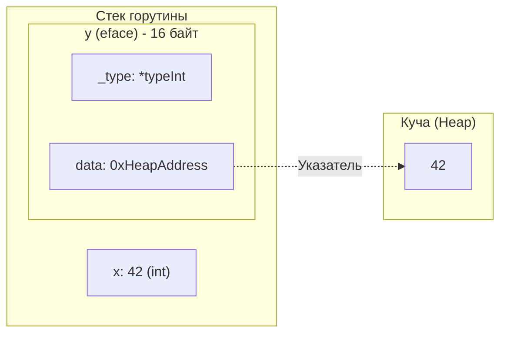
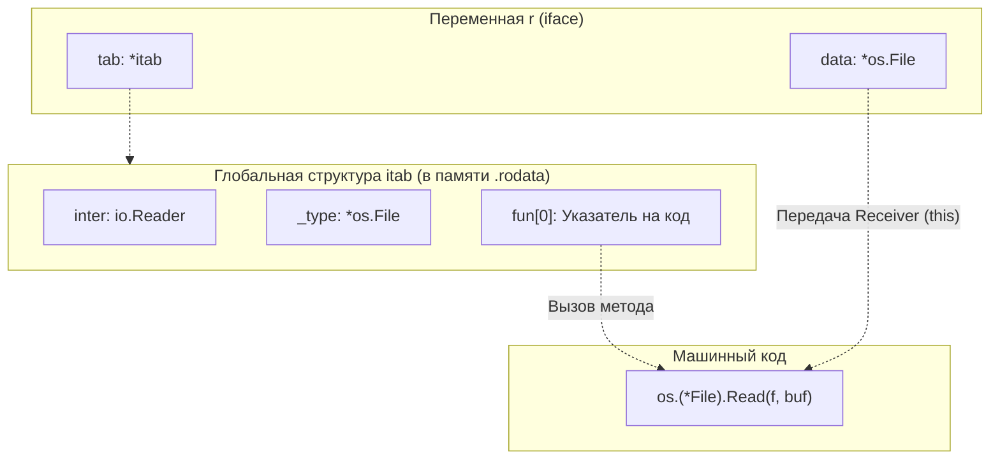

В прошлых статьях мы детально разобрали, как устроены базовые типы: массивы, слайсы, словари и строки. Они хранят конкретные данные. Но сила Go заключается в его системе типов, построенной вокруг **Интерфейсов (Interfaces)**.

Интерфейсы в Go — это утиная типизация (Duck Typing) с проверкой на этапе компиляции. Если тип реализует все методы интерфейса, он *автоматически* реализует сам интерфейс. Нам не нужно писать `implements MyInterface`.

Это невероятно удобно для разработчика. Но как это работает на уровне "железа"?
Как рантайм Go умудряется хранить в переменной типа `error` (которая является интерфейсом) и крошечную структуру на 8 байт, и гигантский `http.Response` на килобайты? И почему мы постоянно твердим о стоимости "упаковки в интерфейс" (Interface Boxing)?

Открываем исходники `src/runtime/runtime2.go`. На уровне рантайма интерфейсов не существует. Существует только две низкоуровневые структуры: **`eface`** и **`iface`**.

## 1. eface: Пустой интерфейс (interface{})

Начнем с самого простого — пустого интерфейса `interface{}` (или `any` в современных версиях Go).
В него можно положить абсолютно любой тип, потому что он не требует реализации ни одного метода.

На 64-битной архитектуре пустой интерфейс — это структура `eface`, которая всегда занимает ровно **16 байт**.

```go
type eface struct {
	_type *_type         // Указатель на метаинформацию о типе данных (8 байт)
	data  unsafe.Pointer // Указатель на сами данные в куче (8 байт)
}
```

* **`_type`:** Это указатель на глобальную статическую структуру, сгенерированную компилятором. Она содержит метаданные о типе: размер, выравнивание, как его хэшировать, как сравнивать (функция `equal`), и главное — содержит ли этот тип указатели (нужно ли его сканировать сборщику мусора).
* **`data`:** Указатель на физическое расположение данных. И вот здесь кроется главная проблема производительности.

### Interface Boxing (Упаковка в интерфейс)

Посмотрим на безобидный код:
```go
var x int = 42       // x лежит на стеке, занимает 8 байт
var y any = x        // Упаковка в eface!
```

Интерфейс обязан занимать 16 байт. Он не может положить число `42` прямо внутрь себя (у него есть только поле `data`, которое обязано быть указателем).
Поэтому, когда вы присваиваете `42` в интерфейс, происходит **Interface Boxing**:

1. Рантайм аллоцирует **в куче (Heap)** новые 8 байт памяти.
2. Копирует туда число `42`.
3. Записывает адрес этой новой памяти в поле `data` структуры `eface`.
4. Записывает указатель на тип `int` в поле `_type`.



Мы обсуждали эту проблему в [[18. Escape Analysis. Почему переменная ушла в heap.md]]. Передача простых типов (чисел, структур по значению) в функции, принимающие `any` (например, `fmt.Println(x)`), **гарантированно вызывает аллокацию в куче**. 

> [!tip] Оптимизация в Go (Zero-allocation any)
> Инженеры Go хитрые. Если вы передаете в интерфейс `byte` или `int` небольшого размера (например, от 0 до 255), рантайм **не делает аллокацию**. 
> В сегменте данных бинарника (read-only) заранее заготовлен статический массив всех чисел от 0 до 255. Если вы делаете `var a any = 5`, поле `data` просто будет указывать на ячейку `5` в этом глобальном массиве. Аллокация не произойдет! 

## 2. iface: Интерфейс с методами

Теперь посмотрим на настоящие интерфейсы с методами (например, `io.Reader`, `error`).
В рантайме они представляются структурой **`iface`**, которая тоже весит ровно **16 байт**.

```go
type iface struct {
	tab  *itab          // Указатель на таблицу интерфейса (8 байт)
	data unsafe.Pointer // Указатель на сами данные в куче (8 байт)
}
```

Поле `data` здесь работает точно так же, как в `eface`. Вся магия утиной типизации и динамического полиморфизма (Dynamic Dispatch) спрятана в поле **`tab`** (Interface Table, или `itab`).

### Анатомия itab

Структура `itab` — это мост между интерфейсом (какие методы требуются) и конкретным типом (где эти методы физически лежат в памяти).

```go
type itab struct {
	inter *interfacetype // Описание интерфейса (напр. io.Reader)
	_type *_type         // Описание конкретного типа (напр. *os.File)
	hash  uint32         // Хэш типа для быстрых проверок (Type Assertion)
	_     [4]byte
	fun   [1]uintptr     // Массив указателей на функции
}
```

* **`inter`:** Знает, что от интерфейса ждут метод `Read([]byte) (int, error)`.
* **`_type`:** Знает, что реальные данные — это `*os.File`.
* **`fun`:** Это самое главное. Это массив указателей на скомпилированный машинный код методов конкретного типа (`*os.File.Read`). Хотя размер массива заявлен как `[1]`, на самом деле он динамический. Если интерфейс требует 3 метода, компилятор положит сюда 3 указателя подряд.

Когда вы вызываете метод через интерфейс:
```go
var r io.Reader = myFile
r.Read(buf)
```
Процессор делает следующее:
1. Идет в структуру `iface` (переменная `r`).
2. Берет поле `tab` (указатель на `itab`).
3. Берет из `itab` поле `fun[0]` (указатель на реализацию `Read`).
4. Вызывает эту функцию, передавая ей поле `data` в качестве receiver'а (аргумента `this` / `self`).

Это называется **Virtual Method Call (Вызов виртуальной функции)**. 
Цена этого вызова — дополнительная операция разыменования указателя (Dereference). Это немного медленнее прямого вызова функции, но обычно не является бутылочным горлышком, так как процессор хорошо кэширует эту структуру (Branch Prediction).



## 3. Сборка itab: Когда компилятор молчит

Главная фишка утиной типизации — неявная реализация. Если тип `User` имеет метод `String()`, он автоматически реализует `fmt.Stringer`.
Как компилятор строит структуру `itab`, если нет слова `implements`?

* Если компилятор на этапе сборки видит, что вы присваиваете `User` в интерфейс `fmt.Stringer`, он **заранее** (во время компиляции) собирает структуру `itab` для этой пары.
* А что если это произойдет динамически во время работы программы (Runtime)? Например, при использовании пакета `reflect` или Type Assertion `x.(fmt.Stringer)`?

В этом случае рантайм генерирует `itab` "на лету" (On-the-fly).
Он берет метаданные типа, метаданные интерфейса и ищет совпадения по именам методов и сигнатурам (строки и типы аргументов). Это относительно медленная операция. 

> [!info] Кэширование itab
> Чтобы не тормозить программу при динамической генерации `itab`, рантайм кэширует все когда-либо созданные `itab` в глобальную хэш-таблицу (itabTable). Если эта пара (Интерфейс + Тип) уже встречалась, рантайм мгновенно достанет готовый `itab` из кэша.

## 4. Mechanical Sympathy: Ловушка "Nil Interface"

Это самая частая ошибка в Go, которая приводит к панике (Nil Pointer Dereference) в неожиданных местах.

```go
func getReader() io.Reader {
    var f *os.File = nil
    return f // Мы возвращаем nil указатель в интерфейс
}

func main() {
    r := getReader()
    if r == nil {
        fmt.Println("Reader пустой!")
    } else {
        fmt.Println("Reader не пустой!") // ВЫВЕДЕТ ЭТО!
    }
}
```

Почему `r != nil`, если мы вернули `nil`?
Давайте посмотрим на структуру `iface`, которую сгенерировал компилятор при `return f`:
* Поле `data` равно `nil` (потому что указатель `f` был `nil`).
* Поле `tab` **НЕ равно nil**! Оно указывает на глобальную структуру `itab`, которая говорит: "Внутри меня лежит тип `*os.File`".

**Интерфейс считается `nil` ТОЛЬКО тогда, когда ОБА его поля (`tab` и `data`) равны `nil`.**
Если `tab` заполнен (тип известен), интерфейс уже не `nil`, даже если данные под ним отсутствуют. 
Если вы попытаетесь вызвать `r.Read()`, программа упадет, потому что в реализацию `os.(*File).Read` будет передан `nil` в качестве receiver'а.

**Решение:** Если вы хотите вернуть пустой интерфейс, всегда возвращайте явно `nil`, а не переменную, содержащую `nil`.

```go
func getReaderSafe() io.Reader {
    var f *os.File = nil
    if f == nil {
        return nil // Возвращаем чистый (nil, nil) интерфейс
    }
    return f
}
```

## Итог

1. Интерфейсов в рантайме не существует. Есть две 16-байтные структуры: `eface` (пустой `any`) и `iface` (с методами).
2. **Interface Boxing:** Присваивание Value-типа (числа, структуры) в интерфейс всегда аллоцирует память в куче (чтобы взять на неё указатель для поля `data`).
3. **`itab` (Interface Table):** Это мост между интерфейсом и типом. Содержит указатели на реальные методы. Вызов метода через интерфейс идет через косвенное обращение к этой таблице.
4. **Утиная типизация:** `itab` генерируется компилятором заранее, либо рантаймом динамически (с кэшированием), сверяя имена методов.
5. **Nil Interface:** Интерфейс равен `nil`, только если в нем нет ни данных, ни типа. Типизированный `nil`-указатель, упакованный в интерфейс, делает интерфейс НЕ `nil`.

Мы разобрали внутреннее устройство интерфейсов и поняли, что за магией «утиной типизации» стоят конкретные структуры `iface` и `eface`. Но самое важное знание для инженера — это цена, которую мы платим за эту гибкость. Каждый раз, когда мы передаем данные в интерфейс, рантайм может незаметно для нас выделять память и нагружать Garbage Collector.

В следующей статье мы разберем «темную сторону» интерфейсов и научимся видеть невидимые аллокации: [[36. Interface Boxing и hidden allocation.md]]