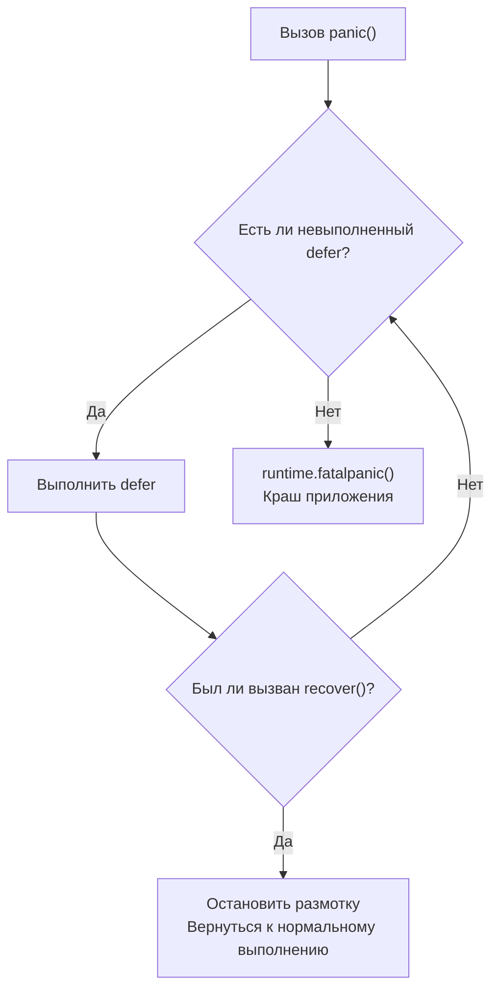

В прошлой статье ([[38. Unsafe.Pointer и нарушение гарантий языка.md]]) мы вышли за пределы безопасного Go, научившись манипулировать сырой памятью. Но даже в безопасном коде программы ломаются: нулевые указатели, выход за границы слайса, закрытые каналы. 

В отличие от C++ или Java с их громоздкими блоками `try/catch`, Go использует уникальную триаду для управления исключительными ситуациями: `defer`, `panic` и `recover`. 

Долгое время на собеседованиях считалось хорошим тоном говорить: *"Не используйте defer в горячих циклах, он медленный"*. Но рантайм Go эволюционирует. Чтобы писать современный и быстрый код, Senior-разработчик должен понимать, как именно компилятор превращает эти ключевые слова в машинные инструкции и почему старые мифы больше не работают.

## 1. Эволюция defer: От кучи к Zero-Cost

Когда вы пишете `defer f()`, вы говорите рантайму: *"Выполни эту функцию перед тем, как текущая функция вернет управление (return)"*. 
Исторически реализация этого механизма прошла три этапа оптимизации.

### Этап 1: Heap-allocated defer (до Go 1.13)
Раньше компилятор создавал тяжелую структуру `_defer` (содержащую указатели на функцию и её аргументы) и аллоцировал её **в куче (Heap)**. Эти структуры связывались в односвязный список (Linked List) для текущей горутины (`g._defer`). 
Это было чудовищно медленно из-за постоянных обращений к аллокатору и сборщику мусора. Именно тогда родилось правило "не писать defer в Hot Path".

### Этап 2: Stack-allocated defer (Go 1.13)
Инженеры поняли, что в 99% случаев `defer` выполняется в рамках жизненного цикла одной функции. Зачем ходить в кучу? Компилятор научился выделять структуру `_defer` прямо **на стеке горутины**, избегая аллокаций. Производительность выросла на 30%, но накладные расходы на поддержание связного списка оставались.

### Этап 3: Open-coded defer (Go 1.14+)
Это шедевр Mechanical Sympathy. Компилятор задал вопрос: *"Зачем вообще создавать структуры в рантайме, если я знаю, где находится defer на этапе компиляции?"*

Если в вашей функции нет сложных циклов с `defer` (до 8 defer'ов в прямом потоке выполнения), компилятор применяет **Open-coded defer (встроенный defer)**.
Он **физически вставляет (инлайнит)** вызовы ваших defer-функций прямо перед каждой инструкцией `return` в ассемблерном коде! 

```go
// Ваш код:
func do() {
    f, _ := os.Open("file.txt")
    defer f.Close()
    // работа с f
}

// Во что это превращает компилятор (упрощенно):
func do() {
    f, _ := os.Open("file.txt")
    // работа с f
    f.Close() // Вызов вставлен напрямую, ZERO накладных расходов!
    return
}
```

> [!info] Под капотом. Defer Bits
> Что если `defer` находится внутри блока `if`? Как компилятор перед `return` узнает, нужно ли вызывать `f.Close()`? 
> Для этого компилятор заводит на стеке одну невидимую 8-битную переменную — **Defer Bits**. 
> Когда выполнение проходит через строку `defer`, нужный бит устанавливается в `1` (одна дешевая битовая операция). Перед `return` компилятор проверяет эти биты по маске и вызывает только те функции, до которых дошел поток выполнения. 

**Вывод:** В современном Go `defer` в обычных функциях работает практически с **нулевыми накладными расходами (Zero-cost)**.

## 2. Анатомия panic: Размотка стека

`panic` — это не просто красивый вывод ошибки в консоль. На уровне исходников это вызов функции `runtime.gopanic`.

Что делает `gopanic`, когда ваш код делит на ноль или вы явно вызываете `panic("error")`?

1. **Создание структуры `_panic`:** Рантайм аллоцирует структуру с информацией об ошибке и прикрепляет её к текущей горутине (`g._panic`).
2. **Размотка стека (Stack Unwinding):** Рантайм берет связный список `_defer` текущей горутины (да, даже для open-coded defer рантайм умеет восстанавливать их список при панике) и начинает выполнять их в порядке **LIFO (Последним пришел — первым ушел)**.
3. **Обвал:** Если список `_defer` закончился, а паника не была остановлена, рантайм вызывает `runtime.fatalpanic`. Эта функция делает дамп стеков всех горутин, пишет их в `stderr` и завершает процесс (вызов `exit(2)` ОС). 



## 3. Магия recover: Как выжить при падении

Чтобы остановить `fatalpanic`, нужно использовать `recover`.
Вызов `recover()` транслируется в `runtime.gorecover`.

Эта функция делает одну очень простую вещь: она смотрит на верхнюю структуру `_panic` в горутине и устанавливает её внутренний флаг `recovered = true`. **Всё.**

Магия происходит после того, как ваша defer-функция завершается. 
Функция `gopanic` (которая всё это время ждала завершения defer) смотрит на этот флаг. Если `recovered == true`, `gopanic` понимает, что приложение спасено. 

Она не возвращает управление туда, где произошла паника (код уже сломан). Вместо этого она **манипулирует регистрами процессора (`SP` — указатель стека и `PC` — счетчик команд)**, заставляя процессор "прыгнуть" в то место, как если бы функция, в которой произошла паника, только что штатно завершила работу (сделала `return`).

> [!warning] Ловушка / Gotcha. Почему recover() работает только напрямую в defer?
> Если вы напишете так, `recover` не сработает:
> ```go
> defer func() {
>     func() { recover() }() // Вложенный вызов
> }()
> ```
> Почему? Функция `runtime.gorecover` жестко проверяет стек вызовов. Она ищет панику, которая связана **ровно с предыдущим фреймом стека** (с самим defer). Если вы спрячете `recover` во вложенную функцию, `gorecover` увидит несоответствие фреймов и вернет `nil`, позволив приложению упасть.

## 4. Mechanical Sympathy: Ловушки defer

Понимание того, как `defer` работает с памятью и стеком, убережет вас от классических багов.

### Ловушка 1: Момент вычисления аргументов
```go
func main() {
    i := 0
    defer fmt.Println(i) // Выведет 0 или 1?
    i++
}
```
**Ответ: 0.** Аргументы для отложенной функции вычисляются (копируются в структуру `_defer` или на стек) **в момент объявления** defer, а не в момент его выполнения.

### Ловушка 2: Именованные возвращаемые значения (Named Returns)
```go
func getError() (err error) {
    defer func() {
        err = fmt.Errorf("перехвачено: %v", err)
    }()
    return fmt.Errorf("оригинальная ошибка")
}
```
Инструкция `return` в Go **не атомарна**. Она состоит из двух шагов:
1. Запись значения в возвращаемую переменную на стеке (`err = "оригинальная ошибка"`).
2. Вызов функций `defer`.
3. Фактический возврат (сдвиг регистра `SP`).

Поскольку `defer` имеет доступ к именованной переменной `err` (через замыкание), он может изменить её *после* того, как сработал `return`. Эта функция вернет `"перехвачено: оригинальная ошибка"`. Это стандартный паттерн для оборачивания ошибок (wrapping) перед возвратом.

## Итог

1. **Defer** больше не медленный. В современном Go (1.14+) благодаря **Open-coded defer** компилятор инлайнит отложенные вызовы, сводя накладные расходы почти к нулю (используя битовые маски на стеке).
2. **Panic** — это контролируемая рантаймом размотка стека. Он последовательно извлекает и запускает структуры `_defer`.
3. **Recover** — работает только будучи вызванным напрямую внутри `defer`. Он устанавливает флаг остановки паники, заставляя рантайм восстановить регистры `SP` и `PC` и "сымитировать" нормальный выход из функции.
4. Аргументы `defer` вычисляются сразу, но отложенные функции могут изменять именованные возвращаемые значения.

Мы завершили изучение внутренних структур рантайма: от аллокатора и сборщика мусора до управления типами, памятью и исключениями внутри приложения. Но наша программа не существует в вакууме. Ей нужно читать файлы, отправлять HTTP-запросы в сеть и взаимодействовать с операционной системой. 

Любое взаимодействие с внешним миром — это Системный Вызов (Syscall). Как рантайм Go умудряется выполнять миллионы сетевых запросов, если системные вызовы блокируют потоки ОС? 

В следующей статье мы выйдем за пределы процесса Go и разберем:
[[40. Как runtime обрабатывает системные вызовы.md]]