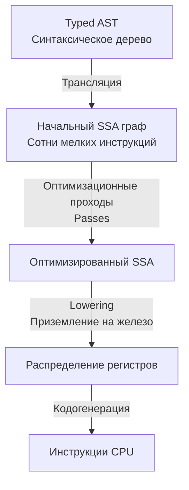

В [[3. Фазы компиляции. Lexer, Parser, Type Checker, SSA.md]] мы остановились на том, как компилятор превратил древовидную структуру (AST) в линейный граф промежуточного представления (IR). Теперь наступает этап, на котором Go-компилятор отрабатывает свою зарплату — фаза глубоких оптимизаций. 

Сердце этих оптимизаций — формат **SSA (Static Single Assignment)**. Понимание того, как компилятор манипулирует этим графом, отличает простого пользователя языка от инженера, который пишет код, интуитивно понятный процессору (Mechanical Sympathy).

## Что такое SSA и зачем он нужен

SSA — это свойство промежуточного кода, при котором **каждой переменной значение присваивается ровно один раз** (Static *Single* Assignment). 

В обычном коде мы можем переиспользовать переменные:
```go
x := 5
x = x * 2
x = x + 1
```

Для программиста это логично (экономим память). Для компилятора это кошмар, потому что переменная `x` меняет свое состояние во времени, и отследить ее жизненный цикл при сложном ветвлении (`if`/`else`) невероятно трудно. 

В форме SSA компилятор разворачивает этот код, создавая новые иммутабельные версии переменных:
```asm
v1 = const 5
v2 = mul v1, const 2
v3 = add v2, const 1
```



Почему это так важно? Потому что когда каждая переменная константна с момента создания, компилятор видит **чистый граф зависимости данных**. Если переменная `v3` дальше нигде не читается, компилятор мгновенно понимает, что `v3`, `v2` и `v1` можно просто выкинуть из итогового бинарника.

## Главные оптимизационные проходы (Passes)

Как только код переведен в SSA, компилятор прогоняет его через цепочку из более чем 40 проходов (passes). Рассмотрим самые важные для производительности.

### 1. DCE (Dead Code Elimination)
Если результат вычислений не влияет на возвращаемое значение функции или побочные эффекты (запись в файл, сеть), компилятор безжалостно удаляет этот код. Это работает даже для сложных структур. Если вы собрали огромный JSON, но никуда его не отправили — в релизной сборке этого кода просто не будет, процессор не потратит на него ни такта.

### 2. CSE (Common Subexpression Elimination)
Устранение общих подвыражений. Если компилятор видит, что вы дважды вычисляете одно и то же, он сохранит результат в невидимую переменную и переиспользует его.

```go
// Ваш код:
a := x * y + 5
b := x * y + 10

// Как это видит SSA после CSE:
v1 = mul x, y
a = add v1, 5
b = add v1, 10
```

### 3. Nil-check Elimination
Когда вы разыменовываете указатель (`*ptr`), компилятор обязан вставить машинную инструкцию проверки на `nil`, чтобы в случае чего бросить панику (panic), а не уронить весь процесс ОС через `SIGSEGV`. Но проверки — это лишние ветвления, убивающие производительность конвейера CPU.
В SSA компилятор анализирует граф. Если вы уже обратились к `ptr.FieldA`, компилятор вставляет nil-check перед этим обращением. Но для всех последующих обращений к `ptr.FieldB` в этой же функции проверки будут удалены — компилятор математически доказал, что если мы дошли до второй строки, указатель точно не `nil`.

## Bounds Check Elimination (BCE)

Это **самая важная оптимизация** для Go-разработчика, пишущего высоконагруженный код. 

При каждом обращении к элементу слайса по индексу (`slice[i]`), рантайм Go вставляет проверку: не выходит ли `i` за пределы длины слайса. Если выходит — `panic: index out of range`. 
Под капотом слайса (см. [[29. Внутреннее устройство slice.md]]) это выглядит как дополнительные инструкции процессора (сравнение `CMP` и условный переход `JMP`). В горячих циклах это серьезный bottleneck.

Компилятор имеет специальный проход `prove`, который пытается математически доказать, что индекс всегда находится в безопасных границах, и вырезать эти проверки.

> [!warning] Ловушка / Gotcha. Неправильный код
> ```go
> func processBad(s []int) {
>     // Компилятор вставит 3 проверки границ!
>     _ = s[0] 
>     _ = s[1] 
>     _ = s[2] 
> }
> ```

> [!tip] Собеседование. Как помочь компилятору
> Чтобы включить BCE и убрать проверки, мы должны дать компилятору "подсказку", обратившись к максимальному индексу первым.
> ```go
> func processGood(s []int) {
>     _ = s[2] // Вставляется ОДНА проверка: len(s) > 2
>     // Для s[0] и s[1] компилятор через SSA докажет, 
>     // что если длина больше 2, то индексы 0 и 1 100% безопасны. 
>     // Проверки для них удаляются (BCE)!
>     _ = s[0] 
>     _ = s[1] 
> }
> ```
> Это классический паттерн Mechanical Sympathy в Go. Мы пишем код немного непривычно для человека, чтобы сгенерировать идеальный машинный код.

## Инструментарий. Заглядываем под капот

Как доказать, что компилятор действительно делает эти оптимизации? Разработчики Go оставили нам мощный инструмент для визуализации SSA-графа.

Если скомпилировать код с переменной окружения `GOSSAFUNC=ИмяФункции`, компилятор сгенерирует HTML-файл `ssa.html`, в котором покажет все 40+ фаз трансформации вашей функции.

```bash
GOSSAFUNC=main go build main.go
# Вывод: dumped SSA to ./ssa.html
```
Открыв этот файл в браузере, вы увидите матрицу, где каждая колонка — это шаг оптимизатора. Вы наглядно увидите, как на фазе `opt` удаляется мертвый код, а на фазе `prove` пропадают красные ветки проверок границ слайсов (BCE).

## Lowering и распределение регистров

Последний этап работы с SSA называется **Lowering** (приземление).
Платформонезависимые инструкции вроде `v3 = add v1, v2` заменяются на инструкции конкретной архитектуры. Например, для x86-64 это может превратиться в `ADDQ`.

Затем вступает в дело **Register Allocator**. Переменные SSA (`v1`, `v2`...) — это абстракция. У процессора нет бесконечных переменных, у него есть около 16 регистров общего назначения (RAX, RBX, RCX...). Аллокатор решает, какие переменные будут жить в быстрых регистрах CPU, а какие придется "вытеснить" (spill) в более медленную память на стек горутины.

## Итоги

1. **SSA (Static Single Assignment)** — это форма представления кода, где нет изменяемых переменных, а есть только направленный поток данных.
2. Благодаря SSA компилятор может легко находить и удалять мертвый код (DCE) и дублирующиеся вычисления (CSE).
3. **BCE (Bounds Check Elimination)** — критически важная фича для перформанса. Умный порядок обращения к элементам слайса помогает компилятору доказать безопасность и удалить лишние проверки из машинного кода.
4. В конце SSA-конвейера абстрактный граф приземляется на физические регистры конкретного CPU.

Именно на этапе Lowering наш красивый Go-код окончательно мутирует в суровые инструкции процессора. Чтобы уметь читать профилировщик (pprof) и понимать, куда уходит процессорное время, нам нужно понимать этот низкоуровневый язык. 

В следующей статье мы разберем, как выглядит конечный результат компиляции: 
[[5. Go assembler и внутренний ассемблерный синтаксис.md]]