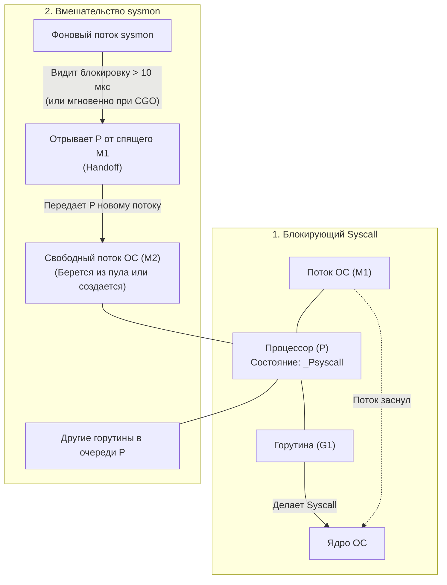

В прошлой статье ([[39. defer, panic и recover под капотом.md]]) мы изучили, как рантайм управляет потоком выполнения внутри самой программы. Но наша программа не существует в вакууме. Любое полезное действие — прочитать файл, отправить HTTP-запрос, записать лог или даже получить текущее время — требует взаимодействия с ядром операционной системы. 

Такое взаимодействие называется **Системным вызовом (Syscall)**. 

Для классического многопоточного программирования (например, в C++ или Java) системные вызовы — это норма. Поток делает сисколл, ядро ОС усыпляет этот поток, пока жесткий диск или сетевая карта не отдадут данные, а затем ОС будит поток.
Но для архитектуры Go с её M:N планировщиком (горутины поверх потоков ОС) блокировка потока ОС — это катастрофа. Если поток уснет, все горутины, привязанные к логическому процессору `P`, тоже уснут и перестанут обрабатывать запросы.

Как рантайм Go умудряется выполнять миллионы системных вызовов в секунду, не блокируя всё приложение? Рантайм делит сисколлы на две категории: умные (асинхронные) и глупые (синхронные).

## 1. Fast Path: Асинхронные вызовы и Netpoller

Если вы пишете HTTP-сервер, 99% ваших системных вызовов — это работа с сетью (Network I/O). 
Сеть непредсказуема. Мы можем ждать ответа от клиента миллисекунду, а можем минуту. Блокировать поток ОС на минуту — непозволительная роскошь.

Поэтому для работы с сетью Go использует **Неблокирующие системные вызовы (Non-blocking I/O)** в связке с механизмом операционной системы: `epoll` на Linux, `kqueue` на macOS и `IOCP` на Windows.
В Go эта подсистема называется **Netpoller**.

Когда ваша горутина делает `conn.Read()` (пытается прочитать данные из TCP-сокета):
1. Рантайм переводит сокет (file descriptor) в неблокирующий режим.
2. Делается сисколл `read`. Ядро мгновенно отвечает `EAGAIN` ("данных пока нет, не жди").
3. Вместо того чтобы блокировать поток `M`, рантайм регистрирует этот сокет в `epoll` (добавляет в Netpoller).
4. Горутина вызывает функцию `gopark` (паркуется) и переходит в состояние `_Gwaiting`. 
5. Поток `M` освобождается! Он берет из локальной очереди процессора `P` другую горутину и продолжает работать. **Никакой блокировки потока ОС не произошло.**

Кто же разбудит горутину? 
Фоновый поток рантайма (или планировщик во время поиска работы) периодически опрашивает `epoll`. Когда сетевая карта получает пакет, ядро ОС сообщает `epoll`, что сокет готов. Netpoller находит припаркованную горутину, вызывает `goready` и кладет её обратно в очередь выполнения. Горутина просыпается и забирает данные.

## 2. Slow Path: Синхронные вызовы и Handoff

Что делать с файловым вводом/выводом (Disk I/O) или вызовами CGO? Операционные системы (до появления `io_uring` в Linux) традиционно не предоставляют хороших неблокирующих интерфейсов для работы с обычными файлами. Сисколл `read` из файла гарантированно **заблокирует** поток ОС, пока диск не прочитает сектора.

Здесь вступает в игру механизм **Syscall Handoff (Передача процессора)**.

Когда горутина делает синхронный сисколл (например, `os.ReadFile` или вызов сишной функции через CGO), рантайм вызывает специальную функцию `entersyscall`.

1. Горутина переводит логический процессор `P` в состояние `_Psyscall`.
2. Поток `M` делает реальный системный вызов к ядру Linux и **намертво засыпает**.
3. Все остальные горутины в очереди этого `P` оказываются заблокированными!

Чтобы спасти остальные горутины, рантайму нужен "сторож". Эту роль выполняет **`sysmon`** (System Monitor).

### Фоновый страж: sysmon
`sysmon` — это уникальный поток в Go. Ему не нужен контекст `P` для работы, он работает напрямую поверх потока ОС `M`. Он просыпается каждые 20 микросекунд-10 миллисекунд и сканирует все процессоры `P`.

Если `sysmon` видит, что процессор находится в состоянии `_Psyscall` слишком долго (в современных версиях это проверяется очень быстро), он производит **Отрыв (Handoff)**:
Он забирает `P` у спящего потока `M1` и отдает его свободному потоку `M2` (если свободных нет, ОС порождает новый физический поток). Поток `M2` продолжает выполнять оставшиеся горутины.

> [!warning] Ловушка / Gotcha. Рост количества потоков ОС
> По умолчанию рантайм Go может создать до **10 000 потоков ОС** (переменная `GOMAXPROCS` контролирует только количество `P`, а не `M`). 
> Если вы сделаете 5000 одновременных горутин, каждая из которых сделает синхронный вызов (например, долгий вызов в базу данных через старый CGO-драйвер), `sysmon` оторвет 5000 процессоров и рантайм создаст 5000 физических потоков ОС! 
> Это убьет ваш сервер из-за перерасхода памяти на стеки потоков ядра и контекст-свитчей (Context Switches). Для таких задач всегда используйте паттерны с ограничением конкурентности (Worker Pools / Семафоры).

## 3. Возвращение из Ядра (exitsyscall)

Что происходит, когда диск, наконец, отдал данные, и ядро ОС разбудило поток `M1`?

Поток `M1` просыпается, но он голый. У него больше нет контекста `P` (его украл `sysmon` и отдал `M2`). Поток `M1` не может просто взять и продолжить выполнять горутину `G1`, так как без `P` нельзя трогать локальный кэш аллокатора (`mcache`) или другие структуры рантайма.

Вызывается функция `exitsyscall`:
1. `M1` пытается получить свой старый `P` обратно (если `M2` уже освободил его).
2. Если старый `P` занят, `M1` пытается украсть любой свободный `P` в системе (Idle P).
3. **Slow Path:** Если все `P` заняты, `M1` смиряется со своей судьбой. Он берет горутину `G1` и кладет её в **Глобальную очередь выполнения (Global Run Queue)**, чтобы её позже забрал какой-нибудь другой процессор. Сам поток `M1` засыпает и отправляется в пул свободных потоков (Idle M Pool).

## 4. Исключение из правил: vDSO (Virtual Dynamic Shared Object)

> [!tip] Собеседование. Почему time.Now() работает так быстро?
> **Вопрос:** Если каждый сисколл — это контекст-свитч в ядро (микросекунды задержки), как функция `time.Now()` (которая запрашивает время у ОС) умудряется отрабатывать за наносекунды и не усыпляет потоки?
> **Ответ:** Благодаря `vDSO`. 

`vDSO` — это хак операционной системы Linux. Ядро ОС маппит небольшую страницу своей памяти прямо в адресное пространство вашего User Space процесса. На этой странице лежат данные, которые часто нужны программам, но не требуют прав суперпользователя (например, текущее время).
Когда Go вызывает `time.Now()`, рантайм просто читает эту память как обычную переменную, **вообще не делая реального системного вызова (Context Switch в кольцо 0 не происходит)**. Это бесплатно для планировщика.

## Итог

1. **Netpoller (epoll/kqueue):** Используется для сети. Превращает блокирующие сокеты в неблокирующие. Горутина паркуется, поток ОС мгновенно берет другую горутину. Самый быстрый путь.
2. **Syscall Handoff:** Используется для диска и CGO. Поток ОС намертво блокируется в ядре.
3. **sysmon:** Фоновый поток, который спасает систему при блокировках. Забирает `P` у спящего `M` и передает его новому потоку, чтобы другие горутины не простаивали.
4. После возвращения из тяжелого сисколла поток пытается вернуть себе `P`, а если не может — отправляет горутину в глобальную очередь и уходит в пул свободных потоков.
5. **vDSO:** Оптимизация ядра ОС, позволяющая получать время (`time.Now()`) без реального системного вызова.

Мы упомянули, что вызовы C (CGO) работают по тяжелому пути (Handoff). Почему так? Почему вызов функции на языке C заставляет рантайм Go применять такие агрессивные меры, перестраивая потоки ОС?

Система типов Go и сборщик мусора живут по строгим правилам, а язык C эти правила игнорирует. Взаимодействие между ними — это опасный танец на границе двух миров.
В следующей статье мы разберем, как устроен этот мост:
[[41. cgo. Как Go взаимодействует с C.md]]