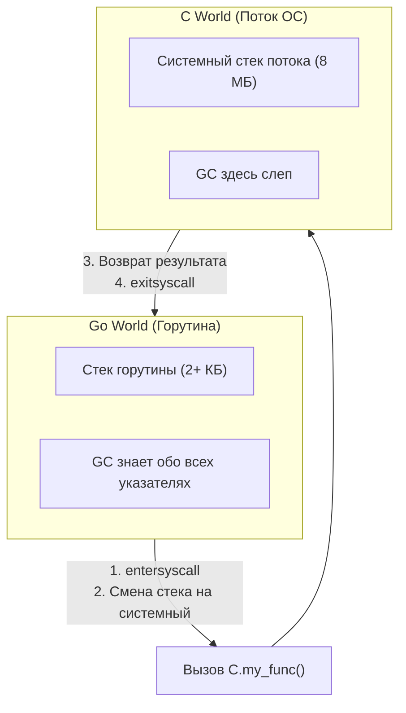

В прошлой статье ([[40. Как runtime обрабатывает системные вызовы.md]]) мы узнали, что рантайм Go панически боится блокировки потоков ОС и применяет агрессивный механизм Handoff (отрыв процессора `P`), если системный вызов затягивается. Мы также упомянули, что вызовы кода на языке C (через CGO) идут именно по этому «тяжелому» пути.

Почему? Язык C — это фундамент современных операционных систем. Огромное количество драйверов, библиотек (OpenCV, SQLite, криптография) и системных API написаны на C/C++. Переписывать их на чистый Go — задача на десятилетия. Поэтому в Go встроен механизм **CGO**, который позволяет вызывать C-код прямо из Go-кода.

Но за эту интеграцию приходится платить гигантскую цену. Знаменитая фраза Роба Пайка (одного из создателей Go) гласит: *"CGO is not Go"*. Давайте разберемся, почему мост между этими языками такой дорогой и как он устроен под капотом.

## 1. Магия синтаксиса: import "C"

Использование CGO выглядит как магия препроцессора. Вы пишете код на C прямо в комментариях над специальным импортом `import "C"`.

```go
package main

/*
#include <stdlib.h>
#include <math.h>

double custom_sqrt(double x) {
    return sqrt(x);
}
*/
import "C" // Этот импорт включает магию CGO
import "fmt"

func main() {
    // Вызываем C-функцию
    val := C.custom_sqrt(16.0)
    fmt.Printf("Корень: %f\n", val)
}
````

Когда вы запускаете `go build`, стандартный компилятор Go видит `import "C"` и останавливается. Он передает этот файл специальной утилите — **cgo**.

Утилита `cgo` распиливает файл на две части:

1. Вырезает C-код и отправляет его системному компилятору C (например, `gcc` или `clang`).
2. Генерирует промежуточные Go-файлы-обертки, которые умеют вызывать скомпилированный бинарный C-код, и отдает их компилятору Go.
3. Компоновщик (Linker) склеивает всё это в единый бинарник.

## 2. Разница миров: Стеки и Контекст

Почему нельзя просто сделать `CALL` к C-функции, как мы делаем с обычными Go-функциями?

Проблема в несовместимости фундаментальных архитектур.

1. **Стеки:** Как мы помним из [[11. Стек горутины. Рост и shrink стека.md]], стек горутины динамический. Он начинается с 2 КБ и может переехать в другой участок памяти.
	С-код ничего не знает про динамические стеки. Если С-функция попытается выделить много локальных переменных, она выйдет за пределы 2 КБ и разрушит память Go. Языку C нужен классический, большой стек потока ОС (обычно 8 МБ).
2. **Сборщик мусора:** C-код управляет памятью вручную (`malloc`/`free`). Он ничего не знает о Триколорном алгоритме, барьерах записи или эвакуации мап.

Поэтому для вызова C-кода рантайм Go должен выполнить сложнейший **Контекстный переход (Context Switch)**.

Фрагмент кода



**Анатомия вызова:**

1. Вызов заворачивается в функцию `runtime.cgocall`.
2. Горутина переводит свой процессор `P` в состояние `_Psyscall` (подготавливая его к Handoff).
3. Рантайм переключает выполнение с маленького стека горутины на большой системный стек (`g0`) текущего потока ОС `M`.
4. Выполняется C-функция.
5. После возврата рантайм вызывает `exitsyscall`, пытается вернуть процессор `P` (который мог быть украден `sysmon`) и переключается обратно на стек горутины.

Этот танец со стеками занимает около **50-100 наносекунд** просто на пересечение границы туда-обратно (без учета времени работы самой C-функции). Для сравнения, вызов обычной Go-функции занимает около **1-2 наносекунд**.

## 3. Налог на Планировщик (Sysmon Handoff)

Переход через границу — это еще не всё. Как мы обсуждали в предыдущей статье, любой CGO-вызов для планировщика выглядит как "непредсказуемый черный ящик".

Язык Go не может прервать (preempt) C-код. Если C-функция решает сделать `sleep(10)` или выполнить тяжелый криптографический расчет на 5 секунд, поток ОС будет заблокирован.

Поэтому фоновый поток `sysmon` безжалостно **отрывает процессор `P`** от потока, выполняющего CGO-вызов, и создает новый поток ОС, чтобы другие горутины могли продолжить работу.

Высоконагруженный цикл с быстрыми вызовами CGO приведет к **созданию тысяч потоков ОС (Thread Churn)** и убьет производительность сервера.

## 4. Память и Указатели: Смертельная зона

Поскольку Сборщик мусора (GC) в Go сканирует кучу, а C-код может удалять или изменять память напрямую, передача указателей через мост CGO строго регламентирована "Правилами передачи указателей CGO" (CGO Pointer Passing Rules).

### Правило 1: Можно передавать Go-указатели в C

Вы можете передать указатель на Go-слайс или строку в C-функцию (например, чтобы C-код записал туда данные). На время работы CGO-вызова рантайм Go "прикалывает" (pin) этот объект в памяти, чтобы GC не удалил его и не переместил.

### Правило 2: Запрещено передавать вложенные Go-указатели

Вы **не можете** передать в C структуру, которая содержит внутри себя другой Go-указатель (например, слайс строк или структуру с указателем на другую структуру). Если вы это сделаете, программа упадет с ошибкой `cgo argument has Go pointer to Go pointer`. C-код не имеет права владеть графами объектов Go.

### Правило 3: C-код не может сохранять Go-указатели

После того как C-функция завершила работу (сделала `return`), она **обязана забыть** все Go-указатели, которые ей передали. Она не может сохранить Go-указатель в глобальную C-переменную для дальнейшего использования. Как только вызов завершен, GC снова получает власть над памятью, и старый указатель превратится в тыкву.

### Решение: C.malloc и C.free

Если C-коду нужно долго хранить данные, вы должны аллоцировать память руками в C-куче.

```go
// Выделяем память вручную (вне зоны действия Go GC)
cStr := C.CString("Привет из Go")
// Обязаны освободить сами, иначе будет Memory Leak!
defer C.free(unsafe.Pointer(cStr)) 

C.save_string_in_c_global_var(cStr)
```

## 5. Почему "CGO is not Go"?

Использование CGO лишает вас главных преимуществ языка Go:

1. **Кросс-компиляция умирает:** Вы больше не можете просто сделать `GOOS=linux GOARCH=amd64 go build` на своем Макбуке. Вам нужен настроенный C-кросс-компилятор под целевую платформу со всеми заголовочными файлами библиотек ОС.
2. **Долгие сборки:** C-код компилируется медленно. Утилита `cgo` генерирует много промежуточного кода.
3. **Отсутствие статических бинарников:** Бинарник Go перестает быть самодостаточным. Он начинает зависеть от системной `libc` (динамическая линковка). Если `glibc` на вашем сервере старее, чем та, на которой вы компилировали, бинарник не запустится (ошибка `glibc not found`).
4. **Слепота профайлеров:** Инструменты `pprof` и встроенный `trace` не видят, что происходит внутри C-кода. Если у вас утечка памяти в `malloc`, Go-профайлер вам не поможет, придется использовать `valgrind`.

## Итог

1. **CGO** — это мост для вызова C-кода из Go, использующий утилиту генерации оберток и системный компилятор C.
2. Граница между языками очень "толстая": требуется смена стека с динамического на системный и вызовы `entersyscall/exitsyscall`.
3. CGO-вызовы блокируют потоки ОС, заставляя `sysmon` отрывать процессоры (Handoff), что может привести к взрывному росту потоков.
4. Передача памяти строго ограничена: C-код не может хранить Go-указатели или принимать вложенные указатели.
5. Использование CGO ломает кросс-компиляцию, статическую линковку и профилирование.

Мы несколько раз упоминали `sysmon` и планировщик, которые пытаются спасти горутины, когда одна из них заблокировалась в сисколле или CGO.

Как именно планировщик решает, кому отдать освободившийся процессор `P`, и как работают блокирующие вызовы на уровне самого планировщика?

В следующей статье мы углубимся в работу планировщика с системными вызовами:

[[42. Планировщик и блокирующие syscalls.md]]