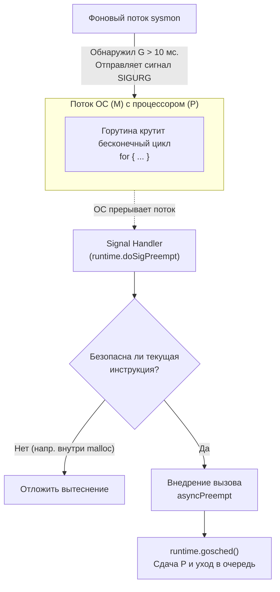

В прошлых статьях мы рассматривали ситуации, когда горутины отдают процессор `P` добровольно (или полудобровольно). Системные вызовы, чтение из сети, блокировка на мьютексе или канале — во всех этих случаях рантайм "знает", что горутина собирается уснуть, и планировщик переключает контекст. Это называется **Кооперативной многозадачностью (Cooperative Multitasking)**.

Но что, если программист напишет такой код:
```go
func main() {
    runtime.GOMAXPROCS(1)
    
    go func() {
        // Фоновая задача
        fmt.Println("Я работаю!") 
    }()

    // Бесконечный цикл без вызовов функций и аллокаций памяти
    for {
        // Чистая математика
        i := 0
        i++
    }
}
```

Фоновая горутина никогда не напечатает текст. Главная горутина захватит единственный процессор `P` и никогда его не отпустит, потому что в её цикле нет ни сетевых вызовов, ни каналов. 
Хуже того: Сборщик Мусора (GC) не сможет запуститься! Для фазы STW (Stop The World) рантайму нужно остановить *все* горутины. Если одна из них бесконечно крутится в цикле, GC будет ждать её вечно. Программа зависнет (или упадет по OOM).

Чтобы решить эту проблему, планировщик должен уметь отбирать процессор насильно. Этот механизм называется **Вытеснением (Preemption)**.

## Эра 1: Кооперативное вытеснение (до Go 1.14)

Создатели Go не хотели использовать классическое вытеснение потоков ОС (как в C++ или Java), потому что оно требует постоянного прерывания процессора по таймеру, что дорого и неэффективно для микро-горутин.

Поэтому до версии Go 1.14 вытеснение было "хитрым". Оно базировалось на проверках размера стека.

Как мы помним из статьи про стек горутины, компилятор вставляет в начало (пролог) каждой функции специальную инструкцию. Она проверяет, хватает ли горутине места на стеке (`SP < stackguard0`). Если места мало, вызывается `runtime.morestack` для роста стека.

Разработчики рантайма решили использовать этот механизм для вытеснения:
1. Фоновый поток `sysmon` (наш старый знакомый из предыдущей статьи) сканирует все процессоры.
2. Если он видит, что горутина выполняется непрерывно больше **10 миллисекунд**, он решает её вытеснить.
3. `sysmon` делает грязный хак: он записывает в переменную `stackguard0` этой горутины специальное константное "отравленное" значение (`stackPreempt`, равное `0xfffffffffffffade`).
4. Когда горутина вызывает **любую следующую функцию**, она проверяет стек. 
5. Видит огромное "отравленное" значение, думает: *"Ой, стек переполнен!"* и вызывает `runtime.morestack`.
6. Функция `morestack` внутри себя видит, что это не переполнение, а сигнал вытеснения. Она вызывает `runtime.gosched()`, отвязывает горутину от процессора `P` и кладет её в Глобальную очередь выполнения.

**В чем был фатальный недостаток?**
Вытеснение срабатывало **только при вызове функций**. 
Если ваша горутина крутила тяжелый `for`-цикл (например, обработка изображений, криптография или хэширование), в котором функции *встраивались (inlined)* компилятором, проверок пролога не было. Горутина становилась неубиваемой. Из-за этого задержки GC (GC Pauses) могли достигать секунд!

## Эра 2: Асинхронное вытеснение (Go 1.14+)

Проблему "залипающих циклов" нужно было решать кардинально. В Go 1.14 Остин Клементс (Austin Clements) реализовал **Некооперативное асинхронное вытеснение (Asynchronous Preemption)** на основе аппаратных прерываний операционной системы.

Теперь `sysmon` не ждет, пока горутина соизволит вызвать функцию. Он бьет кувалдой.



### Как работает прерывание (на примере Linux/macOS)

1. **Сигнал `SIGURG`:** `sysmon` замечает горутину-нарушителя (> 10 мс). Он использует системный вызов `tgkill`, чтобы отправить конкретному потоку ОС (`M`), на котором крутится горутина, сигнал `SIGURG`.
   *(Почему SIGURG? Это сигнал "urgent condition on socket". В отличие от SIGALRM или SIGUSR1, он почти никогда не используется пользовательскими приложениями, поэтому Go может безопасно забрать его себе).*
2. **Прерывание ОС:** Получив сигнал, операционная система мгновенно ставит поток ОС на паузу, в каком бы цикле он ни находился. Контекст процессора (регистры) сохраняется, и вызывается зарегистрированный обработчик сигнала Go — `runtime.doSigPreempt`.
3. **Safe Points (Безопасные точки):** Рантайм не может вытеснить горутину в любую секунду. Если прерывание произошло в момент, когда рантайм держит внутренний мьютекс или пишет в память через `unsafe`, вытеснение сломает сборщик мусора. Обработчик проверяет `PC` (Program Counter) и решает, безопасно ли вытеснение прямо сейчас.
4. **Внедрение (Hijacking):** Если точка безопасна, обработчик сигнала делает магию. Он изменяет сохраненные регистры потока так, чтобы при возврате из прерывания процессор пошел выполнять не ваш цикл, а специальную функцию `runtime.asyncPreempt`.
5. **Сдача процессора:** `asyncPreempt` аккуратно сохраняет состояние всех регистров (чтобы цикл потом смог продолжиться), отвязывает горутину от `P` и отправляет её в очередь выполнения.

**Результат:** Проблема "залипающих" циклов решена полностью. Задержки сборщика мусора (STW) стали предсказуемыми и микросекундными, независимо от того, какой код вы пишете.

> [!info] Под капотом. Windows и macOS
> На Linux и macOS используются POSIX-сигналы. А на Windows сигналов нет. Там `sysmon` использует функцию `SuspendThread`, чтобы заморозить поток, изменяет его контекст (регистр `RIP`) через `SetThreadContext` на функцию вытеснения, и вызывает `ResumeThread`. Идея та же, но через WinAPI.

## Mechanical Sympathy: Стоит ли бояться бесконечных циклов?

Начиная с Go 1.14, вам больше не нужно вручную вставлять `runtime.Gosched()` в тяжелые вычислительные циклы (как это делали раньше). Рантайм позаботится о вытеснении сам.

Но нужно понимать: **Асинхронное вытеснение — это дорого**.
Прерывание потока ОС сигналом, сохранение контекста, работа обработчика сигналов — это системные операции, которые сжигают тысячи тактов CPU. 

Если вы пишете систему реального времени или занимаетесь микро-оптимизациями, помните, что любая горутина, которая захватывает CPU дольше 10 миллисекунд, получит `SIGURG` по голове. Вычисления лучше дробить или использовать пулы воркеров (Worker Pools), чтобы горутины естественно блокировались на каналах (кооперативно), не заставляя `sysmon` стрелять прерываниями.

## Итог

1. **Кооперативное вытеснение (Go < 1.14):** Базировалось на проверках переполнения стека в прологах функций. Не работало для бесконечных циклов без вызова функций, блокируя GC и всё приложение.
2. **Асинхронное вытеснение (Go 1.14+):** Базируется на аппаратных прерываниях потоков ОС.
3. Фоновый поток `sysmon` отправляет сигнал `SIGURG` потоку, если тот работает > 10 мс.
4. Обработчик сигнала на лету подменяет `Program Counter`, заставляя горутину выполнить функцию `asyncPreempt` и отдать процессор `P`.
5. Благодаря этому механизму Go гарантирует "мягкое реальное время" (Soft Real-Time) для сборщика мусора и планировщика.

Мы завершили огромный блок, посвященный внутреннему устройству рантайма, памяти и планировщика. Мы видели, как компилятор вставляет вызовы `morestack`, как он преобразует `defer` и как он собирает `itab` для интерфейсов.

Но как исходный код в файлах `.go` превращается в исполняемый бинарный файл, который содержит в себе и наш код, и рантайм, и сборщик мусора? За это отвечают Компилятор и Линкер (Компоновщик).

В следующей статье мы выйдем за пределы рантайма и посмотрим на процесс сборки приложения:
[[44. Linker и Build Modes.md]]