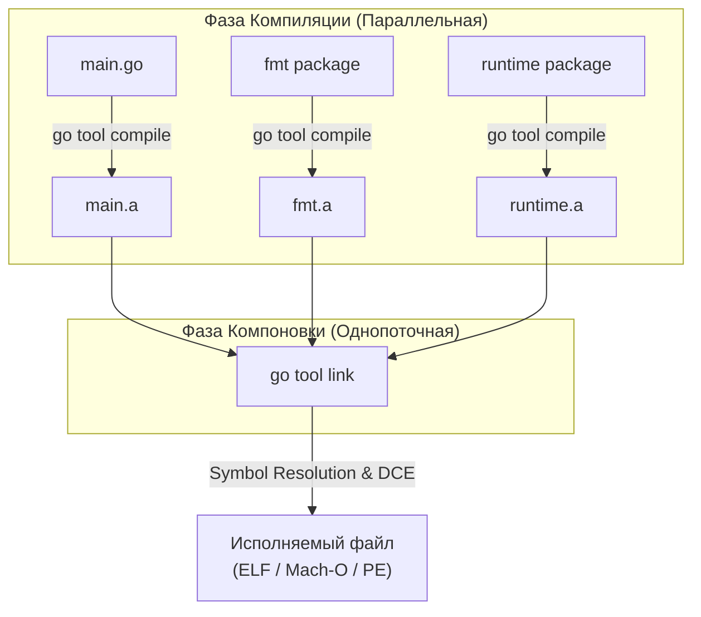

В прошлых статьях мы детально разобрали, как работает рантайм Go: от сборщика мусора и планировщика до вытеснения горутин ([[43. Preemption. Как Go останавливает горутины.md]]). Мы знаем, как программа выполняется. 

Но как исходный код в текстовых файлах `.go` превращается в тот самый единственный, независимый бинарный файл, который мы просто копируем на сервер и запускаем без установки зависимостей? 

За этот процесс отвечает цепочка сборки (Toolchain), в которой главную роль играют **Компилятор (Compiler)** и **Компоновщик (Linker)**. Понимание их работы позволяет Senior-разработчику управлять размером бинарника, внедрять версии при сборке и превращать Go-код в библиотеки для других языков.

## 1. Конвейер сборки: Compile -> Link

Когда вы пишете `go build main.go`, под капотом запускается несколько программ. Вы можете увидеть их, добавив флаг `-x` (`go build -x`).

1. **Компилятор (compile):** Работает на уровне **пакетов**. Он берет все `.go` файлы одного пакета, строит абстрактное синтаксическое дерево (AST), проводит оптимизации (Inlining, Escape Analysis) и генерирует машинный код. Результатом работы компилятора является **объектный файл** (архив `.a` для библиотек или `.o` для `main`). В этом файле код еще "сырой" — адреса вызовов функций других пакетов не заполнены (там стоят заглушки).
2. **Компоновщик (link):** Это финальный босс. Компилятор не знает ничего о других пакетах, кроме их интерфейсов. Линкер же берет объектный файл пакета `main`, все объектные файлы импортированных библиотек (например, `fmt`, `net/http`) и **сам рантайм Go** (`src/runtime`), и склеивает их в единый исполняемый файл.



## 2. Статическая линковка и жирные бинарники

Философия Go с самого начала звучала так: **"Один бинарник, чтобы править всеми"**. 
В отличие от C++ или Python, где программа часто зависит от динамических библиотек (DLL на Windows, `.so` на Linux), установленных в операционной системе, Go использует **Статическую линковку (Static Linking)**.

Линкер Go копирует *весь* необходимый машинный код (включая планировщик, GC и сетевые драйверы) прямо внутрь вашего исполняемого файла. 

**Плюсы:** "Zero dependencies". Вы можете скомпилировать бинарник на Ubuntu 22.04 и запустить его на древнем CentOS, и он будет работать, потому что ему не нужна системная `libc` (если выключен CGO).
**Минусы:** Размер файла. Даже банальный `Hello World` в Go весит около 2 мегабайт, потому что он тащит за собой весь рантайм.

## 3. Магия Линкера: Dead Code Elimination (DCE)

Если Go тащит в бинарник всё подряд, почему бинарники микросервисов весят 15–30 МБ, а не гигабайты?
Линкер делает важнейшую работу — **Удаление мертвого кода (Dead Code Elimination)**.

Представьте, что вы импортировали огромный пакет `net/http`, но использовали только функцию `http.ParseTime`. 
Линкер строит направленный граф вызовов (Call Graph), начиная с функции `main.main` и `runtime.main`. Он помечает все функции, глобальные переменные и структуры, до которых может дотянуться поток выполнения. 

Всё, что осталось непомеченным (тысячи функций из `net/http`, которые вы не вызывали), линкер **физически вырезает** и не включает в итоговый бинарный файл.

> [!warning] Ловушка / Gotcha. Рефлексия ломает DCE
> Линкер — это программа статического анализа. Он видит прямые вызовы `A()` вызывает `B()`.
> Но если вы используете `reflect` для вызова метода по строковому имени, линкер слепнет. Он не может доказать, что метод `C` никогда не будет вызван. Поэтому, если тип попал в рефлексию (или упакован в `interface{}`), линкер вынужден сохранить в бинарнике **все** методы этого типа "на всякий случай", что сильно раздувает размер файла.

## 4. Mechanical Sympathy: Флаги линкера (ldflags)

Senior-инженеры активно управляют поведением линкера через флаг `-ldflags` при сборке (`go build -ldflags="..."`).

### 1. Уменьшение размера бинарника (`-s -w`)
По умолчанию линкер внедряет в бинарник **Таблицы символов (Symbol Table)** и **Отладочную информацию (DWARF)**. Это нужно, чтобы `panic` мог напечатать красивые стектрейсы с номерами строк, а отладчик `dlv` мог шагать по коду.
Для Production-сборок в Docker-образах это часто не нужно.
```bash
# -s отключает таблицу символов
# -w отключает DWARF
go build -ldflags="-s -w" main.go
```
Это может уменьшить размер бинарника на 20-30%! (Правда, при панике вы увидите адреса памяти вместо номеров строк).

### 2. Внедрение переменных при сборке (`-X`)
Как вшить в бинарник номер версии (Git Commit) или время сборки без чтения конфигов?
Линкер умеет подменять значения глобальных строковых переменных в момент склейки!

В коде:
```go
package main
var Version = "dev"
func main() { fmt.Println("Version:", Version) }
```
При сборке:
```bash
go build -ldflags="-X 'main.Version=v1.2.3'" main.go
```

## 5. Build Modes: Не только исполняемые файлы

Go умеет собирать не только классические приложения. Флаг `-buildmode` меняет поведение линкера, заставляя его генерировать другие форматы файлов.

### A. `-buildmode=pie` (Position Independent Executable)
По умолчанию код компилируется для загрузки по фиксированным адресам памяти. В режиме `pie` линкер генерирует код, независимый от позиции. Это позволяет операционной системе использовать ASLR (Address Space Layout Randomization) — рандомизацию адресов при каждом запуске. Это стандартное требование кибербезопасности для защиты от эксплойтов.

### B. `-buildmode=c-shared` и `c-archive`
В статье про CGO ([[41. cgo. Как Go взаимодействует с C.md]]) мы вызывали C из Go. 
Но что если вы хотите написать быструю библиотеку на Go и использовать её в проекте на Python, Ruby или C++?

Режим `c-shared` заставляет линкер собрать ваш Go-код в классическую динамическую библиотеку `.so` (или `.dll` на Windows) и сгенерировать заголовочный файл `.h`. 

```go
package main
import "C"

//export MyAdd
func MyAdd(a, b C.int) C.int {
    return a + b
}
func main() {} // Обязателен, но не вызывается
```
```bash
go build -buildmode=c-shared -o libmath.so main.go
```
Вы получаете `.so` файл, который содержит внутри себя **весь рантайм Go**. Любая программа на C или Python может загрузить этот файл и вызвать `MyAdd`. При первом вызове рантайм Go незаметно инициализируется в отдельном потоке ОС, запустит планировщик, GC и выполнит вашу функцию!

## Итог

1. **Компилятор** переводит `.go` файлы в сырые объектные файлы (машинный код без привязки к адресам).
2. **Линкер (Компоновщик)** склеивает объектные файлы и рантайм в единый статический бинарник, разрешая адреса вызовов.
3. **Dead Code Elimination (DCE)** — механизм линкера, вырезающий неиспользуемые функции, чтобы бинарник не весил сотни мегабайт. (Рефлексия мешает DCE).
4. Флаги `-ldflags="-s -w"` позволяют сильно уменьшить бинарник, удалив DWARF и отладочные символы, а `-X` — внедрить переменные (версии) на этапе сборки.
5. **Build Modes** позволяют компилировать Go-код как `pie` для безопасности или как `.so` (`c-shared`) для интеграции в другие языки программирования.

Режим `c-shared` делает Go отличным инструментом для написания модулей для других языков. Но что если мы хотим сделать систему плагинов *внутри самого Go*? Можно ли скомпилировать кусок Go-кода отдельно, а затем подгрузить его в уже работающий сервер "на лету"?

В следующей статье мы разберем темную сторону модульности Go:
[[45. Plugins, Shared Libraries и ограничения Go.md]]