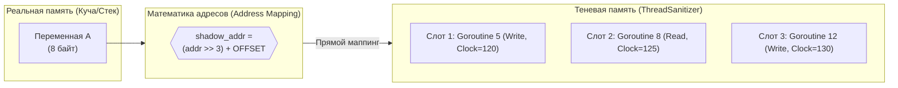

В прошлой статье ([[45. Plugins, Shared Libraries и ограничения Go.md]]) мы изучили процесс сборки и загрузки кода. До сих пор мы рассматривали работу программы так, будто она выполняется в вакууме предсказуемого потока команд. Но реальный Go-бэкенд — это тысячи горутин, одновременно обращающихся к разделяемой памяти.

Если две горутины обращаются к одной ячейке памяти без синхронизации (мьютексов, атомиков или каналов), и хотя бы одна из них осуществляет запись, возникает **Состояние гонки (Data Race)**. Это самый страшный и неуловимый баг в программировании. Он может не проявляться месяцами, а потом обрушить Production под специфической нагрузкой, выдав непредсказуемый мусор в данных.

Чтобы бороться с этим, в Go есть флаг `go run -race`. Он феноменально точно находит состояния гонки. Но как он это делает? Это не статический анализатор (он не читает ваш код в поисках ошибок). Это мощнейший рантайм-инструмент. Пришло время узнать, как компилятор "минирует" вашу память.

## 1. Не магия, а ThreadSanitizer

Инженеры Go не стали изобретать велосипед. Под капотом Race Detector в Go — это интеграция библиотеки **ThreadSanitizer (TSan)**, созданной в Google для C/C++ инфраструктуры (LLVM/Clang).

Рантайм Go содержит специальную версию библиотеки TSan, скомпилированную в машинном коде, и предоставляет ей интерфейсы для работы с горутинами вместо обычных POSIX-потоков.

Работа детектора гонок состоит из двух фундаментальных частей:
1. **Инструментирование кода компилятором.**
2. **Отслеживание доступов через Теневую память (Shadow Memory) в рантайме.**

## 2. Инструментирование (Compiler Instrumentation)

Когда вы собираете код с флагом `-race`, компилятор Go меняет свое поведение. Он проходит по абстрактному синтаксическому дереву вашей программы и **переписывает машинный код**.

Каждое обращение к памяти (чтение или запись) оборачивается в вызов специальных функций TSan.

**Ваш исходный код:**
```go
func updateCounter(p *int) {
    *p = *p + 1
}
```

**Во что его превращает компилятор с флагом `-race` (упрощенно):**
```go
func updateCounter(p *int) {
    runtime.raceread(unsafe.Pointer(p)) // TSan: Фиксируем чтение!
    tmp := *p
    
    tmp = tmp + 1
    
    runtime.racewrite(unsafe.Pointer(p)) // TSan: Фиксируем запись!
    *p = tmp
}
```

Это означает, что при каждой операции с памятью (даже простой математике) процессор теперь вынужден делать прыжок (Context Switch) в тяжелую функцию библиотеки ThreadSanitizer. Именно поэтому код с включенным `-race` работает **в 2–20 раз медленнее**.

## 3. Теневая память (Shadow Memory)

Как TSan понимает, что произошла гонка? Ему нужно хранить "историю" обращений к каждой ячейке памяти. 
Для этого используется концепция **Теневой памяти**.

При старте программы с `-race` рантайм резервирует гигантский кусок виртуальной памяти операционной системы. 
Для каждых 8 байт реальной памяти вашего приложения (Application Memory) TSan выделяет несколько ячеек в Теневой памяти (Shadow Memory) — обычно это учетверенный объем (до 32 байт тени на 8 байт реальности).



Когда горутина делает `racewrite(p)`, алгоритм работает так:
1. TSan берет реальный адрес указателя `p`.
2. С помощью простого побитового сдвига вычисляет адрес соответствующей ячейки в Теневой памяти.
3. Записывает в Теневую память **Метаданные**: 
   * ID текущей горутины.
   * Тип операции (Чтение или Запись).
   * Адрес инструкции (Program Counter), чтобы потом показать вам номер строки в коде.
   * **Временную метку (Vector Clock)**.

## 4. Векторные часы (Vector Clocks) и Happens-Before

Если в Теневой памяти записано, что Горутина 1 писала в переменную `A`, а потом Горутина 2 читала переменную `A` — это Data Race?
**Необязательно!** Если Горутина 1 записала данные, потом сделала `mutex.Unlock()`, а Горутина 2 сделала `mutex.Lock()` и только потом прочитала данные — это абсолютно легальный, синхронизированный код.

TSan должен понимать концепцию **"Happens-Before" (Происходит-До)**. Для этого используются **Векторные часы (Vector Clocks)**.
Это сложные математические счетчики событий. 

Компилятор инструментирует не только чтение и запись памяти, но и **все примитивы синхронизации** (`sync.Mutex`, `channel`, `sync.WaitGroup`, `atomic`).
Когда вы делаете `Unlock()`, TSan обновляет векторные часы. Когда другая горутина делает `Lock()`, она синхронизирует свои часы с этими обновленными часами.

**Алгоритм детектирования гонки (в момент обращения к памяти):**
1. Горутина 2 хочет прочитать переменную `A`.
2. TSan смотрит в Теневую память переменной `A` и видит там прошлую запись от Горутины 1.
3. TSan берет Векторные часы этой прошлой записи и сравнивает их с текущими Векторными часами Горутины 2.
4. Если между этими часами **нет связи Happens-Before** (то есть Горутина 2 не проходила через мьютекс или канал, оставленный Горутиной 1), TSan бьет тревогу: **WARNING: DATA RACE**.

> [!info] Под капотом. Ограничение в 8192 горутины
> В старых версиях Go (до 1.22) использование `-race` имело жесткое ограничение: Race Detector падал с ошибкой, если в программе одновременно существовало более 8192 горутин. 
> Почему? Каждая горутина требовала своего собственного слота в структуре Векторных часов TSan. Архитектура ThreadSanitizer (написанного для C-потоков) не была рассчитана на миллионы микро-потоков. В Go 1.22 рантайм обновили до новой версии TSan (v3), и этот лимит был значительно расширен, но память всё равно расходуется агрессивно.

## 5. Mechanical Sympathy: Правила использования -race

Знание архитектуры Race Detector диктует Senior-инженеру строгие правила его использования:

❌ **Никогда не запускайте бинарник с `-race` в Production!**
Это убьет ваш сервер. 
* CPU-нагрузка возрастает в 2-20 раз из-за постоянных прыжков в TSan на каждую операцию с памятью.
* Потребление оперативной памяти возрастает в 5-10 раз из-за выделения гигантских объемов Теневой памяти.

✅ **Где он должен работать:**
1. Локально при разработке (запуск тестов `go test -race`).
2. В пайплайнах CI/CD (Continuous Integration).
3. (Очень редко) На одном выделенном "Canary" сервере в стейджинге, на который пускают 1% реального трафика, чтобы выловить самые хитрые гонки, которые не покрыты тестами.

⚠️ **Слепота детектора:**
Race Detector — это динамический инструмент. Он не анализирует код! Он видит гонку **только если она реально произошла во время выполнения**. Если в вашем коде есть гонка в блоке `if err != nil`, но во время тестов ошибка ни разу не случилась — Race Detector ничего не найдет. 100% покрытие кода тестами критически важно для работы этого инструмента.

## Итог

1. **Race Detector** — это не статический анализатор, а обертка над C/C++ библиотекой ThreadSanitizer.
2. При компиляции с `-race` все чтения и записи в память оборачиваются в функции TSan (`raceread`, `racewrite`).
3. TSan использует **Теневую память (Shadow Memory)** для хранения истории последних обращений к каждому байту реальной памяти.
4. Синхронизация проверяется через **Векторные часы (Vector Clocks)**, которые обновляются мьютексами и каналами для построения графа "Happens-Before".
5. Из-за колоссальных накладных расходов (CPU и RAM) запуск с `-race` допустим только в тестовых средах, но это абсолютно незаменимый инструмент для поиска многопоточных багов.

Мы научились находить баги в конкурентном коде. Но что, если багов нет, а приложение работает медленно? Почему `GOMAXPROCS=8`, а CPU утилизирован только на 30%? Почему сборщик мусора "залипает"?

Для ответов на эти вопросы в Go встроена тяжелая артиллерия — системы профилирования. В следующей статье мы разберем, как они работают:
[[47. Pprof, Trace и внутренние механизмы профилирования.md]]