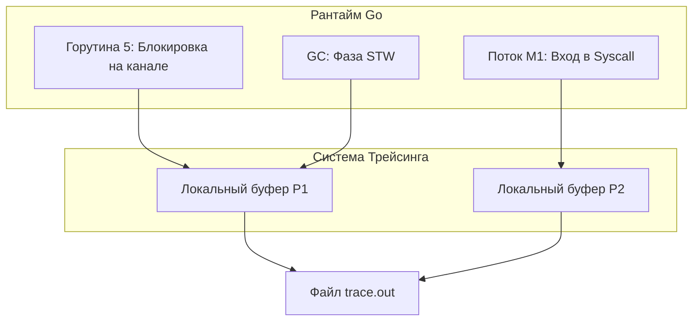

В прошлой статье ([[46. Race Detector под капотом.md]]) мы выяснили, как компилятор переписывает машинный код для поиска состояний гонки. Race Detector находит логические ошибки (баги). Но что делать, если багов нет, а сервис просто работает медленно? Почему `GOMAXPROCS=16`, а утилизация процессора не превышает 20%? Куда утекают гигабайты оперативной памяти?

Для ответа на эти вопросы в стандартную библиотеку Go встроена тяжелая артиллерия — системы профилирования **pprof** и **Execution Trace**.

В других языках (например, Java или Node.js) подключение профайлера к Production-серверу часто требует перезапусков, установки агентов и влечет чудовищные накладные расходы (Overhead). В Go профайлеры спроектированы так, чтобы работать в Production постоянно. Давайте разберем, как рантайму это удается.

## 1. Профилирование CPU: Механика сэмплинга

Когда вы запускаете CPU-профайл (`go tool pprof http://localhost/debug/pprof/profile`), рантайм Go не начинает оборачивать каждую вашу функцию в таймеры (это убило бы производительность). Он использует механизм **Сэмплинга (Sampling)** на базе прерываний операционной системы.

**Как это работает под капотом:**
1. Рантайм делает системный вызов `setitimer` (на Linux), прося ядро ОС отправлять текущему процессу сигнал **`SIGPROF`** ровно **100 раз в секунду** (каждые 10 миллисекунд).
2. Ядро ОС прерывает случайный поток (M), выполняющий Go-код, и заставляет его выполнить обработчик сигнала (`sigprof` в рантайме Go).
3. Обработчик сигнала `sigprof` смотрит на текущую горутину и записывает её **Stack Trace (Стек вызовов)** и текущий `Program Counter` (адрес выполняемой инструкции).
4. Затем поток возвращается к своей нормальной работе.
5. Через 30 секунд профайлер собирает эти 3000 "фотографий" стека и агрегирует их.

Если функция `CalculateHash` встречается в 1500 сэмплах из 3000, профайлер делает статистический вывод: эта функция занимает 50% процессорного времени.

**Overhead:** Около 1–5%. Это настолько дешево, что Senior-инженеры оставляют эндпоинты `/debug/pprof` открытыми во внутренней сети Production-серверов 24/7.

## 2. Профилирование памяти: Иллюзия перехвата

Memory Profiler (`/debug/pprof/heap`) показывает, где ваша программа аллоцирует память.
Но аллокаций могут быть миллионы в секунду. Если записывать каждую, сервер остановится.

Здесь снова работает сэмплинг, но уже на уровне аллокатора (`mcache/mcentral`, которые мы разбирали в [[21. Аллокатор памяти Go. mcache, mcentral, mheap.md]]).

В рантайме есть глобальная переменная `MemProfileRate`, которая по умолчанию равна **512 KB**.
Это значит, что профайлер записывает стек вызовов **в среднем на каждые 512 Килобайт выделенной памяти**.
* Если функция выделяет по 1 байту в цикле, профайлер запишет примерно 1 вызов из 500 000.
* Если функция выделяет сразу слайс на 2 МБ, профайлер запишет её гарантированно несколько раз.

Когда вы смотрите в Heap Profile, вы видите два главных среза:
* **`alloc_objects` / `alloc_space`:** Вся память, выделенная за время жизни программы. Помогает найти места, которые постоянно генерируют мусор и нагружают Garbage Collector (даже если объекты быстро удаляются).
* **`inuse_objects` / `inuse_space`:** Память, которая выделена и **прямо сейчас "жива"** (не собрана GC). Помогает искать Memory Leaks (утечки памяти), например, забытые элементы в глобальной `sync.Map`.

## 3. Block и Mutex профилирование: Поиск бутылочных горлышек

CPU-профайл показывает, чем занят процессор. Но что если CPU простаивает, а приложение тормозит? Это означает, что горутины спят!

1. **Mutex Profile:** Анализирует **Lock Contention (Спор за блокировки)**. Когда горутина пытается взять `sync.Mutex`, но он уже занят, она засыпает. Когда мьютекс освобождается, рантайм замеряет, сколько времени горутина спала, и записывает этот стек вызовов. Позволяет найти мьютексы, которые превращают многопоточный код в однопоточный. *(По умолчанию выключен, нужно включать через `runtime.SetMutexProfileFraction`).*
2. **Block Profile:** Анализирует, где горутины блокируются на **каналах, `sync.WaitGroup` и `select`**. *(По умолчанию выключен, включается через `runtime.SetBlockProfileRate`).*

## 4. Execution Tracer: Микроскоп для планировщика

`pprof` отвечает на вопросы **"Что?"** и **"Где?"**. Но он слеп к оси времени. Он не может показать, что функция A заблокировала функцию B, или что Garbage Collector вызвал STW паузу на 5 миллисекунд.

Для анализа причинно-следственных связей и задержек (Latency) существует **Execution Tracer** (`go tool trace`).

**Как он работает:**
В отличие от `pprof` (сэмплинга), Tracer — это **инструментирование событий (Event Tracing)**.
Внутри исходного кода рантайма Go расставлены хуки (зацепки). Каждый раз, когда:
* Создается, паркуется или разблокируется горутина;
* Процессор (`P`) крадется `sysmon`'ом или делает Syscall;
* Сборщик мусора начинает фазы Mark Setup или Mark Termination;

...рантайм генерирует микро-событие с точной наносекундной меткой времени (Timestamp) и складывает его в локальный кольцевой буфер процессора `P`. Когда буфер заполняется, он сбрасывается в итоговый бинарный файл трейса.

**Overhead Tracer'a:** Гораздо выше, чем у `pprof` (около 10-20% нагрузки на CPU). Он генерирует огромные файлы (десятки мегабайт за секунду работы). Трейсинг в Production собирают крайне редко и только на 1-2 секунды, чтобы локализовать аномалию.

Загрузив файл в `go tool trace`, вы увидите интерактивный таймлайн в браузере. Вы сможете своими глазами увидеть "Смертельную спираль GC" или как `sysmon` отрывает `P` от потока ОС — всё то, о чем мы говорили в предыдущих статьях.

## 5. Mechanical Sympathy: goroutine profile и ловушка STW

Есть один эндпоинт, который часто используют неправильно: `/debug/pprof/goroutine?debug=2`. Он выдает текстовый дамп стеков всех горутин, существующих в системе.

Это отличный инструмент для поиска "зависших" горутин (Goroutine Leaks), которые заблокированы на мертвом канале или вечно ждут ответа от базы данных без таймаута.

> [!warning] Ловушка / Gotcha. Дамп горутин и STW
> Чтобы сделать согласованный снимок всех стеков, рантайм вынужден инициировать фазу **Stop The World (STW)**. Все до единой горутины вашего сервера будут поставлены на паузу, пока профайлер обходит их стеки.
> Если у вас на сервере 5 000 горутин — это микросекунды, никто не заметит.
> Но если у вас утечка горутин, и их скопилось **2 миллиона**, запрос к `/debug/pprof/goroutine` вызовет STW паузу на несколько секунд! Ваш балансировщик (Nginx/HAProxy) решит, что сервис "умер", откинет его из пула и направит весь трафик на соседний сервис, вызвав каскадное падение кластера. Никогда не делайте дамп горутин вслепую на тяжело больных серверах.

## Итог

1. **`pprof` (CPU & Memory)** использует сэмплинг (прерывания ОС и статистику аллокатора), имеет минимальный overhead и должен быть включен в Production всегда.
2. **Mutex и Block профилирование** помогает искать узкие места в многопоточной логике (ожидания на замках и каналах).
3. **Execution Trace** записывает наносекундную хронологию работы планировщика и GC. Он дорогой, генерирует тяжелые файлы, но незаменим для анализа задержек (Latency) и "залипаний".
4. Снятие полного дампа горутин (`goroutine profile`) вызывает Stop The World и может быть опасно при миллионах зависших горутин.

Мы завершили огромный путь. От битов и указателей мы поднялись к сборщику мусора, планировщику, сисколлам, компилятору и системам профилирования. Мы заглянули в самые темные уголки рантайма Go. 

Теперь пришло время собрать все эти шестеренки вместе и посмотреть, как они образуют единый, невероятно эффективный механизм. В финальной статье этого раздела мы нарисуем полную архитектурную картину языка Go:
[[48. Итоги раздела. Полная картина работы Go под капотом.md]]