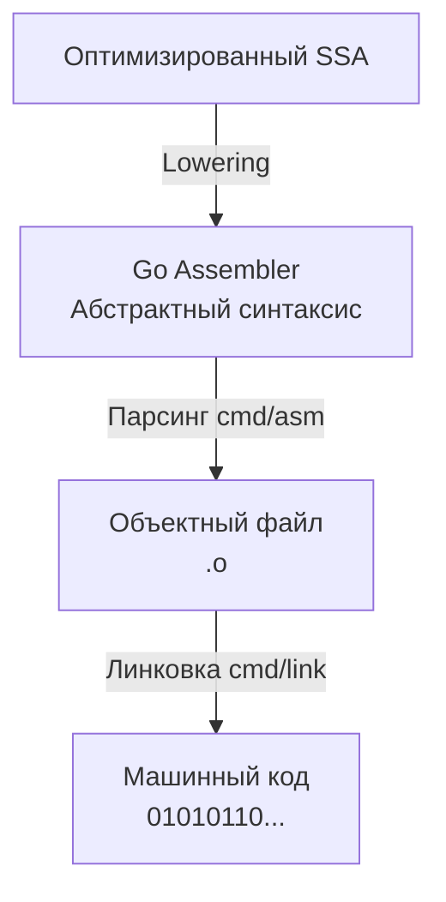

В прошлой статье ([[4. SSA в Go. Как компилятор оптимизирует код.md]]) мы остановились на фазе Lowering, когда платформонезависимый граф SSA опускается на уровень железа. Результатом этого этапа становится код на **Go Assembler**. 

Для инженера, стремящегося к уровню Senior/Lead, умение читать ассемблерный выхлоп компилятора — это суперсила. Это единственный способ со стопроцентной уверенностью доказать, сработала ли оптимизация (например, BCE или Inlining), ушла ли переменная в кучу (Escape Analysis) и не сгенерировал ли компилятор лишних инструкций в критическом для производительности цикле (hot path).

## Иллюзия нативного ассемблера

Первое, что шокирует разработчиков, знакомых с синтаксисом Intel или AT&T (используемых в C/C++) — ассемблер Go выглядит иначе. 

Ассемблер Go — это **псевдо-ассемблер**. Он базируется на синтаксисе ОС Plan 9 (над которой в Bell Labs работали создатели Go — Кен Томпсон и Роб Пайк). Компилятор не генерирует строгий машинный x86-64 или ARM код напрямую в виде текста. Вместо этого он генерирует промежуточное абстрактное представление, которое уже линковщик транслирует в конкретные опкоды (opcodes) процессора.



Такой подход дал языку потрясающую портируемость: разработчикам компилятора не нужно писать полностью новый текстовый парсер для каждой архитектуры (x86, ARM, MIPS, WebAssembly).

## Четыре всадника рантайма: Псевдо-регистры

Чтобы писать кроссплатформенный код, Go Assembler вводит концепцию **псевдо-регистров**. Это виртуальные регистры, которых физически не существует в кремнии вашего процессора. Компилятор и линковщик сами мапят их на реальные аппаратные регистры в зависимости от архитектуры (например, на `RAX`, `RSP` или `RBP` в x86-64).

Всего их четыре, и понимать их критически важно для чтения стека горутины:

1. `SB` **(Static Base):** Указатель на начало памяти программы. Используется для обращения к глобальным переменным и функциям. Вызов функции всегда выглядит как обращение к `SB` (например, `CALL pkg.MyFunc(SB)`).
2. `FP` **(Frame Pointer):** Указатель на фрейм (кадр) стека. Используется для обращения к аргументам функции и возвращаемым значениям, переданным через память.
3. `SP` **(Stack Pointer):** Указатель на вершину текущего стека (локального фрейма функции). Используется для доступа к локальным переменным.
4. `PC` **(Program Counter):** Указатель на следующую инструкцию, которую должен выполнить процессор (аналог `RIP` в x86). В пользовательском ассемблере почти не трогается вручную.

> [!warning] Ловушка / Gotcha. Два разных SP
> В Go Assembler существует два разных регистра с именем `SP`, и это ломает мозг новичкам:
> 1. Псевдо-регистр `SP`: Пишется с именем переменной, например `localvar-8(SP)`. Указывает на локальную переменную относительно вершины виртуального стека.
> 2. Аппаратный регистр `SP`: Пишется без имени переменной, например `-8(SP)`. Указывает на реальный регистр процессора `RSP`.
> Различать их можно только по наличию или отсутствию текстового префикса перед скобками!

## Синтаксис и суффиксы инструкций

В отличие от синтаксиса Intel (`ОПЕРАЦИЯ ПРИЕМНИК, ИСТОЧНИК`), ассемблер Plan 9 использует порядок AT&T: `ОПЕРАЦИЯ ИСТОЧНИК, ПРИЕМНИК`.

Размер данных указывается суффиксом в названии инструкции:
* `MOVB` (Byte) — 8 бит (1 байт).
* `MOVW` (Word) — 16 бит (2 байта).
* `MOVL` (Long) — 32 бита (4 байта).
* `MOVQ` (Quad) — 64 бита (8 байт).

Пример: инструкция `MOVQ $10, AX` означает «положить константу 10 (размером 64 бита) в аппаратный регистр AX».

## Анатомия ассемблерной функции

Давайте напишем примитивную функцию и посмотрим на ее ассемблерный выхлоп.
В консоли выполним команду: `go tool compile -S main.go`

```go
// main.go
package main

func Add(a, b int) int {
	return a + b
}
```

Выхлоп компилятора (упрощенно для понимания):
```asm
TEXT "".Add(SB), NOSPLIT|ABIInternal, $0-24
    FUNCDATA $0, gclocals·g2BeySu+wFnoycgXfElmcg==(SB)
    FUNCDATA $1, gclocals·g2BeySu+wFnoycgXfElmcg==(SB)
    MOVQ "".a+8(SP), AX
    MOVQ "".b+16(SP), CX
    ADDQ CX, AX
    MOVQ AX, "".~r2+24(SP)
    RET
```

Разберем первую, самую важную строку по частям: `TEXT "".Add(SB), NOSPLIT|ABIInternal, $0-24`

1. `TEXT`: Директива, объявляющая новую функцию (блок кода).
2. `"".Add(SB)`: Имя функции. Пустые кавычки `""` означают текущий пакет. `(SB)` показывает, что это глобальный символ, привязанный к Static Base.
3. `NOSPLIT`: Флаг для рантайма. Говорит планировщику: "Эта функция настолько мала, что не требует проверки на переполнение стека (stack bounds check)". Это серьезная микрооптимизация, экономящая такты CPU (подробнее разберем в [[11. Стек горутины. Рост и shrink стека.md]]).
4. `ABIInternal`: Указывает, какой бинарный интерфейс (конвенция вызовов) используется.
5. `$0-24`: Важнейшая часть! 
   * `$0` — размер локального фрейма (локальных переменных) в байтах. У нас их нет, поэтому 0.
   * `24` — суммарный размер аргументов (2 аргумента по 8 байт) и возвращаемого значения (1 возвращаемое значение на 8 байт). 8 + 8 + 8 = 24.

Далее идут инструкции:
* `MOVQ "".a+8(SP), AX` — берем аргумент `a` из памяти (со смещением 8 от `SP`) и кладем в регистр `AX`.
* `ADDQ CX, AX` — складываем.
* `MOVQ AX, "".~r2+24(SP)` — кладем результат обратно в память на место возвращаемого значения.

> [!info] Под капотом
> Директивы `FUNCDATA` и `PCDATA` (которые генерируются в большом количестве, но убраны из примера для краткости) — это метаинформация для Сборщика мусора (Garbage Collector). Ассемблер размечает, в каких регистрах лежат указатели (pointers), а в каких — обычные числа (scalars). Когда наступает фаза сборки мусора, GC сканирует стек функции и благодаря `FUNCDATA` точно знает, по каким адресам нужно переходить, чтобы не удалить живые объекты.

## Mechanical Sympathy. Стоит ли писать на Asm вручную?

В стандартной библиотеке Go (особенно в пакетах `crypto`, `math/bits`, `runtime`, `sync/atomic`) вы найдете тысячи строк `.s` файлов — ассемблерного кода, написанного людьми вручную. Это делается для использования специфичных инструкций процессора (например, аппаратного ускорения AES или AVX-512 для векторизации массивов).

Но писать бизнес-логику на ассемблере в 99.9% случаев **категорически запрещено**.

> [!tip] Собеседование. Почему ручной ассемблер делает код МЕДЛЕННЕЕ?
> На хардовом собеседовании могут спросить: "Вы переписали функцию на ассемблер, она выполняет меньше инструкций, но общий бенчмарк программы упал. Почему?"
> **Ответ:** Потеря Inlining (встраивания). Компилятор Go **не умеет инлайнить** функции, написанные на ассемблере. Если вы перепишете крошечную функцию на asm, каждый ее вызов из Go-кода будет сопровождаться полноценным созданием фрейма стека, сохранением регистров и сбросом конвейера процессора. Накладные расходы на сам вызов превысят любую пользу от ручной оптимизации инструкций.

## Итог

1. Go использует собственный кроссплатформенный псевдо-ассемблер, базирующийся на синтаксисе Plan 9.
2. Он опирается на 4 псевдо-регистра (`SB`, `FP`, `SP`, `PC`), которые абстрагируют реальное железо и структуру памяти программы.
3. Чтение ассемблера (`go tool compile -S`) — главный инструмент Senior-разработчика для профилирования узких мест и понимания того, как абстракции превратились в машинный код.
4. Ручной ассемблер запрещает инлайнинг и усложняет работу GC.

В примере ассемблерной функции выше мы видели, как аргументы доставались из памяти (`SP`), и я специально использовал устаревший вариант для простоты объяснения. 
Но начиная с Go 1.17, язык совершил колоссальный архитектурный прыжок в производительности — аргументы больше не передаются через память! Чтобы понять, как именно компоненты программы общаются друг с другом, в следующей статье мы разберем: 
[[6. ABIInternal и ABI0. Как Go вызывает функции.md]]