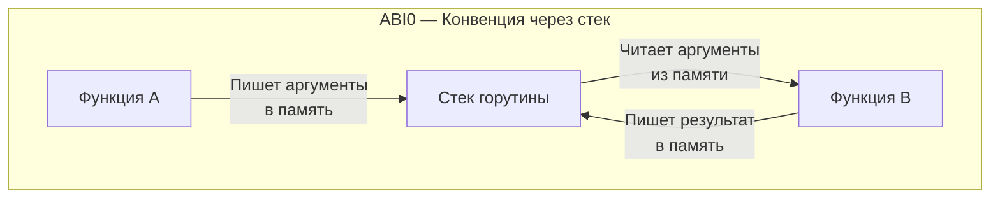
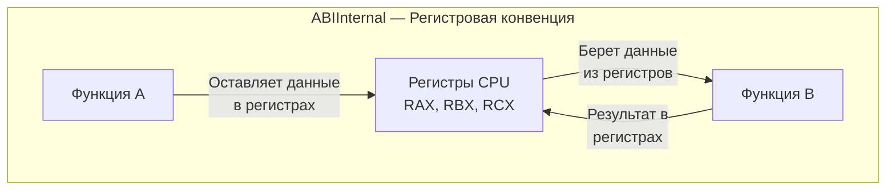

В конце статьи [[5. Go assembler и внутренний ассемблерный синтаксис.md]] мы увидели, как ассемблерный код читает аргументы функции прямо из памяти (используя указатель стека `SP`). Для разработчика на C/C++ это выглядит дико: почему мы обращаемся к медленной оперативной памяти, когда у процессора есть сверхбыстрые регистры?

Долгие годы это было главным архитектурным изъяном компилятора Go. Но в версии Go 1.17 произошла тихая революция, которая мгновенно ускорила все Go-программы в мире примерно на 5-10% без изменения единой строчки пользовательского кода. Эта революция называлась **сменой конвенции вызовов** (Calling Convention) и переходом на **ABIInternal**.

## Что такое ABI?

**ABI (Application Binary Interface)** — это строгий контракт на уровне машинного кода. Если API определяет, *какие* функции можно вызывать, то ABI определяет, *как именно* физически происходит этот вызов. 

Самая важная часть ABI — это **Конвенция вызовов** (Calling Convention). Она отвечает на вопросы:
1. Куда вызывающая функция должна положить аргументы (в память или в регистры)?
2. Где вызываемая функция должна искать эти аргументы?
3. Куда возвращается результат работы функции?
4. Кто отвечает за очистку памяти после вызова?

## ABI0. Наследие Plan 9 (До Go 1.17)

С момента создания и до версии 1.16 язык Go использовал конвенцию, которая сейчас называется **ABI0**. 
Ее суть: **все аргументы и возвращаемые значения передаются исключительно через стек (память)**.

Когда функция `A` вызывала функцию `B`, происходило следующее:
1. `A` выделяла место на своем фрейме стека.
2. `A` копировала значения всех аргументов в эту память.
3. `A` вызывала `B` (инструкция `CALL`).
4. `B` читала аргументы из памяти стека функции `A`.
5. По завершении `B` писала результат обратно в память стека функции `A`.

### Mechanical Sympathy. Почему ABI0 — это медленно?

Чтение из регистра процессора занимает **1 такт**. 
Чтение из L1-кэша процессора занимает **~3-4 такта**. 
Доступ к основной оперативной памяти (RAM) занимает **~100-300 тактов**.

Даже с учетом того, что стек горутины почти всегда горячий и лежит в L1-кэше, мы заставляли процессор выполнять бессмысленные инструкции `MOV` (чтение/запись в память). Вместо того чтобы просто передать значение из регистра в регистр, процессор гонял данные по маршруту `Регистр -> L1-кэш -> Регистр`. Это убивало пропускную способность конвейера CPU (Instruction-Level Parallelism).

## ABIInternal. Революция регистров (Go 1.17+)

Разработчики Go решили внедрить современную регистровую конвенцию вызовов. Новую спецификацию назвали **ABIInternal**.

Теперь, при вызове функции, компилятор пытается передать аргументы и вернуть результаты **исключительно через аппаратные регистры процессора**, вообще не обращаясь к памяти.

Для архитектуры `amd64` (x86-64) компилятор выделил жесткий пул регистров:
* **9 целочисленных регистров:** RAX, RBX, RCX, RDI, RSI, R8, R9, R10, R11.
* **15 регистров для чисел с плавающей точкой:** X0 - X14.

С ABIInternal функция `Add(a, b int)` больше не лезет в память. Переменная `a` уже лежит в регистре `RAX`, переменная `b` — в `RBX`. Функция просто выполняет `ADDQ RBX, RAX` и оставляет результат в `RAX`. Всё происходит на околосветовой скорости внутри ядра CPU.

> [!tip] Собеседование. Что будет, если аргументов больше 9?
> **Вопрос:** Если функция принимает 10 аргументов типа `int`, как они будут переданы в ABIInternal?
> **Ответ:** Произойдет **Spill to Stack** (вытеснение на стек). Первые 9 аргументов будут аккуратно разложены по регистрам RAX-R11. Для десятого аргумента места не хватит, поэтому компилятор фолбэкнется (fallback) к старому поведению и положит 10-й аргумент в память на фрейм стека вызывающей функции.
> Именно поэтому линтеры вроде `golangci-lint` ругаются на функции с большим количеством аргументов. Это не только плохой стиль (Code Smell), но и прямая деградация производительности на уровне машинного кода.

## Структуры, интерфейсы и слайсы в ABIInternal

Как передаются сложные типы данных? В Go любой сложный встроенный тип — это просто структура (struct) под капотом. Компилятор раскладывает (unpack) эту структуру на составные части и кладет каждую часть в отдельный регистр.

* **String** (см. [[34. Внутреннее устройство string.md]]) — это указатель на данные и длина. Они займут 2 регистра (например, RAX и RBX).
* **Slice** (см. [[29. Внутреннее устройство slice.md]]) — это указатель, длина и capacity. Они займут 3 регистра (RAX, RBX, RCX).
* **Interface** (см. [[35. iface и eface. Как устроены интерфейсы.md]]) — это два указателя (на тип и на данные). Займут 2 регистра.

> [!warning] Ловушка / Gotcha. Разворачивание огромных структур
> Если вы передаете в функцию по значению (by value) структуру, состоящую из 5 полей типа `int64`, компилятор развернет ее и забьет сразу 5 регистров. Если полей будет 10 — произойдет Spill to Stack. 
> Передача крупных структур по указателю (`*Struct`) всегда занимает ровно 1 регистр (сам адрес памяти), оставляя остальные регистры свободными. Но тут в игру вступает Escape Analysis, который может перенести выделение этой памяти в медленную кучу. Это классический инженерный трейд-офф, о котором мы поговорим в [[19. Escape Analysis на практике. Как писать меньше аллокаций.md]].

## Почему оставили два ABI?

Вы можете спросить: зачем называть это `ABIInternal` и хранить `ABI0`? Почему не удалить старый вариант?

Ответ: **Обратная совместимость ассемблерного кода**.
В экосистеме Go написаны сотни библиотек (криптография, математика), содержащие `.s` файлы с ручным ассемблером. Весь этот код был написан в парадигме ABI0 (ожидал аргументы на стеке). Если бы компилятор просто изменил поведение, все эти библиотеки мгновенно сломались бы, обрушив экосистему.

Поэтому Go использует гениальный механизм **ABI-wrapper'ов** (оберток):
1. Весь ваш Go код компилируется в быстрый `ABIInternal`.
2. Когда быстрый Go-код вызывает старую ассемблерную функцию, компилятор на лету генерирует невидимую функцию-обертку.
3. Обертка берет аргументы из регистров, кладет их на стек (эмулируя ABI0), вызывает ассемблерную функцию, забирает результат со стека и кладет обратно в регистры.

Таким образом, старый код продолжает работать (хоть и с небольшим пенальти за перекладку данных), а новый код летает на максимальной скорости.

## Итог

1. **Конвенция вызовов (ABI)** определяет, как функции обмениваются аргументами на уровне железа.
2. **ABI0** (старый подход) — передавал всё через оперативную память (стек). Это медленно, но использовалось для совместимости со старым кодом.
3. **ABIInternal** (Go 1.17+) — передает аргументы и результаты через аппаратные регистры CPU (до 9 int и 15 float в x86-64).
4. Передача огромного количества аргументов или массивных структур по значению приводит к исчерпанию регистров и вытеснению данных в память (spill), замедляя вызов.

Теперь мы знаем, как компилятор парсит код (Frontend), как оптимизирует (SSA) и как превращает в машинные инструкции с правильной конвенцией вызовов (Backend). Результат всей этой магии запаковывается линковщиком в единый исполняемый файл.

Что же находится внутри этого файла? И почему бинарник Go на 20 строчек кода "весит" минимум 2 Мегабайта? Узнаем в следующей статье:
[[7. Устройство бинарника Go.md]]