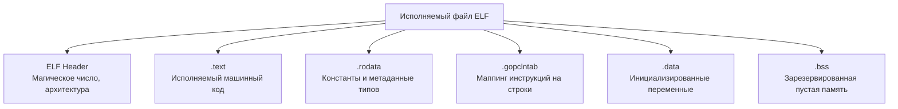

В предыдущих статьях мы проследили путь исходного кода от обычного текста до машинных инструкций и конвенций вызовов (ABI). На последнем этапе компиляции в игру вступает **Линковщик (Linker)**. Его задача — собрать все разрозненные объектные файлы (`.o`), ваш код, код сторонних библиотек и код самого рантайма Go, а затем "сшить" их в единый монолитный исполняемый файл.

Разработчики, приходящие из C/C++ или Rust, часто испытывают шок, когда компилируют простой HTTP-сервер на Go и получают бинарник размером 15–20 Мегабайт. В C аналогичная программа весила бы сотни килобайт. 

Чтобы понять, откуда берется этот объем и как он влияет на работу приложения в операционной системе, нам нужно вскрыть скомпилированный бинарник (в контексте Linux это формат ELF) и изучить его анатомию.

## Философия статической линковки (Fat Binaries)

Главная причина огромного размера Go-программ — это парадигма **статической линковки по умолчанию**.

В C/C++ компилятор использует динамическую линковку. Программа не содержит в себе код стандартной библиотеки (например, функции `printf` или `malloc`). Вместо этого в бинарнике остается лишь "ссылка" на динамическую библиотеку (`libc.so` в Linux или `msvcrt.dll` в Windows), которая уже установлена в ОС. Операционная система подгружает эту библиотеку в память при запуске программы.

Go идет другим путем. Философия Go — максимальная независимость и простота деплоя (переложил один файл на сервер — и он работает). Поэтому линковщик берет **весь** необходимый код и физически копирует его внутрь вашего бинарника. 

Что именно зашивается внутрь каждого, даже самого крошечного Go-файла:
1. **Ваш скомпилированный код.**
2. **Весь рантайм Go:** Планировщик горутин, Сборщик мусора (GC), таймеры, сетевой поллер (netpoller).
3. **Стандартная библиотека:** Весь код из импортированных пакетов (например, `net/http` тянет за собой половину криптографии, `sync`, `reflect` и парсинг строк).

> [!warning] Ловушка / Gotcha. CGO и зависимость от libc
> Утверждение "Go собирает полностью статические бинарники" верно только до тех пор, пока вы не используете пакет `net` (в некоторых сценариях) или `cgo`. По умолчанию, если вы собираете проект на Mac или используете `cgo`, бинарник становится динамически слинкованным с `libc` операционной системы. Если вы перенесете такой бинарник на чистый Alpine Linux (где используется `musl libc` вместо `glibc`), программа упадет при запуске. 
> Чтобы получить истинно статический бинарник (Static ELF), нужно жестко отключить CGO при сборке: `CGO_ENABLED=0 go build`. Подробнее мы рассмотрим эту боль в [[41. cgo. Как Go взаимодействует с C.md]].

## Анатомия Go ELF бинарника

Если мы возьмем скомпилированный бинарник Linux (ELF — Executable and Linkable Format) и проанализируем его сегменты (например, утилитой `readelf -S myapp`), мы увидим жесткую структуру, разбитую на секции. 

Рассмотрим критически важные секции, которые отличают Go от других языков.

### 1. Секция .text (Машинный код)
Здесь лежат те самые чистые инструкции процессора, которые мы обсуждали в [[5. Go assembler и внутренний ассемблерный синтаксис.md]]. ОС загружает эту секцию в память с правами "Только чтение и Исполнение" (Read-Execute). Запись сюда запрещена на аппаратном уровне (защита от внедрения шелл-кодов). Именно здесь лежит код вашего приложения и код `runtime.main`.

### 2. Секция .rodata (Read-Only Data)
Здесь хранятся данные, которые не меняются во время выполнения программы:
* Строковые литералы (все ваши хардкодные строки вида `"hello world"`).
* Математические константы.
* **Структуры RTTI (Run-Time Type Information):** Огромный массив метаданных о каждом типе (struct, interface, slice), используемом в программе. Эта информация критически нужна пакету `reflect`, чтобы во время выполнения программы вы могли узнать, какие поля есть у структуры. (См. [[37. Reflect под капотом.md]]).

### 3. Секретный соус: .gopclntab (Program Counter Line Table)
Это самая тяжелая специфичная секция в бинарнике Go. На нее часто уходит от 15% до 25% всего размера файла.

`gopclntab` — это гигантская хеш-таблица, которая связывает машинные адреса (Program Counters - PC) с:
1. Именем файла исходного кода.
2. Номером строки в этом файле.
3. Именем функции.
4. Информацией о фрейме стека и расположении указателей для сборщика мусора.

Зачем Go тащит эту гигантскую таблицу в production-бинарник, в то время как C++ оставляет ее в отдельных `.pdb` или DWARF файлах?

> [!tip] Собеседование. Зачем нужна gopclntab?
> **Вопрос:** Почему Go не вырезает отладочную информацию из релизного бинарника по умолчанию?
> **Ответ:** Без секции `.gopclntab` рантайм Go не сможет корректно работать. 
> 1. **Panics:** Когда случается паника, рантайм обязан раскрутить стек (stack unwinding) и вывести красивый stack trace с номерами строк и именами файлов. Без этой секции паника выдаст просто набор шестнадцатеричных адресов памяти.
> 2. **Garbage Collector:** GC использует эту таблицу, чтобы точно знать, где на стеке горутины в данный момент лежат указатели, а где — обычные числа, чтобы не удалить живые объекты.
> 3. **Pprof:** Встроенный профилировщик опирается на эту таблицу для создания flame-графов и профилей CPU.

### 4. Секции .data и .bss
* **.data:** Содержит глобальные переменные пакета, которым вы присвоили начальные значения (например, `var ConfigPath = "/etc/config"`). Эта секция копируется в оперативную память при запуске.
* **.bss:** Гениальное изобретение системных инженеров. Здесь "хранятся" глобальные переменные, которые инициализированы нулями (например, `var RequestCount int64`). В самом бинарном файле эта секция занимает ровно **0 байт**. Бинарник просто хранит инструкцию для ОС: *"Когда будешь запускать процесс, выдели в RAM 8 байт и заполни их нулями"*. 

## Mechanical Sympathy. Уменьшение размера бинарника

Хотя "жирный" бинарник упрощает деплой, в эпоху микросервисов, когда в Kubernetes могут крутиться тысячи подов, размер образа имеет значение. Скорость скачивания образа (Pull image) напрямую влияет на время автомасштабирования (Autoscaling) при скачках трафика.

Как мы можем "похудеть" Go бинарник?

### Шаг 1: Удаление DWARF и таблицы символов
По умолчанию Go встраивает в бинарник стандартную отладочную информацию DWARF (нужна для отладчиков вроде Delve или GDB). На production сервере вы вряд ли будете подключаться дебаггером к запущенному процессу.

Мы можем передать флаги линковщику через команду `go build`:
`go build -ldflags="-s -w" main.go`

* `-s`: Вырезать таблицу символов (Symbol table).
* `-w`: Вырезать отладочную информацию DWARF.

Это безопасно для production и уменьшает размер бинарника на 20-30%. При этом секция `.gopclntab` остается целой — ваши паники по-прежнему будут печатать красивые stack trace с номерами строк!

### Шаг 2: Упаковщики (UPX) — Зло для бэкенда
Вы можете пойти дальше и использовать утилиту сжатия исполняемых файлов UPX: `upx --brute myapp`.
Бинарник сожмется еще в 3-4 раза. **Но для высоконагруженного бэкенда это грубая архитектурная ошибка.**

> [!warning] Ловушка / Gotcha. Месть UPX
> Когда вы запускаете неупакованный бинарник, операционная система (Linux) использует механизм **Page Sharing**. Если вы запустите 10 экземпляров (подов) одного микросервиса на одной ноде, ОС загрузит секцию `.text` в физическую RAM только ОДИН раз, и все 10 процессов будут ссылаться на этот участок памяти.
> 
> Если бинарник сжат через UPX, он представляет собой запакованный архив со встроенным распаковщиком. При запуске он распаковывает сам себя прямо в оперативную память (в кучу). 
> 1. Это сильно замедляет холодный старт (Cold Start).
> 2. ОС воспринимает распакованный код как динамические данные, а не как исполняемый `.text`. Page Sharing ломается. 10 запущенных процессов сожрут в 10 раз больше физической оперативной памяти.

## Инструментарий архитектора

Чтобы стать мастером своего инструмента, вы должны уметь препарировать результат сборки. Go предоставляет мощный набор утилит из коробки:

1. **`go tool nm <binary>`** — показывает таблицу символов (все функции и глобальные переменные), их размер в байтах и тип (в какой секции они лежат: T - Text, R - Rodata). Отличный способ найти, какая глобальная переменная сожрала много места.
2. **`go tool objdump -s "main.main" <binary>`** — дизассемблирует конкретную функцию уже из скомпилированного бинарника, показывая финальный машинный код и маппинг на номера строк.
3. **`go version -m <binary>`** — читает секцию `go.buildinfo` и выводит точную версию Go, с которой был собран файл, и список всех зависимостей (модулей) с их версиями. Незаменимо при инцидентах безопасности (например, нужно быстро проверить, уязвим ли скомпилированный бинарник к новой CVE в стороннем пакете).

## Итог

1. Бинарник Go имеет огромный размер из-за статической линковки: он включает в себя все зависимости, стандартную библиотеку и "толстый" рантайм (GC, планировщик).
2. Секция `.gopclntab` занимает существенную часть файла, но критически необходима рантайму для профилирования, сборки мусора и вывода stack trace при паниках.
3. Правильный способ уменьшить размер бинарника для продакшена — флаги линковщика `-ldflags="-s -w"`.
4. Использование упаковщиков типа UPX разрушает механизм Page Sharing в ОС и увеличивает потребление физической памяти.

Теперь мы полностью понимаем, из чего состоит исполняемый файл и как он ложится в память ОС. Главная "полезная нагрузка" этого файла (помимо нашего кода) — это рантайм. 
Пришло время заглянуть в ядро платформы. В следующей статье мы разберем:
[[8. Go runtime. Главные компоненты рантайма.md]]