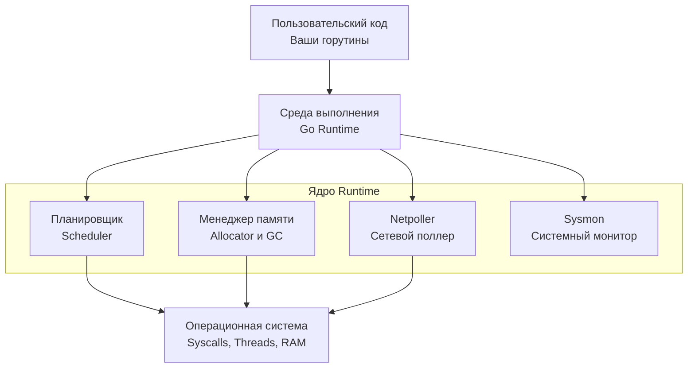

В прошлой статье мы вскрыли бинарник и увидели, что значительную его часть занимает загадочный код, который вы даже не писали. Это и есть **Go Runtime** (среда выполнения). 

Разработчики из мира Java или C# привыкли к тяжеловесным виртуальным машинам (JVM, CLR), которые интерпретируют байт-код, управляют потоками ОС и компилируют код на лету (JIT). С другой стороны, разработчики на C или Rust привыкли к практически голому железу, где "рантайм" — это тонкая прослойка стандартной библиотеки (`libc`), а за управление памятью и потоками отвечает сам программист или операционная система.

Go выбирает уникальный "Срединный путь". Компилятор Go генерирует честный, быстрый машинный код (как C/C++), но при этом в каждый бинарник статически вшивается мощнейшая "мини-операционная система". Эта мини-ОС берет на себя самую сложную работу бэкенд-инженера: асинхронный ввод-вывод, балансировку нагрузки на CPU и управление памятью.

Давайте разберем архитектуру этой "мини-ОС" и ее главные компоненты, чтобы понимать, кому мы делегируем управление нашим приложением.

## Общая архитектура Runtime

Исходный код рантайма лежит в стандартной библиотеке (пакет `runtime`). Это сотни тысяч строк на Go и ассемблере. Если попытаться логически сгруппировать весь этот код, мы получим четыре фундаментальных столпа, на которых держится любая Go-программа.



Рассмотрим каждый из этих компонентов в деталях. На данном этапе мы даем высокоуровневый системный обзор, а в последующих статьях раздела будем погружаться в исходники каждого из них.

## 1. Планировщик (Scheduler)

В классических серверных языках (например, в PHP с Apache `prefork` или старой Java) каждый параллельный запрос обслуживается отдельным потоком операционной системы (OS Thread). Это архитектура `1 к 1`. 
Проблема в том, что поток ОС — это очень тяжелый объект. У него огромный стек (по умолчанию 1-8 МБ в Linux), а переключение между потоками требует системного вызова, сброса конвейера CPU и инвалидации кэшей (Context Switch). Сервер на 10 000 потоков ОС просто умрет от нехватки памяти и троттлинга CPU.

Планировщик Go реализует архитектуру `M к N`. Он позволяет запустить **M** легковесных горутин (со стеком всего 2 КБ) поверх **N** тяжелых потоков операционной системы.

В основе планировщика лежит знаменитая тройка:
* **G (Goroutine):** Объект вашей горутины. Содержит свой стек, указатель инструкций (PC) и статус.
* **M (Machine):** Поток операционной системы (тред). Он не знает о горутинах, он просто исполняет то, что ему дают.
* **P (Processor):** Логический процессор (контекст). Их количество равно `GOMAXPROCS` (обычно равно количеству физических ядер сервера). 

Именно `P` хранит локальную очередь горутин (`G`) и отдает их на исполнение свободному `M`. Благодаря этому, Go может легко держать миллион активных веб-сокетов на сервере с 8 ГБ RAM.
*(Детальный разбор: [[9. Scheduler Go. G, M, P и work stealing.md]])*

## 2. Менеджер памяти (Allocator + GC)

Если вы пишете на C++, фрагментация памяти и утечки — ваша личная головная боль. В Go рантайм берет на себя выделение (Allocation) и очистку (Garbage Collection) памяти.

**Аллокатор (TCMalloc):**
Аллокатор Go базируется на архитектуре `TCMalloc` (Thread-Caching Malloc), созданной инженерами Google. Его главная цель — **выделять память без блокировок (Mutex)** в многопоточной среде. 
Рантайм создает иерархию кэшей: `mcache` (локальный кэш для каждого логического процессора `P`), `mcentral` (общий кэш для объектов определенного размера) и `mheap` (глобальная куча). Когда вашей горутине нужен новый объект, она мгновенно берет его из локального `mcache` своего `P` без единого системного вызова и без блокировки других тредов.
*(Детальный разбор: [[21. Аллокатор памяти Go. mcache, mcentral, mheap.md]])*

**Сборщик мусора (GC):**
В Go используется **Concurrent Mark and Sweep GC** (Конкурентный алгоритм пометки и очистки) с применением трехцветного графа (Tricolor Abstraction). 
В отличие от Java, которая долгое время предпочитала алгоритмы максимизации пропускной способности (throughput) ценой долгих пауз (Stop-The-World), Go сфокусирован на **минимальных задержках (Low Latency)**. В современных версиях Go паузы GC редко превышают 1 миллисекунду, потому что сборщик работает параллельно с вашим пользовательским кодом.
*(Детальный разбор: [[24. Сборщик мусора Go. Общая архитектура.md]])*

## 3. Netpoller (Сетевой поллер)

Это один из самых магических компонентов для бэкенд-разработчика. 

Когда вы пишете код:
```go
data := make([]byte, 1024)
// Программа "зависает" здесь, пока не придут данные по сети
n, err := conn.Read(data) 
```

Вам кажется, что вы делаете блокирующий вызов. Если бы горутина реально заблокировала поток ОС (M), ожидая сетевой пакет, миллион горутин сожрал бы миллион тредов ОС, и сервер бы упал.

**Mechanical Sympathy: Как работает Netpoller?**
Под капотом рантайм перехватывает ваш вызов `conn.Read()`. Он видит, что данных в сокете пока нет. 
Вместо того чтобы блокировать поток ОС, рантайм:
1. Переводит сокет в неблокирующий режим (non-blocking IO).
2. Регистрирует файловый дескриптор этого сокета в механизме ядра операционной системы (например, `epoll` в Linux или `kqueue` в macOS).
3. "Усыпляет" вашу горутину (`G`), снимает ее с потока ОС (`M`) и кладет в сторонку.
4. Поток ОС (`M`) берет из очереди другую готовую горутину и продолжает полезную работу.

Когда сетевой пакет физически приходит на сетевую карту, ядро Linux сигнализирует `epoll`. Скрытый механизм рантайма (`Netpoller`) видит это, находит вашу спящую горутину, "будит" её и ставит обратно в очередь на выполнение. 

Для вас код выглядит как простой синхронный, блокирующий скрипт. Под капотом рантайм проворачивает сложнейшую асинхронную event-driven архитектуру (аналог Node.js Event Loop, но прозрачный для разработчика и распределенный по всем ядрам CPU).

## 4. Sysmon (Системный монитор)

`Sysmon` — это тайный страж вашей программы. 
Это единственный поток в Go, который работает **без привязки к логическому процессору (без P)**. Он запускается на отдельном, выделенном потоке операционной системы (M) в самом начале старта программы (мы видели это в первой статье раздела) и работает в бесконечном цикле в фоновом режиме.

Его задачи критически важны для стабильности системы:
1. **Превенция (Preemption):** Если какая-то горутина исполняет тяжелый цикл `for` без системных вызовов более 10 миллисекунд, она захватывает ядро CPU и не дает работать другим. `Sysmon` обнаруживает это и принудительно прерывает такую горутину (посылая сигнал ОС потоку), заставляя её уступить место другим.
2. **Освобождение памяти (Scavenger):** Если после работы GC в `mheap` скопилось много свободной памяти, `sysmon` постепенно возвращает эту память операционной системе (через syscall `madvise`), чтобы ваш Docker-контейнер не убил OOM Killer.
3. **Защита от зависаний в Syscalls:** Если горутина делает настоящий тяжелый системный вызов (например, чтение с медленного диска) и блокирует поток ОС, `sysmon` замечает это. Он "отрывает" логический процессор (`P`) от зависшего потока (`M`) и передает его новому потоку, чтобы другие горутины в очереди не простаивали.

> [!tip] Собеседование. Что делает рантайм, а что нет?
> **Вопрос:** Является ли рантайм Go полноценной виртуальной машиной (VM)?
> **Ответ:** Нет. В отличие от JVM или CLR, рантайм Go не интерпретирует байт-код и не компилирует код в рантайме (JIT). Код Go компилируется в машинные инструкции (AOT) заранее. Рантайм Go — это, по сути, статически слинкованная библиотека (набор функций на Go и ассемблере), которая инициализируется перед вашей функцией `main` и прозрачно управляет ресурсами (память, сеть, потоки), перехватывая ваши вызовы.

> [!warning] Ловушка / Gotcha. Overhead рантайма
> За всю эту магию нужно платить.
> 1. **Размер бинарника:** Из-за встроенного рантайма даже `Hello World` весит около 2 МБ.
> 2. **Память:** Рантайм сам потребляет оперативную память под свои внутренние структуры (стеки горутин, структуры `mspan`, метаданные GC). Минимальный оверхед "пустого" запущенного приложения в Go составляет около 10-20 Мегабайт RAM. Это ничтожно для бэкенда, но делает Go плохим выбором для крошечных микроконтроллеров (где правят C и Rust или используются специальные урезанные компиляторы вроде TinyGo).

## Итог

1. **Go Runtime** — это мощная среда, статически встроенная в каждый бинарник. Она избавляет разработчика от ручного управления потоками, памятью и асинхронными коллбеками.
2. **Планировщик (Scheduler)** мультиплексирует легковесные горутины на реальные треды ОС.
3. **Менеджер памяти (Allocator + GC)** выделяет память без глобальных блокировок и убирает мусор конкурентно с минимальными задержками.
4. **Netpoller** превращает блокирующий сетевой код в высокопроизводительный неблокирующий ввод-вывод через `epoll/kqueue`.
5. **Sysmon** — фоновый поток-супервизор, предотвращающий зависания и балансирующий ресурсы.

Теперь, когда мы видим картину рантайма целиком, пришло время разобрать его компоненты под микроскопом. Начнем с самого сложного и гениального механизма — планировщика. 

Переходим к статье: [[9. Scheduler Go. G, M, P и work stealing.md]]