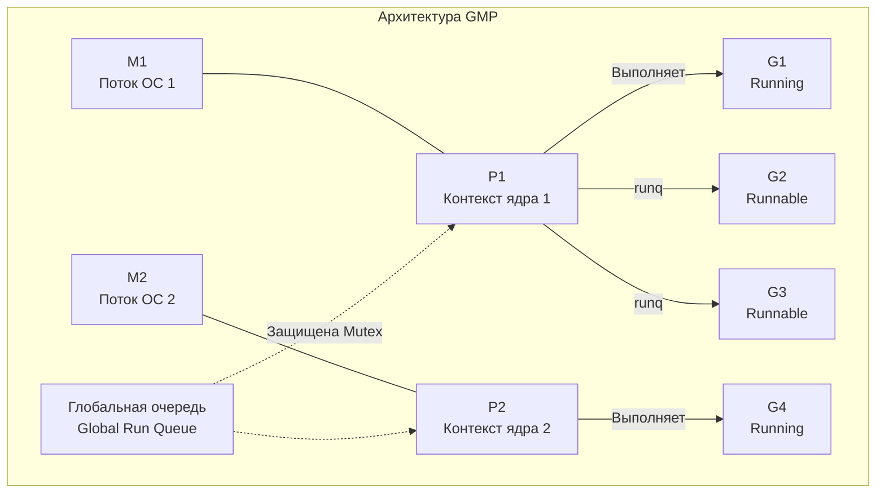
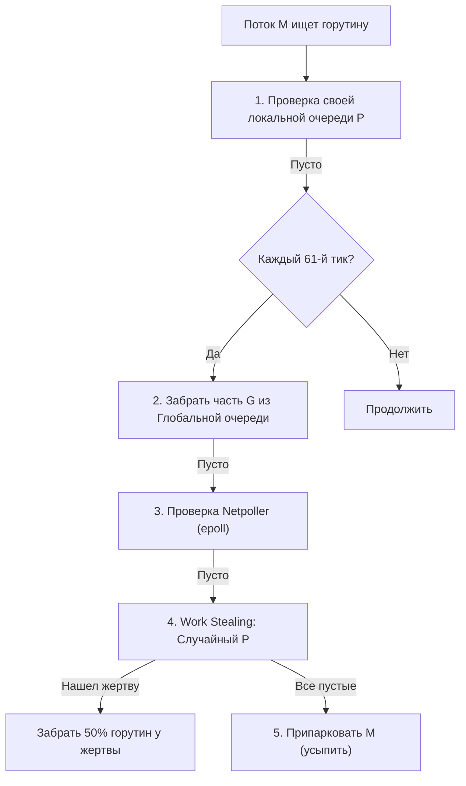

В прошлой статье ([[8. Go runtime. Главные компоненты рантайма.md]]) мы в общих чертах познакомились с архитектурой "мини-ОС", зашитой в каждый бинарник Go. Главным дирижером этой системы является **Планировщик (Scheduler)**.

Исторически, многопоточность в языках программирования строилась вокруг модели `1:1` — на каждый параллельный поток в коде создавался один поток операционной системы (OS Thread). 
Для высоконагруженного бэкенда это катастрофа. Поток ОС — это тяжеловесный объект ядра. Операционная система выделяет ему гигантский стек (обычно от 1 до 8 МБ), а переключение между потоками (Context Switch) требует системного вызова, сохранения десятков регистров, сброса конвейера CPU и, что самое страшное, инвалидации TLB-кэша процессора. Сервер с 10 000 активных потоков ОС просто задохнется от накладных расходов.

Go реализует модель `M:N` — планировщик мультиплексирует **M** легковесных пользовательских горутин поверх **N** тяжелых потоков операционной системы. 

Чтобы эта магия работала без глобальных блокировок (mutex contention), инженеры Google (Дмитрий Вьюков и другие) разработали элегантную трехкомпонентную архитектуру — **GMP**.

## Фундаментальные структуры: G, M и P

Если мы откроем исходники рантайма (`src/runtime/runtime2.go`), мы увидим три главные C-подобные структуры.

### 1. G (Goroutine)
Структура `g` описывает отдельную горутину. Это минимальная единица исполнения.
Она невероятно легковесна — на старте ее стек занимает всего 2 КБ. 

Ключевые поля структуры `g`:
* `stack`: Указатели на начало и конец текущего выделенного стека памяти.
* `sched`: Структура `gobuf`, которая хранит "закладку" (контекст выполнения), если горутина была приостановлена. Она содержит сохраненные значения регистров процессора: `sp` (указатель стека), `pc` (указатель инструкций) и `bp` (указатель базы стека).
* `atomicstatus`: Текущее состояние (например, `_Grunnable` — готова к выполнению, `_Grunning` — выполняется, `_Gwaiting` — заблокирована на канале или мьютексе).

### 2. M (Machine)
Структура `m` представляет поток операционной системы (OS Thread). 
В отличие от горутины, `M` — это реальный тред ядра (например, созданный через `clone` в Linux), который исполняет машинные инструкции на процессоре.

Ключевые поля структуры `m`:
* `g0`: Особая системная горутина со стеком операционной системы (8 МБ). Именно на ее стеке выполняется код самого планировщика и сборщика мусора. Пользовательский код здесь не выполняется никогда!
* `curg`: Указатель на пользовательскую горутину (`G`), которая выполняется прямо сейчас.
* `p`: Указатель на логический процессор (`P`), к которому этот поток привязан в данный момент.

### 3. P (Processor)
Это самый гениальный элемент системы, добавленный в Go 1.1 (до этого были только G и M, и планировщик безбожно тормозил из-за единого глобального мьютекса).
Структура `p` — это абстрактный **Локальный контекст исполнения**. Их количество жестко задано переменной окружения `GOMAXPROCS` (по умолчанию равно количеству логических ядер CPU сервера).

Зачем нужен `P`? 
Поток ОС (`M`) не имеет права выполнять Go-код, пока он не захватит эксклюзивный доступ к какому-нибудь `P`. 
Ключевые поля структуры `p`:
* `runq`: **Локальная очередь (Local Run Queue — LRQ)** горутин, готовых к выполнению. Это кольцевой буфер (ring buffer) на 256 элементов, работающий без мьютексов на атомарных операциях (lock-free).
* `runnext`: Специальный слот (указатель) на одну горутину, которая должна быть выполнена абсолютно следующей (опережая даже локальную очередь).
* `mcache`: Локальный кэш аллокатора памяти для выделения мелких объектов без блокировок.

> [!info] Под капотом. runnext и локальность кэша CPU
> Почему в структуре `P` есть отдельный слот `runnext`?
> Когда горутина `A` создает горутину `B` (через `go func()`), планировщик с огромной вероятностью поместит `B` именно в слот `runnext` текущего `P`. Это сделано из-за **Mechanical Sympathy**. Процессор только что работал с данными для порождения `B`, эти данные уже лежат в сверхбыстрых L1/L2 кэшах физического ядра. Если мы выполним `B` прямо сейчас, мы получим максимальный прирост скорости (Cache Affinity). Если бы `B` ушла в конец очереди из 256 элементов, к моменту ее выполнения кэши были бы давно перезаписаны.

## Цикл Планирования (The Schedule Loop)

Когда рантайм инициализирован, каждый активный поток `M` (к которому привязан `P`) запускает бесконечный цикл планирования (функция `schedule()` в рантайме).

Единственная цель `M` в этой жизни — найти горутину со статусом `_Grunnable`, сменить ее статус на `_Grunning`, переключить указатели `SP` и `PC` процессора на стек этой горутины (функция `gogo()`) и выполнить ее код.

Откуда `M` берет горутины? Алгоритм функции `findrunnable()` строго приоритезирован:

1. **runnext:** Проверить слот `runnext` у своего `P`. Если там есть `G` — забрать и выполнить.
2. **Локальная очередь (LRQ):** Взять `G` из головы кольцевого буфера `P.runq`. Операция Lock-Free, невероятно быстрая.
3. **Глобальная очередь (GRQ):** Если локальная очередь пуста, берем пачку `G` из глобальной очереди `sched.runq`. Глобальная очередь защищена системным мьютексом (блокировкой), поэтому часто туда ходить нельзя.
4. **Network Poller:** Проверить сетевой поллер (не пришли ли данные из сокетов ядра через `epoll`). Если пришли, разбудить ожидавшие `G` и забрать их себе.
5. **Work Stealing (Кража работы).**

## Work Stealing (Кража работы)

Что произойдет, если горутины на `P1` оказались тяжелыми (числодробилки), а горутины на `P2` — легкими и быстро завершились? Локальная очередь `P2` опустеет. 
Без балансировки поток `M2` уснул бы, пока `M1` задыхался бы от нагрузки на одном ядре CPU. 

Чтобы этого не допустить, используется паттерн **Work Stealing**. 
Если `M` не нашел работу ни в локальной, ни в глобальной очереди, он переходит в режим "вора" (spinning thread).
Он случайным образом выбирает другой логический процессор `P` в системе, блокирует его локальную очередь атомарной операцией и **крадет ровно половину (50%) горутин** из его хвоста, перенося их в свою локальную очередь.

> [!warning] Ловушка / Gotcha. Проблема голодания (Starvation)
> Если планировщик будет всегда брать горутины только из локальных очередей (которые могут постоянно пополняться), горутины в глобальной очереди могут никогда не выполниться!
> Чтобы предотвратить голодание, в рантайме жестко захардкожено правило (шаг `CHECK_TICK` на диаграмме): **ровно каждый 61-й тик планировщика** поток обязан проигнорировать свою локальную очередь и попытаться взять горутину из глобальной. 61 — это простое число (prime number), выбранное специально, чтобы минимизировать шанс совпадения с другими циклическими алгоритмами рантайма.

## Handoff: Что происходит при системных вызовах?

Мы подошли к главному вопросу: почему в системе есть сущность `P`? Почему нельзя было просто привязать локальную очередь прямо к `M`?

Ответ кроется в **блокирующих системных вызовах** (например, синхронное чтение файла с диска, `CGO` вызов или `syscall.Read`).
Когда горутина делает такой вызов, она проваливается в Kernel Space (Ring 0). Поток операционной системы (`M`) физически блокируется ядром Linux до завершения I/O операции. 

Если бы очередь горутин висела на `M`, то 255 других готовых горутин зависли бы в ожидании вместе с ним, хотя другие процессоры сервера могли бы простаивать!

Благодаря структуре `P` происходит механизм **Handoff (передача эстафеты)**:
1. `M1` выполняет `G1`, которая делает блокирующий системный вызов.
2. `M1` понимает, что сейчас уснет в ядре ОС.
3. Рантайм **отрывает** логический контекст `P1` (со всеми его 255 горутинами) от засыпающего `M1`.
4. Рантайм ищет свободный поток `M2` (или создает новый поток ОС, если все заняты).
5. `P1` прикрепляется к `M2`. `M2` продолжает выполнять горутины из очереди `P1`.

Когда системный вызов на `M1` завершится, он проснется, обнаружит, что у него больше нет `P`, сбросит `G1` в глобальную очередь и уйдет в пул спящих потоков (или самоуничтожится, если тредов стало слишком много).

*(Подробнее механику парковки тредов мы разберем в [[42. Планировщик и блокирующие syscalls.md]])*

> [!tip] Собеседование. Spinning Threads (Крутящиеся потоки)
> **Вопрос:** Если процессу нечего делать, Go усыпляет треды ОС. Но почему в профилировщике часто видно, что парочка тредов потребляет CPU, хотя полезной нагрузки нет?
> **Ответ:** Это `Spinning Threads`. Когда `M` остается без `P` или без горутин, он не засыпает (syscall `futex`) мгновенно. Засыпание и последующее пробуждение треда ядром ОС — это очень дорогая операция (микросекунды). Вместо этого, рантайм позволяет нескольким тредам "крутиться вхолостую" (активно опрашивая очереди в цикле) некоторое короткое время в надежде, что прямо сейчас появится новая работа (например, придет сетевой пакет). Это сжигает немного тактов CPU, но кардинально снижает Latency (задержку) обработки новых задач.

## Итоги

1. **Модель M:N:** Go не привязывает горутины к потокам ОС жестко. `M` пользовательских горутин бегают на `N` тредах ОС.
2. **Архитектура GMP:** `G` — горутина (стек + регистры), `M` — поток ОС (исполнитель), `P` — логический процессор (очередь задач и кэши аллокатора).
3. **Локальность:** Локальная очередь (LRQ) и слот `runnext` позволяют планировщику работать без мьютексов и максимально эффективно использовать кэши L1/L2 процессора (Mechanical Sympathy).
4. **Work Stealing:** Балансировка нагрузки достигается тем, что свободные потоки агрессивно "крадут" работу у загруженных.
5. **Handoff:** Разделение `M` и `P` позволяет рантайму отвязать очередь готовых горутин от треда ОС, если тот заблокировался в тяжелом системном вызове.

Теперь мы знаем, как горутины распределяются по ядрам. Но кто следит за тем, чтобы вся эта система не застряла? Кто будит горутины при сетевых запросах и кто отбирает CPU у "жадных" циклов `for`? 
Всё это делает тайный кардинал рантайма. В следующей статье мы разберем: 
[[10. sysmon, netpoller и фоновые потоки рантайма.md]]