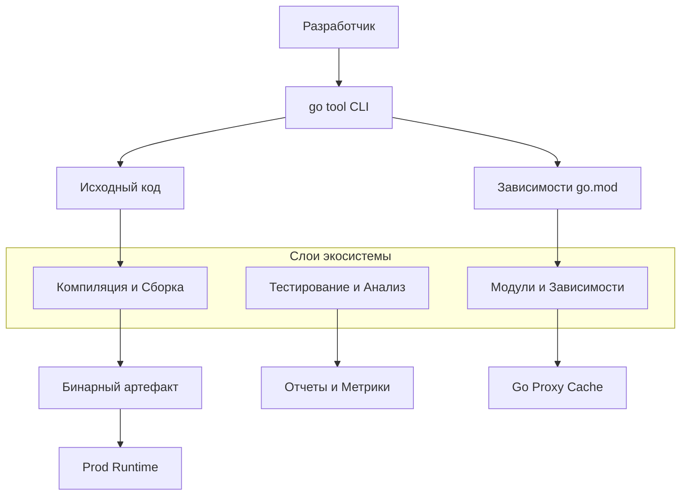

## Экосистема инструментов Go: Философия "Batteries Included"

Если вы переходите в Go из мира Java (Maven/Gradle), PHP (Composer) или Node.js (npm/yarn), первое, что бросается в глаза — это отсутствие внешних «сборщиков проектов». Вам не нужно скачивать отдельный тулчейн для сборки, форматирования или линтинга. Все необходимое уже встроено в дистрибутив языка.

Это философия **«Batteries Included»**. Язык поставляется как законченный продукт, где инструментальная обвязка является частью дизайна, а не постфактум-надстройкой. Роб Пайк однажды сказал: «Go был разработан для решения проблем, которые возникают при разработке софта в Google». Одна из таких проблем — хаос в инструментарии. Go решает её радикально: один бинарник `go` управляет всем жизненным циклом программы.

## Архитектура экосистемы

В отличие от Python или Ruby, где инструменты живут в изолированных пакетах (pip, bundler), экосистема Go строится вокруг единой точки входа — команды `go`. Это не просто компилятор, это диспетчер задач.

### Уровни инструментария

1.  **Ядро (Core Toolchain):** Компилятор (`compile`), линкер (`link`), ассемблер (`asm`). Вы редко вызываете их напрямую, они скрыты за `go build`.
2.  **Менеджмент зависимостей:** Система модулей (`go mod`), пришедшая на смену `GOPATH` в Go 1.11 и ставшая стандартом в 1.16.
3.  **Quality Assurance:** Встроенный форматтер (`go fmt`), статический анализатор (`go vet`) и фреймворк для тестирования (`go test`).
4.  **Рантайм и интроспекция:** Инструменты для профилирования (`pprof`), трассировки и анализа сборщика мусора.

> [!info] Под капотом
> Команда `go` — это драйвер. Когда вы запускаете `go build`, под капотом происходит цепочка вызовов отдельных инструментов, лежащих в `$GOROOT/pkg/tool/<os>_<arch>/`. Там вы найдете `compile`, `link`, `asm` и другие низкоуровневые утилиты. Go скрывает эту сложность, но дает доступ к ней через `go tool -compile` или `go tool -link` для тонкой настройки.

## Mechanical Sympathy: Скорость имеет значение

Go создавался для гигантских монорепозиториев (как в Google). Это наложило жесткие требования на скорость инструментов.

1.  **Параллелизм компиляции:** Компилятор Go спроектирован так, чтобы максимально использовать многоядерность CPU. Он компилирует каждый пакет в отдельности и параллельно.
2.  **Кэширование (Go Cache):** Инструментарий Go использует контент-адресуемый кэш в директории `GOCACHE`. Если вы не меняли исходный файл и его зависимости, Go не будет перекомпилировать его заново. Это делает инкрементальную сборку мгновенной.
3.  **Отсутствие циклических зависимостей:** Ограничение на уровне языка (импорты не могут образовывать циклы) позволяет компилятору строить ациклический граф зависимостей и эффективно распараллелить работу.

> [!warning] Ловушка / Gotcha
> Переходя с интерпретируемых языков (PHP, Python), разработчики часто привыкают к «магии» автозагрузки классов и динамическому разрешению зависимостей. В Go этап разрешения зависимостей происходит строго **до** компиляции. Если в `go.mod` нет пакета, код не скомпилируется. Это исключает ошибки времени выполнения вида "Class not found", но требует дисциплины на этапе разработки.

## Сравнение подходов

| Характеристика | Java / Maven / Gradle | Node.js / npm | Go |
| :--- | :--- | :--- | :--- |
| **Сборка** | Внешние инструменты (XML/Groovy DSL), долгая инициализация. | Скрипты в `package.json`, часто хаотичные. | Встроенная `go build`. Работает «из коробки». |
| **Зависимости** | Централизованные репозитории (Maven Central). Сильная зависимость от версий. | Огромные `node_modules`, дублирование версий. | Встроенный `go mod`. Минималистичный граф зависимостей. |
| **Форматирование** | Требуется настройка плагинов (Checkstyle, Spotless). | Prettier / ESLint (требуют установки). | `gofmt` — часть дистрибутива. Стиль один для всех. |
| **Тестирование** | JUnit (внешняя библиотека). | Jest / Mocha (внешние библиотеки). | `testing` пакет в стандартной библиотеке. |

## Философия "Opinionated Defaults"

Go — язык с сильными мнениями (opinionated). Инструментарий навязывает «правильный» путь:
*   **Форматирование:** `gofmt` не имеет настроек. Стиль кода — не предмет обсуждения в командах.
*   **Документация:** `go doc` генерирует документацию из комментариев. Вам не нужен отдельный парсер (как Doxygen или Javadoc).
*   **Конкурентность:** Инструменты вроде `go run -race` включают Race Detector одной строкой. В C++ это потребовало бы подключения внешних санитайзеров и сложной конфигурации.

## Roadmap раздела

В этом разделе мы последовательно разберем каждый слой инфраструктуры, необходимый для превращения кода в надежный продакшн-сервис.

Мы начнем с фундамента — устройства самой цепочки инструментов и процесса компиляции. Затем перейдем к управлению зависимостями, без которого невозможна современная разработка. После этого мы углубимся в автоматизацию: линтеры, Makefile, Docker и CI/CD пайплайны.

К концу раздела у вас сформируется полное понимание того, как настроить процесс разработки так, чтобы он был быстрым, надежным и масштабируемым.

В следующей статье мы разберем, как устроена сама система инструментов Go, и поговорим о том, что происходит, когда вы нажимаете Enter после команды `go build`. Переходим к статье: [[2. go toolchain. Общая архитектура инструментов]].