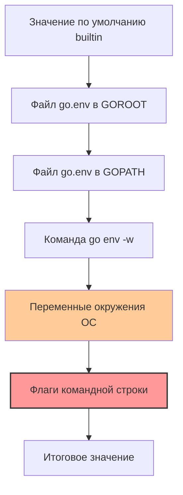

Настройка среды выполнения — это то, что отличает код, работающий "на ноуте", от кода, работающего в продакшене. В Go конфигурация инструментального средства и рантайма управляется через переменные окружения. Команда `go env` — это окно в этот мир конфигурации.

Она показывает, что "знает" тулчейн о вашей системе: где лежат исходники, где кэш, какие флаги линкера использовать по умолчанию. Но главное — она позволяет переопределять поведение Go без изменения кода.

## Иерархия конфигурации

Go определяет значения переменных по строгому приоритету. Понимание этого порядка спасает от часов отчаяния, когда "флаг не работает".



1.  **Флаги командной строки** (например, `go build -tags=prod`) имеют наивысший приоритет.
2.  **Переменные окружения ОС** (`export GOOS=linux`).
3.  **`go env -w`** (запись в конфиг пользователя `~/.config/go/env`).
4.  **Дефолтные значения**.

> [!warning] Ловушка / Gotcha
> Новички часто пытаются выставить переменную через `go env -w GOOS=linux`, а потом удивляются, почему `GOOS=windows go build` игнорирует их настройку. Причина: переменная окружения ОС перекрывает значение, записанное через `-w`. Флаг `-w` удобен для установки "глобальных дефолтов", но в CI/CD скриптах всегда используйте переменные окружения ОС, так как они более явные и временные.

## Ключевые переменные (Must Know)

### 1. `GOCACHE` и `GOMODCACHE`
Это две самые важные переменные для производительности сборки.
*   `GOCACHE`: Директория, где хранятся кэшированные результаты компиляции. Если путь не задан, Go использует дефолтный путь в профиле пользователя. Если кэш "сломался" (редко, но бывает), его можно очистить через `go clean -cache`. **Никогда не отключайте кэш** (`GOCACHE=off`), иначе сборка будет выполняться полностью каждый раз.
*   `GOMODCACHE`: Где хранятся скачанные зависимости (`$GOPATH/pkg/mod` по умолчанию). В CI-системах эту папку часто монтируют как том, чтобы ускорить сборку — зависимости не будут качаться заново при каждом запуске пайплайна.

### 2. `GOOS` и `GOARCH`
Главные переменные для кросс-компиляции.
*   `GOOS` (Operating System): `linux`, `windows`, `darwin`.
*   `GOARCH` (Architecture): `amd64`, `arm64`, `arm`.
Именно благодаря им `go build` может создать бинарник под Raspberry Pi (`GOOS=linux GOARCH=arm`) с вашего Mac на M1.

### 3. `CGO_ENABLED`
Определяет, будет ли использоваться компилятор C (gcc/clang) для сборки кода с CGO.
*   **`1` (по умолчанию):** CGO включен. Вы можете использовать C-библиотеки (например, `sqlite3`). Бинарник будет динамически слинкован с libc (в Linux).
*   **`0`:** CGO отключен. Вы получаете полностью статический бинарник. Это критично для использования `scratch` образов в Docker. При кросс-компиляции (например, сборка Linux бинарника на macOS) CGO автоматически отключается, если не настроен кросс-компилятор C.

### 4. Настройки Garbage Collector (`GOGC`, `GOMEMLIMIT`)
Это переменные не тулчейна, а **Go Runtime**. Они читаются при старте программы.
*   `GOGC`: Коэффициент, определяющий частоту запуска GC. `GOGC=off` отключает GC (используется только в специфичных случаях). `GOGC=100` (дефолт) означает, что GC запустится, когда куча вырастет на 100%.
*   `GOMEMLIMIT` (Go 1.19+): "Мягкий лимит" памяти. Если установить `GOMEMLIMIT=4GiB`, GC будет работать активнее, чтобы удержать потребление памяти около этой отметки. Это спасает от OOM Kill в Kubernetes.

> [!info] Под капотом
> Runtime переменные читаются в функции `runtime.init` на старте программы. Вы можете изменить их в runtime через код, но инициализация происходит через `os.Getenv`. Это позволяет тюнить поведение программы в продакшене, просто меняя переменные окружения в манифесте Kubernetes/Docker Compose, без пересборки бинарника.

## Управление конфигурацией

### Просмотр
```bash
# Посмотреть все переменные
go env

# Посмотреть конкретную переменную (удобно для скриптов)
go env GOPATH
# /home/user/go
```

### Изменение (Persist)
Команда `go env -w` сохраняет значение в файл конфигурации пользователя. Это удобно для настройки приватных прокси или прокси для Китая, чтобы не прописывать их в каждом проекте.

```bash
# Установить прокси для модулей
go env -w GOPROXY=https://proxy.golang.org,direct

# Вернуть дефолтное значение
go env -u GOPROXY
```

## `go env` в CI/CD

В CI/CD системах важно кэшировать правильные директории. Использование `go env` позволяет писать кроссплатформенные скрипты:

```yaml
# Пример для GitHub Actions
steps:
  - name: Setup Go
    uses: actions/setup-go@v4
    
  - name: Get Go paths
    id: go-paths
    run: |
      echo "GOCACHE=$(go env GOCACHE)" >> $GITHUB_OUTPUT
      echo "GOMODCACHE=$(go env GOMODCACHE)" >> $GITHUB_OUTPUT
      
  - name: Cache Go modules
    uses: actions/cache@v3
    with:
      path: |
        ${{ steps.go-paths.outputs.GOCACHE }}
        ${{ steps.go-paths.outputs.GOMODCACHE }}
      key: ${{ runner.os }}-go-${{ hashFiles('**/go.sum') }}
```

## Итог

1.  **`go env`** — централизованная точка управления конфигурацией тулчейна и рантайма.
2.  Переменные окружения ОС имеют приоритет над настройками `go env -w`.
3.  **`GOGC` и `GOMEMLIMIT`** — мощные рычаги управления GC без переписывания кода.
4.  Используйте `go env GOMODCACHE` в скриптах для кроссплатформенного определения путей кэша.

Мы настроили окружение. Теперь давайте научимся "рентгенить" проект: получать метаданные о пакетах, зависимостях и структуре проекта. В следующей статье разберем: [[11. go list и introspection проекта]].