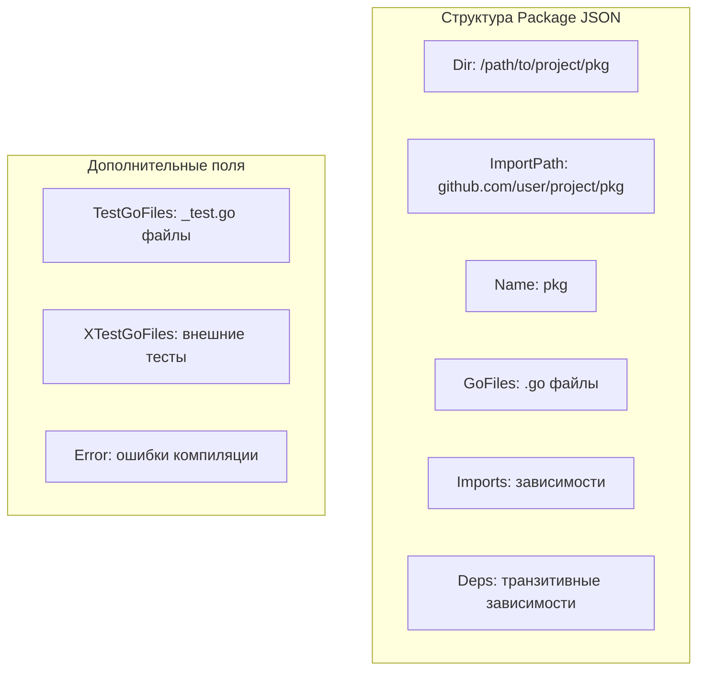

## Рентген вашего проекта

Если `go env` показывает настройки среды, то `go list` позволяет заглянуть внутрь самого проекта. Это команда-инспектор, которая отвечает на вопрос: "Что Go реально *видит* в моих директориях, прежде чем начнет компиляцию?".

Для Senior-разработчика `go list` — это не просто способ узнать имена пакетов. Это основной инструмент для написания скриптов автоматизации, анализа зависимостей и отладки странных ошибок сборки. Именно на `go list` держится большинство продвинутых `Makefile` и CI-пайплайнов.

## JSON как API к тулчейну

Главная фишка `go list` — возможность выводить информацию не текстом, а в формате JSON (`-json`). Это превращает команду в полноценное API. Под капотом `go list` использует те же структуры данных, что и компилятор, заполняя поля информацией о файлах, импортах и ошибках.

Попробуйте выполнить:
```bash
go list -json ./...
```

Вы получите огромный массив данных. Вот как это выглядит схематично для одного пакета:



> [!info] Под капотом
> Команда `go list` фактически выполняет "сухой прогон" загрузки пакетов. Она парсит `go.mod`, обходит файловую систему, строит граф импортов, но не запускает компиляцию. Если в коде есть синтаксическая ошибка, `go list` всё равно отработает, но в поле `Error` структуры JSON будет записано описание ошибки. Это позволяет скриптам анализировать проблемы без остановки сборки (при использовании флага `-e`).

## Полезные флаги и шаблоны

Выводить весь JSON каждый раз избыточно. Для скриптов используется механизм шаблонов Go (`-f`), что позволяет выдергивать только нужные поля.

### 1. Список всех зависимостей
Чтобы узнать, от каких пакетов зависит ваш проект (прямо или транзитивно):
```bash
go list -f '{{.Deps}}' ./...
```

### 2. Поиск `main` пакетов
Если у вас монорепозиторий с несколькими сервисами в папке `cmd`, вы можете найти все точки входа:
```bash
# Найдет все пакеты с именем main
go list -f '{{if eq .Name "main"}}{{.ImportPath}}{{end}}' ./...
```

### 3. Файлы для компиляции
Иногда нужно передать список всех `.go` файлов (кроме тестов) в линтер или анализатор:
```bash
go list -f '{{range .GoFiles}}{{$.Dir}}/{{.}}{{"\n"}}{{end}}' ./...
```

## Флаг `-deps`: Полный граф

Флаг `-deps` расширяет список выводимых пакетов. Без него `go list ./...` покажет только ваши локальные пакеты. С ним — вы получите дерево всех зависимостей, включая стандартную библиотеку и сторонние модули.

Это полезно для:
*   Анализа "раздувания" бинарника (какие библиотеки тянутся).
*   Поиска уязвимостей (проверка версий вложенных зависимостей).
*   Визуализации графа зависимостей.

## Работа с ошибками (`-e`)

Обычно, если пакет не компилируется, `go list` падает с ошибкой. Но иногда нам нужно узнать статус пакетов, даже если они сломаны (например, в IDE или анализаторах). Флаг `-e` заставляет команду продолжать работу и включать поле `Error` в JSON-вывод для проблемных пакетов.

```json
{
  "ImportPath": "broken/pkg",
  "Error": {
    "ImportStack": [...],
    "Pos": "broken/pkg/main.go:5:2",
    "Err": "undefined: someVar"
  }
}
```

> [!warning] Ловушка / Gotcha
> Обратите внимание на разницу между `Imports` и `Deps`.
> *   `Imports` — это список пакетов, указанных в `import` блоках файлов текущего пакета. Это прямые зависимости.
> *   `Deps` — это полный транзитивный набор. Если пакет A импортирует B, а B импортирует C, то `Deps` пакета A будет содержать и B, и C.

## `go list` в Real World

Главный кейс использования — написание умных `Makefile`. Например, вы хотите запустить линтеры параллельно над всеми файлами, или сгенерировать документацию только для экспортируемых пакетов.

Пример скрипта для поиска всех go-файлов для статического анализатора:
```bash
FILES=$(go list -f '{{range .GoFiles}}{{$.Dir}}/{{.}} {{end}}' ./...)
my-custom-tool $FILES
```

Также именно `go list` используется редакторами кода (VSCode, GoLand) и сервером языка `gopls` для формирования списка файлов, отображения структуры проекта и навигации. Если ваш проект странно ведет себя в IDE, иногда помогает ручной запуск `go list -e -json ./...` чтобы увидеть, не отвалился ли какой-то пакет из-за ошибок сборки.

## Итог

1.  **`go list`** — это API для интроспекции проекта через консоль.
2.  Формат вывода `-json` идеален для парсинга скриптами и CI.
3.  Шаблоны `-f` позволяют фильтровать данные прямо на этапе запроса.
4.  Флаг `-deps` показывает полное дерево зависимостей.
5.  Используйте этот инструмент для автоматизации рутины (поиск файлов, пакетов).

Мы научились "рентгенить" структуру проекта. Теперь пора углубиться в то, как эта структура связана с внешним миром — зависимостями. В следующей статье мы разберем фундамент современной Go-разработки: [[12. Модули. go.mod и go.sum]].