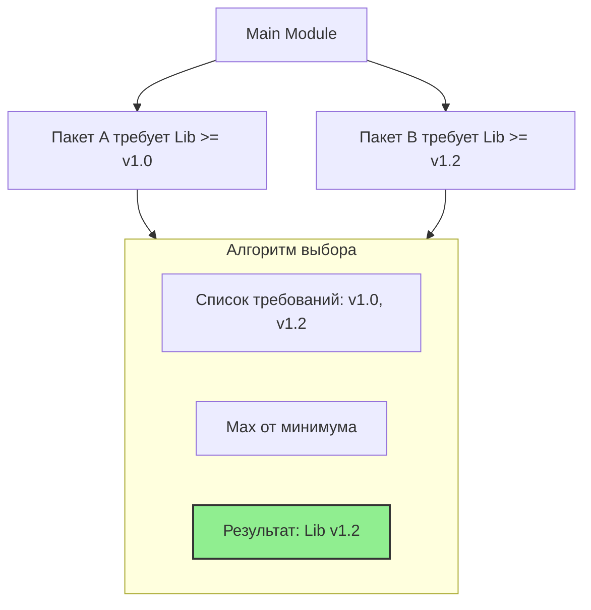

## Эра модулей: Прощай, GOPATH

До появления модулей (Go 1.11, официально в 1.13) управление зависимостями в Go было больной темой. Все проекты обязаны были лежать в одной директории `$GOPATH/src`. Хотите использовать две разные версии одной библиотеки? Забудьте. Это называлось "Vendor directories" и "dep", но это были костыли.

С приходом **Go Modules** проект стал самодостаточной единицей. Он может лежать где угодно (даже вне `$GOPATH`), он сам описывает свои зависимости и их версии. Модуль — это коллекция пакетов, версия вместе и пересобираемых вместе.

## Файл `go.mod`: Манифест проекта

Файл `go.mod` — это сердце модуля. Он выполняет роль идентификатора и декларации зависимостей.

```go
module github.com/myuser/myproject // Имя модуля (путь импорта)

go 1.22 // Версия Go, используемая для компиляции

require (
    github.com/gin-gonic/gin v1.9.1 // Прямая зависимость
    golang.org/x/text v0.14.0 // Прямая зависимость
)

require (
    github.com/some/indirect v1.0.0 // indirect // Транзитивная зависимость
)
```

### Ключевые поля:
1.  **`module`**: Определяет путь импорта корневого пакета. Все `import` внутри проекта строятся относительно этого пути.
2.  **`go`**: Указывает минимальную версию Go. С версии Go 1.21 это также включает в себя семантику строгной совместимости языка (GODEBUG).
3.  **`require`**: Список зависимостей.
    *   Без пометки `// indirect` — прямые зависимости (то, что вы импортируете в коде).
    *   С пометкой `// indirect` — транзитивные зависимости (то, что нужно вашим библиотекам, но не нужно вам напрямую).

> [!warning] Ловушка / Gotcha
> Если вы удалите `import` из кода, зависимость не исчезнет из `go.mod` автоматически. Go оставляет управление зависимостями на усмотрение разработчика. Для очистки неиспользуемых зависимостей всегда используйте:
> ```bash
> go mod tidy
> ```
> Эта команда приводит `go.mod` и `go.sum` в идеальное соответствие с реальным импортом в коде.

## Файл `go.sum`: Криптографический реестр

Многие разработчики путают `go.mod` и `go.sum`, считая второе файлом блокировок (аналог `package-lock.json`). Это не совсем так.

`go.sum` — это база данных криптографических хешей (SHA-256) всех модулей, которые когда-либо скачивались для этого проекта.

```text
github.com/gin-gonic/gin v1.9.1 h1:4idEAncQnU5cB7BeOkPtxjfCSye0AAm1O0RDIiNA18g=
github.com/gin-gonic/gin v1.9.1/go.mod h1:hPrL7YrpYksX/tHE9xW0A6c2nPpnI96LsKgCYW5flxQ=
```

Зачем нужны две строки на каждый модуль?
1.  Строка без `/go.mod` — хеш самого zip-архива с исходным кодом.
2.  Строка с `/go.mod` — хеш файла `go.mod` этой зависимости.

### Зачем это нужно? (Security)
Представьте, что автор библиотеки на GitHub решил "тихо" изменить код тега `v1.2.3` (переписать историю). В мире `npm` это может привести к тому, что `npm install` скачает новый код под старой версией, что открывает дыру для атак на цепочку поставок (supply chain attacks).

Go проверяет хеш из `go.sum` при скачивании. Если содержимое архива не совпадает с записанным хешем, Go откажется собирать проект. Это гарантирует, что бинарник, собранный сегодня, будет бит-в-бит идентичен бинарнику, собранному год назад на том же коде.

> [!info] Под капотом
> `go.sum` не содержит информации о том, какие версии *нужны*. Он содержит хеши *всех известных* версий. Если вы обновили зависимость, старая запись в `go.sum` не удаляется автоматически (кроме как через `go mod tidy`). Это позволяет кэшировать данные и проверять целостность при переключении между ветками git.

## Minimal Version Selection (MVS)

Алгоритм выбора версий в Go радикально отличается от других менеджеров пакетов (npm, pip, Maven).
Большинство систем пытаются выбрать **самую новую** совместимую версию. Go выбирает **минимальную достаточную**.

Пример:
*   Пакет A требует `lib v1.0.0`.
*   Пакет B требует `lib v1.2.0`.
*   Система сборки выберет `lib v1.2.0` (минимальная версия, удовлетворяющая всем требованиям).



> [!tip] Собеседование
> **Вопрос:** Почему Go использует Minimal Version Selection, а не "latest"?
> **Ответ:** Это делает сборку детерминированной и стабильной. Если завтра выйдет `lib v1.9.0`, ваша сборка не сломается, потому что вы её не запрашивали. Вы обновляете зависимости явно (`go get -u`), а не неявно. Это соответствует философии Go: явное лучше неявного.

## Команды работы с модулями

*   `go mod init`: Создает новый `go.mod`.
*   `go mod tidy`: Синхронизирует зависимости (добавляет недостающие, удаляет лишние). Запускайте перед каждым коммитом.
*   `go mod verify`: Проверяет соответствие кэшированных зависимостей в `$GOMODCACHE` хешам в `go.sum`. Защита от подмены файлов на диске.
*   `go mod download`: Скачивает зависимости в кэш, не компилируя проект. Полезно для "прогрева" кэша в CI/CD (Docker layer caching).
*   `go mod vendor`: Создает директорию `vendor/` с копиями зависимостей. Исторический артефакт, иногда полезен для air-gapped сред (без интернета), но в современном мире используется редко.

## Итог

1.  **`go.mod`** — это манифест: кто мы и что нам нужно.
2.  **`go.sum`** — это реестр безопасности: гарантия того, что зависимости не подменили.
3.  **MVS** обеспечивает стабильность и воспроизводимость сборок, выбирая минимальные достаточные версии.
4.  Всегда коммитьте и `go.mod`, и `go.sum` в репозиторий.

Теперь, когда мы понимаем структуру модулей, возникает вопрос: как правильно нумеровать версии, чтобы система MVS и Go понимали их корректно? В следующей статье мы углубимся в семантическое версионирование: [[13. Versioning. SemVer и совместимость]].