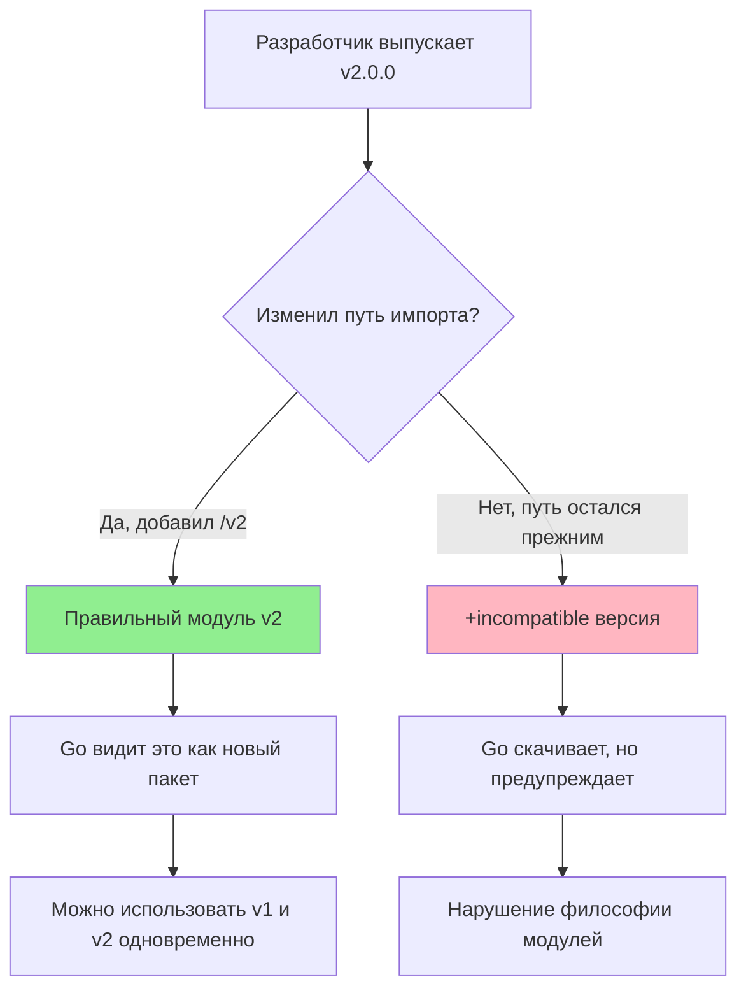

## SemVer в мире Go: Искусство не ломать совместимость

Система модулей Go полагается на **Semantic Versioning (SemVer)** — стандарт кодирования версий в формате `vMAJOR.MINOR.PATCH` (например, `v1.2.3`). В отличие от простого сравнения строк, Go понимает семантику этих чисел, что напрямую влияет на то, как обновляются зависимости.

Однако в Go есть уникальная особенность, отличающая его от Node.js или Python: жесткая привязка_major_-версии к пути импорта. Это то место, где спотыкается каждый второй новичок.

## Семантика версий

1.  **PATCH (v1.2.3 -> v1.2.4)**: Исправление багов. Обратная совместимость гарантируется. Go без вопросов обновится до этой версии, если вы не зафиксировали версию жестко.
2.  **MINOR (v1.2.3 -> v1.3.0)**: Добавление новой функциональности. Обратная совместимость API гарантируется. Go также считает безопасным обновление.
3.  **MAJOR (v1.x.x -> v2.0.0)**: Слом обратной совместимости. В Go это событие трактуется особенно строго.

## Правило "Major Version в Import Path"

В большинстве языков вы можете обновить библиотеку с v1 до v2, просто изменив версию в файле зависимостей. В Go это приведет к ошибке, если автор библиотеки не следовал протоколу.

**Правило:** Если major-версия равна 2 или выше, она **обязана** быть частью пути импорта модуля.

*   `github.com/user/lib` — это модуль v0 или v1.
*   `github.com/user/lib/v2` — это модуль v2.



> [!warning] Ловушка / Gotcha
> Если вы используете библиотеку `github.com/foo/bar` версии v1.0.0, и автор выпускает v2.0.0, но **не меняет** путь импорта в `go.mod` на `github.com/foo/bar/v2`, то при попытке обновления Go добавит суффикс `+incompatible`.
> ```text
> require github.com/foo/bar v2.0.0+incompatible
> ```
> Это означает, что библиотека v2 не поддерживает Go Modules должным образом. Использовать такие зависимости не рекомендуется, так как Go не может гарантировать корректность графа зависимостей (вы можете случайно импортировать два пакета с одинаковым путем, но разным поведением).

## Версия v0: Зона хаоса

Версии, начинающиеся с `v0.x.x`, считаются "pre-release". Семантическое версионирование снимает с них гарантии стабильности.

*   Go разрешает любые изменения API между `v0.1.0` и `v0.2.0`.
*   Для публичных библиотек, предназначенных для использования другими, застревать на `v0` долго — плохая практика. Как только API стабилизировался, выпускайте `v1.0.0`.
*   Для внутренних модулей или приватных сервисов `v0` — это норма.

## Pseudo-versions: Версии без тегов

Что происходит, когда вы используете зависимость, у которой нет тегов (например, коммит из ветки `main`)?

Go генерирует **Pseudo-version** — виртуальный номер версии, основанный на хеше коммита и времени.

Формат: `vx.y.z-yyyymmddhhmmss-abcdefabcdef`.

Пример из `go.mod`:
```text
require github.com/user/lib v0.0.0-20231110153415-123456789abc
```

*   `v0.0.0` — базовая версия (означает, что тегов старше этого коммита нет).
*   `20231110153415` — время коммита в UTC (для сортировки).
*   `123456789abc` — первые 12 символов хеша коммита.

> [!info] Под капотом
> При разрешении зависимостей алгоритм MVS (Minimal Version Selection) сравнивает эти строки лексикографически. Благодаря дате и хешу в строке, Go может однозначно определить, какой коммит "новее". Если вы хотите зафиксировать конкретное состояние репозитория без тегов, `go get` сам сгенерирует такую строку.

## `go.mod` и директива `go 1.22`

В начале `go.mod` есть строка `go 1.22`. Это не просто рекомендация. Начиная с Go 1.21, эта директива работает как **ограничение версии языка**.

*   Если ваш модуль требует `go 1.22`, а вы пытаетесь собрать его компилятором Go 1.21, сборка упадет с ошибкой.
*   Это включает поведение языка. Например, изменения в семантике циклов (`for` loop semantics), произошедшие в Go 1.22, будут работать только если в `go.mod` указана эта версия. Если там указано `go 1.21`, компилятор сохранит старое поведение для обратной совместимости вашего кода.

## Итог

1.  **SemVer** — это фундамент управления зависимостями.
2.  **v2+** должны менять путь импорта (`/v2`), иначе они помечаются как `+incompatible`.
3.  **v0** не дает гарантий совместимости.
4.  **Pseudo-versions** позволяют работать с нетегированными коммитами, сохраняя воспроизводимость.
5.  Директива `go` в `go.mod` управляет поведением компилятора и совместимостью языка.

Понимание версионирования критически важно, но что делать, если зависимость ведет себя неправильно, или нужно временно подменить её локальной версией? В следующей статье мы разберем инструменты "хирургического вмешательства" в граф зависимостей: [[14. Dependency management. replace, exclude]].