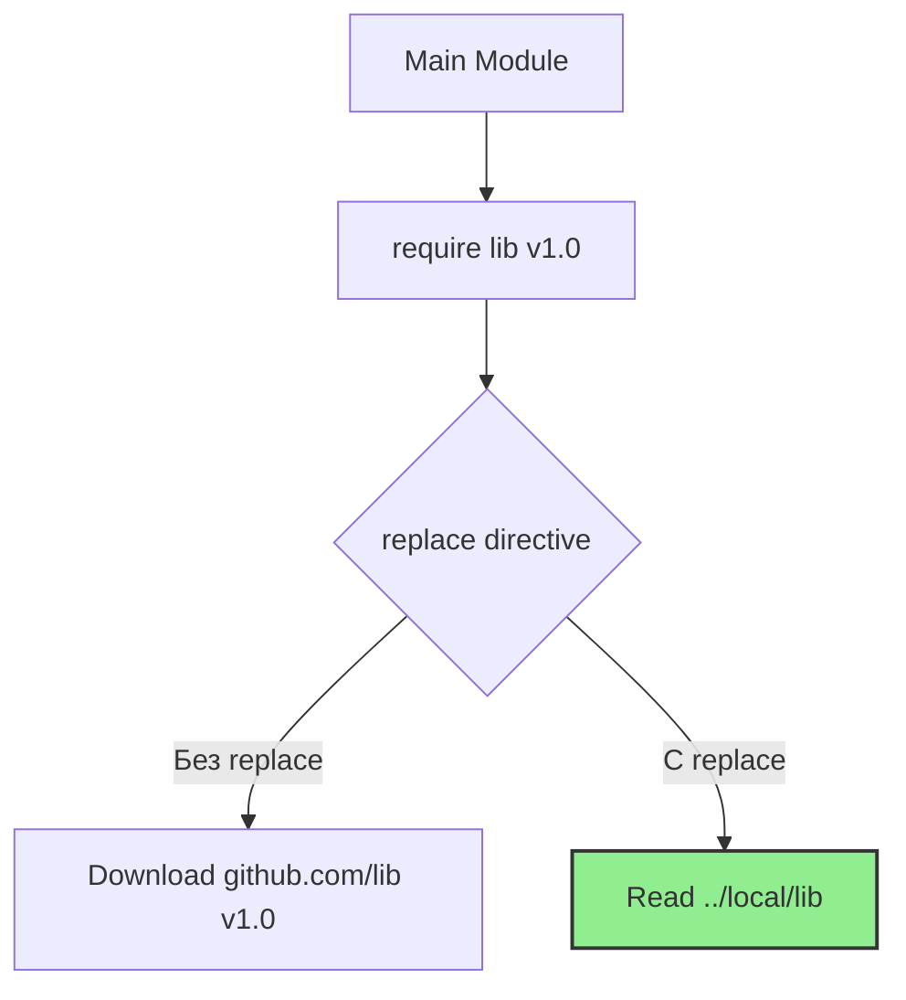

## Инструменты ручного управления графом зависимостей

В идеальном мире команда `go mod tidy` идеально разрешает все зависимости, а авторы библиотек никогда не ломают обратную совместимость. В реальном мире иногда требуется "хирургическое вмешательство" в процесс разрешения модулей.

Директивы `replace` и `exclude` в файле `go.mod` — это инструменты для разработчика, когда автоматика MVS (Minimal Version Selection) справляется не так, как нам нужно. Они позволяют перенаправить зависимость или скрыть проблемную версию.

## Директива `replace`: Перенаправление

`replace` заставляет Go использовать другой путь или версию вместо указанной в `require`. Это работает на уровне исходного кода: код скачивается из нового места, но в вашем проекте импорты остаются старыми.

### 1. Исправление бага в сторонней библиотеке (Forking)
Вы используете библиотеку `github.com/old/lib`, но в ней нашли критический баг. Автор не отвечает, а ждать нельзя. Вы делаете форк, исправляете баг и говорите Go: "Используй мой форк вместо оригинала".

```go
module myproject

go 1.22

require github.com/old/lib v1.2.3

// Перенаправляем на ваш форк на GitHub
replace github.com/old/lib => github.com/myname/lib v1.2.4-fix
```

### 2. Локальная разработка (Monorepo / WIP)
Вы разрабатываете два модуля одновременно: `api` и `db`. Вы хотите проверить изменения в `db`, не пуша их в репозиторий и не выпуская новую версию.

```go
// Указываем Go искать модуль в директории выше
replace github.com/myorg/db => ../db
```

Это заставляет Go читать исходный код прямо с диска, минуя скачивание.



> [!warning] Ловушка / Gotcha
> **Никогда не коммитьте `replace` с локальными путями (`../`) в основную ветку.**
> Для вашего CI-пайплайна и других разработчиков эта папка не будет существовать. Сборка сломается. Локальные `replace` — это временная мера для локальной разработки. Перед коммитом используйте `go mod tidy`, чтобы убрать их, или используйте директивы только в своих feature-ветках.

## Директива `exclude`: Исключение версий

`exclude` говорит тулчейну: "Забудь, что эта версия вообще существует". Это используется, если конкретная версия зависимости содержит критический баг, уязвимость или была отозвана автором, но из-за специфики графа MVS выбирает именно её.

```go
// Запрещаем использование сломанной версии
exclude github.com/broken/lib v1.5.0
```

Если ваш проект (или транзитивная зависимость) просит `github.com/broken/lib v1.5.0`, Go выдаст ошибку или попытается найти следующую доступную версию (например, `v1.5.1`), которая удовлетворяет требованиям.

### Сценарий использования
Представьте, что библиотека `A` требует `Lib >= v1.0`, а самая свежая версия — `v1.5.0`. Но в `v1.5.0` есть уязвимость. Вы можете:
1.  Поднять требование в `A` до `v1.5.1` (если она есть).
2.  Или запретить `v1.5.0` через `exclude`. Тогда MVS выберет `v1.4.0` (если она совместима) или `v1.5.1`.

## Директива `retract` (Современный подход)

В Go 1.16 появилась директива `retract` — это "белый флаг" от авторов библиотек. Если автор случайно выпустил сломанную версию или отозвал её, он добавляет в свой `go.mod`:

```go
// В go.mod библиотеки
retract v1.5.0 // Серьезный баг, отзываем версию
```

Когда вы запускаете `go list -m -u` или `go get`, Go видит пометку `retract` и автоматически игнорирует такую версию, предупреждая вас. Это более здоровый способ борьбы с плохими релизами, чем `exclude` в вашем `go.mod`.

> [!info] Под капотом
> Директивы `replace` и `exclude` обрабатываются на этапе **построения графа модулей** (MVS build list). Это происходит до компиляции.
> *   `exclude` просто вычеркивает узел из списка кандидатов.
> *   `replace` подменяет узел: метаданные (путь, версия) заменяются, но интерфейс модуля (экспортируемые имена) должен остаться совместимым, иначе компилятор выдаст ошибку несовпадения типов.

## Практика и безопасность

Использование `replace` для подмены зависимостей (особенно системных или криптографических) — это риск. Вы берете на себя ответственность за код, который исполняется в вашем приложении.

В продакшене `replace` часто используется для:
1.  **Vendoring**: Когда код зависимостей копируется в проект (редко сейчас).
2.  **Private proxies**: Перенаправление на внутренний прокси для частных библиотек (хотя это лучше делается через `.netrc` или `GOPRIVATE`).

## Итог

1.  **`replace`** — мощный инструмент для форков и локальной разработки, но опасен в продакшене из-за путей файловой системы.
2.  **`exclude`** — способ запретить использование конкретной версии зависимости.
3.  **`retract`** — механизм для авторов библиотек, позволяющий "отозвать" сломанную версию.
4.  Используйте эти инструменты как временные меры, пока не будет обновлена зависимость или исправлен апстрим.

Мы научились управлять версиями и форками. Но что делать, если ваша компания использует приватные репозитории, и вы не хотите "светить" их в публичные прокси? В следующей статье мы разберем настройку доступа к приватным модулям: [[15. Private modules и proxy]].